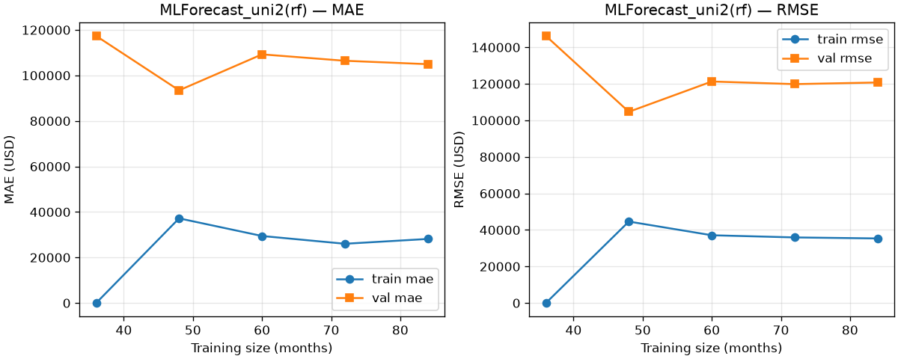
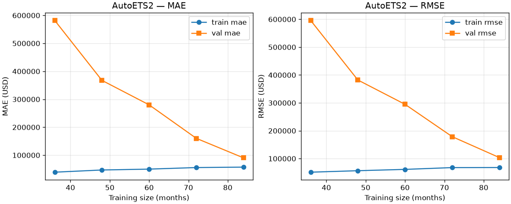
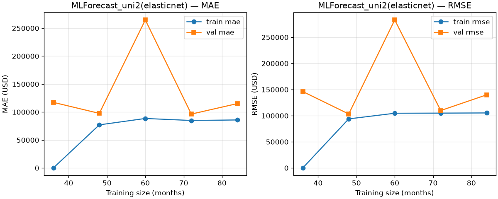

# HealthCore — Temporal CV & Fit Diagnosis Report

## 1. Summary

| Model | Fit verdict | CV RMSE (mean ± std) | Corrective action |
|---|---|---|---|
| MLForecast_uni2(rf) | **overfitting** | $103,498 ± $28,617 | Constrain MLForecast_uni2(rf): set max_depth (e.g. 3–5), raise min_samples_leaf, max_features < 1.0, and/or fewer estimators. |
| AutoETS2 | **well-fitted** | $93,757 ± $25,643 | Ship classical AutoETS (diagnosed here as AutoETS2); keep this CV/learning-curve suite as a regression guard. |

- Diagnostic ML target: `MLForecast_uni2(rf)` with params `{'max_depth': None, 'max_features': 1.0, 'n_estimators': 200}`.
- Diagnostic classical label: `AutoETS2` (StatsForecast `AutoETS` under this diagnosis suite).
- 5-fold selection winner is `rf` (params `{'max_depth': None, 'max_features': 1.0, 'n_estimators': 200}`). Prior 3-fold shipped selection pinned as `rf` with params `{'n_estimators': 200, 'max_depth': None, 'max_features': 1.0}`. Winner unchanged vs the pinned 3-fold selection.

## 2. CV setup & integrity

- **Folds:** 5 (≥5 required) × 6-month non-overlapping validation blocks on the diagnostic CV frame (through **2024-06-01**).
- **Why 5×6:** comparable per-fold RMSE across engines; non-overlapping so std is not understated.
- **Window redesign:** Previous design used 2021-07…2023-12 (train-only). Shifted later to thicken fold 0; last fold scores 2024-01…2024-06 for diagnostics only.
- **Fold 0 train size:** ML fold 0 has `n_train=37` usable rows after differencing/`lag_12` — shifted later so this is no longer the starved 31-row fold from the 2021-07 start. Still interpret mean±std as a small-sample (5-fold) estimate.
- **Engines:** ML → `sklearn.model_selection.TimeSeriesSplit` (gap=0); `AutoETS2` → `classical_backtest` / `StatsForecast.cross_validation` on model `AutoETS` (`n_windows=5`, `h=6`, `step_size=6`).
- **Chronology:** no shuffle; every fold has `max(train ds) < min(val ds)`; validation blocks are contiguous and roll forward; `TimeSeriesSplit` never shuffles.
- **Date alignment:** both engines score the same calendar windows `[('2022-01-01', '2022-06-01'), ('2022-07-01', '2022-12-01'), ('2023-01-01', '2023-06-01'), ('2023-07-01', '2023-12-01'), ('2024-01-01', '2024-06-01')]`.
- **Selection CV change:** MLForecast learner-selection defaults raised from **n_windows=3, h=12** (shipped) to **n_windows=5, h=6**. Classical `classical_backtest` was already 5-fold.

- **Pipeline recommendation after 5-fold retrain:** primary classical `AutoETS`; regression path `MLForecast_exog` (visits help=True). Prior 3-fold narrative preferred univariate when visits lift was weak — note any flip; learner identity for uni/exog remains pinned above when unchanged.

### Per-fold validation RMSE

| Fold | Window | ML n_train | ML val RMSE | AutoETS2 val RMSE |
|---:|---|---:|---:|---:|
| 0 | 2022-01-01…2022-06-01 | 37 | $103,365 | $90,130 |
| 1 | 2022-07-01…2022-12-01 | 43 | $58,379 | $60,529 |
| 2 | 2023-01-01…2023-06-01 | 49 | $131,567 | $118,584 |
| 3 | 2023-07-01…2023-12-01 | 55 | $99,750 | $79,469 |
| 4 | 2024-01-01…2024-06-01 | 61 | $124,429 | $120,071 |

- ML val RMSE min/max: $58,379 / $131,567 (small-sample std caveat: only 5 folds).
- AutoETS2 val RMSE min/max: $60,529 / $120,071.

## 3. Metrics table (train & validation)

| Model | Stage | MAE (mean ± std) | RMSE (mean ± std) | RMSE % mean train revenue |
|---|---|---|---|---|
| MLForecast_uni2(rf) | Train | $29,130 ± $2,377 | $37,166 ± $1,635 | — |
| MLForecast_uni2(rf) | Validation | $90,942 ± $27,899 | $103,498 ± $28,617 | 3.8% |
| AutoETS2 | Train | $58,111 ± $1,808 | $69,537 ± $1,816 | — |
| AutoETS2 | Validation | $82,573 ± $25,573 | $93,757 ± $25,643 | 3.4% |

Mean monthly train revenue ≈ **$2,754,918**.

## 4. Learning curves

Fixed validation block: **2023-01…2023-12**. Training prefixes `[36, 48, 60, 72, 84]` all end before 2023-01. Prefix **84** ends **2022-12** (contiguous with the val block) so the curve no longer skips all of 2022 between the largest train set and validation. Smallest prefixes (~36 months) are noisy.

### MLForecast_uni2(rf)

- s=36: train RMSE $0, val RMSE $146,226 (gap $146,226)
- s=48: train RMSE $44,603, val RMSE $104,688 (gap $60,085)
- s=60: train RMSE $37,100, val RMSE $121,277 (gap $84,177)
- s=72: train RMSE $35,913, val RMSE $119,851 (gap $83,938)
- s=84: train RMSE $35,355, val RMSE $120,743 (gap $85,388)

### AutoETS2

- s=36: train RMSE $51,223, val RMSE $595,843 (gap $544,620)
- s=48: train RMSE $56,533, val RMSE $382,106 (gap $325,573)
- s=60: train RMSE $61,279, val RMSE $294,749 (gap $233,470)
- s=72: train RMSE $67,704, val RMSE $178,649 (gap $110,945)
- s=84: train RMSE $68,009, val RMSE $103,575 (gap $35,565)

### ElasticNet side check (ML overfit contrast)

- s=36: train RMSE $0, val RMSE $146,226
- s=48: train RMSE $93,901, val RMSE $103,298
- s=60: train RMSE $104,674, val RMSE $283,236
- s=72: train RMSE $104,956, val RMSE $109,876
- s=84: train RMSE $105,272, val RMSE $139,964

## 5. Business-cost metric (MAE vs RMSE)

Authoritative context: **`rag_assignments/CONTEXT-healthcore.en.md` §3** (sales-prediction context — **not** the repo website `CONTEXT.md`).

CONTEXT §3 asks to *"report MSE in USD², and also as a percentage of average monthly revenue"*, and prizes a high **Gini** to *"distinguish a normal low-season month … from an atypical drop."* Both signals say the business cares about **large, unusual deviations**, not just average error.

**RMSE is the business-cost metric.** It is √MSE in interpretable dollars and penalizes large errors disproportionately — matching the cost of a planning-breaking revenue miss (over/under-staffing, misinformed executive decisions). A single $500k miss is worse than ten $50k misses; RMSE reflects that, MAE treats them as equal.

- ML CV RMSE as % of mean monthly train revenue: **3.8%**.
- AutoETS2 CV RMSE as % of mean monthly train revenue: **3.4%**.
- MAE is reported alongside for “average dollars off” interpretability.

## 6. Fit diagnosis

### MLForecast_uni2(rf) → **overfitting**

- Learning-curve (largest prefix): train RMSE $35,355, val RMSE $120,743, gap $85,388 (relative 71%).
- CV: train RMSE $37,166, val RMSE $103,498 ± $28,617, CV gap $66,332 (relative 64%), fold CV 0.28.
- Guardrail: For tree models, near-zero train RMSE is the overfitting signature; diagnose on the val−train gap, not absolute train error. Do not compare tree train error to AutoETS in-sample residuals as like-for-like.

### AutoETS2 → **well-fitted**

- Learning-curve (largest prefix): train RMSE $68,009, val RMSE $103,575, gap $35,565 (relative 34%).
- CV: train RMSE $69,537, val RMSE $93,757 ± $25,643, CV gap $24,219 (relative 26%), fold CV 0.27.
- Guardrail: Classical AutoETS train error is genuine in-sample residual, not memorization. Learning-curve val error from early prefixes includes a long multi-step horizon into 2023 (trend), so CV train/val gap is the primary fit signal.

## 7. Method note

§5.4 correctness rules honored for the ML path: causal `.shift()` features (no same-month target leakage); `Differences([12])` + local scaler **fit per fold on train rows only** and inverted for scoring; **recursive** month-by-month prediction inside each 6-month block (predictions feed lag features — never one-shot `predict(X[test])`); validation windows defined **by date first** and asserted identical across `MLForecast_uni2` (`TimeSeriesSplit`) and `AutoETS2` (`StatsForecast.cross_validation` / `classical_backtest`).

## 8. Corrective actions

### MLForecast_uni2(rf) (overfitting)

- Constrain MLForecast_uni2(rf): set max_depth (e.g. 3–5), raise min_samples_leaf, max_features < 1.0, and/or fewer estimators.
- Prune the feature set (many lags/rollings on ~84 effective rows).
- Prefer a more regularized learner (ElasticNet) or lean on classical AutoETS.
- Add drift monitoring (PSI); more historical data is not available (fixed 120 months).

### AutoETS2 (well-fitted)

- Ship classical AutoETS (diagnosed here as AutoETS2); keep this CV/learning-curve suite as a regression guard.
- Monitor PSI for regime shift; revisit only if new data changes the pattern.
- More data is not available as a lever (fixed 120 months).

## Stretch notes

- **Purged gap=1 A/B:** gap=0 val RMSE $103,498 ± $28,617; gap=1 val RMSE $106,112 ± $27,837.
- Per-fold RMSE strip: `diagnostics/fold_rmse_strip.png`.
- **SeasonalNaive-in-CV** val RMSE $164,589 ± $49,374 (skill context vs MLForecast_uni2 / AutoETS2 fold RMSE).

## 9. Limitations

- Only 120 monthly points; ~84 effective training rows after differencing + `lag_12`.
- 6-month CV horizon; std across 5 folds is a small-sample estimate (report min/max).
- “Collect more data” is not a lever for corrective action.
- Learning-curve prefixes at s=36 are noisy after transforms.
