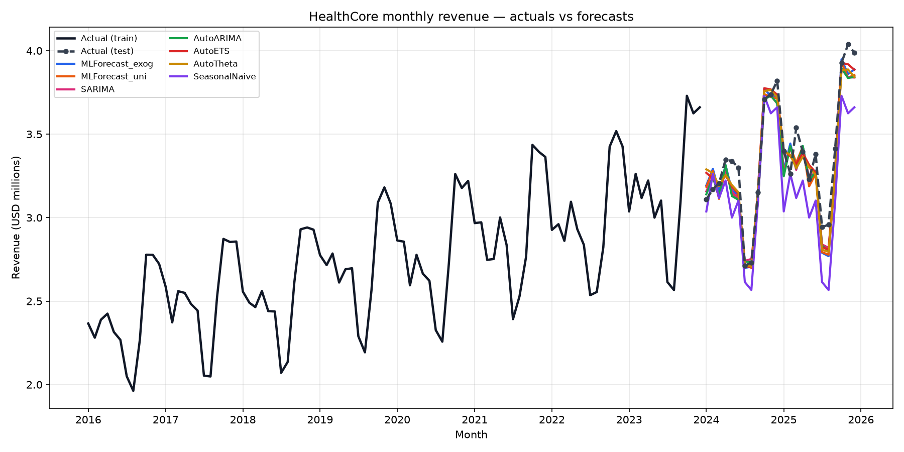

# HealthCore Monthly Revenue Forecast Report

## 1. Executive summary

Yes — monthly consolidated revenue is predictable enough to justify a network dashboard, with honest recursive 24-month accuracy around **RMSE $116,979** (3.5% of mean test monthly revenue) for the recommended regression model **MLForecast_exog** (learner: `rf`).

- SeasonalNaive baseline test RMSE: **$242,690**.
- Chosen regression beats SeasonalNaive: **True**.
- Best classical model on the holdout: **AutoETS** (RMSE $102,474).
- Visits exogenous lift: exogenous RMSE $116,979 vs univariate $121,141 (visits help=True).
- Stage-1 visits forecast RMSE: **986.5** visits (MAPE 0.047); the exogenous revenue model inherits this error.

## 2. Data & cleaning

Source: `data/raw/healthcore_sales.csv` (120 consolidated monthly rows, 2016-01 … 2025-12).
Cleaning drops null/empty month or revenue rows, validates a continuous monthly index,
and reshapes to Nixtla long format (`unique_id`, `ds`, `y`, `visits_count`).

**Split:** train 2016-01…2023-12 (96 months), test 2024-01…2025-12 (24 months), chronological — never random.

**Leakage controls:** `avg_revenue_per_visit_usd` is excluded (with visits it reconstructs revenue).
`visits_count` is used as an exogenous demand driver, but over the test horizon it comes from a
**Stage-1 StatsForecast visits forecast**, never actual test visits.

Feature catalog (`FEATURE_COLUMNS`): month, month_sin, month_cos, quarter, year, trend, is_high_season, is_low_season, rev_lag_1, rev_lag_2, rev_lag_3, rev_lag_12, rev_roll_mean_3, rev_roll_mean_12, rev_roll_std_3, rev_yoy, visits_count, visits_lag_1, visits_lag_12, visits_roll_mean_3.

## 3. Regression model (MLForecast)

Two-stage design: forecast visits → feed as `X_df` into MLForecast with lag/calendar features,
`Differences([12])` + `LocalStandardScaler` inside `.fit()` (train only). Learners compared by
rolling-origin CV on the training window (RF, XGBoost, ElasticNet); test scored once.

- Exogenous CV winner: `rf` with light sweep params `{'n_estimators': 200, 'max_depth': None, 'max_features': 1.0}`.
- Univariate CV winner: `rf`.
- Ablation verdict: exogenous visits improved test RMSE.

Perfect-foresight diagnostic (actual test visits — **not** a reportable model): RMSE $114,714. Gap vs exogenous forecast isolates Stage-1 visits error.

## 4. Classical models (StatsForecast)

Explicit **SARIMA(1, 1, 1)(1, 1, 1)_12** (pinned from / compared to AutoARIMA where available).
AutoARIMA order note: `arma=(0, 0, 1, 0, 12, 0, 1)`.
Also fit AutoETS, AutoTheta, AutoCES, and SeasonalNaive with 80/95% intervals.

Holdout winner among classical models: **AutoETS**.
Rolling-origin backtest RMSE (train windows): `{'AutoARIMA': 111561.58848518715, 'AutoETS': 110196.45885173779, 'AutoTheta': 99612.77063283187, 'SeasonalNaive': 170214.22695569685}`.

## 5. Predictions

### Combined overlay

### Per-model vs actual

#### MLForecast_exog

#### MLForecast_uni

#### SARIMA

#### AutoARIMA

#### AutoETS

#### AutoTheta

#### SeasonalNaive

### Stage-1 visits

### Chosen model intervals & residuals

## 6. Evaluation metrics

| Model | RMSE (USD) | RMSE % mean | MAE | MAPE | MASE | PSI | Gini | K2 p | Cov80 | Cov95 |
|---|---:|---:|---:|---:|---:|---:|---:|---:|---:|---:|
| MLForecast_exog | 116,979 | 3.5% | 95,514 | 0.028 | 0.745 | 5.159 | 0.786 | 0.761 | 0.71 | 0.75 |
| MLForecast_uni | 121,141 | 3.6% | 100,613 | 0.030 | 0.785 | 5.147 | 0.800 | 0.515 | 0.75 | 0.75 |
| SARIMA | 120,129 | 3.6% | 98,384 | 0.029 | 0.767 | 0.000 | 0.829 | 0.783 | 0.58 | 0.83 |
| AutoARIMA | 122,140 | 3.6% | 97,544 | 0.029 | 0.761 | 0.000 | 0.833 | 0.810 | 0.58 | 0.83 |
| AutoETS | 102,474 | 3.0% | 83,425 | 0.025 | 0.651 | 0.000 | 0.801 | 0.625 | 0.79 | 0.96 |
| AutoTheta | 113,848 | 3.4% | 93,729 | 0.028 | 0.731 | 0.000 | 0.727 | 0.685 | 0.50 | 0.75 |
| SeasonalNaive | 242,690 | 7.2% | 206,633 | 0.061 | 1.611 | 0.000 | 0.553 | 0.498 | 0.67 | 0.96 |

### Plain-English interpretations

- **RMSE / MSE:** typical monthly miss of ~$116,979 (3.5% of average test revenue). MSE is in USD².
- **MASE:** 0.745 vs SeasonalNaive scale — better than same-month-last-year on absolute error.
- **PSI (5.159):** score-distribution drift train→test. CONTEXT frames PSI as US/UK visit-mix shift, but this dataset has only consolidated revenue — a high value here most likely reflects 2024–25 revenue exceeding the training range, not clinic mix.
- **Gini (0.786):** ranking quality — how well the model orders low vs high months.
- **K2 p-value (0.761):** residuals look roughly normal — intervals more trustworthy.
- **Interval coverage:** 80% band covers 71% of test months; 95% band covers 75% (conformal / StatsForecast levels).

## 7. Recommendation

Put **MLForecast_exog** behind the executive dashboard as the regression path, with **AutoETS** as the classical comparator.
Use the recursive 24-month forecast (not one-step) as the honest accuracy number.

### Limitations

- Only 120 monthly points; deep models (NeuralForecast / TimeGPT) are not justified and TimeGPT was dropped to keep the pipeline local/key-free.
- Strong upward trend makes extrapolation and PSI sensitive.
- No US/UK regional breakdown — visit-mix PSI is not directly computable.
- Log/Box-Cox left off the default path; SHAP deferred.
