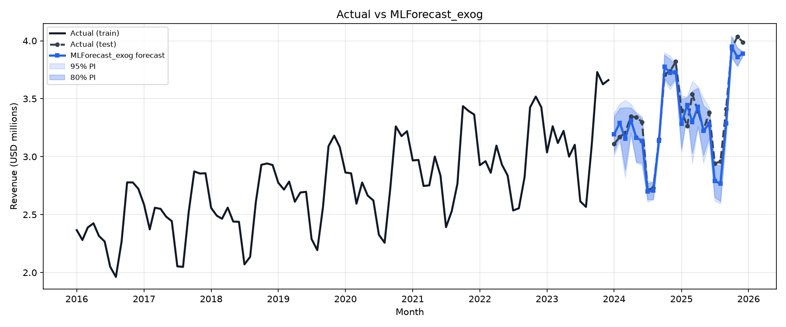
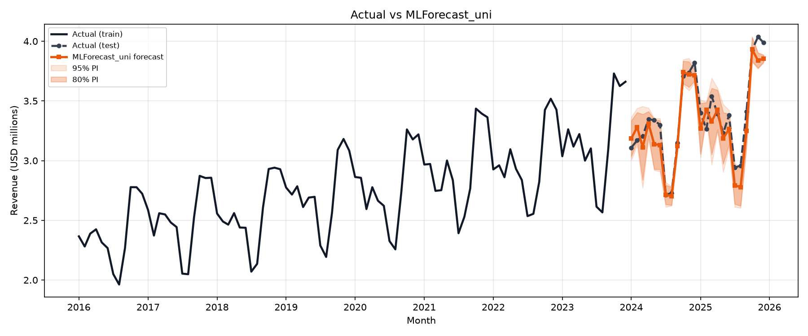
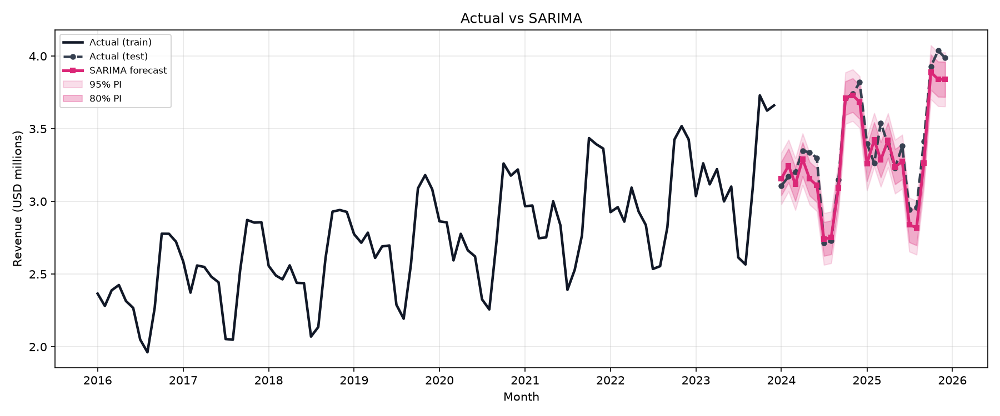
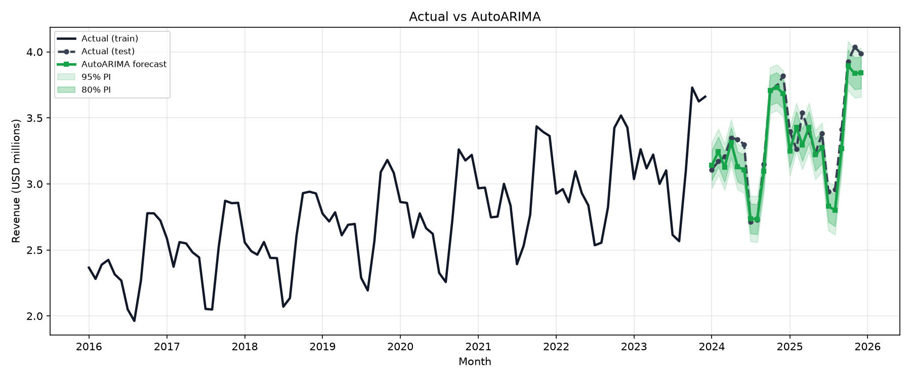
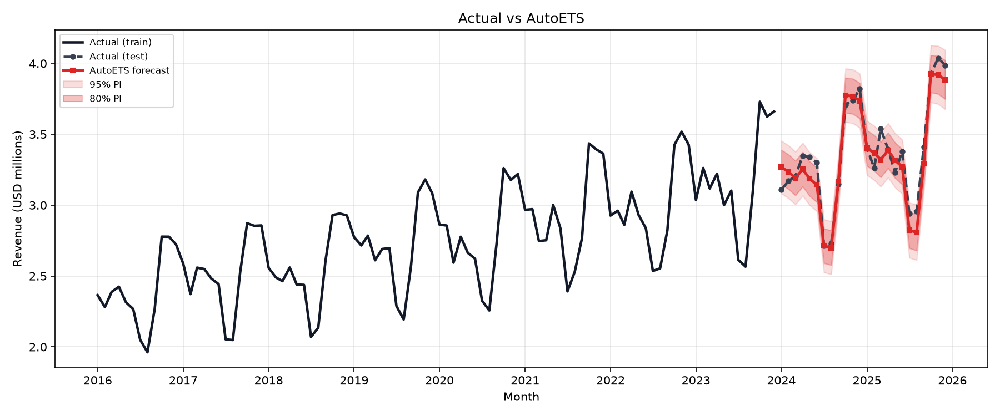
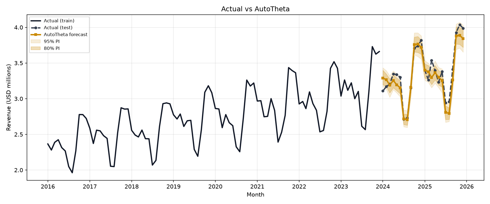
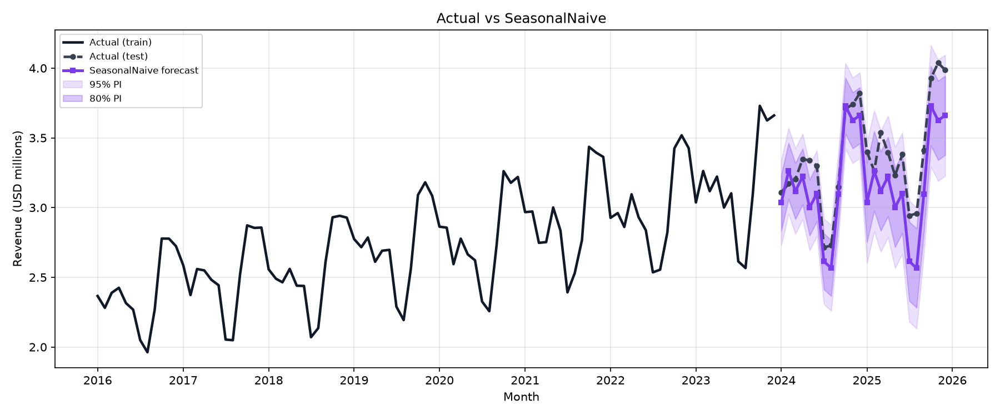
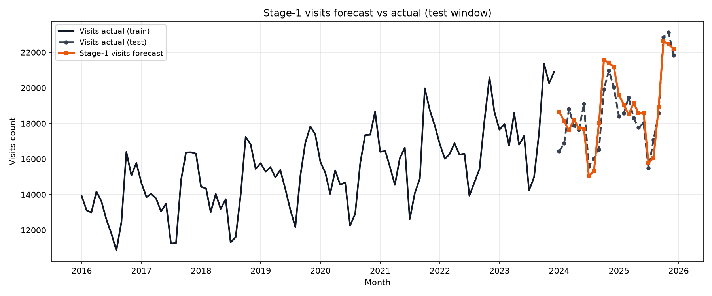
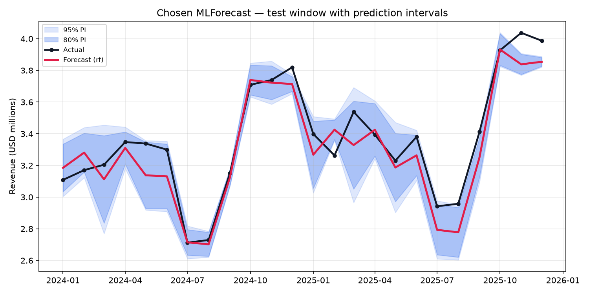
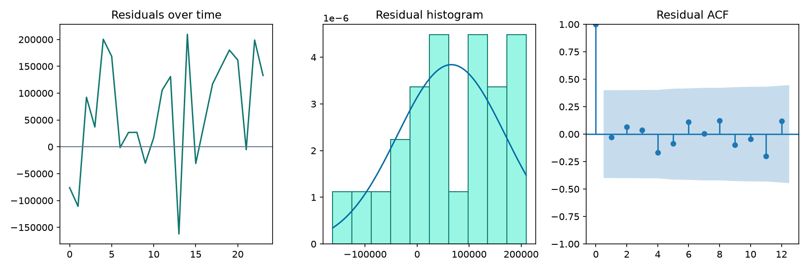

# HealthCore Monthly Revenue Forecast Report

## 1. Executive summary

Yes — monthly consolidated revenue is predictable enough to justify a network-wide executive dashboard.
The honest evaluation number is the **recursive 24-month** holdout (2024–2025), not one-step-ahead error.

### What to put behind the dashboard

1. **Primary point forecast: `AutoETS`** — best holdout accuracy (RMSE **$102,474**, 3.0% of mean test revenue, R² **0.917**, 80/95% coverage 79%/96%).
2. **Regression path: `MLForecast_uni`** (learner `rf`) — kept for a tree/lag feature workflow and possible later scenario analysis. Holdout RMSE **$121,141** (MASE 0.785 vs SeasonalNaive).
3. **Do not default to the visits exogenous model.** Ablation evidence says visits add little (see §3.1); Stage-1 visits forecast error is MAPE 4.7%.

- SeasonalNaive baseline test RMSE: **$242,690** (all recommended models beat this).
- Chosen regression beats SeasonalNaive: **True**.
- Visits help (strict rule)? **False**.

## 2. Data & cleaning

Source: `data/raw/healthcore_sales.csv` — 120 consolidated monthly rows (2016-01 … 2025-12).
Cleaning drops null/empty `month` / `revenue_usd`, validates a continuous monthly index,
and reshapes to Nixtla long format (`unique_id`, `ds`, `y`, `visits_count`).
`avg_revenue_per_visit_usd` is dropped entirely.

**Chronological split (never random):**

| Set | Window | Months |
|---|---|---:|
| Train | 2016-01 … 2023-12 | 96 |
| Test | 2024-01 … 2025-12 | 24 |

### Leakage controls

- **Identity leakage:** `visits × avg_revenue_per_visit ≈ revenue`. Including both would let the model relearn multiplication. `avg_revenue_per_visit_usd` is never a feature.
- **Future visits leakage:** contemporaneous `visits_count` is unknown at forecast time. The exogenous model uses a **Stage-1 StatsForecast visits forecast** in `X_df`, never actual test visits.
- **Transforms:** MLForecast `Differences([12])` + `LocalStandardScaler` are fit inside `.fit()` on train only.

Feature catalog (`FEATURE_COLUMNS`): month, month_sin, month_cos, quarter, year, trend, is_high_season, is_low_season, rev_lag_1, rev_lag_2, rev_lag_3, rev_lag_12, rev_roll_mean_3, rev_roll_mean_12, rev_roll_std_3, rev_yoy, visits_count, visits_lag_1, visits_lag_12, visits_roll_mean_3.

## 3. Regression model (MLForecast)

Two families were trained with the same lag/calendar machinery:

- **Exogenous (two-stage):** Stage-1 visits forecast → revenue model with `visits_count` in `X_df`.
- **Univariate ablation:** Groups A+B only (calendar + revenue lags/rolling + trend). No visits.

Learners compared inside one MLForecast object: RandomForest, XGBoost, ElasticNet.
Selection uses rolling-origin CV on the **training** window only (`n_windows=3`, `h=12`); the test set is scored once.

- Exogenous CV winner: `rf` (CV RMSE 100,538); light sweep params `{'n_estimators': 200, 'max_depth': None, 'max_features': 1.0}`.
- Univariate CV winner: `rf` (CV RMSE 100,387).

### 3.1 Ablation: do visits actually help?

Spec §7.4c: if the lift is small, recommend the simpler univariate model.

| Evidence | Exogenous | Univariate | Interpretation |
|---|---:|---:|---|
| CV RMSE (winner learner) | $100,538 | $100,387 | Univariate better/equal in CV |
| Test RMSE | $116,979 | $121,141 | Test lift for exogenous = $4,163 (3.4% relative) |
| Perfect-foresight RMSE (diagnostic) | $114,714 | — | Even with *actual* test visits, gain vs exogenous forecast ≈ $2,265 |
| Stage-1 visits error | RMSE 986 visits (MAPE 4.7%) | — | Exogenous revenue inherits this error |

**Verdict:** visits help = **False**. Rule used: `Recommend univariate unless CV and test both favor exogenous by >=3% relative RMSE`.
The holdout edge for exogenous is small relative to revenue scale and contradicts CV; perfect foresight shows visits carry little incremental signal beyond revenue's own past. Therefore the recommended regression path is **`MLForecast_uni`**.

Perfect-foresight is **leakage-for-diagnosis only** and is excluded from headline metrics.

## 4. Classical models (StatsForecast)

Explicit **SARIMA(1, 1, 1)(1, 1, 1)_12** (hand-specified / AutoARIMA-informed).
AutoARIMA order note: `unknown`.
Also fit AutoETS, AutoTheta, and SeasonalNaive with 80/95% intervals.
AutoCES skipped (numba readonly-array TypingError on this stack).

**Holdout classical winner: `AutoETS`** (RMSE $102,474, R² 0.917).
Rolling-origin backtest RMSE (train windows): `{'AutoARIMA': 111561.58848518715, 'AutoETS': 110196.45885173779, 'AutoTheta': 99612.77063283187, 'SeasonalNaive': 170214.22695569685}`.

### 4.1 Seasonality recovery (ETS factors)

AutoETS monthly seasonal factors recovered the business pattern from CONTEXT §4 (Jul–Aug −12–18%, Oct–Dec +15–20%):

- Jul / Aug factors: **0.83 / 0.83** (~17% dip vs mean).
- Oct / Nov / Dec factors: **1.16 / 1.16 / 1.15** (~15% lift vs mean).

That match is evidence the leakage guards held: a leaked model would not need to learn seasonality.

## 5. Predictions

### Per-model vs actual

#### MLForecast_exog

#### MLForecast_uni

#### SARIMA

#### AutoARIMA

#### AutoETS

#### AutoTheta

#### SeasonalNaive

### Stage-1 visits

### Recommended regression — intervals & residuals

## 6. Evaluation metrics

All metrics below are on the **24-month test set** unless noted. PSI uses **in-sample fitted scores on train** vs **test forecasts** (same definition for every model).

| Model | RMSE (USD) | RMSE % mean | MAE | MAPE | MASE | R² | PSI | Gini | K2 p | Cov80 | Cov95 |
|---|---:|---:|---:|---:|---:|---:|---:|---:|---:|---:|---:|
| MLForecast_exog | 116,979 | 3.5% | 95,514 | 0.028 | 0.745 | 0.892 | 5.159 | 0.786 | 0.761 | 0.71 | 0.75 |
| MLForecast_uni | 121,141 | 3.6% | 100,613 | 0.030 | 0.785 | 0.884 | 5.147 | 0.800 | 0.515 | 0.75 | 0.75 |
| SARIMA | 120,129 | 3.6% | 98,384 | 0.029 | 0.767 | 0.886 | 8.936 | 0.829 | 0.783 | 0.58 | 0.83 |
| AutoARIMA | 122,140 | 3.6% | 97,544 | 0.029 | 0.761 | 0.882 | 7.625 | 0.833 | 0.810 | 0.58 | 0.83 |
| AutoETS | 102,474 | 3.0% | 83,425 | 0.025 | 0.651 | 0.917 | 7.679 | 0.801 | 0.625 | 0.79 | 0.96 |
| AutoTheta | 113,848 | 3.4% | 93,729 | 0.028 | 0.731 | 0.898 | 7.546 | 0.727 | 0.685 | 0.50 | 0.75 |
| SeasonalNaive | 242,690 | 7.2% | 206,633 | 0.061 | 1.611 | 0.535 | 7.747 | 0.553 | 0.498 | 0.67 | 0.96 |

### Plain-English metric guide

- **RMSE / MSE / MAPE / R²:** size of the typical miss. Recommended regression RMSE ~$121,141 (3.6% of mean test revenue); R²=0.884. Primary classical `AutoETS` RMSE ~$102,474 (R²=0.917).
- **MASE:** error scaled by SeasonalNaive’s seasonal MAE on train. < 1 beats same-month-last-year. Recommended regression MASE=0.785; `AutoETS` MASE=0.651.
- **PSI (Population Stability Index):** compares the **distribution of model scores** (train fitted predictions vs test forecasts). Rule of thumb: <0.1 stable, 0.1–0.25 moderate, >0.25 large. CONTEXT originally framed PSI as US/UK visit-mix shift, but this file has only consolidated revenue — a high PSI here almost always means **2024–25 revenue sits above the training score range** (trend), not clinic-mix change. Prior classical PSI=0.000 values were a bug (test scores compared to themselves) and have been corrected to use in-sample fitted scores.
- **Gini:** ranking quality (0≈random, 1≈perfect ordering of low→high months). Recommended regression Gini=0.800; `AutoETS` Gini=0.801. This is the “spot an atypical August” metric Sandra cares about — SeasonalNaive is much weaker.
- **K2 (D'Agostino–Pearson):** normality of residuals. High p (>0.05) → errors look roughly Gaussian → interval bands are more trustworthy. Recommended regression K2 p=0.515; `AutoETS` p=0.625. **Caveat:** with only 24 test points this test is weak — “looks normal” is soft evidence, not proof.
- **Interval coverage:** share of test months inside 80%/95% bands. `AutoETS` covers 79% / 96%. MLForecast bands are conformal; StatsForecast bands come from each classical model.

## 7. Recommendation

- **Ship `AutoETS` as the default point forecast** for the executive dashboard (best holdout RMSE, strong R², strong interval coverage, recovered seasonality).
- **Keep `MLForecast_uni` as the regression path** if product wants lag/tree features or later what-if extensions. Prefer it over the exogenous visits pipeline given the ablation.
- **Treat exogenous visits as optional R&D**, not production default: CV does not favor it, perfect foresight gain is tiny, and Stage-1 adds moving parts.
- Always quote the **recursive 24-month** error — that is the cold-start number Sandra will live with.

### Limitations

- Only 120 monthly points; NeuralForecast / TimeGPT are out of scope (and TimeGPT would leave the box).
- Strong upward trend inflates PSI and stresses extrapolation beyond 2023.
- No US/UK regional series — visit-mix PSI is not directly computable.
- Log/Box-Cox left off the default path; SHAP deferred.
- K2/normality evidence is soft at n=24.
