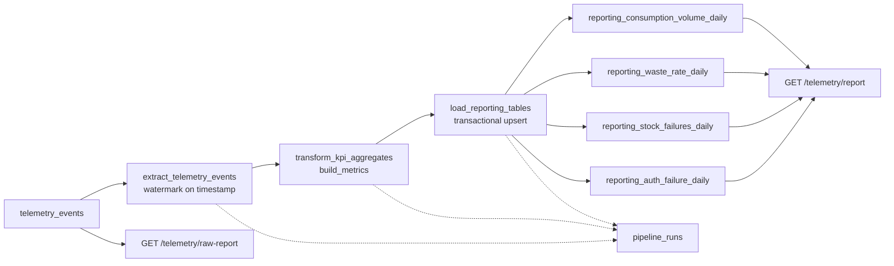

# HealthCore Telemetry KPI Pipeline — Design

**Version:** 1.0.0 (Design)  
**Branch:** `feature/data_pipeline`  
**KPI / event ground truth:** [`docs/telemetry/telemetry-plan.md`](../telemetry/telemetry-plan.md), [`docs/telemetry/event-schemas.json`](../telemetry/event-schemas.json), and `services/api/app/domains/telemetry/` (`analysis.py`, `models.py`, `mapper.py`, `repository.py`, `router.py`)  
**Implementation plans:** `memory-bank/references/data_pipelines_ai_plan/data_pipeline_*_implementation_plan.md`

This document is the sole design artifact for Build 1 and Build 2. There is no second copy under `data/pipelines/`.

---

## 1. Current State

HealthCore persists append-only backoffice telemetry in Supabase PostgreSQL table **`telemetry_events`** (SQLModel `TelemetryEventRow` in `services/api/app/domains/telemetry/models.py`). Columns: `id (uuid)`, `timestamp (timestamptz)`, `service`, `event_type`, `level`, `value (float?)`, `message (str?)`, `tags (jsonb)`. The app reads events via `load_events()` in `repository.py` through `get_supabase_db` / `supabase_engine` (`app/core/db.py`). Tables are created at FastAPI startup with `SQLModel.metadata.create_all`; when `DATABASE_URL` is unset, Supabase work is skipped.

Leadership KPIs are computed **inside the request path** of `GET /api/v1/telemetry/report` (`router.py`): `build_metrics()` in `analysis.py` runs four Pandas aggregations and is wrapped by a 60-second in-memory cache (`cache.py`).

| KPI function (`analysis.py`) | Grain | Outputs |
| --- | --- | --- |
| `consumption_volume_per_day` | `date · clinic_id · jurisdiction` | `count` |
| `waste_rate_per_day` | `date · jurisdiction` | `waste_rate`, `total` |
| `insufficient_stock_failures_per_day` | `date · clinic_id · jurisdiction · supply_id` | `count`, `attempts`, `rejection_rate` |
| `auth_failure_rate` | `date` | `failed`, `succeeded`, `failure_rate` |

These match the reconciled KPIs in `telemetry-plan.md` §2 (consumption rate, waste rate, insufficient-stock rejection rate) plus auth failure rate from instrumentation.

**Event types used by `build_metrics` today:** `supply_consumption_created`, `supply_consumption_failed`, `user_login_succeeded`, `user_login_failed`. Other stored types (e.g. `supply_delivery_created`, `supply_list_viewed`, `session_expired`, v1.1 abandon/filter) are not inputs to these four KPIs.

**Limitations of the current path:**

- Every report call (cache miss) recomputes aggregations from raw `telemetry_events` — no materialized reporting tables.
- No pipeline **run log**; operators cannot see what window a failed job processed.
- Invalid grain rows are dropped with Pandas `dropna` without a counted quarantine trail.
- There is no idempotent load strategy and no watermarked incremental extract.

**Strong vs weak Current State:** Strong — names the real table, four `analysis.py` functions, request-path `/telemetry/report`, and concrete limitations (no run log, silent drops). Weak — “we should move analytics offline someday” with no entity names.

---

## 2. Purpose

Materialize HealthCore’s clinic- and jurisdiction-segmented supply consumption, waste, stock-rejection, and auth-failure KPIs from `telemetry_events` into auditable reporting tables so operations leadership can trust nightly figures without re-running ad-hoc Pandas on every dashboard request.

**Strong vs weak Purpose:** Strong — one sentence naming HealthCore ops KPIs and the business outcome. Weak — “build an ETL with Prefect.”

---

## 3. Extraction format

| Concern | Design |
| --- | --- |
| **Source** | `telemetry_events` (append-only / immutable) |
| **Payload shape** | Operational dimensions live in JSONB `tags` (`clinic_id` int, `jurisdiction ∈ {us, uk}`, `consumption_type`, `supply_id`, etc.) plus envelope keys from ingest |
| **Cadence** | Nightly batch **and** on-demand (CLI + HTTP trigger) |
| **Volume (rough)** | 12 clinics × 2 jurisdictions; inventory/auth staff actions — thousands of events/day at full rollout, not high-frequency streaming |
| **Windowing** | **Watermark on `timestamp`** (event time). Do not full-table scan on every run |
| **Event filter** | KPI-only types listed in §8 Interfaces (`PipelineConfig.event_types`) |

Extract reads `timestamp >= watermark_from AND timestamp < watermark_to` (and `event_type IN (…)`) via the existing engine/session pattern.

---

## 4. Data-flow diagram



Stages: **extract → transform → load**, then serve. `pipeline_runs` records audit metadata for every execution. Live `/telemetry/raw-report` remains the only HTTP path that recomputes from raw `telemetry_events`.

---

## 5. Update / dedup strategy

`telemetry_events` is append-only, but KPI **aggregates** change when late events arrive (e.g. UK mid-day correcting a US-morning rollup already loaded).

**Mechanism:** upsert each reporting row on its **KPI grain unique key** (not `DISTINCT`, not delete-all-reload for the whole table).

| Table | Upsert conflict target (grain) | Value columns |
| --- | --- | --- |
| `reporting_consumption_volume_daily` | `(report_date, clinic_id, jurisdiction)` | `count` |
| `reporting_waste_rate_daily` | `(report_date, jurisdiction)` | `waste_rate`, `total` |
| `reporting_stock_failures_daily` | `(report_date, clinic_id, jurisdiction, supply_id)` | `count`, `attempts`, `rejection_rate` |
| `reporting_auth_failure_daily` | `(report_date)` | `failed`, `succeeded`, `failure_rate` |

Provenance columns on every reporting row: `run_id (uuid)`, `updated_at (timestamptz)`.

**Reprocess-window:** each run re-aggregates the last **N days** (default **2**) of event time so late cross-jurisdiction arrivals correct already-loaded grains via upsert. See §8.

**Strong vs weak dedup:** Strong — named tables + grain keys + reprocess-window. Weak — “use DISTINCT” or “dedupe somehow.”

---

## 6. Idempotency strategy

**Scenario — second run after a load-phase failure:**

1. Run A inserts `pipeline_runs` with `run_id=A`, `status=running`, resolves `watermark_from` / `watermark_to`, extracts and transforms successfully, then crashes mid-load before commit.
2. Because load uses **one transaction for all four upserts**, Run A leaves **no partial reporting rows**. Watermark fields on the successful-run cursor are **not** advanced (watermark advances only after a committed load). Run A ends `status=failed` with `error_summary` and `checkpoint` at the last completed phase (e.g. `transform`).
3. Run B creates a **new** `run_id=B`, resolves the window again from the last **successful** run’s `watermark_to` minus reprocess-window (same or overlapping window as A), re-extracts, re-transforms, and upserts.
4. Upserts conflict on grain keys and overwrite values + `run_id`/`updated_at` — **no duplicate grain rows**. Serving layer continues to show last successfully committed reporting data until B commits (**serve-last-good**).

**Strong vs weak idempotency:** Strong — describes failed load, unadvanced watermark, and second-run upsert. Weak — “pipeline should be idempotent.”

---

## 7. Execution log — `pipeline_runs`

| Field | Type | Audit justification |
| --- | --- | --- |
| `run_id` | `uuid` (PK) | Correlates load provenance on reporting rows to a single execution |
| `started_at` | `timestamptz` | When the run began (ops SLAs / latest-run API) |
| `finished_at` | `timestamptz` nullable | When the run ended; null while `running` |
| `watermark_from` | `timestamptz` nullable | Event-time lower bound actually processed |
| `watermark_to` | `timestamptz` nullable | Event-time upper bound; basis for the next successful run’s cursor |
| `rows_extracted` | `int` default 0 | Reconciliation: how many source rows entered the window |
| `rows_loaded` | `int` default 0 | Reconciliation: reporting rows upserted (“records processed” for eval/API) |
| `rows_quarantined` | `int` default 0 | Invalid of rows held back (PHI / invalid grain), not silent loss |
| `status` | `str` enum-like | Lifecycle: `running` → `success` \| `partial` \| `failed` \| `quarantined` |
| `error_summary` | `text` nullable | Human-readable failure cause without stack traces / PHI |
| `pipeline_version` | `str` | Reproducibility (semver / git sha) |
| `checkpoint` | `str` nullable | Last completed phase (`extract` \| `transform` \| `load`) for audit; **resume is Roadmap** |

**Status lifecycle**

| Status | When set |
| --- | --- |
| `running` | Run row inserted at flow start |
| `success` | All critical stages committed; watermark advanced; optional snapshot OK |
| `partial` | Critical path succeeded; **non-critical** snapshot export failed (`return_state=True`) |
| `failed` | Critical stage crashed; load not committed; watermark not advanced |
| `quarantined` | PHI/schema circuit breaker tripped; **load blocked** |

Index: `idx_pipeline_runs_started_at` on `(started_at DESC)` for latest-run queries.

---

## 8. Interfaces

### 8.1 Watermark strategy

- At run start: `watermark_to = end` if provided, else **`now(UTC)`**.
- `watermark_from` = latest `pipeline_runs.watermark_to` where `status = 'success'`, **minus `reprocess_window_days`**.
- **First run** (no successful prior run): `watermark_from = watermark_to - lookback_days`.
- **Defaults:** `reprocess_window_days = 2` (US morning vs UK mid-day late arrivals); `lookback_days = 7` (first-run backfill without scanning full history forever).
- Advance persisted successful watermark **only after** the load transaction commits.

### 8.2 Reprocess-window

Re-aggregate the last **2 days** of event time on every success path so late-arriving cross-jurisdiction events correct grains via upsert without requiring a manual backfill for small clock/jurisdiction skew.

### 8.3 Reporting tables

All include surrogate `id` PK, grain unique constraint, value columns above, plus `run_id` and `updated_at`. KPI JSON uses string `date`; load maps to `report_date (date)`. Normalize `supply_id` to string; `clinic_id` is integer; `jurisdiction ∈ {us, uk}`.

### 8.4 Prefect Blocks (config shape)

Build 1 implements these fields as **`data/pipelines/config.py` constants** (Block registration is optional later).

| Block | Fields |
| --- | --- |
| `SupabaseConfig` | `database_url` |
| `PipelineConfig` | `event_types`, `reprocess_window_days`, `lookback_days`, `batch_size`, `pipeline_version` |

**`event_types` (KPI-only):**

```text
supply_consumption_created
supply_consumption_failed
user_login_succeeded
user_login_failed
```

### 8.5 Endpoints (Build 1)

Same auth (`get_current_user`) and report JSON conventions as today.

| Endpoint | Behavior |
| --- | --- |
| `GET /api/v1/telemetry/report` | Reads `reporting_*` (materialized); frontend URL/shape unchanged |
| `GET /api/v1/telemetry/raw-report` | Live `build_metrics` from `telemetry_events` (preserved former report) |
| `GET /api/v1/telemetry/pipelines/runs/latest` | Newest `pipeline_runs` metadata (`status`, `started_at`, `finished_at`, `rows_loaded`, …) |
| `POST /api/v1/telemetry/pipelines/runs/trigger` | Imports `telemetry_etl_flow` (BackgroundTasks); returns `{ message, run_id }` |

### 8.6 Batch / transaction tradeoff

**Chosen approach:** one database transaction wrapping all four reporting upserts.

- **Why:** a mid-load crash must not leave half the KPIs updated for a window (dashboard inconsistency). Idempotent upsert + watermark-after-commit makes replay safe.
- **Tradeoff vs chunked upserts:** chunked is more recoverable mid-batch but needs careful watermark semantics; deferred to Roadmap (savepoints / sub-batch).

### 8.7 PHI allowlist (circuit breaker)

Fail closed before load. Allowed tag keys = **union** of all property keys in `mapper.EVENT_PROPERTY_ALLOWLIST` plus envelope keys `eventId`, `sessionId`, `userId`, `schemaVersion`, `requestId`. Trip on unknown keys or PHI-like values (email regex, DOB-shaped, free-text personal name heuristics). On trip: `status=quarantined`, do not load, increment `rows_quarantined`.

---

## 9. Prefect mapping

### Flows (≥2)

| Flow | Role |
| --- | --- |
| `telemetry_etl_flow(start=None, end=None)` | Nightly / default incremental ETL |
| `backfill_flow(start, end)` | Thin wrapper forcing an explicit event-time window through the same tasks |

### Tasks (≥3 + required non-critical)

| Task | Stage | Notes |
| --- | --- | --- |
| `extract_telemetry_events` | Extract | `retries=3`, backoff, `retry_condition_fn` for transient DB errors only |
| `transform_kpi_aggregates` | Transform | Calls `build_metrics`; `cache_key_fn` + `cache_expiration` on window |
| `load_reporting_tables` | Load | Transactional upsert; returns rows loaded |
| `export_snapshot_optional` | Non-critical | Write JSON snapshot under `data/process/`; **must** be invoked with **`return_state=True`**; failure → continue + `partial` |

Prefect task/flow states observed operationally: Running / Completed / Failed (mapped into `pipeline_runs.status` as above).

Build 2 wraps these tasks in subflows (`extract_telemetry_subflow`, `transform_kpi_subflow`, `load_reporting_subflow`, `export_snapshot_subflow`) without renaming the grain model.

---

## 10. Resilient, Observable, and Recoverable features

Each item: **(a)** failure scenario, **(b)** rationale, **(c)** tag.

### Extract

| Feature | Failure scenario | Rationale | Tag |
| --- | --- | --- | --- |
| Smart retries + `retry_condition_fn` | Transient Supabase / connection reset mid-read | Retry blips without retrying validation errors or paging on-call | **Build 1** |
| Backoff + jitter / `timeout_seconds` | Hung DB connection | Bound wait time; avoid thundering herd | **Build 1** (retries+delay); fine-grained jitter/timeouts may follow Prefect defaults |
| Chunked reads | Very large windows OOM the worker | Scale extract independently of transform | **Roadmap** |

### Transform

| Feature | Failure scenario | Rationale | Tag |
| --- | --- | --- | --- |
| Schema validation + defensive coerce (`errors="coerce"`) | Malformed `timestamp` strings | Prefer NaT over hard crash; aligns with later unit tests | **Build 1** |
| Row quarantine count (don’t silently lose visibility) | Null `clinic_id` / `jurisdiction` / `supply_id` grain fields | KPI math still via `analysis.py`; pipeline records `rows_quarantined` for ops | **Build 1** |
| Per-KPI isolation (`return_state=True` per metric) | One KPI function throws and blanks the whole report | Useful, but Build 1 keeps single `build_metrics` call | **Roadmap** |
| HIPAA PHI circuit breaker | Bad/poison row with patient-like tags already in DB | Fail closed; block load; `quarantined` | **Build 1** |

### Load

| Feature | Failure scenario | Rationale | Tag |
| --- | --- | --- | --- |
| Transactional all-or-nothing upsert | Crash after 2 of 4 tables written | No inconsistent KPI slice for a window | **Build 1** |
| Watermark after commit | Advance cursor then fail load | Prevents permanent data loss / skipped windows | **Build 1** |
| Savepoints / advisory run-lock | Concurrent nightly + manual trigger | Serialize writers; deferred | **Roadmap** |

### Cross-cutting

| Feature | Failure scenario | Rationale | Tag |
| --- | --- | --- | --- |
| `on_failure` / structured `error_summary` + `run_id` | Any critical crash | Ops can find the run without log diving for stack dumps | **Build 1** |
| Volume/freshness anomaly check | Extract returns ~0 after weeks of volume | Catch broken instrumenters early | **Roadmap** |
| Fail-fast if `database_url` / `DATABASE_URL` missing | CLI runs with engine `None` | Never silently “succeed” with empty KPIs | **Build 1** |
| Serve-last-good | Failed run | Prior committed `reporting_*` rows remain queryable | **Build 1** |

### Recovery

| Feature | Failure scenario | Rationale | Tag |
| --- | --- | --- | --- |
| `checkpoint` column written | Ops asks “where did it die?” | Audit only in Build 1 | **Build 1** (write) |
| Checkpoint **resume** | Restart mid-pipeline without re-extract | Complexity; watermark+upsert already covers most cases | **Roadmap** |
| `backfill_flow` + reprocess-window | Historical gap / late data | Explicit window + nightly 2-day overlap | **Build 1** (`backfill_flow` thin); deep resume **Roadmap** |

---

## 11. Repo traps

- Package management is **uv**. Prefect is **not** installed until Build 1 (`uv add "prefect>=3"` on `services/api`; re-lock **both** `services/api/uv.lock` and root `uv.lock`).
- Pipeline code lives at repo-root `data/pipelines/` but must import `app.*` from `services/api`. Build 1 must make `services/api` importable from the script (`sys.path` / workspace).
- FastAPI endpoints in `services/api` must import the flow from `data.pipelines` — repo root must be importable (`data/__init__.py`).
- App silently skips Supabase when `DATABASE_URL` unset — pipeline CLI must **fail fast** instead.

---

## 12. Run command and schedule

**CLI (Build 1):**

```bash
uv run python data/pipelines/pipeline.py
```

Requires `DATABASE_URL` set to the Supabase Postgres URL for `milestone5_inventory`. If unset, exit non-zero with a one-line message (no false success).

**Intended schedule:** nightly cron `0 2 * * *` (02:00 local ops window) invoking the same CLI. On-demand: `POST /api/v1/telemetry/pipelines/runs/trigger` or CLI.

Build 1/2 must keep this section accurate when the entrypoint changes.

---

## 13. Build roadmap / handoff

Shared vocabulary: flows/tasks/tables/states in §§7–9. **Do not rename** between builds.

### Build 1 — Resilient pipeline (implement)

- `data/pipelines/pipeline.py` + `config.py`; `data/process/reporting_repository.py`
- Four `reporting_*` tables + `pipeline_runs`; indexes; register models in `main.py`
- Watermark, reprocess-window, transactional upsert, PHI guard, quarantine counts
- Extract retries; transform cache; **`export_snapshot_optional` with `return_state=True`**
- CLI fail-fast; thin `backfill_flow`
- `GET /telemetry/report` → reporting tables; `GET /telemetry/raw-report` → live; latest + trigger endpoints
- Commit: `feat: implement resilient prefect pipeline`
- **Pause for review** before Build 2

### Build 2 — Subflows & tests (refactor only)

- ≥3 typed subflows wrapping existing tasks; main flow = coordinator
- Promote `analysis.py` helpers; DB-free tests in `tests/pipelines/test_pipeline.py`
- Fix root pytest collection; re-verify CLI
- Commit: `feat: refactor pipeline into subflows and add unit tests`; **open PR → `main`**

---

## 14. Definition of done (Design)

- [x] This file exists under `docs/data_pipelines/`; design only (no orchestration code in this phase)
- [x] Purpose is one concrete HealthCore sentence
- [x] Diagram shows extract → transform → load with real names
- [x] Update/dedup uses upsert on named grains + reprocess-window
- [x] Idempotency describes the second run after a load failure
- [x] Execution log fields include name, type, justification
- [x] Prefect mapping ≥2 flows + ≥3 tasks + Block shapes
- [x] Watermark, reporting tables, run states, Build 1 vs Roadmap resilience tags
- [x] Consistent with telemetry-plan KPIs and `analysis.py` grains
- [x] Build roadmap / handoff for Build 1 and Build 2
- [x] Run command + schedule documented here for Build 1/2 reference
