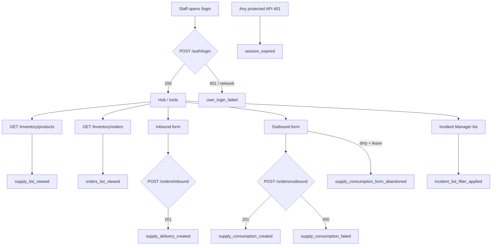

# HealthCore Backoffice Telemetry Plan

**Version:** 1.1.0  
**Scope:** Medical supply inventory, incident list filters, and authentication flows in the backoffice landing app (`uis/backoffice/landing`, port 3001)  
**Entity source of truth:** `services/api/app/domains/inventory/models.py`  
**Downstream specs:** `memory-bank/references/telemetry_ai_plan/telemetry_frontend_specs.md`, `telemetry_storage_specs.md`, `telemetry_report_specs.md`

This document is the authoritative design for Phases 2–4. Instrumentation must use the entity names, fields, event types, and property allowlists defined here.

---

## 1. Executive summary

HealthCore operates 12 outpatient clinics across the US and UK. Clinic staff log medical supply deliveries and consumptions through the backoffice inventory module, backed by FastAPI (`POST /api/v1/inventory/orders/inbound`, `POST /api/v1/inventory/orders/outbound`) and SQLModel persistence on Supabase (`MedicalSupply`, `SupplyDelivery`, `SupplyConsumption`).

Today the system answers **what** happened in the database but not **how operations behave over time** across jurisdictions. Leadership and the CCO (Claire Whitfield) cannot reliably answer:

- Which clinics consume supplies fastest, and whether US vs UK patterns differ.
- What share of outbound volume is clinical use vs expiry/waste disposal.
- How often outbound orders are rejected for insufficient stock, and which supplies/clinics are affected.
- Whether staff abandon outbound forms before submitting (form friction vs stock-out failures).
- How Patient Experience teams filter incident lists when reviewing operational data.

Telemetry closes this gap by capturing a small, allowlisted set of staff-action events from the backoffice UI and auth layer. Events carry jurisdiction and clinic dimensions (where applicable) for segmented audit trails, with **no patient identifiers**.

---

## 2. KPI analysis

### KPI 1 — Supply consumption rate

| | |
|---|---|
| **Definition** | Count of successful outbound consumptions (`SupplyConsumption`) per clinic per calendar day, segmented by jurisdiction (`us` / `uk`). |
| **Data components** | `event_type = supply_consumption_created`; properties: `clinic_id`, `jurisdiction`, `quantity`, `supply_id`, `consumption_type`. |
| **System touchpoint** | `POST /api/v1/inventory/orders/outbound` → HTTP 201; frontend: `inventory/lib/outbound-form-logic.ts` after `createOutboundOrder` succeeds. |
| **Why telemetry helps** | Surfaces high-consumption clinics without exporting order tables; enables reorder and par-level review by jurisdiction. |

### KPI 2 — Supply waste rate

| | |
|---|---|
| **Definition** | Share of outbound events where `consumption_type = expiry_waste` vs all outbound (`clinical_use` + `expiry_waste`), per jurisdiction (and clinic where volume allows), per day. |
| **Data components** | Same events as KPI 1; key dimension: `consumption_type ∈ {clinical_use, expiry_waste}`. |
| **System touchpoint** | Outbound form submits `consumption_type` to `SupplyConsumptionCreate`; validated in `inventory/schemas.py`. |
| **Why telemetry helps** | Identifies clinics with disproportionate waste for expiry-management and ordering process review. |

### KPI 3 — Insufficient-stock rejection rate

| | |
|---|---|
| **Definition** | Count (and rate relative to outbound attempts) of outbound orders rejected because `quantity > available` stock, per supply/clinic/jurisdiction per day. |
| **Data components** | `event_type = supply_consumption_failed`; properties: `error_code` (e.g. `INSUFFICIENT_STOCK`), `supply_id`, `clinic_id`, `jurisdiction`. Supporting context: `supply_consumption_form_abandoned` distinguishes abandon friction from rejection. |
| **System touchpoint** | `create_outbound_order` in `inventory/router.py` → HTTP 400 when `body.quantity > compute_stock(...)`; frontend catch in `use-outbound-form.ts` / `classifyOutboundError`. |
| **Why telemetry helps** | Observable stock-out signal without a persisted `current_stock` column; supports US vs UK supply-chain reliability comparison. |

### Reconciliation with CONTEXT

The stakeholder CONTEXT document proposed KPIs that depend on fields not present in the delivered codebase. This plan re-grounds metrics on observable code paths.

| CONTEXT KPI | Reconciled KPI (above) | Why re-grounded |
| --- | --- | --- |
| Critical supply availability rate (needs `min_stock_threshold`) | Insufficient-stock rejection rate | No `min_stock_threshold` or stored `current_stock` column; stock is computed (`compute_stock`) and only the HTTP 400 rejection path is observable. |
| Emergency dispensing frequency (needs `clinical_context = emergency`) | Supply consumption rate + Supply waste rate | No `clinical_context` or `emergency` value; outbound is `SupplyConsumption` with `consumption_type ∈ {clinical_use, expiry_waste}` only. |
| Stock-out incident rate (needs stored stock hitting zero) | Insufficient-stock rejection rate + consumption volume | No persisted stock level to observe hitting zero; rejections are the observable stock-out signal; consumption volume contextualises demand. |

---

## 3. Flow mapping

Authenticated staff use the backoffice hub → inventory tool and incident manager.

### Inventory instrumentation points (≥6)

| # | `event_type` | Trigger | Code location (Phase 2) |
|---|--------------|---------|-------------------------|
| 1 | `supply_list_viewed` | Products list data loaded | `inventory/hooks/use-products.ts` |
| 2 | `orders_list_viewed` | Orders list data loaded | `inventory/hooks/use-orders.ts` |
| 3 | `supply_delivery_created` | Inbound POST 201 | `inventory/lib/inbound-form-logic.ts` |
| 4 | `supply_consumption_created` | Outbound POST 201 | `inventory/lib/outbound-form-logic.ts` |
| 5 | `supply_consumption_failed` | Outbound POST 400 / validation error | `inventory/hooks/use-outbound-form.ts` catch |
| 6 | `supply_consumption_form_abandoned` | Dirty outbound form left without submit | `inventory/hooks/use-outbound-form.ts` |

**Note:** `list_products` and `list_orders` return **all clinics** (not clinic-scoped). List-view events carry `item_count` only — no `clinic_id` or `jurisdiction`.

### Jurisdiction derivation

`jurisdiction` is **not** stored on inventory rows. On clinic-operation events, the client derives it from the selected supply's `MedicalSupply.country`:

| `country` (API) | `jurisdiction` (telemetry) |
|-----------------|---------------------------|
| `US` | `us` |
| `UK` | `uk` |

Products are loaded via `listProducts()` (`MedicalSupplyRead` includes `country`).

### Outbound form dirty definition (v1.1)

Form is **dirty** when any field differs from `emptyOutbound()` in `outbound-form-logic.ts`:

- `supplyId !== null` OR
- `quantity !== ""` OR
- `consumptionType !== CONSUMPTION_TYPES[0].value` OR
- `clinicId !== 1`

---

## 4. Backoffice opportunities

### Auth events

| `event_type` | Trigger | Stream/batch | Rationale |
|--------------|---------|--------------|-----------|
| `user_login_succeeded` | `POST /auth/login` 200 | batch | Operational signal; batched with inventory events for daily reporting. |
| `user_login_failed` | `POST /auth/login` 401 or network error | **stream** | Security and UX urgency — failed access attempts should flush quickly. |
| `session_expired` | 401 → redirect to `/login` in `healthcoreFetch` / `apiFetch` | **stream** | Session loss affects immediate user experience. |

**Auth instrumentation sites (Phase 2):**

- `landing/hooks/use-login-form.ts` — login success/failure; generate `sessionId` on success.
- `shared/lib/healthcore-api.ts` — `session_expired` on inventory routes.
- `landing/lib/api.ts` — `session_expired` on hub/profile routes.

`jurisdiction` on `user_login_succeeded` is **optional** — omit at login if unknown.

### Incident filter event (v1.1)

| `event_type` | Trigger | Stream/batch | Rationale |
|--------------|---------|--------------|-----------|
| `incident_list_filter_applied` | Dropdown change in `IncidentListFilters` | batch (500ms debounce) | Patient Experience audit; not security-urgent. |

**Code location (Phase 2):** `incident-manager/components/incident-list-filters.tsx` `onChange`.

Inventory has no filter UI; Incident Manager provides status / origin / branch / category dropdowns.

---

## 5. Event envelope

Every event uses this envelope. `schemaVersion` is **`1.1.0`** for this release.

| Field | Type | Required | Notes |
| --- | --- | --- | --- |
| `eventId` | string (UUID) | yes | Client-generated at capture; dedup/idempotency |
| `timestamp` | string (ISO 8601, UTC) | yes | Moment of capture, not of send |
| `sessionId` | string | yes | Opaque; generated at login, stored in `sessionStorage` |
| `userId` | string | yes | Opaque TinyDB user id as string (`str(user.id)` from `GET /auth/me`); never name/email |
| `event_type` | string | yes | Snake-case `entity_action` taxonomy |
| `schemaVersion` | string | yes | `1.1.0` |
| `requestId` | string | yes | Correlates frontend ↔ API ↔ logs |
| `service` | string | yes | Constant `"backoffice"` |
| `properties` | object | yes | Event-specific allowlist keys only |

---

## 6. Event catalog

### PII sanitisation strategy

No PII is collected in `properties`. `userId` is an opaque TinyDB user id carried in the envelope only. `jurisdiction` and `clinic_id` are non-patient operational dimensions. Staff actions on supplies do not reference patients. Incident filter values are operational enums only — never incident title or description.

---

### Inventory events

#### `supply_delivery_created`

**Golden rule:** When a staff member successfully logs an inbound delivery, we record the supply, quantity, clinic, and jurisdiction so procurement can audit stock-in by location.

| Property | Type | Required | PII |
|----------|------|----------|-----|
| `supply_id` | integer | yes | false |
| `quantity` | integer | yes | false |
| `clinic_id` | integer | yes | false |
| `jurisdiction` | `us` \| `uk` | yes | false |

**Stream/batch:** batch

---

#### `supply_consumption_created`

**Golden rule:** When a staff member successfully logs an outbound consumption, we record supply, quantity, consumption type, clinic, and jurisdiction so clinical ops can track usage and waste patterns.

| Property | Type | Required | PII |
|----------|------|----------|-----|
| `supply_id` | integer | yes | false |
| `quantity` | integer | yes | false |
| `consumption_type` | `clinical_use` \| `expiry_waste` | yes | false |
| `clinic_id` | integer | yes | false |
| `jurisdiction` | `us` \| `uk` | yes | false |

**Stream/batch:** batch

---

#### `supply_consumption_failed`

**Golden rule:** When an outbound order is rejected (insufficient stock or validation failure), we record a stable error code and operational context so leadership can measure stock-out pressure without logging raw API error text.

| Property | Type | Required | PII |
|----------|------|----------|-----|
| `error_code` | string | yes | false |
| `supply_id` | integer | yes | false |
| `clinic_id` | integer | yes | false |
| `jurisdiction` | `us` \| `uk` | yes | false |

**Stream/batch:** batch

---

#### `supply_consumption_form_abandoned` (v1.1)

**Golden rule:** When staff leave the outbound consumption form with unsaved changes, we record partial form progress so ops can separate abandon friction from stock-out failures.

| Property | Type | Required | PII |
|----------|------|----------|-----|
| `clinic_id` | integer | yes | false |
| `had_supply_selected` | boolean | yes | false |
| `had_quantity` | boolean | yes | false |
| `jurisdiction` | `us` \| `uk` | no | false |
| `abandon_trigger` | `navigation` \| `tab_hidden` | yes | false |

**Stream/batch:** batch — at most once per form mount per abandon episode; 30s dedupe.

**Notes:** No `supply_id` or raw quantity. `jurisdiction` omitted when no supply selected.

---

#### `supply_list_viewed`

**Golden rule:** When the products list loads, we record how many supplies are visible so we can normalise engagement metrics without clinic scope (list is global).

| Property | Type | Required | PII |
|----------|------|----------|-----|
| `item_count` | integer | yes | false |

**Stream/batch:** batch

---

#### `orders_list_viewed`

**Golden rule:** When the order history list loads, we record the number of orders shown so reporting can distinguish empty vs populated views.

| Property | Type | Required | PII |
|----------|------|----------|-----|
| `item_count` | integer | yes | false |

**Stream/batch:** batch

---

#### `product_created` (design-only — API-only)

**Golden rule:** When a new `MedicalSupply` is registered via API, we would record supply id, category, and jurisdiction for catalogue-growth auditing.

| Property | Type | Required | PII |
|----------|------|----------|-----|
| `supply_id` | integer | yes | false |
| `category` | string | yes | false |
| `jurisdiction` | `us` \| `uk` | yes | false |

**Status:** `POST /api/v1/inventory/products` exists (auth required) but **no create-product UI** in the backoffice. **Do not instrument in Phase 2.**

**Stream/batch:** batch

---

### Incident manager event (v1.1)

#### `incident_list_filter_applied`

**Golden rule:** When staff change an incident list filter, we record which dimension changed and how many filters are active so Patient Experience can audit how teams slice incident data.

| Property | Type | Required | PII |
|----------|------|----------|-----|
| `filter_dimension` | `status` \| `origin` \| `branch` \| `category` | yes | false |
| `filter_value` | string | yes | false |
| `active_filter_count` | integer (0–4) | yes | false |

**Stream/batch:** batch — 500ms debounce for rapid multi-dropdown changes.

---

### Auth events

#### `user_login_succeeded`

**Golden rule:** When a staff member successfully authenticates, we record the session start so access patterns can be correlated with inventory activity.

| Property | Type | Required | PII |
|----------|------|----------|-----|
| `jurisdiction` | `us` \| `uk` | no | false |

**Stream/batch:** batch

---

#### `user_login_failed`

**Golden rule:** When login fails, we record a coarse reason code (never email/password) so security and support can detect credential vs network issues quickly.

| Property | Type | Required | PII |
|----------|------|----------|-----|
| `reason` | `invalid_credentials` \| `session_expired` \| `network_error` | yes | false |

**Stream/batch:** stream

---

#### `session_expired`

**Golden rule:** When an authenticated session is invalidated (401 on a protected call), we record the event with envelope fields only so UX friction from token expiry is measurable.

| Property | Type | Required | PII |
|----------|------|----------|-----|
| *(none)* | — | — | false |

**Stream/batch:** stream

---

## 7. High-frequency strategy

| Category | Delivery | Notes |
|----------|----------|-------|
| `user_login_failed`, `session_expired` | **Stream** | Security and session-loss signals should not wait for batch window. |
| All inventory events | **Batch** | Phase 2 `TelemetryService`: flush every 10s or 20 events; `sendBeacon` on tab close. |
| `incident_list_filter_applied` | **Batch** | 500ms debounce when staff adjust multiple dropdowns. |
| `supply_list_viewed`, `orders_list_viewed` | **Batch** + debounce | Collapse duplicate views within **30 seconds** at call site. |
| `supply_consumption_form_abandoned` | **Batch** | At most once per form mount; 30s dedupe. |

---

## 8. Risks and exclusions

### Regulatory

- **HIPAA (US) / UK GDPR:** No patient identifiers in any event — no patient name, ID, DOB, or diagnosis. `SupplyConsumption` events describe staff inventory actions, not patient encounters. Incident filter values are operational enums only.
- **`userId`:** Opaque TinyDB user id string only; never display name or email in telemetry payloads.
- **`jurisdiction` on clinic-operation events:** Required on delivery, consumption, and failure events for CCO jurisdiction-segmented audit trails.
- **Audit durability:** Events are immutable once stored; envelope carries `schemaVersion` for forward-compatible evolution.

### Ingest security (Phase 2+)

The telemetry ingest endpoint is intentionally **unauthenticated** so `navigator.sendBeacon` can flush on tab close. Identity is self-reported in the envelope (`userId`, `sessionId`). Protection relies on CORS allowlist, per-event validation, and non-critical data classification.

### Dropped events (not designed)

| Proposed event | Reason excluded |
|----------------|-----------------|
| `stock_threshold_triggered` | No `min_stock_threshold` field on `MedicalSupply` or elsewhere. |
| `direct_stock_edit_rejected` | No direct stock-edit endpoint; stock changes only via inbound/outbound orders. |
| `emergency_dispensing_flagged` | No `clinical_context` or `emergency` consumption type; only `clinical_use` and `expiry_waste`. |

### Rejected filter alternatives (v1.1)

| Alternative | Why not chosen |
|-------------|----------------|
| `supplier_list_filter_applied` | Supplier Directory country/category — procurement domain. |
| `candidate_list_filter_applied` | Talent Tracker — external API, recruiting domain. |

### Reconciled entity reference (code wins)

| Do not use (docs) | Use (codebase) |
|-------------------|----------------|
| `Product` | `MedicalSupply` |
| `InboundOrder` | `SupplyDelivery` |
| `OutboundOrder` / `DispensingOrder` | `SupplyConsumption` |
| `jurisdiction` column | Derive from `MedicalSupply.country` |
| `clinic_id` slug | Integer (`1`, `10`, …) |

---

## Appendix — Event count summary

| Category | Instrumentable in Phase 2 | Design-only |
|----------|---------------------------|-------------|
| Inventory | 6 | 1 (`product_created`) |
| Incident manager | 1 | 0 |
| Auth | 3 | 0 |
| **Total** | **10** | **1** |

JSON Schema definitions: [`event-schemas.json`](event-schemas.json)
