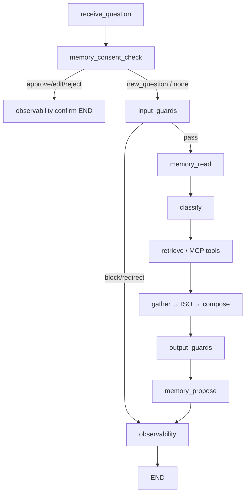

# Agent Memory — Implementation Plan

**Plan file:** [`agent_memory_IMPLEMENTATION_PLAN.md`](agent_memory_IMPLEMENTATION_PLAN.md)

**Requirements source (authoritative):** [`agent_memory_specs.md`](agent_memory_specs.md)

**Prerequisite:** Parts 1–4 delivered — RAG-on-LangGraph, incident/inventory tools, Company Tools MCP, and the guardrail harness on `feature/agent_harness`. Graph lives in `services/api/app/domains/agent/`.

**Branch:** `feature/agent_memory` off `origin/feature/agent_harness`. PR → `feature/agent_harness`.

**Working directories:**

| Area | Path |
|------|------|
| Memory subpackage (new) | `services/api/app/domains/agent/memory/` |
| Graph wiring (modify) | `state.py`, `nodes.py`, `routing.py`, `graph.py`, `service.py` |
| API contract (modify) | `schemas.py`, `router.py` |
| Users / auth (modify) | `app/domains/users/`, `app/domains/auth/schemas.py`, seed |
| Settings / env | `app/core/config.py`, `services/api/.example.env`, root `.example.env` |
| Infra | `docker-compose.yml` (`redis` service) |
| Dependencies | `services/api` + root: `redis>=5`; dev: `fakeredis` |
| Consolidation script | `scripts/consolidate_agent_memory.py` (or `uv run` entry) |
| Frontend | `uis/backoffice/knowledge/` (+ landing Jest) |
| Tests (new) | `services/api/tests/test_agent_memory.py`, `tests/pipelines/test_memory_consent.py` |
| Stay green | `tests/pipelines/test_guardrails_injection.py`, `tests/pipelines/test_rag.py`, agent/knowledge suites |
| Docs | `services/api/app/domains/agent/memory/README.md` (Cycles A/B); API README pointer |

**Status:** Plan ready — implement only after developer go-ahead.

**Rule:** Spec + locked planning clarifications below override any ambiguity. Redis is source of truth; Qdrant `agent_memory` is a rebuildable recall index. Memory is never appended to the system prompt. PHI validation runs before showing a proposal and before consolidation writes. No Mem0/LangMem/Letta. No new HITL framework — reuse classifier pattern. Do **not** commit until the developer explicitly asks.

---

## Executive summary

Add **consent-gated, PHI-safe long-term memory** to the LangGraph support agent:

- **Explicit** `MemoryStore` (Redis SoT + Qdrant recall); inject bounded top-k as a labeled `[MEMORY]` block in the *user* message.
- **Self-eval** after each answer (`memory_propose`) — classifier-style JSON; dismiss one-offs / chit-chat; hard-reject PHI.
- **Consent** via approve / edit / reject (classifier + optional buttons); ignore = disregard; every proposal/decision audited.
- **Bounded** via sliding 90-day TTL, 30-day zero-recall prune, 50/scope cap + consolidation.
- **Frontend:** inline Approve/Edit/Reject + “what I remember” list with delete.



---

## Locked decisions (spec + planning Q&A)

| # | Topic | Decision |
|---|--------|----------|
| 1 | Architecture | **Redis** (entries + pending + audit stream + TTL) + **Qdrant** collection `agent_memory` (semantic recall). Redis wins on inconsistency. |
| 2 | Scope isolation | Filter recall/write on **`clinic_id` + `staff_id`**. Staff at the same clinic do **not** share memories in MVP. Clinic-shared semantic + staff procedural merge is **deferred** (§16.4). |
| 3 | `clinic_id` source | TinyDB user field. Values = inventory catalog ids as **strings** `"1"`…`"9"`. Missing → `"unassigned"` + warning. |
| 4 | User seeding | Idempotent demo users (create-if-missing); do **not** mass-backfill the 155 local `db.json` accounts. See Phase 1. |
| 5 | Branch / PR | `feature/agent_memory` ← `origin/feature/agent_harness`; PR → `feature/agent_harness`. |
| 6 | Pending consent | Redis `mem:pending:{staff_id}` JSON, **TTL 30m**. `GETDEL` on next turn. Buttons must match pending `proposal_id`. |
| 7 | Consent turn | Approve / edit / reject → short confirm (`"Saved."` / reject ack) → **END**. No normal Q&A on that turn. New question → `new_question` → disregard → normal graph. |
| 8 | Free-text edit | Classifier `decision=edit` when user supplies corrected wording (`"edit: …"`, `"save it as: …"`, or clear replacement text). Pure approve/reject phrases stay approve/reject. |
| 9 | Frontend | **In scope:** proposal Approve/Edit/Reject UI + memory list panel with delete. |
| 10 | DELETE | **`DELETE /api/v1/agent/memory/{id}`** (caller-scoped, audit `deleted`). Full per-scope purge deferred. |
| 11 | Consolidation trigger | On **hard-cap breach** (inline, no-raise) + **`uv run` script** + README suggested nightly cron. **Do not** wire DEV-53 `domains/jobs` in this PR. |
| 12 | Tests / Redis | **`fakeredis`** for pytest; stub Qdrant. Live Redis for local manual Cycle A/B only (Compose service). |
| 13 | Models | Keep **`deepseek-v4-flash`** (via existing `generation_model`) for proposal, consent-intent, and consolidation summarize. Temp 0. Embeddings: existing `pplx-embed-v1`. |
| 14 | §16 extras MVP | **In:** `mem_id`s in `trace_steps`; DELETE; frontend buttons + list. **Out:** relevance-weighted ranking, contradiction/replace, consent rate-limit, Presidio, consolidation LLM-judge eval, clinic/staff split-at-read. |
| 15 | Kill-switch | `memory_enabled=False` → memory nodes pass through; agent still answers. Missing Redis → disable gracefully (log once). |
| 16 | Git commits | **No commits until the developer explicitly asks.** Spec §14 granular list is aspirational only. |

---

## Prerequisites

- [ ] On / based off `origin/feature/agent_harness` (guardrails + MCP present)
- [ ] Spec + this plan read end-to-end before coding
- [ ] Docker available for local `redis` service; Qdrant already in stack/workflow as used by RAG
- [ ] API + backoffice landing runnable for Knowledge Assistant smoke
- [ ] Applicable `.agents/rules/frontend/*` loaded before UI edits

---

## Phase 0 — Branch, deps, Redis infra, settings

### 0.1 Branch

```bash
git fetch origin
git checkout -b feature/agent_memory origin/feature/agent_harness
```

### 0.2 Dependencies

- Production: `redis>=5` (`uv add redis` in `services/api`; re-lock **both** `services/api/uv.lock` and root `uv.lock`).
- Dev/test: `fakeredis` with **GETDEL + streams** support (`uv add --dev fakeredis`; pin version that supports them).
- Keep `[project.optional-dependencies] dev` and root `[dependency-groups] dev` aligned (conventions).

### 0.3 Docker Compose

Add service (dev, no auth locally):

```yaml
redis:
  image: redis:7-alpine
  ports:
    - "6379:6379"
  networks:
    - healthcore_net
```

- `api` `depends_on: redis` (soft — app must still start if Redis is down when `memory_enabled` degrades).
- Document password/TLS for non-dev in API README.
- Wire `REDIS_URL` into Compose / root `.example.env`.

### 0.4 Settings

Add to `app/core/config.py` and document in `services/api/.example.env` (+ root `.example.env` for Docker):

```
memory_enabled: bool = True
redis_url: str = "redis://localhost:6379/0"
memory_qdrant_collection: str = "agent_memory"
memory_recall_k: int = 5
memory_entry_ttl_days: int = 90
memory_pending_ttl_minutes: int = 30
memory_max_entries_per_scope: int = 50
memory_dedupe_threshold: float = 0.92
memory_low_relevance_days: int = 30
memory_summarize_min_cluster: int = 3
```

Reuse `settings.embedding_model` / `settings.generation_model` — no new model keys.

---

## Phase 1 — User `clinic_id` + demo seed

### 1.1 Schema

- Add optional `clinic_id: str | None = None` to `User`, `UserCreate`, `UserUpdate`, `UserResponse` (`app/domains/auth/schemas.py`).
- Persist on create/update in users service/store (TinyDB doc field).
- Normalize to lowercase opaque string when set; allow only catalog-like values or any non-empty string (no hard enum required for MVP).

### 1.2 Runtime resolution

In agent `service.invoke_graph` (or equivalent):

- `staff_id = str(user_id)` from JWT.
- `clinic_id = user.clinic_id or "unassigned"`; if unassigned, log warning once per request (or throttled).

### 1.3 Idempotent demo seed

Create-if-missing (do **not** rewrite existing local accounts):

| Email | `clinic_id` | Purpose |
|-------|-------------|---------|
| `memory-north@example.com` | `"2"` | Austin North — Cycle A |
| `memory-uk@example.com` | `"7"` | London Canary Wharf — cross-clinic isolation |
| `memory-unassigned@example.com` | omit / `null` | `"unassigned"` fallback |

Document passwords in seed/README (dev-only). Map Cycle A narrative: clinic `"north"` in spec examples → **`"2"`** in this repo.

Wire into existing `uv run seed` if practical; otherwise a small dedicated seed helper called from seed entrypoint.

---

## Phase 2 — Memory package: schemas, PHI, audit, store

New package `services/api/app/domains/agent/memory/`:

```
memory/
  __init__.py
  config.py       # re-export settings thresholds / TTLs helpers
  schemas.py      # MemoryScope, MemoryEntry, MemoryProposal, MemoryDecision, …
  phi.py          # validate_no_phi(text) -> (ok, reasons)
  audit.py        # XADD mem:audit (PHI-free)
  store.py        # MemoryStore protocol + RedisQdrantMemoryStore
  proposal.py     # LLM self-eval → MemoryProposal
  consent.py      # consent-intent classifier
  consolidate.py  # dedupe + summarize + expire
  README.md       # Cycles A / B
```

### 2.1 Schemas

Match spec §4 / Appendix A: `MemoryScope(clinic_id, staff_id)`, `MemoryEntry`, `MemoryProposal` (`proposal_id`, type, text, …), decision literals.

### 2.2 PHI

`validate_no_phi` wraps harness `detect_phi` + `redact_pii` (+ quasi-identifier checks already used by IG). Used:

1. Before showing a proposal.
2. Before `store.write` on approve/edit.
3. Before consolidation writes.

Failure → never show / never write; audit `phi_rejected` or `phi_rejected_consolidation` **without** storing offending raw text (`reasons` only; omit `preview` on PHI reject per Appendix A.7).

### 2.3 Audit

Redis Stream `mem:audit` with `MAXLEN ~ 100000`. Events: `proposed`, `approved`, `edited`, `rejected`, `dismissed_ignored`, `phi_rejected`, `phi_rejected_consolidation`, `consolidated`, `deleted`. Parallel structured log line via harness observability style (`guardrail:"memory_proposal"` or equivalent memory tag) — additive, not in guardrail metric buckets.

### 2.4 Store (`RedisQdrantMemoryStore`)

Implement Appendix A exactly:

| Method | Behavior |
|--------|----------|
| `read(scope, query, k)` | Qdrant scoped search → hydrate Redis hashes → `touch` recalled |
| `write` | Redis HSET+EXPIRE+ZADD first, then Qdrant upsert; on Qdrant fail log + rely on reconcile |
| `list` | ZREVRANGE index; ZREM stragglers whose entry keys expired |
| `delete` | Redis DEL+ZREM + Qdrant delete |
| `touch` | incr recall_count, refresh last_recalled_at + TTL + ZADD score |
| `save_pending` / `pop_pending` | SET EX / GETDEL |

Constructor injects `redis_client`, `qdrant_client`, `embed_fn` (tests pass fakeredis + FakeQdrant).

Ensure `agent_memory` collection exists (create-if-missing at first write or startup helper) — **do not** mix with `company_knowledge_base`.

Production wiring: lazy singleton from settings; if Redis unreachable at init → `memory_enabled` effective false.

---

## Phase 3 — Proposal + consent classifiers

### 3.1 `proposal.py`

Strict JSON, temp 0, same pattern as `classify_node` / harness classifiers:

```json
{
  "worth_remembering": true,
  "type": "semantic",
  "memory_text": "…",
  "scope_hint": "clinic",
  "reasoning": "…"
}
```

Dismiss (`worth_remembering: false`) for: one-off RAG facts, closing/chit-chat. PHI cases may still be proposed by the LLM — **deterministic `validate_no_phi` hard-rejects** before show.

Injectable `propose_fn` seam for tests.

### 3.2 `consent.py`

```json
{"decision": "approve" | "edit" | "reject" | "new_question", "edited_text": "…|null"}
```

Injectable `classify_fn` seam. Prompt documents approve / reject / corrected-text-as-edit.

---

## Phase 4 — Graph nodes + routing

### 4.1 State additions

Thread into `AgentState` as needed: `clinic_id`, `staff_id`, `memory_block` / recalled ids, `memory_proposal` (response payload), `memory_consent_result`, `memory_confirm_answer`, flags for consent-resolved short-circuit.

### 4.2 Nodes (all no-raise)

| Node | Placement | Behavior |
|------|-----------|----------|
| `memory_consent_check` | After `receive_question`, before `input_guards` | `pop_pending`; if none → continue; else classify reply; approve/edit → PHI + write; reject → discard; `new_question` → audit dismiss, leave question for normal path |
| `memory_read` | After IG pass, before `classify` | `store.read`; inject `[MEMORY]` into compose context (user-message isolation); `touch`; add recalled `mem_id`s to `trace_steps` |
| `memory_propose` | After `output_guards`, before `observability` | Self-eval; PHI gate; maybe append consent question + `save_pending` + set response `memory_proposal` |

### 4.3 Routing changes

Update `after_receive` (or replace with consent-first edges):

```
receive_question → memory_consent_check
memory_consent_check → { input_guards | observability }   # observability when consent resolved to confirm
input_guards → { memory_read | observability }            # was classify | observability
memory_read → classify
…
output_guards → memory_propose → observability → END
```

- Guardrail blocks still skip `memory_read` / `memory_propose` as today (blocked before classify path); on block/redirect, `memory_propose` should no-op if never reached — OK.
- When consent resolves (approve/edit/reject), set short `answer` and route to observability → END (**confirm-only**).
- When `new_question`, do **not** restore pending; continue to `input_guards` with the new question.
- Keep `MemorySaver`. Pending lives in Redis, not the checkpointer.
- `memory_enabled=False` or store unavailable: consent/read/propose are pass-through.

### 4.4 Compose / external content

`[MEMORY]` block treated like other external content — labeled, bounded top-k, never merged into `AGENT_SYSTEM_PROMPT`. Prefer injecting beside the user question / compose user payload consistently with ISO isolation style.

---

## Phase 5 — API endpoints + response contract

### 5.1 `POST /api/v1/agent/query`

Unchanged request. Response gains optional:

```json
"memory_proposal": {
  "id": "mp-…",
  "text": "…",
  "options": ["approve", "edit", "reject"]
}
```

`null` when no pending proposal to show.

### 5.2 New routes (same auth as agent router)

| Method | Path | Body / behavior |
|--------|------|-----------------|
| `POST` | `/api/v1/agent/memory/decision` | `{ proposal_id, decision, edited_text? }` → same resolution as consent node; `{ status }` |
| `GET` | `/api/v1/agent/memory` | List caller’s scoped memories (read-only) |
| `DELETE` | `/api/v1/agent/memory/{id}` | Delete one entry in caller scope; audit `deleted`; 404 if missing/other scope |

No PHI in responses beyond already-approved memory text the user consented to store.

---

## Phase 6 — Consolidation

`memory/consolidate.py` per scope:

1. Dedupe (embedding cosine ≥ `memory_dedupe_threshold`).
2. Summarize clusters ≥ `memory_summarize_min_cluster` (LLM temp 0, `deepseek-v4-flash`).
3. Discard `recall_count == 0` and age > `memory_low_relevance_days`.
4. Re-validate PHI; on fail discard that consolidation + audit.
5. Rewrite Redis + rebuild Qdrant points; audit `consolidated` with before/after counts only.
6. Use `mem:lock:consolidate:{clinic_id}:{staff_id}` (SET NX EX 60).

**Triggers:**

- After write, if `list(scope)` length > `memory_max_entries_per_scope`, run consolidate for that scope (async-ish OK but must not raise into the request — catch/log).
- CLI: `uv run` script (e.g. `scripts/consolidate_agent_memory.py`) iterating scopes / optional clinic+staff args.
- README: suggested cron `0 3 * * *` (document only — not DEV-53 job wiring).

Document expiration policy in `memory/README.md` (90-day sliding TTL, 30-day zero-recall, 50 cap) per §7.1.

---

## Phase 7 — Frontend (Knowledge Assistant)

Load `.agents/rules/frontend/*` before editing. Keep ≤80 lines per component file.

### 7.1 Types + API

Extend `uis/backoffice/knowledge/types/knowledge.ts` and `lib/knowledge-api.ts`:

- Parse `memory_proposal` from `/agent/query`.
- `postMemoryDecision({ proposal_id, decision, edited_text? })`.
- `listMemories()` / `deleteMemory(id)`.

### 7.2 Consent UI

When `memory_proposal` present: inline **Approve / Edit / Reject** (Edit opens a small text field prefilled with proposal text). Calls decision endpoint; on success show toast/ack and clear proposal. Free-text path still works if user types in the main question box on the next turn.

### 7.3 Memory panel

Collapsible “What I remember for this clinic” (wording can say clinic even though scope is clinic+staff): list entries + delete control. Refresh after approve/delete.

### 7.4 Tests

Landing Jest: API client mapping for `memory_proposal`; optional component tests for buttons invoking decision with correct payload.

---

## Phase 8 — Tests

### 8.1 `services/api/tests/test_agent_memory.py`

Per spec §15.1: fakeredis fixture + FakeQdrant.

- Scoped write/read isolation.
- TTL set; `touch` refreshes + bumps `recall_count`.
- `pop_pending` GETDEL semantics.
- Expiry reconciles index (list ZREMs stragglers).
- Delete removes Redis + Qdrant point.
- Audit stream events for store-level actions as applicable.

### 8.2 `tests/pipelines/test_memory_consent.py`

Stub `propose_fn` / `classify_fn` + inject store:

- Worth remembering → consent question + pending saved + `memory_proposal` in response shape.
- Approve → entry written + audit `approved`.
- Reject → nothing written + `rejected`.
- `new_question` → disregarded + question answered + `dismissed_ignored`.
- PHI proposal → never shown + `phi_rejected` + empty memory.
- Three §5.2 dismissibles → `worth_remembering: false`, no prompt.
- Consolidation: >cap with near-dupes; PHI-laced summary discarded.

### 8.3 Regression

- `tests/pipelines/test_guardrails_injection.py`, `test_rag.py`, agent/knowledge tests stay green.
- Where routing assertions assume IG → classify, stub memory nodes pass-through or update edges expectations.

---

## Phase 9 — Docs + verification

### 9.1 `memory/README.md`

Document **Cycle A** (approved + later recall) and **Cycle B** (reject / ignore-disregard / PHI auto-reject) using clinic `"2"` / demo user. Include Redis key overview pointer to Appendix A. Expiration policy justification.

### 9.2 API README

Redis bring-up, settings, memory endpoints, consolidation script + suggested cron, graceful degradation.

### 9.3 Verification commands

```bash
docker compose up -d redis
uv run pytest services/api/tests/test_agent_memory.py tests/pipelines/test_memory_consent.py -q
uv run pytest tests/pipelines/test_guardrails_injection.py tests/pipelines/test_rag.py -q
# landing: npm run verify (or Jest for knowledge memory bits)
```

Manual smoke with `memory-north@example.com`: Cycle A then B2/B3.

---

## Suggested implementation order

1. Phase 0 — branch, redis dep/Compose, settings  
2. Phase 1 — `clinic_id` + demo seed  
3. Phase 2 — schemas / phi / audit / store (+ unit tests early)  
4. Phase 3 — proposal + consent classifiers  
5. Phase 4 — graph nodes + routing  
6. Phase 5 — endpoints + response contract  
7. Phase 6 — consolidation + script  
8. Phase 8.2 — consent pipeline tests (build gate)  
9. Phase 7 — frontend + Jest  
10. Phase 9 — README cycles + full verification  

Aspirational commits (only when developer asks): (a) infra+store, (b) PHI+audit, (c) proposal+consent, (d) graph wiring, (e) endpoints, (f) consolidation, (g) frontend, (h) tests+README.

---

## Deferred (out of scope this PR)

1. Per-clinic shared semantic + per-staff procedural merge at read (§16.4)  
2. Relevance-weighted recall (similarity × recency × recall_count)  
3. Contradiction detection / replace flow  
4. Consent fatigue / rate-limit / confidence threshold  
5. Presidio or second PHI detector  
6. Full per-scope purge endpoint  
7. Consolidation offline LLM-judge eval harness  
8. Wiring consolidation into DEV-53 `domains/jobs` / Prefect  
9. Switching classifiers to Claude Haiku / Sonnet  

---

## Acceptance checklist

- [ ] Branch `feature/agent_memory` off `feature/agent_harness`; PR targets harness  
- [ ] Redis + Qdrant `agent_memory` architecture implemented; Appendix A key schema honored  
- [ ] Explicit `MemoryStore`; recall scoped top-k; `[MEMORY]` in user message — **not** system prompt  
- [ ] `memory_propose` self-eval; 3 dismissible examples; PHI hard-reject before show  
- [ ] Consent approve/edit/reject; ignore → disregard; pending 30m TTL; confirm-only consent turn  
- [ ] Every proposal/decision audited PHI-free on `mem:audit`  
- [ ] PHI re-validated before consolidation writes  
- [ ] Consolidation + 90d sliding TTL + 30d zero-recall + 50/scope; policy documented  
- [ ] Cycles A/B in `memory/README.md`  
- [ ] `clinic_id` on TinyDB users + demo seed (`"2"` / `"7"` / unassigned)  
- [ ] Graph nodes wired; MemorySaver retained; guardrails before memory read/propose; no-raise degradation  
- [ ] Endpoints: query `memory_proposal`, decision, list, **DELETE**  
- [ ] Frontend: buttons + list/delete panel  
- [ ] `redis` + `fakeredis`; settings in `.example.env`; pytest green offline; guardrail/RAG suites green  
- [ ] Models remain `deepseek-v4-flash` / existing embed model  
- [ ] No commit until developer requests  

---

## Open risks / notes

- **PHI false positives/negatives:** tune `validate_no_phi` against graded memory cases during implementation; Presidio is the upgrade path.  
- **Redis/Qdrant split brain:** always write Redis first; reconcile job/list prunes Qdrant orphans.  
- **Consent classifier ambiguity:** weak free-text may misclassify edit vs new_question — prefer buttons for UX; log decisions for debugging.  
- **Hard-cap consolidate on request path:** must be strictly no-raise and time-bounded so `/agent/query` latency stays acceptable; prefer best-effort + rely on nightly script for heavy scopes.  
- **Demo passwords:** keep out of production docs tone; local-only seed.  
- **Compose Redis vs local Qdrant path:** confirm existing Qdrant access pattern (embedded vs service) and mirror env docs for memory collection create.  
