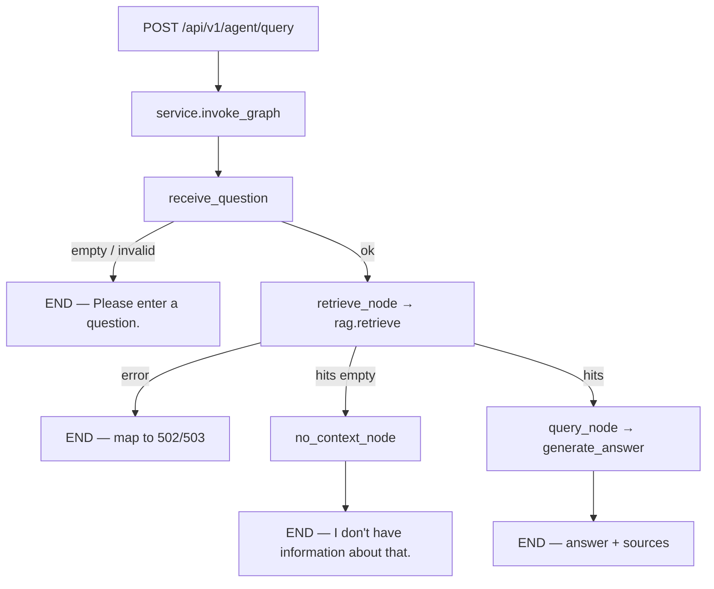

# LangGraph Support Agent — Implementation Plan

**Plan file:** [`agent_rag_langgraph_IMPLEMENTATION_PLAN.md`](agent_rag_langgraph_IMPLEMENTATION_PLAN.md)

**Requirements source (authoritative):** [`agent_rag_langgraph_specs.md`](agent_rag_langgraph_specs.md)

**Reference guide:** `4GeeksAcademy/ai-engineering-syllabus` → `content/projects/ai-eng-langgraph-agent-base/.learn/solution/README.md`

**Branch:** `feature/agent_rag_langgraph` off `origin/feature/rag` (not `main`); PR → `feature/rag`

**Working directories:**

| Area | Path |
|------|------|
| RAG pipeline (reuse + refactor) | `data/pipelines/rag.py` |
| RAG process (reuse as-is) | `data/process/rag.py` |
| Agent domain (new) | `services/api/app/domains/agent/` |
| v1 router mount | `services/api/app/api/v1/router.py` |
| Pipeline evals | `tests/pipelines/test_agent_evals.py` |
| Grounding fixture | `tests/pipelines/fixtures/agent_grounding_response.json` |
| HTTP contract tests | `services/api/tests/test_agent.py` |
| Config / env | `services/api/app/core/config.py`, `services/api/.example.env`, root `.example.env` |
| Deps | `services/api/pyproject.toml`, `services/api/uv.lock`, root `uv.lock` |

**Status:** Implemented on `feature/agent_rag_langgraph` — automated tests green; awaiting manual smoke before single commit.

**Rule:** Spec + locked planning clarifications below override any ambiguity. Reuse existing retrieval/generation; do **not** reimplement RAG logic. Do **not** change observable behavior of `POST /api/v1/knowledge/query` or `tests/pipelines/test_rag.py`.

---

## Executive summary

Re-express the existing RAG request→retrieve→generate flow as a compiled LangGraph state graph with named nodes, real conditional routing, `MemorySaver` checkpointing, in-state `trace_steps` (eval source of truth), optional LangSmith tracing, and a sibling endpoint `POST /api/v1/agent/query`. Factor `generate_answer` out of `query()` so the agent generation node and the monolithic RAG path share one generation implementation.



---

## Locked decisions (spec + planning Q&A)

| # | Topic | Decision |
|---|--------|----------|
| 1 | Branch / PR | `feature/agent_rag_langgraph` off `origin/feature/rag`; PR → `feature/rag` |
| 2 | Empty-question answer | Exact string: **`Please enter a question.`** (200, with `trace_id`) |
| 3 | No-context answer | Exact string: **`I don't have information about that.`** (`AGENT_NO_CONTEXT_ANSWER`) — distinct from RAG `FALLBACK_ANSWER` |
| 4 | Auth | JWT via `api_v1_router.include_router(..., dependencies=[Depends(get_current_user)])` — same as knowledge |
| 5 | Path | `POST /api/v1/agent/query` (router prefix `/agent` under `/api/v1`) |
| 6 | Frontend | **Out of scope** for this milestone |
| 7 | Feedback JSONL | **Deferred** — depends on future frontend; do not wire `feedback_store` yet |
| 8 | HTTP tests | **Yes** — `services/api/tests/test_agent.py` (auth, empty, no-context, error mapping) |
| 9 | Grounding eval | **Both:** recorded fixture for CI + live path when `LLM_API_KEY` set (skip/xfail live without key) |
| 10 | §13 in scope | (a) grounding fixture, (b) `MemorySaver` multi-worker TODO comment, (c) retrieve-step summary includes top source titles |
| 11 | §13 deferred | LLM-as-judge, feedback logging, `trace_id` headers, low-confidence tagging, streaming, model swap |
| 12 | Package layout | `services/api/app/domains/agent/` (repo convention), not syllabus `services/agent/` |
| 13 | Eval source of truth | In-state `trace_steps`; LangSmith additive and optional at runtime |
| 14 | Git commits | **No commits until build + manual test are done.** Then **one commit** for the entire implementation (plan/docs + code + tests). Overrides spec §11 granular commits. All work on `feature/agent_rag_langgraph` only — never commit planning-only work on `feature/rag`. |

---

## Prerequisites

- [ ] `origin/feature/rag` available and up to date (M7 RAG implemented)
- [ ] Local Qdrant collection seedable via `scripts/seed_knowledge_base.py` / existing startup path
- [ ] `LLM_API_KEY` available for live grounding eval and optional live smoke (not required for CI fixture path)
- [ ] Spec + this plan read end-to-end before coding

---

## Phase 0 — Branch and dependencies

### 0.1 Branch

All work (including this plan) lives on `feature/agent_rag_langgraph` off `feature/rag`. Create if missing:

```bash
git fetch origin
git checkout -b feature/agent_rag_langgraph origin/feature/rag
# or, if already created locally from feature/rag:
# git checkout feature/agent_rag_langgraph
```

**Do not commit** until Phases 0–5 are built and manually smoke-tested.

### 0.2 Dependencies

Add to `services/api/pyproject.toml` `dependencies`:

```
"langgraph>=0.2.0",
"langsmith>=0.1.0",
```

```bash
cd services/api && uv add langgraph langsmith
# Re-lock root uv.lock as well (dual-lockfile convention)
```

`langchain-core` comes transitively — do not add unless import errors force it.

### 0.3 Env keys

Append to `services/api/.example.env` and root `.example.env` (placeholders only):

```
LANGCHAIN_TRACING_V2=true
LANGCHAIN_API_KEY=
LANGCHAIN_PROJECT=healthcore-agent
LANGCHAIN_ENDPOINT=https://api.smith.langchain.com
```

`tracing.py` reads these; missing `LANGCHAIN_API_KEY` disables LangSmith silently — graph still runs.

Do not commit yet — fold into the single implementation commit after Phase 5.

---

## Phase 1 — Behavior-preserving `generate_answer` refactor

**Goal:** Single generation path for RAG `query()` and agent `query_node`. Guardrail: **`tests/pipelines/test_rag.py` must pass unchanged.**

### 1.1 Extract in `data/pipelines/rag.py`

Add (verbatim prompt assembly from current `query()`):

- `build_assembled_prompt(question: str, hits: list[dict[str, Any]]) -> str`
- `generate_answer(question, context, *, generate_fn=_generate) -> str`  
  - Assembles via `build_assembled_prompt`, returns `generate_fn(assembled)`  
  - Callers with no context must **not** call this (routing owns no-context)

Refactor `query()`:

1. `normalize_query` → `retrieve` (unchanged)
2. Empty hits → existing `FALLBACK_ANSWER` `QueryResult` (unchanged)
3. Else: `assembled = build_assembled_prompt(normalized, hits)`; `answer = generate_answer(..., generate_fn=generate_fn)` **or** call `generate_fn(assembled)` once after building assembled so `QueryResult.assembled_prompt` stays populated without double LLM calls  
   - Preferred: `assembled = build_assembled_prompt(...); answer = generate_fn(assembled)` inside `query()`, and `generate_answer` is the shared helper that does exactly that — `query()` may call `generate_answer` and also set `assembled_prompt=build_assembled_prompt(...)` once, **or** have `generate_answer` return only the string while `query()` builds assembled once and passes through. Keep **one** LLM call.

Export `generate_answer` and `build_assembled_prompt` in `__all__`.

### 1.2 Verify

```bash
uv run pytest tests/pipelines/test_rag.py services/api/tests/test_knowledge.py -q
```

Do not commit yet — continue to Phase 2 once this guardrail is green.

---

## Phase 2 — Agent package (graph)

Create `services/api/app/domains/agent/`:

```
__init__.py
state.py
nodes.py
routing.py
graph.py
tracing.py
schemas.py
service.py
router.py
```

### 2.1 `state.py` — `AgentState`

Minimal TypedDict per spec §6.1:

- `question`, `normalized_question`, `retrieved_context`, `answer`, `sources`
- `trace_id`, `trace_steps` (`Annotated[Sequence[dict], operator.add]`), `error`

No conversation history.

### 2.2 `tracing.py`

- `trace_step(node, order, summary) -> dict` → `{"node", "order", "output_summary"}`
- Document / echo LangSmith env vars; no hard dependency on key
- Optional: thin helper that ensures `os.environ` reflects Settings if ever loaded from pydantic — prefer reading env directly as LangGraph/LangSmith already do

### 2.3 `nodes.py` — single-responsibility nodes

| Node | Behavior | Trace |
|------|----------|--------|
| `receive_question` | `normalize_query`; on `ValueError` set `error="empty_question"`, do not raise | `receive_question` |
| `retrieve_node` | `retrieve(normalized_question)` — **no lowered threshold**; set `retrieved_context` (may be `[]`); on `EmbeddingError`/`RagConfigError` set `error` | `retrieve` — summary includes hit count **and top source titles** (locked §13) e.g. `3 hits >= 0.30 [appointment-policy, insurance-coverage]` |
| `query_node` | `generate_answer(normalized_question, retrieved_context)`; `sources = _dedupe_sources(...)`; never call `query()` | `query` |
| `no_context_node` | `answer = AGENT_NO_CONTEXT_ANSWER`, `sources = []`; **no LLM** | `no_context` |

Constants:

```python
AGENT_NO_CONTEXT_ANSWER = "I don't have information about that."
EMPTY_QUESTION_ANSWER = "Please enter a question."
```

Empty-question answer may be set in `receive_question` or mapped in `service.py` when `error == "empty_question"` — prefer setting `answer = EMPTY_QUESTION_ANSWER` in `receive_question` so the final state is complete without extra service branching.

**Injectable generation seam for evals:** monkeypatch target is `data.pipelines.rag.generate_answer` (or a module-level `_generate_fn` used by `query_node`). Document the seam in a short comment on `query_node`.

### 2.4 `routing.py`

Real conditions only:

- `after_receive` → `"end"` if `error == "empty_question"` or missing `normalized_question`; else `"retrieve"`
- `after_retrieve` → `"end"` if `error`; `"no_context"` if not `retrieved_context`; else `"query"`

### 2.5 `graph.py`

- Build `StateGraph` per spec §6.5
- `MemorySaver` checkpointer; `compile` once at module import → `compiled_graph`
- Comment TODO: `MemorySaver` is in-process; multi-worker Uvicorn does not share checkpoints — consider `SqliteSaver`/`PostgresSaver` later (locked §13)

### 2.6 `schemas.py` / `service.py` / `router.py`

**Request:** `{ "question": str }` with `min_length=0` (allow blank so graph empty path is exercised).

**Response:** `{ "answer", "trace_id", "sources": [{source_document, section, score}] }`

**`invoke_graph(question)`:**

1. `trace_id = "run-" + uuid4().hex[:12]`
2. `initial_state` with `question`, `trace_id`, empty/None fields, `trace_steps=[]`
3. `compiled_graph.invoke(initial_state, config={"configurable": {"thread_id": trace_id}})`
4. Map `final_state` → `AgentQueryResponse`
5. Hard errors → HTTPException: `RagConfigError` → 503; `EmbeddingError`/`GenerationError` → 502; other → 500 with  
   `"The support agent is temporarily unavailable. Please try again."`  
   Log full exception server-side only; reuse `redact_pii` if logging question/answer
6. Soft empty-question path → **200** with `EMPTY_QUESTION_ANSWER` (not 422)

**Router:** `prefix="/agent"`, `POST /query` only; no business logic — delegates to service.

Do not commit yet — continue to Phase 3.

---

## Phase 3 — Mount endpoint

In `services/api/app/api/v1/router.py`:

```python
from app.domains.agent.router import router as agent_router
api_v1_router.include_router(agent_router, dependencies=[Depends(get_current_user)])
```

Sibling of knowledge router. No other domains changed.

Do not commit yet — continue to Phase 4.

---

## Phase 4 — Evals and HTTP tests

### 4.1 `tests/pipelines/test_agent_evals.py`

Helper: `run_agent(question, *, generate_fn=None) -> final_state` — unique `thread_id`, optional monkeypatch of `generate_answer`.

| # | Name | Input | Asserts |
|---|------|-------|---------|
| 0 | Compile sanity | import | `compiled_graph` is not `None` |
| 1 | Node order / routing | FAQ from `test-queries.json` (`should_abstain=false`); generation stubbed | `trace_steps` nodes: `receive_question → retrieve → query`; no `no_context` |
| 2 | Empty-question path | `""` or whitespace | has `receive_question`; no `query`; `error == "empty_question"`; answer clear message |
| 3a | Grounding (fixture) | policy question with known `expected_source_document` | stub/replay recorded answer; answer non-empty, not no-context/fallback; mentions grounded entity; `sources` includes expected doc |
| 3b | Grounding (live) | same question | real proxy; **skip if `LLM_API_KEY` unset**; `setup()` collection if empty |

### 4.2 Fixture (locked §13)

- Path: `tests/pipelines/fixtures/agent_grounding_response.json`
- Capture once with live key: question, expected entity substring(s), expected `source_document`, and the stubbed `generate_answer` return string (or full final-state slice)
- Eval 3a loads fixture and injects via `generate_fn` / monkeypatch so CI never needs the proxy
- Document in test docstring how to refresh the fixture

### 4.3 `services/api/tests/test_agent.py`

Mirror knowledge test patterns:

- Unauthenticated → 401
- Empty/blank question → 200, answer `Please enter a question.`, has `trace_id`
- No-context path (stub retrieve → `[]`) → 200, `I don't have information about that.`, `sources == []`
- Happy path (stub retrieve + generate) → 200, answer + sources shape
- Upstream errors map to 502/503/500 with clear `detail`, no stack in body

### 4.4 Verify

```bash
uv run pytest tests/pipelines/test_rag.py services/api/tests/test_knowledge.py -q
uv run pytest tests/pipelines/test_agent_evals.py services/api/tests/test_agent.py -q
# Optional live:
LLM_API_KEY=… uv run pytest tests/pipelines/test_agent_evals.py -q
```

Do not commit yet — continue to Phase 5.

---

## Phase 5 — Docs / memory-bank handoff

- [ ] Update `memory-bank/progress.md` — note LangGraph agent plan + implementation status
- [ ] Update `memory-bank/decisions.md` — agent domain layout, distinct no-context string, fixture+live grounding, no frontend this milestone
- [ ] Smoke: `uv run uvicorn app.main:app --reload` → authenticated `POST /api/v1/agent/query`

---

## Commit / PR workflow

**No commits until the implementation is built and manually tested.** Then **one commit** for everything (overrides spec §11 granular commits).

Keep plan, code, tests, and memory-bank updates uncommitted on `feature/agent_rag_langgraph` through Phases 0–5. After acceptance checks **and** a manual smoke of `POST /api/v1/agent/query`, create a single commit:

Include: deps/lockfiles, `.example.env` keys, `generate_answer` refactor, `app/domains/agent/`, router mount, evals, HTTP tests, grounding fixture, specs/plan, and memory-bank progress/decisions updates.

```bash
# Only after build + manual smoke — one commit, then PR
git add …   # all implementation + plan files
git commit -m "$(cat <<'EOF'
feat: add LangGraph support agent with /api/v1/agent/query

Re-express RAG as a checkpointed graph with conditional routing, in-state traces, and sibling authenticated endpoint.
EOF
)"

gh pr create --base feature/rag --head feature/agent_rag_langgraph ...
```

---

## Acceptance checklist

- [ ] Branch off `feature/rag`
- [ ] `generate_answer` extracted; `query()` delegates; `test_rag.py` unchanged and passing
- [ ] Minimal `AgentState`; four nodes; no retrieve+generate in one node
- [ ] Two real conditional edges (empty → END; no context → `no_context`)
- [ ] `query_node` calls `generate_answer`, never `query()`
- [ ] Compile once at import; `MemorySaver` + per-request `thread_id`; multi-worker TODO noted
- [ ] `trace_steps` accumulated; retrieve summary includes hit count + source titles; LangSmith optional
- [ ] `POST /api/v1/agent/query` JWT-protected sibling of knowledge; `{answer, trace_id, sources}`
- [ ] Empty → 200 `Please enter a question.`; no-context → exact agent fallback string
- [ ] ≥3 trace-based evals + compile sanity; grounding via fixture (CI) + live skip without key
- [ ] `services/api/tests/test_agent.py` covers auth + contract + error mapping
- [ ] `langgraph` + `langsmith` locked; `.example.env` documents `LANGCHAIN_*`
- [ ] No frontend; no feedback JSONL wiring; knowledge endpoint behavior unchanged

---

## Out of scope / follow-ups

| Item | Notes |
|------|--------|
| Frontend Agent panel / RAG vs agent toggle | Follow-up after endpoint stable |
| Feedback JSONL for agent runs | Revisit with frontend |
| LLM-as-judge grounding | Optional quality pass |
| `trace_id` response header | Ops/debug convenience |
| Streaming `?stream=true` | Stretch |
| Durable checkpointer | When multi-worker matters |
| Generation model swap | Settings-only; keep `deepseek-v4-flash` |

---

## Risk notes

| Risk | Mitigation |
|------|------------|
| Refactor breaks RAG | Do not edit `test_rag.py`; run it after Phase 1 before agent work |
| Qdrant file lock (API + tests) | Follow existing knowledge/RAG test isolation patterns; fixture path avoids live embed where possible |
| Flaky live grounding | Fixture is CI gate; live is optional/skip |
| Accidental call to `query()` from agent | Code review + eval asserts `query` node uses generate seam |
| Dual uv lockfiles drift | Update `services/api/uv.lock` and root `uv.lock` after `uv add` |
