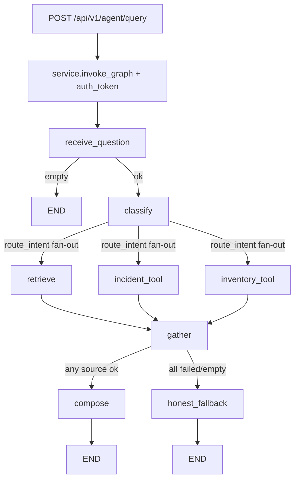

# Agent Tools: Incident + Inventory — Implementation Plan

**Plan file:** [`agent_tools_incident_inventory_IMPLEMENTATION_PLAN.md`](agent_tools_incident_inventory_IMPLEMENTATION_PLAN.md)

**Requirements source (authoritative):** [`agent_tools_incident_inventory_specs.md`](agent_tools_incident_inventory_specs.md)

**Prerequisite:** Part 1 delivered on `feature/agent_rag_langgraph` — see [`agent_rag_langgraph_specs.md`](agent_rag_langgraph_specs.md) and [`agent_rag_langgraph_IMPLEMENTATION_PLAN.md`](agent_rag_langgraph_IMPLEMENTATION_PLAN.md).

**Branch:** `feature/agent_tools_langgraph` off `origin/feature/agent_rag_langgraph` (which carries Part 1). PR → `feature/agent_rag_langgraph`.

**Working directories:**

| Area | Path |
|------|------|
| Agent domain (extend) | `services/api/app/domains/agent/` |
| Tools subpackage (new) | `services/api/app/domains/agent/tools/` |
| Config / env | `services/api/app/core/config.py`, `services/api/.example.env` |
| Pipeline evals | `tests/pipelines/test_agent_evals.py` |
| HTTP contract tests | `services/api/tests/test_agent.py` (update as needed for `sources_used` / token forwarding) |
| Incident API (call target) | `GET /api/v1/incidents`, `GET /api/v1/incidents/{id}` |
| Inventory API (call target) | `GET /api/v1/inventory/products` |

**Status:** Implemented on `feature/agent_tools_langgraph` — automated tests green (30 passed, 1 skipped); awaiting developer commit request (+ optional live smoke).

**Rule:** Spec + locked planning clarifications below override any ambiguity. Reuse Part 1 graph/tracing/endpoint. Do **not** create a new endpoint. Do **not** change observable RAG-only answers for knowledge questions when tools are not selected. `tests/pipelines/test_rag.py` and `services/api/tests/test_knowledge.py` must stay green unchanged.

---

## Executive summary

Extend the Part 1 LangGraph support agent into a **multi-source agent**: an LLM intent classifier routes each question to RAG, the incident HTTP tool, the inventory HTTP tool, or **both**, then a barrier `gather` node joins branches. Successful sources feed a grounded `compose` node; total failure/empty uses an explicit `honest_fallback` recovery node (which also absorbs Part 1's `no_context`). Tools call this same API over `httpx` with timeouts, optional retry-once on 5xx/timeout, and never raise into the graph.



---

## Locked decisions (spec + planning Q&A)

| # | Topic | Decision |
|---|--------|----------|
| 1 | Branch / PR | `feature/agent_tools_langgraph` off `origin/feature/agent_rag_langgraph`; PR → `feature/agent_rag_langgraph` |
| 2 | Endpoint | **No new endpoint** — extend existing `POST /api/v1/agent/query` |
| 3 | Frontend | **Out of scope** (same as Part 1) |
| 4 | Transport | Tools use **httpx** to `settings.internal_api_base_url` with `tool_http_timeout_seconds` (default 5.0). No new packages. |
| 5 | Auth forwarding | Read caller `Authorization` bearer in router; seed `auth_token` into graph state; forward on tool calls. **Never log the token.** |
| 6 | Routing | LLM `classify` node → structured multi-label intent; evals stub `classifier_fn` |
| 7 | Identifiers | Extracted from free-text `question` by classifier (`incident_id`, `product_hint`). Request schema unchanged. |
| 8 | Incident list filters | Typed on `IncidentToolInput` but **always null this milestone** — classifier does not extract `status`/`origin`/`branch`/`category` |
| 9 | Answer on success | LLM `compose` grounded strictly in returned RAG + tool JSON |
| 10 | Fallbacks | Verbatim: `INCIDENT_FALLBACK` / `INVENTORY_FALLBACK`. Multiple lines joined with **newline**. |
| 11 | `no_context` | **Fold into `honest_fallback`** — remove Part 1 `no_context` node |
| 12 | Generation hard errors | `RagConfigError` / `GenerationError` in `compose` keep Part 1-style `error` mapping (502/503 via service) — **do not** route those to `honest_fallback` |
| 13 | Response | Keep `{answer, trace_id, sources}`; **add optional `sources_used: list[str]`** |
| 14 | Docker / Compose | **No Docker requirement** — document `INTERNAL_API_BASE_URL=http://localhost:8000` in `services/api/.example.env` only |
| 15 | Models | **Keep current** proxy generation model(s); no settings model swap |
| 16 | Evals in scope | Required §10 evals **4** (tool) + **5** (RAG); plus **“both”** eval; plus **tool-failure** eval |
| 17 | Retry | **In scope:** retry-once on tool HTTP **5xx / timeout** (mirror RAG `_generate` `_MAX_RETRIES = 1` pattern) in `tools/base.py` |
| 18 | Deferred (§15) | Product-list cache, clarify node, JSON-schema classifier, tool telemetry, respx contract tests, prompt-injection hardening |
| 19 | Git commits | **No commits until the developer explicitly asks.** Spec §13 granular commit list is aspirational only — do not commit on your own. |

---

## Prerequisites

- [ ] `origin/feature/agent_rag_langgraph` available (Part 1 agent + tests green)
- [ ] Spec + this plan read end-to-end before coding
- [ ] API runnable locally (`uv run uvicorn app.main:app --reload`) for live smoke of tool HTTP paths
- [ ] JWT available for authenticated smoke (incident tool requires bearer)

---

## Phase 0 — Branch and settings

### 0.1 Branch

```bash
git fetch origin
git checkout -b feature/agent_tools_langgraph origin/feature/agent_rag_langgraph
```

All Part 2 work (including this plan once committed by request) lives on this branch only.

### 0.2 Settings

In `services/api/app/core/config.py` add:

```python
internal_api_base_url: str = "http://localhost:8000"
tool_http_timeout_seconds: float = 5.0
```

Document in `services/api/.example.env`:

```
INTERNAL_API_BASE_URL=http://localhost:8000
TOOL_HTTP_TIMEOUT_SECONDS=5.0
```

No root `.example.env` / Docker Compose changes (locked #14).

No new third-party deps — verify `httpx` remains in `services/api/pyproject.toml`.

---

## Phase 1 — Typed tool contracts (`app/domains/agent/tools/`)

Create:

```
tools/__init__.py
tools/base.py
tools/incident.py
tools/inventory.py
```

### 1.1 `tools/base.py`

- `tool_timeout() -> httpx.Timeout` from `settings.tool_http_timeout_seconds` (connect = `min(t, 3.0)`)
- `api_url(path) -> str` joining `settings.internal_api_base_url` + path
- **`request_with_retry(method, url, *, headers, params=None)`** (or equivalent):
  - Sync `httpx.Client` with `tool_timeout()`
  - **Retry once** on `httpx.TimeoutException` and on HTTP status ≥ 500 (same spirit as `data/pipelines/rag._generate` / `_MAX_RETRIES = 1`)
  - Do **not** retry 4xx (except that the tool layer maps them to typed errors)
  - Never raise out of the public `run_*_tool` functions — catch and map inside tool modules
- Optional small sleep between attempts is fine if kept tiny/deterministic; document choice in code comment
- Do **not** log bearer tokens; if logging URLs/errors, redact PII via existing `redact_pii` when incident descriptions appear

### 1.2 `tools/incident.py`

Implement Pydantic models and `run_incident_tool` exactly per spec §5.1:

- Missing `auth_token` → `ok=False, error="unauthenticated"`
- `incident_id` set → `GET /api/v1/incidents/{id}`; 404 → `not_found`
- Else → `GET /api/v1/incidents` (filters null this milestone)
- Map timeout / transport / `http_{status}` / empty list

### 1.3 `tools/inventory.py`

Per spec §5.2:

- `GET /api/v1/inventory/products`; forward token if present
- Case-insensitive substring match on `name` / `sku` → `matched`; keep full `products`
- `empty=True` when no products or (`name_hint` set and `matched == []`)

**Recovery contract:** tool functions **never raise** into the graph.

### 1.4 Unit-level smoke (optional light tests)

Prefer covering tool mapping via graph evals (Phase 4). Dedicated tool unit tests are deferred unless useful during build — not required for acceptance.

---

## Phase 2 — State, classify, nodes, routing, graph

### 2.1 `state.py` additions

Extend `AgentState` per spec §7.1:

- `auth_token: str | None`
- `intent: dict | None`
- `incident_result: dict | None`
- `inventory_result: dict | None`
- `sources_used: Annotated[list[str], operator.add]`

Keep distinct keys for `retrieved_context` / `incident_result` / `inventory_result` so parallel branches do not clobber each other. Keep `trace_steps` reducer.

Update `service.invoke_graph` / eval `run_agent` initial state to seed new keys (`auth_token`, empty `sources_used`, etc.).

### 2.2 Constants (nodes or dedicated module)

```python
INCIDENT_FALLBACK = "I could not confirm the ticket's status."
INVENTORY_FALLBACK = "I could not confirm the inventory item's status."
# Keep Part 1:
AGENT_NO_CONTEXT_ANSWER = "I don't have information about that."
EMPTY_QUESTION_ANSWER = "Please enter a question."
```

Helper: `join_fallbacks(lines: list[str]) -> str` → `"\n".join(lines)` (locked #10).

### 2.3 `classify` node

- Module-level `classifier_fn` default = real LLM JSON call via existing proxy (`_generate`-style / chat completions); tests monkeypatch `classifier_fn`
- Prompt lists three capabilities; output schema:

```json
{
  "use_rag": true,
  "use_incident": false,
  "use_inventory": false,
  "incident_id": null,
  "product_hint": null,
  "reasoning": "…"
}
```

- Parse JSON safely; on unparseable / nothing selected → default `{use_rag: true, ...}` + warning log — **never crash**
- Do **not** extract incident list filters this milestone (locked #8)
- Append `classify` trace step summarizing route

### 2.4 Tool nodes + gather + honest_fallback + compose

| Node | Behavior |
|------|----------|
| `incident_tool` | Build `IncidentToolInput` from intent (`incident_id` only); `run_incident_tool(..., auth_token=…)`; store `incident_result`; `sources_used += ["incident_tool"]`; trace `ok`/`error`/`empty` |
| `inventory_tool` | Same with `product_hint` → `name_hint`; `sources_used += ["inventory_tool"]` |
| `retrieve` | Reuse Part 1; on success with hits append `sources_used += ["rag"]` (only when hits non-empty — empty RAG does not claim a successful source) |
| `gather` | Barrier no-op; trace step listing `sources_used` |
| `compose` | Build combined context: RAG blocks (`build_assembled_prompt`-style) **+** labeled successful tool JSON (`[INCIDENT SYSTEM]` / `[INVENTORY]`); LLM generate grounded **only** in that context; **deterministically append** newline-joined fallback line(s) for any requested tool that failed/empty; set `sources` (RAG parity) + `answer`. On `RagConfigError`/`GenerationError` set `error` like Part 1 `query_node` (locked #12) |
| `honest_fallback` | **No LLM.** Emit verbatim tool fallback(s) for failed/empty requested tools; if RAG was sole requested source and empty → `AGENT_NO_CONTEXT_ANSWER`. Join multiple with newline. |

**Remove** Part 1 nodes `query` and `no_context` from the graph (logic absorbed by `compose` / `honest_fallback`).

### 2.5 `routing.py`

- `after_receive` → `"classify"` if normalized question else `"end"` (**change from Part 1** `"retrieve"`)
- `route_intent(state) -> list[str]` fan-out per spec §7.3 (RAG safe default if nothing selected)
- `after_gather(state) -> str` per spec §7.3 → `"honest_fallback"` or `"compose"`
- Remove `after_retrieve` (retrieve always edges to `gather`)

Hard retrieve errors (`RagConfigError` / `EmbeddingError`): ensure they still surface. Preferred approach consistent with Part 1 service mapping:

- If retrieve sets `error` and was the only branch, `after_gather` should not pretend success — treat missing/failed RAG like not `rag_ok`; if tools also failed/absent → `honest_fallback` **or** preserve hard error when `error` is set and no tool succeeded. **Lock for build:** if `state["error"]` is a hard retrieve/config/embedding error and no tool returned `ok`, route to END via service mapping by leaving `error` set and skipping compose — simplest: `after_gather` returns `"end"` equivalent by having gather/compose check, **or** keep Part 1 behavior by letting `retrieve` set `error` and `after_gather` → if `error` in hard set and not (inc_ok or inv_ok) then leave answer unset and let service raise. Document chosen path in code comments; evals should not regress HTTP 502/503 for retrieve failures on RAG-only path.

Practical recommendation for implementer: if `state.get("error")` in `{RagConfigError, EmbeddingError}` and not `inc_ok` and not `inv_ok`, skip `compose`/`honest_fallback` and END with error still set (service maps to 502/503). If a tool succeeded, clear path to `compose` using tool data only (do not require RAG).

### 2.6 `graph.py` rewire

Edges per spec §7.4:

```
receive_question --after_receive--> {classify, END}
classify --route_intent(list)--> {retrieve, incident_tool, inventory_tool}
retrieve / incident_tool / inventory_tool --> gather
gather --after_gather--> {compose, honest_fallback}  # (+ hard-error END path if implemented)
compose --> END
honest_fallback --> END
```

Recompile at import with existing `MemorySaver`; keep multi-worker TODO comment.

---

## Phase 3 — Endpoint wiring (no contract break)

### 3.1 Router

- Read raw bearer from `Authorization` header (`HTTPAuthorizationCredentials` / `Request.headers`)
- Pass `auth_token` into `service.invoke_graph(question, auth_token=…)`
- Do not log the token

### 3.2 Service

- Seed `auth_token` into initial state
- Map `sources_used` from final state onto response
- Keep hard-error HTTP mapping for `RagConfigError` / `EmbeddingError` / `GenerationError`
- Soft empty-question path unchanged (200 + `Please enter a question.`)

### 3.3 Schemas

```python
class AgentQueryResponse(BaseModel):
    answer: str
    trace_id: str
    sources: list[AgentSource]
    sources_used: list[str] = []  # additive, optional for clients
```

Request body unchanged: `{ "question": str }`.

---

## Phase 4 — Evals

Update `tests/pipelines/test_agent_evals.py`.

### 4.1 Update Part 1 evals

- **Node-order eval:** change exact list equality to a **subsequence** check: `retrieve` precedes `compose` (and `classify` appears before source nodes). Remove expectation of `query` / `no_context`.
- Empty-question eval: still ends after `receive_question` (no classify).
- Grounding fixture/live evals: stub `classifier_fn` → `{use_rag: true, …}`; stub compose generation seam; expect `compose` (not `query`); no-context path now hits `honest_fallback` with `AGENT_NO_CONTEXT_ANSWER` when RAG-only empty.

Extend `run_agent(...)` helper to accept `classifier_fn`, tool HTTP stubs / patches, and seed `auth_token` / `sources_used`.

### 4.2 New evals (required + locked extras)

| # | Name | Setup | Assert |
|---|------|-------|--------|
| 4 | Resolves with TOOL | classifier → incident 42; incident HTTP stub → fixture `IncidentRead` (`status: in_progress`); compose LLM stubbed or real stub that echoes status | `sources_used == ["incident_tool"]`; no `"rag"`; subsequence `classify → incident_tool → gather → compose`; answer contains status |
| 5 | Resolves with RAG | classifier → RAG only; **assert tool HTTP not called** | `sources_used == ["rag"]`; no tool steps; subsequence `classify → retrieve → gather → compose` |
| 6 | Resolves with BOTH | classifier → `use_rag` + `use_inventory` + `product_hint`; inventory stub returns matching product; RAG hits stubbed; compose stubbed | `sources_used` contains `rag` and `inventory_tool`; both branches in trace; answer blends / includes stock signal from stub |
| 7 | Tool failure → honest fallback | classifier → incident only; HTTP stub raises timeout / returns timeout error path | answer **exactly** `INCIDENT_FALLBACK`; trace records `error="timeout"`; path includes `honest_fallback` (or gather → honest_fallback) |

Stub strategy: monkeypatch `classifier_fn` and patch `httpx.Client` / `tools.base.request_with_retry` / `run_incident_tool` / `run_inventory_tool` as needed for determinism. Prefer stubbing at tool-function boundary for graph routing tests; add one retry-focused unit assertion if easy (first call 500/timeout, second succeeds) inside tool tests or eval setup.

### 4.3 HTTP tests (`services/api/tests/test_agent.py`)

- Update no-context expectation to still return `AGENT_NO_CONTEXT_ANSWER` (via `honest_fallback`)
- Assert `sources_used` present on happy-path response when stubbed
- Optionally assert Authorization is accepted/forwarded (stub tool path) — keep suite green without live API

### 4.4 Verify

```bash
uv run pytest tests/pipelines/test_rag.py services/api/tests/test_knowledge.py -q
uv run pytest tests/pipelines/test_agent_evals.py services/api/tests/test_agent.py -q
```

---

## Phase 5 — Live smoke + memory-bank handoff

### 5.1 Manual smoke (API running)

With JWT:

1. `"status of incident 1?"` → incident tool path / honest fallback if empty DB
2. `"do you take Medicaid?"` → RAG only
3. `"mask policy and stock?"` → both (when classifier agrees)
4. Tiny `TOOL_HTTP_TIMEOUT_SECONDS` or stop dependency mid-call → verbatim incident/inventory fallback

### 5.2 Memory-bank (when implementation is done)

- Update `memory-bank/progress.md` — Part 2 agent tools status
- Update `memory-bank/decisions.md` — tools via HTTP + forwarded JWT; `honest_fallback` replaces `no_context`; `sources_used` on response; retry-once; no frontend

### 5.3 Commits

**Do not commit until the developer explicitly asks** (locked #19). When asked, prefer one or few clear commits on `feature/agent_tools_langgraph`, then PR → `feature/agent_rag_langgraph`.

---

## Acceptance checklist

- [ ] Work on `feature/agent_tools_langgraph` off `feature/agent_rag_langgraph`
- [ ] Typed tool contracts; HTTP tools never raise; retry-once on 5xx/timeout
- [ ] Nodes: `classify`, `incident_tool`, `inventory_tool`, `gather`, `compose`, `honest_fallback`; Part 1 `query`/`no_context` removed
- [ ] `route_intent` fan-out (RAG / tool / both); `after_gather` explicit recovery
- [ ] Explicit per-call timeouts; verbatim fallbacks; multi-fallback joined with newline
- [ ] Trace shows `sources_used` + per-node `trace_steps`
- [ ] Caller JWT forwarded to incidents; never logged
- [ ] Response includes optional `sources_used`; `{answer, trace_id, sources}` intact
- [ ] Evals 4 + 5 + both + tool-failure; Part 1 node-order updated to subsequence
- [ ] RAG + knowledge tests still green; RAG-only behavior unchanged for knowledge questions
- [ ] Graph recompiles at startup; `MemorySaver` retained; no new endpoint; no frontend
- [ ] Settings + `.example.env` keys documented; no Docker work

---

## Out of scope / follow-ups

| Item | Notes |
|------|--------|
| Frontend agent UI | Out of scope |
| Docker `INTERNAL_API_BASE_URL` wiring | Not required this milestone |
| Classifier list filters (`status`/`origin`/`branch`/`category`) | Deferred |
| Product-list per-request cache | Deferred §15 |
| Clarify node on low confidence | Deferred §15 |
| JSON-schema / function-schema classifier | Deferred §15 |
| Tool telemetry → feedback JSONL | Deferred §15 |
| respx contract tests vs live routers | Deferred §15 |
| Prompt-injection hardening for tool fields | Deferred §15 |
| Model swap to Haiku/Sonnet | Settings-only later; keep current models |

---

## Risk notes

| Risk | Mitigation |
|------|------------|
| Fan-out state races | Distinct result keys + `operator.add` reducers for `sources_used` / `trace_steps` |
| Self-HTTP deadlocks / wrong base URL | Default localhost; document that tools call the same process over loopback; keep timeouts short |
| Classifier flakes | Safe default to RAG; stub `classifier_fn` in all routing evals |
| Part 1 eval breakage | Subsequence asserts; stub classify → RAG for grounding tests; map no-context → `honest_fallback` |
| Token leakage | Never log `auth_token`; redact incident text if logged |
| Retry masking 4xx | Retry only timeout + 5xx; map 401/404 to typed errors without retry |
| Dual path RAG empty vs tool empty | `after_gather` + verbatim constants; unit/eval cover both sole-tool failure and RAG-only empty |
