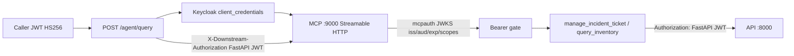

# Company Tools MCP Server + Agent Migration — Implementation Plan

**Plan file:** [`mcp_company_tools_IMPLEMENTATION_PLAN.md`](mcp_company_tools_IMPLEMENTATION_PLAN.md)

**Requirements source (authoritative):** [`mcp_company_tools_specs.md`](mcp_company_tools_specs.md)

**Prerequisite:** Part 2 delivered and committed on `feature/agent_tools_langgraph` (`63e124f`) — see [`agent_tools_incident_inventory_specs.md`](agent_tools_incident_inventory_specs.md) and [`agent_tools_incident_inventory_IMPLEMENTATION_PLAN.md`](agent_tools_incident_inventory_IMPLEMENTATION_PLAN.md).

**Branch:** `feature/agent_mcp_langgraph` off `origin/feature/agent_tools_langgraph`. PR → `feature/agent_tools_langgraph`.

**Working directories:**

| Area | Path |
|------|------|
| MCP server (new) | `mcps/company-tools/` |
| Keycloak realm | `mcps/company-tools/keycloak/realm-export.json` |
| Agent MCP client (new) | `services/api/app/domains/agent/mcp_client.py` |
| Agent nodes / delete direct tools | `services/api/app/domains/agent/nodes.py`, `tools/` |
| Config / env | `services/api/app/core/config.py`, `services/api/.example.env`, root `.example.env` |
| Compose | `docker-compose.yml` (Keycloak only) |
| Workspace | root `pyproject.toml` `[tool.uv.workspace].members` |
| MCP tests | `mcps/company-tools/tests/` |
| Agent evals | `tests/pipelines/test_agent_evals.py` (stub MCP client) |
| Guardrails | `tests/pipelines/test_rag.py`, `services/api/tests/test_knowledge.py` |

**Status:** Plan ready — implement only after developer go-ahead.

**Rule:** Spec + locked planning clarifications below override any ambiguity. RAG-vs-tool routing and honest-fallback recovery from Part 2 stay behaviorally unchanged. `tests/pipelines/test_rag.py` and `services/api/tests/test_knowledge.py` must stay green. Do **not** use FastMCP built-in auth. Do **not** commit until the developer explicitly asks.

---

## Executive summary

Extract the agent's in-process incident/inventory HTTP tools into a standalone **FastMCP** server under `mcps/company-tools/` with **Streamable HTTP**, gated by **`mcpauth`** against a self-hosted **Keycloak** realm. The LangGraph agent discovers and invokes those tools via **`langchain-mcp-adapters`**; the old `tools/incident.py` and `tools/inventory.py` modules are **deleted** so there is a single path to operational data.

Because FastAPI login stays HS256 and Keycloak mints RS256 tokens for the MCP surface, this plan uses a **split-identity** model: Keycloak authenticates MCP; the caller's FastAPI JWT is forwarded downstream to `/api/v1/incidents*` and `/api/v1/inventory*` so live incident round-trips keep working.



---

## Locked decisions (spec + planning Q&A)

| # | Topic | Decision |
|---|--------|----------|
| 1 | Branch / PR | `feature/agent_mcp_langgraph` off `origin/feature/agent_tools_langgraph`; PR → `feature/agent_tools_langgraph` |
| 2 | Auth library | **`mcpauth` only** — never FastMCP `BearerAuthProvider` / built-in OAuth |
| 3 | Transport | **Streamable HTTP** (`streamable_http_app()`); justify in PR description |
| 4 | OIDC provider | **Keycloak** `quay.io/keycloak/keycloak:26.0` in Compose; realm `healthcore` via committed `realm-export.json` |
| 5 | Scopes | `incidents:read`, `incidents:write`, `inventory:read` (no `CONTEXT-company.md` — use spec names) |
| 6 | Identity split | **MCP gate = Keycloak JWT.** **Downstream API = caller FastAPI JWT** via `X-Downstream-Authorization` (agent → MCP), forwarded by MCP as `Authorization` to the API. Never log either token |
| 7 | Agent → MCP token | Keycloak **`client_credentials`** on client `agent-support` (env id/secret). Password grant only for Inspector/Playground (`coordinator` / `readonly`) |
| 8 | Downstream data | Live HTTP to `/api/v1/incidents*` and `/api/v1/inventory/products*` — no mocked ops data inside MCP process |
| 9 | Inventory writes | **No write tool.** Strict allowlist input: only `name_hint`, `product_id`. Any other / write-shaped field → `INVENTORY_WRITE_FORBIDDEN` before HTTP |
| 10 | PII | **Local** `redact_pii` helper inside `mcps/company-tools/` — do not import `app.domains.knowledge.pii` |
| 11 | Compose | Add **Keycloak only**. MCP runs via `uv run` on `:9000` (no `company-tools` Compose service in v1) |
| 12 | Dev secrets | Fixed admin/client/user passwords in realm export + README are OK; label **dev only** |
| 13 | Issuer host | Document localhost primary; short Codespaces note (`KC_HOSTNAME` / `iss` must match `OIDC_ISSUER`) |
| 14 | Validation docs | README with commands + expected outcomes; screenshots optional / nice-to-have |
| 15 | Models | **Keep** current proxy classifier/compose models — no §15 swap |
| 16 | Scope of §14 | **Out of scope** — required §1–13 / §17 only. Hard delete direct tools (no `use_mcp_tools` flag). No Keycloak+MCP CI job |
| 17 | Part 2 prerequisite | Already committed on `feature/agent_tools_langgraph` — no “commit Part 2 first” step |
| 18 | Git commits | **No commits until the developer explicitly asks.** Spec §11 granular list is aspirational only |

---

## Prerequisites

- [ ] On / based off `origin/feature/agent_tools_langgraph` (Part 2 agent tools present)
- [ ] Spec + this plan read end-to-end before coding
- [ ] Docker available for Keycloak
- [ ] API runnable locally on `:8000` for live MCP → API smoke
- [ ] FastAPI JWT available for authenticated incident smoke
- [ ] Verify installed `mcpauth` / FastMCP APIs against docs after `uv add` (adjust identifiers if SDK differs)

---

## Phase 0 — Branch, workspace, settings

### 0.1 Branch

```bash
git fetch origin
git checkout -b feature/agent_mcp_langgraph origin/feature/agent_tools_langgraph
```

All MCP work lives on this branch only.

### 0.2 Workspace member

1. Create `mcps/company-tools/pyproject.toml`:
   - `name = "company-tools"`
   - `requires-python = ">=3.12"`
   - deps: `mcpauth`, `fastmcp`, `httpx`, `pydantic`, `pyjwt[crypto]`, `requests`, `starlette`
   - optional/dev: `pytest`, `respx`
2. Add `mcps/company-tools` to root `pyproject.toml` `[tool.uv.workspace].members`.
3. Agent side: `uv add --package healthcore-api langchain-mcp-adapters`.
4. `uv sync` (re-lock root and `services/api` lockfiles per conventions).

Package import path: prefer `company_tools` as the Python package dir (or `mcps/company-tools` with hatch package config). Entry: `uv run python -m company_tools.main` (or documented equivalent). Align module layout with §5 of the spec; if hyphenated folder conflicts with imports, use a `company_tools` package package-dir mapping in `pyproject.toml` while keeping the folder name `mcps/company-tools/` as prescribed.

### 0.3 Environment keys

Document in **root** `.example.env` and `mcps/company-tools/README.md`, and agent-relevant keys in `services/api/.example.env` + `app/core/config.py`:

```
# OIDC / Keycloak (MCP resource server)
OIDC_ISSUER=http://localhost:8080/realms/healthcore
OIDC_AUDIENCE=company-tools-mcp
OIDC_RESOURCE=http://localhost:9000/mcp
MCP_REQUIRED_SCOPES=inventory:read

# MCP server process
MCP_HOST=0.0.0.0
MCP_PORT=9000

# Downstream API (live)
INCIDENTS_API_BASE_URL=http://localhost:8000
INVENTORY_API_BASE_URL=http://localhost:8000
DOWNSTREAM_HTTP_TIMEOUT_SECONDS=5.0

# Agent -> MCP
MCP_COMPANY_TOOLS_URL=http://localhost:9000/mcp
KEYCLOAK_TOKEN_URL=http://localhost:8080/realms/healthcore/protocol/openid-connect/token
KEYCLOAK_CLIENT_ID=agent-support
KEYCLOAK_CLIENT_SECRET=<dev-secret-from-realm-export>
```

Downstream header constant (code + README): `X-Downstream-Authorization: Bearer <fastapi-jwt>`.

Never commit real secrets; realm-export may contain **dev-only** client secret — document rotation if ever reused outside graded/dev.

---

## Phase 1 — Keycloak in Compose

### 1.1 `docker-compose.yml`

Add service (ports `8080:8080`):

```yaml
  keycloak:
    image: quay.io/keycloak/keycloak:26.0
    command: ["start-dev", "--import-realm"]
    environment:
      KC_BOOTSTRAP_ADMIN_USERNAME: admin
      KC_BOOTSTRAP_ADMIN_PASSWORD: admin
      KC_HTTP_PORT: 8080
      # Set KC_HOSTNAME if iss must be forced (localhost vs keycloak)
    ports:
      - "8080:8080"
    volumes:
      - ./mcps/company-tools/keycloak/realm-export.json:/opt/keycloak/data/import/realm-export.json:ro
    networks:
      - healthcore_net
```

Do **not** add an MCP Compose service in v1 (locked #11).

### 1.2 `realm-export.json`

Provision realm **`healthcore`** with:

| Object | Value |
|--------|--------|
| Client scopes | `incidents:read`, `incidents:write`, `inventory:read` |
| Audience | `aud = company-tools-mcp` via protocol mapper on `agent-support` |
| Client | `agent-support` — confidential; `client_credentials` + `password` (dev) |
| User `coordinator` | all three scopes |
| User `readonly` | `inventory:read` + `incidents:read` only |

Document mint curl (password grant) in README § validation.

### 1.3 Smoke Keycloak

```bash
docker compose up -d keycloak
# wait for ready, then:
curl -s -X POST "$KEYCLOAK_TOKEN_URL" \
  -d grant_type=password \
  -d client_id=agent-support -d client_secret=<dev-secret> \
  -d username=coordinator -d password=<pw> \
  -d scope="openid incidents:read incidents:write inventory:read" \
  | jq -r .access_token
```

Confirm `iss`, `aud`, `scope` in the JWT payload.

---

## Phase 2 — MCP server scaffold + auth

Layout (spec §5):

```
mcps/company-tools/
  __init__.py          # or company_tools package mapping
  main.py
  auth.py
  config.py
  logging.py
  downstream.py
  errors.py
  redact.py            # local PII helper (locked #10)
  tools/
    __init__.py
    incidents.py
    inventory.py
  keycloak/realm-export.json
  README.md
  tests/
    test_auth.py
    test_tools.py
```

### 2.1 `config.py`

Pydantic/settings or env reads for issuer, audience, resource, scopes, host/port, base URLs, timeout. On missing required env → `sys.exit(78)` with clear message (`EX_CONFIG`).

### 2.2 `auth.py` (`mcpauth`)

Wire per spec §4.2:

- `fetch_server_config(OIDC_ISSUER, AuthServerType.OIDC)` — on failure → `sys.exit(69)` (`EX_UNAVAILABLE`)
- `MCPAuth` + `ResourceServerMetadata` with `scopes_supported`
- `bearer_auth_middleware("jwt", audience=..., resource=..., required_scopes=...)`

**Pin and adjust** to installed `mcpauth` signatures after install.

### 2.3 `main.py`

Starlette app:

1. `mcp_auth.metadata_route()` → `/.well-known/oauth-protected-resource`
2. `Mount("/", app=mcp.streamable_http_app(), middleware=[bearer_middleware])`

Register tools after `FastMCP("company-tools")`. Bind `MCP_HOST`/`MCP_PORT` (default `0.0.0.0:9000`).

Unauthenticated list/call → **401** + `WWW-Authenticate` pointing at PRM.

### 2.4 `errors.py`

Documented codes + messages: `AUTH_MISSING_TOKEN`, `AUTH_INVALID_TOKEN`, `AUTH_INSUFFICIENT_SCOPE`, `INVENTORY_WRITE_FORBIDDEN`, `VALIDATION_ERROR`, `NOT_FOUND`, `UPSTREAM_TIMEOUT`, `UPSTREAM_ERROR`. Exit codes `0` / `1` / `78` / `69`.

### 2.5 `logging.py`

One structured JSON log line per tool invocation: timestamp, subject, client_id, tool, input_summary, result, error_code, duration_ms. Never log tokens or raw incident descriptions; use `redact.py` if free text is summarized.

### 2.6 `downstream.py`

`httpx` helpers with explicit timeout:

- Prefer `Authorization` from **`X-Downstream-Authorization`** (FastAPI JWT) when present; else fall back to the validated Keycloak bearer only for non-auth-sensitive paths (inventory GETs are public — still fine either way).
- For **incident** mutations/reads that require API auth: **require** downstream FastAPI token; if missing → structured `AUTH_MISSING_TOKEN` / clear tool error before HTTP (Inspector flows that only send Keycloak must document that live incident calls need the extra header, or use a documented FastAPI JWT alongside).
- Map timeout → `UPSTREAM_TIMEOUT`; 5xx/transport → `UPSTREAM_ERROR`; 404 → `NOT_FOUND`.

**Inspector live incident round-trip:** README documents minting a FastAPI JWT (login) and passing it as `X-Downstream-Authorization` in addition to Keycloak `Authorization`, **or** a small helper curl wrapper — so create/update/get against the live API works under the split-identity model.

---

## Phase 3 — Tools

### 3.1 `manage_incident_ticket`

- Input/output Pydantic models per spec §6.1.
- Cross-field validation → `VALIDATION_ERROR`.
- Per-action scopes from validated Keycloak token: `get` → `incidents:read`; `create`/`update_status` → `incidents:write`; else `AUTH_INSUFFICIENT_SCOPE`.
- Downstream:
  - `POST /api/v1/incidents`
  - `PATCH /api/v1/incidents/{id}/status` body `{"status": ...}`
  - `GET /api/v1/incidents/{id}`
- Never raise to transport — return `IncidentToolOutput`.

### 3.2 `query_inventory`

- Allowlist: `name_hint`, `product_id` only. Extra/write-shaped fields → `INVENTORY_WRITE_FORBIDDEN` **before** HTTP.
- Requires Keycloak scope `inventory:read`.
- Port `_match_products` (token/plural handling) from Part 2 `tools/inventory.py` into MCP `tools/inventory.py`.
- Downstream: `GET /api/v1/inventory/products` or `.../products/{id}`.
- Return `InventoryToolOutput` (`products`, `matched`).

### 3.3 Register tools

`register_incident_tools(mcp)` / `register_inventory_tools(mcp)` with descriptions from the spec (discovery schema in Inspector).

---

## Phase 4 — MCP unit tests

`mcps/company-tools/tests/`:

| Test | Assert |
|------|--------|
| Unauthenticated | tool list/call → 401 (+ WWW-Authenticate if assertable) |
| Invalid token | 401 `AUTH_INVALID_TOKEN` path |
| Insufficient scope | `readonly`-equivalent scopes → create → `AUTH_INSUFFICIENT_SCOPE` |
| Inventory write-shaped | `INVENTORY_WRITE_FORBIDDEN` with no httpx call |
| Validation | bad incident input → `VALIDATION_ERROR` |
| Happy paths | `respx` stubs for incident create/get/status + inventory list/match |

Mock JWKS/verification so tests run **offline** (no live Keycloak required in pytest).

```bash
uv run pytest mcps/company-tools/tests -q
```

---

## Phase 5 — Agent migration

### 5.1 `mcp_client.py`

- `build_mcp_client()` → `MultiServerMCPClient` with `url=settings.mcp_company_tools_url`, `transport="streamable_http"`.
- Helper to obtain Keycloak access token via **client_credentials** (cache token until near `expires_in`).
- Per-invocation headers: `Authorization: Bearer <keycloak>`, `X-Downstream-Authorization: Bearer <state.auth_token>` when present.
- Load tools (`manage_incident_ticket`, `query_inventory`); keep callables usable from nodes.

### 5.2 Rewire nodes

In `nodes.py`:

- Stop importing `run_incident_tool` / `run_inventory_tool`.
- `incident_tool_node` / `inventory_tool_node` invoke MCP tools with mapped inputs (`action="get"` + `ticket_id`, `name_hint`, etc.).
- Map MCP structured errors → `ok=False` / empty results so `after_gather` → `honest_fallback` still works.
- **Nodes must not raise** into the graph.
- Keep `sources_used += ["incident_tool"|"inventory_tool"]` and trace step shapes identical for evals.

### 5.3 Delete direct tools

- Delete `app/domains/agent/tools/incident.py`, `inventory.py`.
- Clean `tools/__init__.py`; remove `tools/base.py` if unused.
- Drop agent-only settings that become unused (`internal_api_base_url` / tool timeout) **only if** nothing else references them — MCP owns downstream URLs/timeouts. Prefer removing dead agent settings to avoid confusion.

### 5.4 Evals / HTTP tests

- Update `tests/pipelines/test_agent_evals.py` to stub **MCP client / loaded MCP tool callables** instead of `run_*_tool`.
- Assertions remain on `sources_used`, `trace_steps`, fallbacks, RAG-only / both / failure cases.
- Update `services/api/tests/test_agent.py` as needed for header/token wiring stubs.
- Guardrails:

```bash
uv run pytest tests/pipelines/test_rag.py services/api/tests/test_knowledge.py -q
uv run pytest tests/pipelines/test_agent_evals.py services/api/tests/test_agent.py -q
uv run pytest mcps/company-tools/tests -q
```

---

## Phase 6 — Manual validation + docs + memory-bank

### 6.1 Runtime trio

1. `docker compose up -d keycloak`
2. API: `uv run uvicorn app.main:app --reload` (`services/api`, `:8000`)
3. MCP: documented module entry on `:9000`

### 6.2 MCP Inspector / Playground

Validate and document in `mcps/company-tools/README.md` (commands + expected outcomes; screenshots optional):

- [ ] PRM at `/.well-known/oauth-protected-resource`
- [ ] Discovery: both tools + schemas
- [ ] No/invalid token → 401 + `WWW-Authenticate`
- [ ] Incident create → update_status → get (Keycloak + FastAPI JWT via downstream header)
- [ ] Inventory read / match
- [ ] Write-shaped inventory → `INVENTORY_WRITE_FORBIDDEN`
- [ ] `readonly` token create → `AUTH_INSUFFICIENT_SCOPE`
- [ ] Agent e2e: incident/inventory questions via MCP; RAG-only unchanged

Justify Streamable HTTP in the eventual PR description (locked #3).

### 6.3 Memory-bank (when implementation is done)

- Update `memory-bank/progress.md` — MCP + agent migration status
- Update `memory-bank/decisions.md` — `mcpauth` + Keycloak; Streamable HTTP; split identity (Keycloak MCP / FastAPI downstream); hard delete direct tools; Keycloak-only Compose

### 6.4 Commits

**Do not commit until the developer explicitly asks** (locked #18). When asked, preferred granular series:

1. MCP scaffold + auth + Keycloak
2. Incident tool
3. Inventory tool + write rejection
4. Logging + error/exit codes
5. Agent migration + delete direct tools
6. Tests + README validation notes

Then PR → `feature/agent_tools_langgraph`.

---

## Acceptance checklist

- [ ] Work on `feature/agent_mcp_langgraph` off `feature/agent_tools_langgraph`
- [ ] `mcps/company-tools/` FastMCP Streamable HTTP under `mcps/`, not `services/`
- [ ] Keycloak realm `healthcore` via Compose + `realm-export.json`; users `coordinator` / `readonly`; `aud=company-tools-mcp`; three scopes
- [ ] `mcpauth` PRM + JWKS JWT validation; FastMCP built-in auth unused
- [ ] Unauthenticated → 401 + `WWW-Authenticate`
- [ ] Per-action scopes; no inventory write tool; write-shaped / non-allowlist input → `INVENTORY_WRITE_FORBIDDEN`
- [ ] `manage_incident_ticket` + `query_inventory` with documented I/O schemas
- [ ] Split identity: Keycloak to MCP; FastAPI JWT downstream via `X-Downstream-Authorization`
- [ ] One structured log line per invocation; no token/PII
- [ ] Error codes + exit codes `78`/`69` documented
- [ ] Validated in Inspector/Playground; outcomes in README
- [ ] Agent via `langchain-mcp-adapters`; direct tool modules deleted; single ops path
- [ ] Routing + honest-fallback preserved; RAG/knowledge tests green; agent evals stub MCP
- [ ] Workspace member + env keys; no secrets in logs; models unchanged

---

## Out of scope / follow-ups (§14)

| Item | Notes |
|------|--------|
| Service-account / token exchange (RFC 8693) downstream | Deferred — would unify identities later |
| `use_mcp_tools` deprecation shim | Hard cutover instead |
| Compose service for MCP server | Deferred |
| CI boot Keycloak + MCP + auth matrix | Deferred |
| Per-tool rate limit / audit store | Deferred |
| Prompt-injection hardening in compose | Deferred |
| Native LLM tool-calling over MCP | Deferred; keep classifier → nodes |
| Model swap to Haiku/Sonnet | Deferred |
| Second inventory tool (`list_low_stock`) | Deferred |

---

## Risk notes

| Risk | Mitigation |
|------|------------|
| Keycloak `iss` host mismatch (localhost vs `keycloak`) | Document `OIDC_ISSUER` + `KC_HOSTNAME`; fail startup with exit 69 if discovery fails |
| `mcpauth` / FastMCP API drift | Pin versions; adjust `auth.py`/`main.py` to installed signatures after `uv add` |
| Split-identity Inspector friction | README documents both tokens for live incident round-trip |
| Agent evals break on call-site change | Stub MCP client/tools; keep assert surface on `sources_used` / trace |
| Package hyphen import issues | Hatch package-dir mapping `company_tools` ← `mcps/company-tools` |
| Token leakage | Never log Keycloak or FastAPI tokens; redact free text in structured logs |
| Downstream 401 if header omitted | Incident tool returns structured auth/upstream error → honest_fallback path preserved |
| Dual lockfiles | Re-lock root + `services/api` after dependency adds |
| Part 2 routing regression | Do not change graph topology beyond tool call implementation inside existing nodes |
