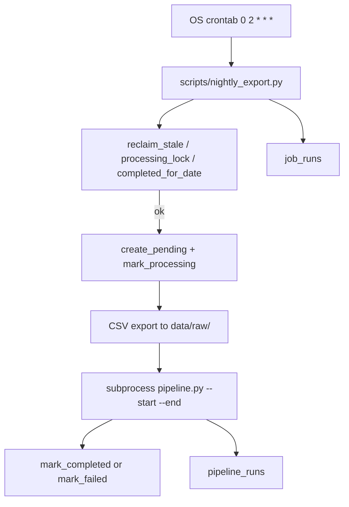

# Background Processes (DEV-53) — Implementation Plan

**Plan file:** [`background_processes_IMPLEMENTATION_PLAN.md`](background_processes_IMPLEMENTATION_PLAN.md)

**Requirements sources (authoritative):**

- [`background_processes_specs.md`](background_processes_specs.md) — full build spec (§1 deviations are mandatory)
- [`background_processes_eval_criteria.md`](background_processes_eval_criteria.md) — acceptance rubric

**Branch:** `feature/background-processing` (create off latest `feature/data_pipeline`; do not implement on `main`)

**PR:** against `main`, label `cronjob`, commit message  
`feat: add nightly telemetry export job with job_runs state machine`

**Status:** Implemented on `feature/background-processing` — pending commit + PR → `main` with `cronjob` label.

**Rule:** Follow Spec §1 resolutions verbatim. Do not re-litigate ticket wording when it conflicts with the repo. The only sanctioned Milestone 6 code change is argparse on `pipeline.py` `__main__`.

---

## Executive summary

Build a standalone nightly OS-cron job that:

1. Records each run in a new `job_runs` table (`pending → processing → completed | failed`)
2. Exports the previous UTC day’s `telemetry_events` to `data/raw/telemetry_YYYY-MM-DD.csv`
3. Triggers Milestone 6 ETL via subprocess: `uv run python data/pipelines/pipeline.py --start … --end …`

`job_runs` owns orchestration (lock + per-date idempotency). `pipeline_runs` remains the ETL audit log. No FK, no vocabulary merge, no FastAPI scheduler.



---

## Locked decisions (planning clarifications + Spec §1)

| Topic | Decision |
|---|---|
| Branch | New branch off `feature/data_pipeline`: `feature/background-processing` |
| Env loading | Script loads repo-root `.env`, then fills gaps from `services/api/.env` before importing `app.core.*` |
| Pipeline entry | `data/pipelines/pipeline.py` — not `telemetry_kpi_daily` |
| `--no-prefect` | Do **not** add (local-ephemeral Prefect; note in PR body) |
| Window CLI | Add `--start` / `--end` on `__main__` only; do not edit `resolve_window` / subflows / tasks |
| Schema | SQLModel `JobRun` + `create_all` — no Alembic, no hand-written `.sql` |
| Module path | `services/api/app/domains/jobs/` (not `services/jobs/`) |
| Import ceiling | `job_runner` may import only `app.core.db`, `app.core.config`, sqlmodel/sqlalchemy, stdlib — never FastAPI / `app.main` / routers |
| Status vocab | Ticket vocabulary for `job_runs`; leave `pipeline_runs` unchanged |
| Lock | `processing` status is the lock; stale reclaim via `STALE_LOCK_HOURS` (default 6, env override) — no lock table/column/file |
| CSV | Backup only; pipeline still reads DB; gitignore `data/raw/*.csv` |
| Trigger | OS crontab only — no APScheduler, `@repeat_every`, lifespan hook, or FastAPI `BackgroundTasks` |

---

## Prerequisites

- [ ] On latest `feature/data_pipeline` (Build 2 pipeline + `telemetry_etl_flow(start, end)` present)
- [ ] Spec §1 and eval criteria read end-to-end
- [ ] `DATABASE_URL` available for manual §7 walkthrough (tests use in-memory SQLite)

---

## Phase 0 — Branch

```bash
git checkout feature/data_pipeline
git pull   # if tracking remote
git checkout -b feature/background-processing
```

---

## Phase 1 — `jobs` domain

Create [`services/api/app/domains/jobs/`](../../../services/api/app/domains/jobs/):

| File | Responsibility |
|---|---|
| `__init__.py` | Package marker |
| `models.py` | `JobRun` → table `job_runs` |
| `job_runner.py` | Session-scoped create / update / query / lock helpers |

### 1.1 `JobRun` fields (exact)

| Field | Type | Notes |
|---|---|---|
| `id` | UUID PK | `default_factory=uuid4` |
| `job_name` | str | `"nightly_export"` for this job |
| `target_date` | date | Required; part of idempotency key |
| `status` | str | `pending` \| `processing` \| `completed` \| `failed` |
| `started_at` | datetime \| None | tz-aware; set on `processing` |
| `finished_at` | datetime \| None | tz-aware; set on `completed` / `failed` |
| `error_message` | str \| None | Truncate to 500 (match `PipelineRun.error_summary`) |
| `created_at` | datetime | tz-aware; set on pending insert |

- Datetimes: `Column(sa.DateTime(timezone=True))` — copy [`reporting_models.py`](../../../services/api/app/domains/telemetry/reporting_models.py)
- Index: `__table_args__ = (sa.Index("ix_job_runs_job_name_target_date", "job_name", "target_date"),)` — **not unique** (failed runs + retries allowed)

### 1.2 `job_runner.py` API

- `create_pending(session, job_name, target_date) -> JobRun`
- `mark_processing(session, run) -> None`
- `mark_completed(session, run) -> None`
- `mark_failed(session, run, error) -> None` — truncate error to 500
- `has_processing_lock(session, job_name) -> bool` — any **non-stale** `processing` row for that job (any date)
- `has_completed_for_date(session, job_name, target_date) -> bool`
- `reclaim_stale_locks(session, job_name) -> int` — stale `processing` → `failed` with reclaim message; `STALE_LOCK_HOURS = 6` overridable via env

Caller owns session commit lifecycle.

### 1.3 Table creation

- Import `JobRun` in [`services/api/app/main.py`](../../../services/api/app/main.py) so API startup `create_all` picks it up
- Script must also `SQLModel.metadata.create_all(engine)` after importing the model (may run before API ever boots)

---

## Phase 2 — argparse on `pipeline.py`

Edit **only** [`data/pipelines/pipeline.py`](../../../data/pipelines/pipeline.py) `if __name__ == "__main__":`:

- `--start` / `--end`: timezone-aware ISO 8601 UTC; reject naive values
- Both set → `telemetry_etl_flow(start=..., end=...)`
- Neither → `telemetry_etl_flow()` (byte-for-byte equivalent to today)
- Exactly one → `parser.error(...)`, non-zero exit
- Keep existing `DATABASE_URL` / `supabase_engine` guard before any flow call
- Let flow exceptions propagate so exit code is non-zero

**Do not** touch `resolve_window`, subflows, or tasks.

---

## Phase 3 — `scripts/nightly_export.py`

Runnable from repo root: `python scripts/nightly_export.py` / `uv run python scripts/nightly_export.py`.

### 3.1 Bootstrap (order matters)

1. `sys.path`: insert `services/api` and repo root (same pattern as `pipeline.py:27–33`)
2. **Env fallback:** parse/load root `.env`, then `services/api/.env` for missing keys (`DATABASE_URL`, `SECRET_KEY`, etc.) **before** importing `app.core.*`
3. If `supabase_engine is None` → log actionable `DATABASE_URL` error, exit `1` **before** any `job_runs` write
4. Import `JobRun`; `SQLModel.metadata.create_all(engine)`

### 3.2 Target date

- `TARGET_DATE` env (`YYYY-MM-DD`) if set — strict parse; malformed → exit non-zero (no fallback)
- Else yesterday UTC: `datetime.now(timezone.utc).date() - timedelta(days=1)`
- Bounds: midnight UTC → +1 day, half-open `[start, end)` (matches `load_events`)

### 3.3 Guard order (rubric-graded — exact sequence)

1. `reclaim_stale_locks(session, "nightly_export")` — WARNING per reclaimed row
2. `has_processing_lock` → INFO, exit `0`, **no new row**
3. `has_completed_for_date` → INFO “skipped as duplicate”, exit `0`
4. `create_pending` → `mark_processing`, **commit before work**

### 3.4 Work

**CSV** → `data/raw/telemetry_<target_date>.csv`

- If file exists → skip export (INFO); still run pipeline
- Else full dump of `telemetry_events` for `[start, end)`: all columns (`id`, `timestamp`, `service`, `event_type`, `level`, `value`, `message`, `tags`) — **not** `load_events`
- Serialize `tags` with `json.dumps`; write via temp file + `os.replace()`; `mkdir(parents=True, exist_ok=True)`

**Pipeline** (after export):

```text
["uv", "run", "python", "data/pipelines/pipeline.py",
 "--start", start.isoformat(), "--end", end.isoformat()]
```

- `cwd` = repo root, `check=True`, capture stdout/stderr, never `shell=True`
- On `CalledProcessError`, include stderr tail in the error that propagates
- CSV is **not** pipeline input

### 3.5 Failure / no zombies

- Wrap work in `try` / `except Exception` / `finally` (or `BaseException` safety net for KeyboardInterrupt / SystemExit)
- `except` → `mark_failed` on a **fresh session**, log ERROR + traceback, exit non-zero
- Success → `mark_completed`, INFO
- `finally` must ensure no row remains `processing`

### 3.6 Logging

- `logging.basicConfig` INFO; UTC `asctime`
- Format: `%(asctime)s %(levelname)s [nightly_export] %(message)s`
- Every relevant line carries job name context and resulting status

---

## Phase 4 — `.gitignore` + README

- Add `data/raw/*.csv` to [`.gitignore`](../../../.gitignore)
- New **"Background Processing"** section in root [`README.md`](../../../README.md):
  - Cron `0 2 * * *` (align with pipeline docstring / `docs/data_pipelines/pipeline-design.md`)
  - Sample crontab with `cd`, absolute `uv` path, log redirect
  - Call out **cwd / `.env` trap** (mandatory `cd`) + dual env locations (root then `services/api/.env`)
  - Manual run + `TARGET_DATE` backfill
  - Note CSV is backup/audit only

Example crontab line:

```cron
0 2 * * * cd /path/to/chitrasharath_healthcore_ft_ai_1 && /usr/local/bin/uv run python scripts/nightly_export.py >> /tmp/nightly_export.log 2>&1
```

---

## Phase 5 — Tests

No changes to root `testpaths` / `pythonpath`.

### 5.1 `services/api/tests/test_job_runner.py`

In-memory SQLite (mirror inventory/telemetry pattern):

- [ ] `pending → processing → completed` sets each timestamp
- [ ] `pending → processing → failed` records `error_message`; never left `processing`
- [ ] `has_completed_for_date` true for matching date; **false for other date, same `job_name`**
- [ ] `has_processing_lock` sees active; ignores completed
- [ ] `reclaim_stale_locks` flips stale; leaves fresh untouched

### 5.2 `tests/jobs/test_nightly_export.py`

Mock `subprocess.run` (pipeline must never execute). No `__init__.py` (match `tests/pipelines/`).

- [ ] Completed row for `target_date` → no CSV, subprocess not called
- [ ] Active `processing` → exit `0`, no new row, subprocess not called
- [ ] Existing CSV → export skipped; pipeline still triggered
- [ ] `CalledProcessError` → row `failed` with stderr tail; nothing left in `processing`
- [ ] `TARGET_DATE` set → CSV name and `--start`/`--end` argv reflect that date

---

## Phase 6 — Verify + handoff

### Automated

```bash
uv run pytest services/api/tests/test_job_runner.py tests/jobs/test_nightly_export.py
uv run pytest   # full suite before commit request
```

### Manual (Spec §7 — when DATABASE_URL available)

1. Happy path with `TARGET_DATE=<day with events>`
2. Idempotency (second run → skipped as duplicate)
3. Concurrent lock (two instances; one exits 0)
4. Forced failure → `failed`, no stranded `processing`
5. Stale reclaim (hand-insert 12h-old `processing` row)

### Docs / memory-bank

- Update [`memory-bank/progress.md`](../../progress.md) when status changes
- Record lock / env / `job_runs` vs `pipeline_runs` decisions in [`memory-bank/decisions.md`](../../decisions.md) if not already present
- Do **not** commit until developer explicitly acknowledges

### PR body must include

- Cron expression + crontab-vs-scheduler justification
- Successful log sample; failed **or** blocked sample
- CSV excerpt (do not commit the file)
- Notes for §1.2 (no `--no-prefect`), §1.5 (domain placement / no FastAPI import), §1.7 (stale-lock reclaim)

---

## Anti-patterns (reject — each fails an eval criterion)

- Lock table, `is_locked` column, `.lock` file, or `flock`
- Merging `job_runs` into `pipeline_runs` or adding an FK
- Idempotency on `job_name` alone (must include `target_date`)
- APScheduler / `@repeat_every` / lifespan / FastAPI `BackgroundTasks` as the trigger
- Importing `app.main`, routers, or `fastapi` from `job_runner` or the script
- Wiring the pipeline to read the exported CSV
- Bare `except: pass`; `mark_failed` on a poisoned session
- Changing `resolve_window`, subflows, or tasks
- Alembic; no-op `--no-prefect`; committing generated CSV

---

## Residual risks (document; do not “fix” unless asked)

- UI `POST /telemetry/pipelines/runs/trigger` (BackgroundTasks) can still run watermark ETL concurrently with the nightly job — `job_runs` only locks `nightly_export`
- Host crontab still requires absolute `uv` path and correct `cd` for `.env` loading
- `Settings` requires `SECRET_KEY` at import; cron/docs must ensure it is present via env files or process env

---

## Definition of done (mirrors Spec §9 + eval criteria)

- [ ] `job_runs` exists with all eight fields + `(job_name, target_date)` index; `pipeline_runs` untouched
- [ ] `job_runner` exposes create/update/query + lock helpers; no FastAPI imports
- [ ] `python scripts/nightly_export.py` standalone; honours `TARGET_DATE`; env fallback works
- [ ] `pipeline.py` accepts `--start`/`--end`; no-arg invocation unchanged
- [ ] Spec §7 scenarios behave; no stranded `processing`
- [ ] CSV in `data/raw/`; `data/raw/*.csv` gitignored
- [ ] `uv run pytest` passes including both new test files
- [ ] README documents cron, crontab line, cwd/`.env` trap + dual env paths
- [ ] PR against `main` with `cronjob` label and required PR notes

---

## Implementation todo checklist

| ID | Task |
|---|---|
| branch | Create `feature/background-processing` off `feature/data_pipeline` |
| jobs-domain | Add `jobs` domain: `JobRun`, `job_runner`, `main.py` import |
| pipeline-cli | Add `--start`/`--end` argparse to `pipeline.py` `__main__` only |
| nightly-script | Implement `scripts/nightly_export.py` (env fallback, guards, CSV, subprocess) |
| gitignore-readme | `data/raw/*.csv` + README Background Processing section |
| tests | `test_job_runner.py` + `tests/jobs/test_nightly_export.py` |
| verify | Targeted + full pytest; update progress/decisions; await commit ack |
