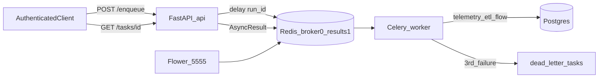

# Message Queues & Async Tasks (DEV-55) — Implementation Plan

**Plan file:** [`message_queues_IMPLEMENTATION_PLAN.md`](message_queues_IMPLEMENTATION_PLAN.md)

**Requirements sources (authoritative):**

- [`message_queues_specs.md`](message_queues_specs.md) — full build spec (§1–§8)
- [`message_queues_eval_criteria.md`](message_queues_eval_criteria.md) — acceptance rubric

**Branch:** `feature/message-queues` (create off latest **`main`**)

**PR:** against `main`, label `async-tasks`

**Status:** Implemented on `feature/message-queues` — pending commit + PR → `main` with `async-tasks` label.

**Rule:** Follow the build spec. Do not re-litigate ticket wording where the spec already decided (additive `/enqueue`, `MAX_ATTEMPTS=3`). Do not reimplement the ETL — wrap `telemetry_etl_flow(run_id=...)`. Do not merge with DEV-53 `job_runs`.

---

## Executive summary

Move the telemetry ETL off FastAPI `BackgroundTasks` onto an independent **Celery worker** backed by **Redis**, with:

1. Additive `POST /api/v1/telemetry/pipelines/runs/enqueue` → `202` + `task_id` + `run_id` in &lt; 200 ms
2. Compose services: `redis`, `worker`, `flower` (Flower on `:5555`)
3. Retries with exponential backoff; after **three** failed executions → Postgres `dead_letter_tasks` (no 4th attempt)
4. `GET /api/v1/tasks/{task_id}` and `GET /api/v1/tasks/dlq` for status / DLQ inspection

Keep existing `POST .../pipelines/runs/trigger` unchanged so the reporting UI keeps working.



---

## Locked decisions (planning clarifications)

| Topic | Decision |
|---|---|
| Endpoint shape | **Additive** `/enqueue` → `202`; keep `/trigger` (BackgroundTasks) as-is. Demo/PR must point graders at `/enqueue` for eval #2. |
| Branch | `feature/message-queues` off latest **`main`** |
| Compose | Define **`redis` + `worker` + `flower`** in [`docker-compose.yml`](../../../docker-compose.yml); wire `REDIS_URL` on `api` |
| Manual testing (disk) | Prefer **no `ui` service**: `docker compose up --build redis api worker flower`. Use [`scripts/docker_purge.sh`](../../../scripts/docker_purge.sh) on ENOSPC. |
| Attempts / retries | `MAX_ATTEMPTS = 3` → Celery `max_retries = 2`; DLQ on 3rd failure; backoff `2s`, `4s` |
| Result backend | Derive from `REDIS_URL` by using Redis DB index `1` (no separate env var) |
| Frontend | Out of scope — reporting UI continues to call `/trigger` |
| Queue target | Pipeline ETL only — **not** `POST /telemetry/events` (payloads would violate “references only”) |

---

## Prerequisites

- [ ] On latest `main` with M6 pipeline + `telemetry_etl_flow(run_id=...)` available
- [ ] Spec §1–§6 and eval criteria read end-to-end
- [ ] Root `.env` with valid `DATABASE_URL` + `SECRET_KEY` (ETL + DLQ require Postgres)
- [ ] Enough disk for one API image build (skip `ui` for queue testing)

---

## Phase 0 — Branch

```bash
git checkout main
git pull
git checkout -b feature/message-queues
```

---

## Phase 1 — Dependencies + env

```bash
cd services/api
uv add celery redis flower
```

- Updates [`services/api/pyproject.toml`](../../../services/api/pyproject.toml) + [`services/api/uv.lock`](../../../services/api/uv.lock) (Docker `uv sync --frozen`). Re-lock root workspace lockfile if required by monorepo conventions.
- Add to [`app/core/config.py`](../../../services/api/app/core/config.py): `redis_url: str = "redis://redis:6379/0"`
- Add `REDIS_URL=redis://redis:6379/0` to [`.example.env`](../../../.example.env); document copying into root `.env`

Broker URL resolution for the worker lives in `services/celery_app.py` (read `REDIS_URL` / env); keep one consistent derivation for the result backend (`…/1`).

---

## Phase 2 — Compose: `redis`, `worker`, `flower`

Modify [`docker-compose.yml`](../../../docker-compose.yml); all on existing `healthcore_net`.

### `redis`

- Image: `redis:7`
- Command includes `--maxmemory-policy noeviction`
- Ports: `6379:6379`
- Healthcheck: `redis-cli ping`
- Optional named volume for durability

### `worker`

- Same build as `api`: `context: .`, `dockerfile: services/Dockerfile`
- `working_dir: /app`
- `environment`: `PYTHONPATH=/app`, plus `REDIS_URL` / `DATABASE_URL` via `env_file: [.env]`
- Volumes: match `api` mounts for `services`, `packages`, `scripts`, `data`, `memory-bank` (worker needs `services/celery_app.py`, `services/tasks.py`, `data/pipelines/*`)
- Command: `celery -A services.celery_app worker --loglevel=info --concurrency=2`  
  **Plain `celery` — not `uv run celery`** (see spec §6.1 gotcha)
- `depends_on: [redis]`; **no** host ports

### `flower`

- Same image / `working_dir: /app` / `PYTHONPATH=/app`
- Command: `celery -A services.celery_app flower --port=5555`
- Ports: `5555:5555`
- `depends_on: [redis]`; `env_file` with `REDIS_URL`

### `api`

- Ensure `REDIS_URL` is present (env_file / environment) so enqueue and `GET /tasks/{id}` reach Redis

### Disk-conscious bring-up (document in README)

```bash
docker compose up --build redis api worker flower   # skip ui
# prove worker first (optional):
docker compose up redis worker
```

---

## Phase 3 — Celery package under `services/`

| File | Responsibility |
|---|---|
| [`services/__init__.py`](../../../services/__init__.py) | Package marker (required for `import services.celery_app`) |
| [`services/celery_app.py`](../../../services/celery_app.py) | Celery instance + config |
| [`services/tasks.py`](../../../services/tasks.py) | Pipeline task, retry/backoff, DLQ `on_failure`, logging |

### `celery_app.py`

1. Bootstrap `sys.path`: insert `services/api` and repo root **before** any `app.*` import — copy pattern from [`data/pipelines/pipeline.py`](../../../data/pipelines/pipeline.py)
2. Read `REDIS_URL` (default `redis://redis:6379/0`); result backend = same host with DB `1`
3. Create app:

```python
celery_app = Celery(
    "healthcore",
    broker=BROKER_URL,
    backend=RESULT_BACKEND,
    include=["services.tasks"],
)
```

4. Required config:
   - `task_track_started=True` (mandatory or `started` never appears)
   - `result_expires=3600`
   - `task_acks_late=True`, `worker_prefetch_multiplier=1`
   - JSON serializers (messages are ids/scalars only)

### `tasks.py`

Constants:

```python
MAX_ATTEMPTS = 3
MAX_RETRIES = MAX_ATTEMPTS - 1  # 2
BASE_BACKOFF_SECONDS = 2
```

- Task name: `pipeline.run_telemetry_etl`
- `bind=True`, `base=DLQTask`, `max_retries=MAX_RETRIES`
- Args: `run_id: str`; kw-only `_force_fail: bool = False` (demo/test only; never set by normal enqueue path without auth)
- Body: call `telemetry_etl_flow(run_id=UUID(run_id))` — **same `run_id` across retries**
- On failure: log; if retries remain, `self.retry(exc=..., countdown=BASE_BACKOFF_SECONDS * 2 ** self.request.retries)` → `2`, `4`, … (never `0`)
- Final failure: re-raise so `DLQTask.on_failure` → `record_dead_letter(...)`
- `log_task(...)`: every success/failure line includes `task_id`, `attempt`, `status`, `duration`; failures include full error

---

## Phase 4 — `async_tasks` domain

Create [`services/api/app/domains/async_tasks/`](../../../services/api/app/domains/async_tasks/):

| File | Role |
|---|---|
| `__init__.py` | Package marker |
| `models.py` | `DeadLetterTask` → `dead_letter_tasks` |
| `service.py` | `record_dead_letter`, `get_task_status`, `list_dlq` |
| `schemas.py` | `TaskStatusResponse`, `DeadLetterItem` |
| `router.py` | `GET /tasks/{task_id}`, `GET /tasks/dlq` |

### `DeadLetterTask` fields

| Field | Type | Notes |
|---|---|---|
| `id` | UUID PK | `default_factory=uuid4` |
| `task_id` | str (indexed) | Celery task id |
| `task_name` | str | e.g. `pipeline.run_telemetry_etl` |
| `attempt` | int | 1-based at dead-letter time |
| `error` | str | `repr(exc)` / message |
| `traceback` | str \| None | truncated `einfo` |
| `created_at` | datetime tz-aware (indexed) | `now(timezone.utc)` |

### Service notes

- `record_dead_letter` runs **in the worker**: open `Session(supabase_engine)` yourself; do not use FastAPI `Depends`. Guard `supabase_engine is None` and log loudly.
- `get_task_status`: `AsyncResult(task_id, app=celery_app)` and map:

| Celery state | Returned `status` | `result` |
|---|---|---|
| `PENDING` | `pending` | `null` (also unknown ids) |
| `STARTED` | `started` | `null` |
| `RETRY` | `started` | `null` |
| `SUCCESS` | `success` | task return value |
| `FAILURE` | `failure` | error string |

### Wiring

- Mount router in [`app/api/v1/router.py`](../../../services/api/app/api/v1/router.py) with `Depends(get_current_user)` (match protected telemetry style)
- Import models in [`main.py`](../../../services/api/app/main.py) (`# noqa: F401`) for API `create_all`
- Import models in `services/tasks.py` so the worker can create/write DLQ without the API ever having started

---

## Phase 5 — Enqueue endpoint

In [`telemetry/router.py`](../../../services/api/app/domains/telemetry/router.py):

```
POST /api/v1/telemetry/pipelines/runs/enqueue  →  202 Accepted
Body: { "task_id": "<celery>", "run_id": "<uuid>" }
```

- Same auth as `/trigger` (`get_current_user`)
- `supabase_engine is None` → `503`
- `run_id = uuid4()`; `run_telemetry_etl.delay(str(run_id), _force_fail=force_fail)` — **no** `.get()` / `.wait()`
- Optional auth-gated `force_fail: bool = False` for DLQ demo
- **Do not change** `/trigger` behavior

---

## Phase 6 — Tests

No live Redis required for unit tests where Celery is mocked.

**`services/api/tests/test_async_tasks.py`**

- Status mapping for Celery states
- DLQ model insert / `list_dlq` against in-memory SQLite
- Enqueue returns **202**, body has `task_id` + `run_id`, and `.delay` is called with the `run_id` string only (mock task)

**Task-focused tests** (mock `telemetry_etl_flow`)

- Retry countdown strictly increases
- After 3rd failure, DLQ record written; no 4th execution
- `_force_fail` raises deterministically

Full suite: `uv run pytest` from repo root must stay green; `/trigger` tests unchanged.

---

## Phase 7 — README + memory-bank

### README — “Message queues (Celery)”

Document:

- `docker compose up --build redis api worker flower` (and why skipping `ui` saves disk)
- Flower at `http://localhost:5555`
- `REDIS_URL` / `DATABASE_URL` requirements
- `MAX_ATTEMPTS` / retry semantics
- How to demo failure (`force_fail`)
- Independence check: `docker compose stop api` while worker continues
- Equivalent local commands if needed: `celery -A services.celery_app worker` / Flower (with `PYTHONPATH` / cwd notes)

### Memory-bank

- Update [`progress.md`](../../progress.md) when status changes
- Record decisions in [`decisions.md`](../../decisions.md): additive `/enqueue`, Celery+Redis+Flower, `MAX_ATTEMPTS=3`, ui-less Compose testing

---

## Manual verification (Spec §8 / eval)

1. **Happy path** — Authenticate; `POST .../enqueue`; confirm **202** in &lt; 200 ms; poll `GET /tasks/{task_id}`: `pending` → `started` → `success`; confirm `pipeline_runs` row; Flower shows completed task.
2. **Failure / DLQ** — Enqueue with `force_fail=true`; worker logs increasing countdown (2s, 4s); exactly **three** attempts; row in `dead_letter_tasks` via `GET /tasks/dlq`; Flower shows failed task; **no** 4th attempt.
3. **Independence** — Enqueue a task; `docker compose stop api`; worker still processes; restart `api`; `GET /tasks/{id}` returns result.
4. **Regression** — `/trigger` still returns current shape; `uv run pytest` passes.
5. **References only** — Inspect queued message / task args: `run_id` (+ scalars), no DataFrame/file bytes.

---

## PR body checklist (user opens PR)

- [ ] Endpoint chosen: `/telemetry/pipelines/runs/enqueue` wrapping `telemetry_etl_flow` — justification from Spec §1
- [ ] Flower screenshot: ≥1 completed + ≥1 failed
- [ ] Worker log snippet showing retry with backoff
- [ ] Note deviations: (a) additive endpoint, (b) `MAX_ATTEMPTS=3` vs literal `max_retries=3`
- [ ] Label: `async-tasks`
- [ ] Point grader at `/enqueue` for eval criterion #2 (`202` + `task_id`)

Suggested commit message style:  
`feat: enqueue telemetry ETL via Celery with Redis broker and DLQ`

---

## Anti-patterns (reject)

- `.apply()` / synchronous task run in the request handler; `.get()` / `.wait()` on enqueue
- Enqueuing DataFrames, file bytes, or large dicts
- Hard-coded Redis host/port in code (use `REDIS_URL`)
- Redis without `noeviction`
- Changing or removing `/trigger` behavior
- Merging DLQ into `job_runs` or `pipeline_runs`
- `uv run celery` from `/app`; missing `PYTHONPATH=/app` / `working_dir: /app`
- Introducing RabbitMQ/SQS or a second DB for the DLQ
- Queuing `POST /telemetry/events` batches

---

## Residual risks

- Codespace disk pressure when rebuilding the API image; mitigate with ui-less Compose + `docker_purge.sh`
- Celery `PENDING` cannot distinguish unknown `task_id` from not-yet-started (document on endpoint)
- Concurrent `/trigger` (BackgroundTasks) and `/enqueue` (Celery) can both run ETL; acceptable for this ticket — note in PR if asked
- Host Redis URL for non-Compose API must use `localhost` in `.env`, not the hostname `redis`

---

## Definition of done

- [ ] Redis in Compose with `noeviction`; worker connects cleanly
- [ ] `/enqueue` returns `202` + `task_id` in &lt; 200 ms
- [ ] `GET /tasks/{id}` returns correct lowercase statuses through the lifecycle
- [ ] Exponential backoff retries; no zero-delay retry
- [ ] After three failures → `dead_letter_tasks` with `task_id`, attempt, error; no 4th attempt
- [ ] Stopping API does not stop worker or drop Redis-queued messages
- [ ] Queue messages are references only (`run_id` + scalars)
- [ ] Flower on `:5555` shows completed and failed tasks
- [ ] Task logs include `task_id`, attempt, status, duration (+ error on failure)
- [ ] Retries reuse the same `run_id` (one logical `pipeline_runs` row)
- [ ] `uv run pytest` green; `/trigger` unchanged
- [ ] README + `.example.env` document worker/Flower/`REDIS_URL`/`MAX_ATTEMPTS`

---

## Implementation todo checklist

| ID | Task |
|---|---|
| branch-deps | Branch off `main`; `uv add celery redis flower`; `REDIS_URL` in Settings + `.example.env` |
| compose | Add `redis` / `worker` / `flower` to Compose; `REDIS_URL` on `api`; document ui-less up |
| celery-core | Add `services/__init__.py`, `celery_app.py`, `tasks.py` (retries / DLQ / logging) |
| async-domain | Add `async_tasks` domain; mount router; `create_all` imports |
| enqueue | Add `POST .../pipelines/runs/enqueue` (202); keep `/trigger` |
| tests-docs | Tests + README + progress/decisions; manual §8 checklist |
