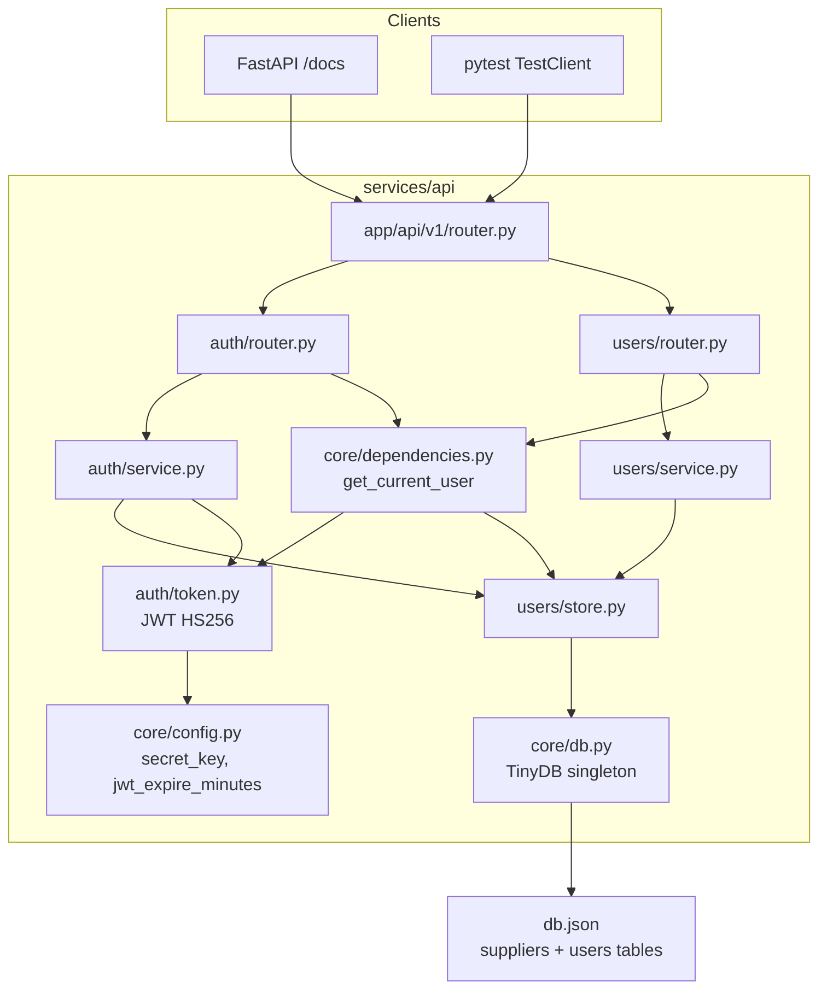
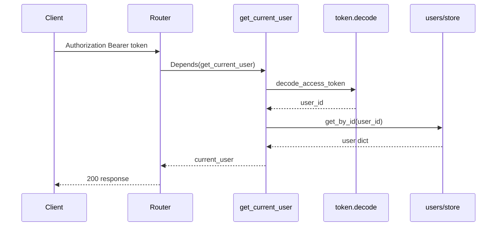

# AUTH-01 Authentication — Implementation Plan

**Plan file:** [`memory-bank/references/authentication_backend_ai_plan/IMPLEMENTATION_PLAN.md`](IMPLEMENTATION_PLAN.md)

**Requirements source:** [`SPECS.md`](SPECS.md), [`screenshot_content.md`](screenshot_content.md)

**Milestone:** AUTH-01 — JWT authentication and route protection

**Branch:** `feature/auth` (per screenshot_content)

**Status:** Delivered — backend, tests, and docs complete

---

## Executive summary

Add JWT-based auth to the existing HealthCore FastAPI monolith at [`services/api`](../../../../services/api). This milestone delivers:

1. **Shared TinyDB layer** — extract `get_db()` / `reset_db()` to [`app/core/db.py`](../../../../services/api/app/core/db.py); refactor suppliers store to use it; add a `users` table in the same [`db.json`](../../../../services/api/db.json).
2. **Auth domain** — `POST /auth/register`, `POST /auth/login`, `GET /auth/me` under `/api/v1/auth`.
3. **Users domain** — full CRUD under `/api/v1/users` with selective protection (`POST` public; GET/PUT/DELETE require token).
4. **Reusable dependency** — [`get_current_user`](../../../../services/api/app/core/dependencies.py) for current and future route groups.
5. **Tests** — 18 cases in [`tests/test_auth.py`](../../../../services/api/tests/test_auth.py) mirroring [`tests/test_suppliers.py`](../../../../services/api/tests/test_suppliers.py) isolation pattern.
6. **Developer docs** — `.example.env`, README auth section, `/docs` smoke-test checklist.

Existing `/suppliers` and `/incidents` routes stay **unprotected**; router wiring includes a commented example for future protection.

The HIPAA opaque-token migration (SPECS §Future milestone) is **out of scope** — documented as a follow-up only.

---

## Planning decisions (locked)

These resolve ambiguities between SPECS, screenshot_content, and stakeholder answers.

| Topic | Decision |
|-------|----------|
| TinyDB sharing | **Extract** `get_db()` / `reset_db()` to `app/core/db.py`; refactor [`suppliers/store.py`](../../../../services/api/app/domains/procurement/suppliers/store.py) to import from core |
| DB path env var | Single `DB_PATH` env var in `app/core/db.py` (accept `SUPPLIERS_DB_PATH` as alias for backward compat in existing supplier tests) |
| Scope | Backend + developer docs; **no** Next.js auth UI |
| DELETE permission | Any authenticated user may delete (per SPECS); add `# TODO: restrict to admin when RBAC is implemented` on endpoint |
| PUT authorization | Owner-only: `current_user["id"] == user_id` else 403 `"Not authorized"` |
| Inactive users | Block login when `is_active=False` — raise `InvalidCredentialsError` (same generic message as wrong password) |
| Email on PUT | Reject duplicate email with 422 `"Email already registered"` if new email belongs to another user |
| Email normalization | Store and compare emails as **lowercase** (normalize in store insert/update and auth lookups) |
| Datetime | Use `datetime.now(timezone.utc)` (match suppliers service `_utc_now()` pattern; avoid deprecated `utcnow()`) |
| Password hashing | Shared `CryptContext(schemes=["bcrypt"], deprecated="auto")` — extract `_hash_password` helper in auth service, reused by users service |
| Exception mapping | Follow SPECS error table exactly (401/403/404/422 messages) |
| Suppliers regression | Existing 29 supplier tests must still pass after `core/db.py` refactor |

---

## Architecture



**Request flow (protected route):**



---

## File layout (new and modified)

```
services/api/
├── pyproject.toml                          # + python-jose, passlib
├── .example.env                            # NEW: SECRET_KEY, JWT_EXPIRE_MINUTES
├── app/
│   ├── core/
│   │   ├── config.py                       # + secret_key, jwt_expire_minutes
│   │   ├── db.py                           # NEW: get_db, reset_db, DEFAULT_DB_PATH
│   │   └── dependencies.py                 # NEW: oauth2_scheme, get_current_user
│   ├── domains/
│   │   ├── auth/
│   │   │   ├── __init__.py
│   │   │   ├── schemas.py                  # User, UserCreate, UserLogin, TokenResponse, UserResponse, UserUpdate
│   │   │   ├── token.py                    # create_access_token, decode_access_token
│   │   │   ├── service.py                  # register, login + exceptions
│   │   │   └── router.py                   # /auth routes
│   │   └── users/
│   │       ├── __init__.py
│   │       ├── store.py                    # users table CRUD
│   │       ├── service.py                  # create, list, get, update, delete
│   │       └── router.py                   # /users routes
│   └── api/v1/router.py                    # wire auth + users routers
├── tests/
│   ├── test_auth.py                        # NEW: 18 SPECS cases
│   └── test_suppliers.py                   # unchanged behavior; may update reset_db import path
└── db.json                                 # gitignored; gains users table at runtime
```

---

## Implementation phases

### Phase 1 — Dependencies and config

**[`pyproject.toml`](../../../../services/api/pyproject.toml)** — add:

```toml
"python-jose[cryptography]>=3.3.0",
"passlib[bcrypt]>=1.7.4",
```

Run `uv sync` from `services/api/`.

**[`app/core/config.py`](../../../../services/api/app/core/config.py)** — add required fields (pydantic-settings maps `SECRET_KEY` → `secret_key`, `JWT_EXPIRE_MINUTES` → `jwt_expire_minutes`; no in-code defaults):

```python
secret_key: str
jwt_expire_minutes: int
```

**[`.example.env`](../../../../services/api/.example.env)** (new; copy to `.env` before run):

```
SECRET_KEY=change-me-before-production
JWT_EXPIRE_MINUTES=30
```

---

### Phase 2 — Extract shared TinyDB (`app/core/db.py`)

Create singleton matching suppliers pattern:

- `DEFAULT_DB_PATH` → `Path(__file__).resolve().parents[2] / "db.json"` (resolves to `services/api/db.json`)
- `DB_PATH` from env `DB_PATH` (fallback `DEFAULT_DB_PATH`; accept `SUPPLIERS_DB_PATH` as alias)
- `get_db() -> TinyDB`, `reset_db(path: Path | None = None) -> None`

**Refactor [`suppliers/store.py`](../../../../services/api/app/domains/procurement/suppliers/store.py):**

- Remove local `_db`, `get_db`, `reset_db`, `DEFAULT_DB_PATH`, `DB_PATH`
- `from app.core.db import get_db, reset_db`
- Keep `TABLE_NAME = "suppliers"` and all table-specific functions unchanged
- Re-export `reset_db` from store for minimal test diff, or update [`test_suppliers.py`](../../../../services/api/tests/test_suppliers.py) fixture to call `app.core.db.reset_db(tmp_path)`

**Verify:** `uv run pytest tests/test_suppliers.py` — all 29 tests green before proceeding.

---

### Phase 3 — Users store (`app/domains/users/store.py`)

Table `"users"`. Follow suppliers `_normalize` pattern (`id` = TinyDB `doc_id`).

| Function | Notes |
|----------|-------|
| `insert_user` | Normalize email to lowercase before insert |
| `get_by_id` | Standard normalize |
| `get_by_email` | `Query().email == email.lower()` |
| `get_all` | All normalized docs |
| `update_user` | Partial update; lowercase email if present |
| `delete_user` | Hard delete; return bool |
| `email_exists` | For registration guard |
| `reset_db` | Re-export from `app.core.db` for test fixture convenience |

Document shape per SPECS:

```json
{"email": "alice@example.com", "hashed_password": "$2b$12$...", "is_active": true, "created_at": "2026-06-18T10:00:00+00:00"}
```

---

### Phase 4 — Schemas (`app/domains/auth/schemas.py`)

Implement all models from SPECS §Pydantic schemas:

- Internal `User` (never returned by endpoints)
- `UserCreate` with `@field_validator` password min 8 chars
- `UserUpdate`, `UserLogin`, `TokenResponse`, `UserResponse`

Place schemas in `auth/` domain (users router imports from there) — matches SPECS file layout.

---

### Phase 5 — JWT helpers (`app/domains/auth/token.py`)

- `create_access_token(user_id: int)` — payload `{"sub": str(user_id), "exp": utc + jwt_expire_minutes}`, HS256, `settings.secret_key`
- `decode_access_token(token: str) -> int` — on any `JWTError` or missing `sub`, raise `HTTPException(401, "Could not validate credentials")`

For test case 18 (expired token): tests patch `settings.jwt_expire_minutes = -1` before calling `create_access_token`.

---

### Phase 6 — Service layer

**[`auth/service.py`](../../../../services/api/app/domains/auth/service.py)**

- `register(body) -> TokenResponse` — email_exists → `DuplicateEmailError`; hash password; insert; return token
- `login(body) -> TokenResponse` — missing user, bad password, or `not user["is_active"]` → `InvalidCredentialsError("Invalid credentials")` (uniform message)
- Exceptions: `DuplicateEmailError`, `InvalidCredentialsError`

**[`users/service.py`](../../../../services/api/app/domains/users/service.py)**

- `create_user(body) -> UserResponse` — same insert logic as register (reuse `_hash_password` from auth)
- `list_users`, `get_user`, `update_user`, `delete_user` per SPECS
- On `update_user`: if email changes and `email_exists(new_email)` for a different id → `DuplicateEmailError`
- Exception: `UserNotFoundError`

**Response mapping helper:** `_to_user_response(doc)` — parse `created_at` ISO string to `datetime` (mirror suppliers `_to_response`).

---

### Phase 7 — `get_current_user` (`app/core/dependencies.py`)

```python
oauth2_scheme = OAuth2PasswordBearer(tokenUrl="/api/v1/auth/login")

def get_current_user(token: str = Depends(oauth2_scheme)) -> dict:
    user_id = decode_access_token(token)
    user = users_store.get_by_id(user_id)
    if user is None:
        raise HTTPException(401, "User not found")
    return user
```

---

### Phase 8 — Routers

**[`auth/router.py`](../../../../services/api/app/domains/auth/router.py)** — `prefix="/auth"`, `tags=["auth"]`

| Route | Auth | Status | Error mapping |
|-------|------|--------|---------------|
| `POST /register` | No | 201 | DuplicateEmail → 422 |
| `POST /login` | No | 200 | InvalidCredentials → 401 |
| `GET /me` | `Depends(get_current_user)` on endpoint | 200 | — |

**[`users/router.py`](../../../../services/api/app/domains/users/router.py)** — `prefix="/users"`, `tags=["users"]`

| Route | Auth | Status | Notes |
|-------|------|--------|-------|
| `POST /users` | No | 201 | Public registration |
| `GET /users` | `Depends(get_current_user)` | 200 | |
| `GET /users/{id}` | `Depends(get_current_user)` | 200 | |
| `PUT /users/{id}` | `Depends(get_current_user)` | 200 | 403 if `current_user["id"] != user_id` |
| `DELETE /users/{id}` | `Depends(get_current_user)` | 204 | `# TODO: restrict to admin when RBAC is implemented` |

Inject `get_current_user` **per protected endpoint** (not router-level) so `POST /users` stays public.

**[`api/v1/router.py`](../../../../services/api/app/api/v1/router.py)** — add:

```python
api_v1_router.include_router(auth_router)
api_v1_router.include_router(users_router)
# Future: api_v1_router.include_router(suppliers_router, dependencies=[Depends(get_current_user)])
```

Do not modify existing incidents/suppliers includes.

---

### Phase 9 — Tests (`tests/test_auth.py`)

Mirror suppliers isolation:

```python
@pytest.fixture(autouse=True)
def isolated_db(tmp_path):
    db_path = tmp_path / "auth_test.json"
    from app.core import db as core_db
    core_db.reset_db(db_path)
    # truncate users table via store helper or fresh file
```

**18 test cases** (SPECS §Tests) — use helper `register_and_token(client)` for bearer headers.

| # | Test case |
|---|-----------|
| 1 | `POST /auth/register` valid → 201, `access_token` present |
| 2 | `POST /auth/register` duplicate email → 422 |
| 3 | `POST /auth/register` password under 8 chars → 422 |
| 4 | `POST /auth/login` valid → 200, `access_token` present |
| 5 | `POST /auth/login` wrong password → 401 |
| 6 | `POST /auth/login` unknown email → 401 |
| 7 | `GET /auth/me` with valid token → 200, no `hashed_password` |
| 8 | `GET /auth/me` without token → 401 |
| 9 | `POST /users` valid → 201, profile fields present, no `hashed_password` |
| 10 | `GET /users` with valid token → 200, list |
| 11 | `GET /users` without token → 401 |
| 12 | `GET /users/{id}` valid token + existing id → 200 |
| 13 | `GET /users/{id}` valid token + unknown id → 404 |
| 14 | `PUT /users/{id}` owner updates own record → 200 |
| 15 | `PUT /users/{id}` authenticated user updates different user → 403 |
| 16 | `DELETE /users/{id}` authenticated user → 204 |
| 17 | `DELETE /users/{id}` unknown id → 404 |
| 18 | Expired token (`jwt_expire_minutes=-1`) on `GET /auth/me` → 401 |

**Optional additional cases:**

- `POST /users` duplicate email → 422
- Login inactive user → 401

**Full suite:** `uv run pytest` (suppliers + auth + incidents).

---

### Phase 10 — Developer docs

**Root [`README.md`](../../../../README.md)** — add **Authentication (AUTH-01)** section after Supplier Directory:

- Env vars (`SECRET_KEY`, `JWT_EXPIRE_MINUTES`)
- Endpoint summary table
- Quick curl examples: register → login → `GET /auth/me` with Bearer token
- Note: suppliers/incidents remain unprotected in this milestone

**Memory-bank** (after verify passes):

- Update [`memory-bank/progress.md`](../../../progress.md) — AUTH-01 delivered
- Update [`memory-bank/decisions.md`](../../../decisions.md) — JWT auth, core/db extraction, route protection scope

---

## Error response contract (must match SPECS)

| Scenario | Status | detail |
|----------|--------|--------|
| Missing/invalid token | 401 | `"Could not validate credentials"` |
| Valid token, user deleted | 401 | `"User not found"` |
| PUT another user's record | 403 | `"Not authorized"` |
| Duplicate email | 422 | `"Email already registered"` |
| Wrong email/password/inactive | 401 | `"Invalid credentials"` |
| User not found (GET/PUT/DELETE) | 404 | `"User not found"` |

---

## Out of scope (document only)

- RBAC / admin roles (TODO on DELETE)
- Refresh tokens, cookies, email verification, password reset
- Protecting `/suppliers` or `/incidents` (commented wiring example only)
- Opaque session tokens / HIPAA migration (SPECS §Future milestone)
- Frontend token integration (deferred per screenshot_content)

---

## Verification checklist

| Step | Command / action | Expected |
|------|------------------|----------|
| 1 | `cd services/api && uv sync` | deps install cleanly |
| 2 | `uv run pytest tests/test_suppliers.py` | 29 passed (regression) |
| 3 | `uv run pytest tests/test_auth.py` | 18 passed |
| 4 | `uv run pytest` | full API suite green |
| 5 | `uv run uvicorn app.main:app --reload --port 8000` | server starts |
| 6 | `/docs` smoke test (see below) | register → authorize → protected routes work |
| 7 | Protected route without token | 401 |
| 8 | Expired token test (pytest case 18) | 401 |

### `/docs` smoke-test checklist

1. Open `http://localhost:8000/docs`
2. `POST /api/v1/auth/register` with valid email + password → copy `access_token`
3. Click **Authorize** → paste token
4. `GET /api/v1/auth/me` → 200, response has no `hashed_password`
5. `GET /api/v1/users` without auth → 401
6. `PUT /api/v1/users/{other_id}` as non-owner → 403

---

## Risk notes

- **Suppliers store refactor** touches shared DB singleton — run supplier tests after Phase 2 before building auth.
- **passlib/bcrypt** on some environments may need `bcrypt<4.1` if truncation warnings appear; pin only if CI fails.
- **Breaking change for UIs:** supplier/incident frontends unaffected (routes still public); any future consumer of `/users` must send Bearer token on protected routes.

---

## Future milestone reference

SPECS documents a follow-up to replace JWT with opaque session tokens for HIPAA compliance (instant revocation, audit trail, `POST /auth/logout`). That work is **not** part of AUTH-01. When scheduled, implement per SPECS §Future milestone: opaque tokens.
