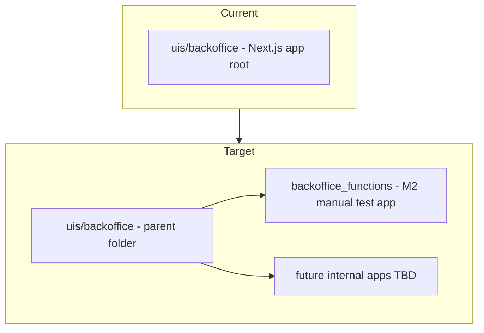

# Backoffice Functions Cleanup Plan

## Goal

Restructure the internal backoffice area so the existing M2 manual-test app lives at [`uis/backoffice/backoffice_functions/`](uis/backoffice/backoffice_functions/), while [`uis/backoffice/`](uis/backoffice/) remains as a parent folder for additional internal pages later. Restyle the moved app to align with the public landing page at [`uis/website/`](uis/website/).



---

## 1. Folder restructure (no behavior changes)

Move the **entire current Next.js app** one level down. Everything currently at `uis/backoffice/` (except new parent-level files) becomes `uis/backoffice/backoffice_functions/`:

| Move from | Move to |
|---|---|
| `app/`, `components/`, `hooks/`, `lib/` | `uis/backoffice/backoffice_functions/...` |
| `package.json`, `package-lock.json`, `tsconfig.json`, `next.config.ts`, etc. | same, under `backoffice_functions/` |
| `.gitignore`, `eslint.config.mjs`, `postcss.config.mjs` | same |

Add at parent level [`uis/backoffice/README.md`](uis/backoffice/README.md):
- Brief purpose: internal backoffice umbrella folder
- Lists `backoffice_functions/` as the M2 manual test dashboard
- Dev command: `cd uis/backoffice/backoffice_functions && npm run dev`

**Do not delete** `uis/backoffice/` — it becomes the container.

---

## 2. Config path fixes (required after nesting)

The app moves one directory deeper; repo-relative paths must shift from `../../` to `../../../`.

### [`uis/backoffice/backoffice_functions/tsconfig.json`](uis/backoffice/backoffice_functions/tsconfig.json)

- `@healthcore/src/*`: `../../../apps/src/*` (was `../../apps/src/*`)
- `include` apps glob: `../../../apps/src/**/*.ts`

### [`uis/backoffice/backoffice_functions/next.config.ts`](uis/backoffice/backoffice_functions/next.config.ts)

- `repoRoot`: `path.join(__dirname, "../../..")` (was `../..`)
- `@healthcore/src` alias unchanged in meaning, path updates automatically via `repoRoot`

### [`uis/backoffice/backoffice_functions/package.json`](uis/backoffice/backoffice_functions/package.json)

- Rename package: `healthcore-backoffice-functions`
- Scripts unchanged (still port **3001**)

### In-app path strings

- [`components/manual-test/how-to-run-panel.tsx`](uis/backoffice/components/manual-test/how-to-run-panel.tsx) → update to `cd uis/backoffice/backoffice_functions && npm run dev`

---

## 3. Styling alignment with `uis/website`

[`globals.css`](uis/website/app/globals.css) already defines the same CSS variables in both apps (`--hc-brand`, `--hc-brand-strong`, etc.). The gap is **component-level Tailwind classes**, not the token file.

### Website brand reference (source of truth)

From [`uis/website`](uis/website):

| Token / pattern | Website usage |
|---|---|
| Page background | `bg-slate-50` |
| Primary brand | `sky-700`, `sky-800`, `text-sky-800` |
| Hero gradient | `bg-gradient-to-r from-sky-900 to-teal-700` |
| Cards | `rounded-xl border border-slate-200 bg-white shadow-sm` |
| Section headings | `text-2xl font-bold text-slate-900` or `text-sky-800` |
| Primary CTA | `bg-sky-700 hover:bg-sky-800` |
| Focus rings | `outline-sky-700` |
| Font | `ui-sans-serif, system-ui` (already in globals) |
| Logo | [`HealthcoreLogo`](uis/website/components/layout/healthcore-logo.tsx) — sky/teal cross on `#0C4A6E` |

### Backoffice drift to fix (current)

| File | Current | Target |
|---|---|---|
| [`app/layout.tsx`](uis/backoffice/app/layout.tsx) | `bg-slate-100` | `bg-slate-50` (match website) |
| [`backoffice-header.tsx`](uis/backoffice/components/layout/backoffice-header.tsx) | `bg-slate-900`, `text-emerald-300` | Hero-style gradient `from-sky-900 to-teal-700`, white/sky-100 text, include `HealthcoreLogo` |
| [`action-bar.tsx`](uis/backoffice/components/manual-test/action-bar.tsx) | `bg-indigo-700` primary | `bg-sky-700 hover:bg-sky-800` |
| [`action-bar.tsx`](uis/backoffice/components/manual-test/action-bar.tsx) | `bg-slate-800` secondary | `bg-sky-900 hover:bg-sky-800` or outline sky variant |
| Section `h2` headings | `text-slate-900` | `text-sky-800 font-bold` for panel titles (match services section) |
| [`result-panel.tsx`](uis/backoffice/components/manual-test/result-panel.tsx) | `bg-slate-900` code block | `bg-sky-950` or `bg-sky-900` — keeps dark terminal feel but on-brand |
| [`manual-test-page.tsx`](uis/backoffice/components/manual-test-page.tsx) | `max-w-6xl` | `max-w-7xl` (match website content width) |

### New shared-internal chrome (copy, not cross-app import)

Copy into `backoffice_functions/components/layout/`:
- [`healthcore-logo.tsx`](uis/website/components/layout/healthcore-logo.tsx) — small, self-contained SVG

Refactor [`backoffice-header.tsx`](uis/backoffice/components/layout/backoffice-header.tsx) → internal header matching website visual language:

```
[Logo] HealthCore Digital
Milestone 2 Function Manual Test
(subtitle in text-sky-100)
```

Use the same gradient shell as [`hero-section.tsx`](uis/website/components/landing/hero-section.tsx) (`rounded-2xl`, `shadow-xl`), adapted for an internal page header (no CTA/image column).

**Out of scope:** bilingual i18n, public nav, portal footer — this is an internal tool; only visual brand alignment.

---

## 4. Documentation updates

Update path references from `uis/backoffice` (app root) to `uis/backoffice/backoffice_functions` (app) while noting `uis/backoffice` as parent:

| File | Change |
|---|---|
| [`memory-bank/progress.md`](memory-bank/progress.md) | M2 backoffice delivery path + verify command |
| [`memory-bank/techContext.md`](memory-bank/techContext.md) | Location, verify, import paths |
| [`memory-bank/decisions.md`](memory-bank/decisions.md) | Registry path `uis/backoffice/backoffice_functions/lib/` |
| [`docs/architecture_proposal.md`](docs/architecture_proposal.md) | Internal ops UI path (light touch) |
| Root [`README.md`](README.md) | Add backoffice_functions run instructions if/when a backoffice section exists |

---

## 5. Verification

```bash
cd uis/backoffice/backoffice_functions
npm run verify          # lint + webpack build
npm run dev             # confirm port 3001, page loads
```

Manual checks:
- Function selector, run, and JSON output still work (M2 `@healthcore/src/*` imports resolve)
- Visual pass: header gradient, sky buttons, slate-50 page bg, sky-800 section titles
- `how-to-run` panel shows correct new path

---

## 6. Risks

| Risk | Mitigation |
|---|---|
| Broken `@healthcore/src` imports after move | Update `tsconfig.json` + `next.config.ts` repo root depth |
| Stale docs referencing old path | Grep `uis/backoffice` and update app-specific references |
| `.next/` / `node_modules` left at old level | Move only source; reinstall in new location; do not commit build artifacts |

**Deferred:** extracting shared layout/components package across `uis/website` and `uis/backoffice`; other sibling apps under `uis/backoffice/` (user will add later).
