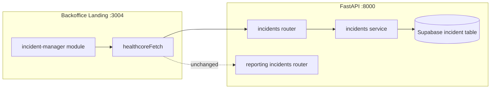
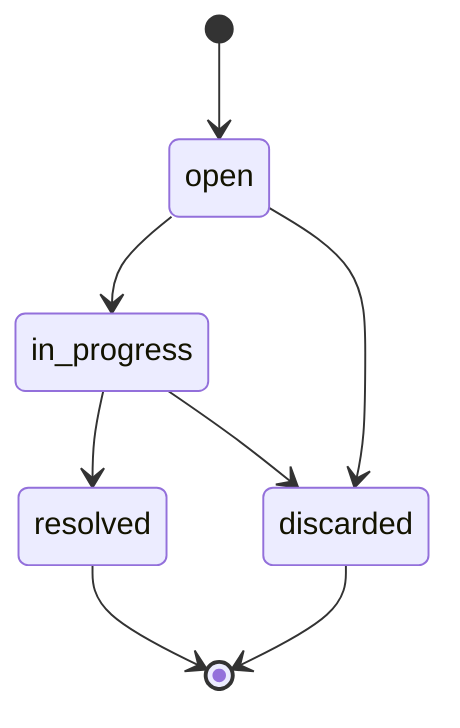

# Centralized Incident Manager — Implementation Plan

**Plan file:** [`memory-bank/references/centralized_incident_manager_ai_plan/centralized_incident_manager_implementation_plan.md`](centralized_incident_manager_implementation_plan.md)

**Requirements source:** [`centralized_incident_manager_specs.md`](centralized_incident_manager_specs.md)

**Milestone:** 5 extension — Centralized Incident Manager (backend + frontend)

**Branch:** `feature/milestone5` (extends delivered inventory work)

**Working directories:** `services/api/` (backend), `uis/backoffice/` (feature module + landing routes)

**Status:** **Delivered** on `feature/milestone5` — backend, seed, frontend, and post-spec enhancements complete (`99` pytest passing; `npm run verify` passes)

---

## Executive summary

Support staff **log and track patient incidents in the browser** instead of exporting CSV files for the Incident Analyzer. Delivered scope:

1. **Backend** — SQLModel `Incident` table on Supabase `milestone5_inventory`; **six** authenticated REST endpoints under `/api/v1/incidents/` with lifecycle rules, field validation, and plain-language errors.
2. **Seed** — Standalone `scripts/seed_incidents.py` loads **94** valid rows from plan-folder CSV (`origin = customer`), idempotent via DB `incident_id`; friendly re-run messaging.
3. **Frontend** — `uis/backoffice/incident-manager/` on landing `:3004`: hub, create form, **filterable sortable list** (with **Updated At**, **Actions**), summary dashboard, **view detail**, and **edit** pages.
4. **Hub UX** — Incident Analyzer tagged **"To be deprecated"**; Incident Manager tagged **"New"**.
5. **Timezone** — User-selectable timezone on list/detail/edit (persisted in `localStorage`), matching inventory pattern.

The **Incident Analyzer** (`POST /incidents/analyze`, `/incident-analyzer`) remains **unchanged**.

---

## Delivered functionality (spec + enhancements)

### Original spec (§15) — delivered

| Area | Delivered |
|------|-----------|
| Backend CRUD + summary | `POST/GET /incidents`, `GET /incidents/summary`, `GET /incidents/{id}`, `PATCH /incidents/{id}/status` |
| Validation messages | Spec §4.2–4.4 copy in `service.py` |
| Seed 94 rows | `scripts/seed_incidents.py` + `create_all` on first run |
| Frontend hub + 3 sub-pages | `/incident-manager`, `/new`, `/list`, `/summary` |
| Auth + build | JWT via `healthcoreFetch`; `npm run verify` green |

### Post-spec enhancements — delivered

| Enhancement | Implementation |
|-------------|----------------|
| **Hub deprecation badges** | `landing/lib/nav-apps.ts` — `tag` + `tagVariant`; `nav-card.tsx` renders amber **To be deprecated** (Analyzer) and teal **New** (Manager) |
| **Updated At column** | List table shows `updated_at` formatted with selected timezone |
| **Sortable columns** | Client-side sort on all data columns via `lib/sort-incidents.ts`, `hooks/use-incident-sort.ts`, `sortable-th.tsx` (stacked chevrons, centered headers) |
| **Category filter** | Fourth dropdown on list (stakeholder Q&A) |
| **View incident** | `GET /incidents/{id}` + `/incident-manager/[id]` + `incident-detail.tsx` |
| **Edit incident** | `PATCH /incidents/{id}` + `/incident-manager/[id]/edit` + `incident-edit-form.tsx` + `hooks/use-incident-edit.ts` |
| **Actions column** | `incident-row-actions.tsx` — View / Edit links on list |
| **Shared form fields** | `incident-form-fields.tsx` + `lib/form-styles.ts` reused by create and edit |
| **Timezone selection** | `lib/timezones.ts`, `incident-timezone-context.tsx`, `incident-timezone-bar.tsx`, `timezone-select.tsx` — bar on list, detail, edit; key `healthcore_incident_manager_timezone` |
| **Seed re-run UX** | Friendly message when already seeded (no repeated invalid-row breakdown) |
| **Merge error handling** | `feature/critical_error_handling` merged into `feature/milestone5` |

### API endpoints (final)

| Method | Path | Purpose |
|--------|------|---------|
| POST | `/api/v1/incidents` | Create (status defaults `open`) |
| GET | `/api/v1/incidents` | List; filters: `status`, `origin`, `branch`, `category` |
| GET | `/api/v1/incidents/summary` | Aggregated metrics |
| GET | `/api/v1/incidents/{id}` | Single incident |
| PATCH | `/api/v1/incidents/{id}` | **Update fields** (title, description, category, origin, branch); bumps `updated_at` |
| PATCH | `/api/v1/incidents/{id}/status` | Lifecycle status only |

### Frontend routes (final)

| Route | Page |
|-------|------|
| `/incident-manager` | Landing hub (3 nav cards) |
| `/incident-manager/new` | Create form |
| `/incident-manager/list` | Filterable, sortable table + inline status |
| `/incident-manager/summary` | Metrics dashboard |
| `/incident-manager/[id]` | View detail |
| `/incident-manager/[id]/edit` | Edit form (status changed on list only) |

---

## Spec vs codebase gap analysis (at delivery)

| Requirement area | Status at delivery |
|------------------|-------------------|
| Incident CRUD domain | **Delivered** — `app/domains/incidents/` |
| `Incident` SQLModel table | **Delivered** — `incident` table via `create_all` |
| REST endpoints | **Delivered** — 6 mgmt endpoints + 2 reporting endpoints unchanged |
| Global 500 handler | **Delivered** — merged from `feature/critical_error_handling` |
| Seed script | **Delivered** — `scripts/seed_incidents.py` |
| Frontend module | **Delivered** — `uis/backoffice/incident-manager/` (28+ files) |
| View / edit | **Delivered** — beyond original spec |
| Sortable list + timezone | **Delivered** — beyond original spec |
| Hub badges | **Delivered** — beyond original spec |

**No changes required (already delivered):**

- JWT auth (`get_current_user`), `healthcoreFetch`, `AuthGuard`, `(protected)/layout.tsx`
- Supabase dual-DB setup (`get_supabase_db`, `DATABASE_URL`, `create_all` on startup)
- Backoffice landing on port 3004, `npm run verify`
- Incident Analyzer module and reporting routes

---

## Planning decisions (locked)

Stakeholder answers recorded **2026-07-01**. All pre-build questions resolved.

| Topic | Decision |
|-------|----------|
| Domain path | **`app/domains/incidents/`** per spec — distinct from `reporting/incidents` (analyze-only) |
| Router namespace | **Same prefix `/incidents`** on a second router; FastAPI merges routes. Register **`GET /summary` before `GET /{id}`**. Analyze routes (`/analyze`, `/results/export`) unchanged |
| Router auth | Include new router with `dependencies=[Depends(get_current_user)]` in `api/v1/router.py` (same as existing incidents router) |
| DB | Reuse **`milestone5_inventory`** Supabase project and `get_supabase_db()` — no new Supabase project |
| Table creation | `SQLModel.metadata.create_all(supabase_engine)` on startup — import `incident` models in `main.py` alongside inventory |
| Domain layout | **Spec layout:** `models.py`, `schemas.py`, `service.py`, `router.py`, `constants.py` — business logic in `service.py` (richer than flat inventory router) |
| Valid branches | **12 clinic codes + `"Central"`** in `constants.py`; seed CSV rows use clinic codes only (no `Central` in historical data) |
| Status in API | Lowercase: `open`, `in_progress`, `resolved`, `discarded`; new incidents default `open` |
| CSV status mapping | `OPEN`→`open`, `CLOSED`→`resolved`, `DISCARDED`→`discarded`; no `in_progress` in seed data |
| Seed origin | All seeded rows: **`origin = "customer"`** |
| Title generation (seed) | `"{category} incident at {clinic_id}"` per spec §16 |
| PHI | Never store or expose `patient_id`; seed skips rows failing `validate_record()` (includes missing patient_id rule) |
| Seed trigger | **Standalone only** — `scripts/seed_incidents.py`; **not** wired into `uv run seed` |
| Seed idempotency key | CSV column **`incident_id`** (e.g. `HC-000001`) — DB column **`incident_id: str \| None`**, unique index, nullable; populated **only during seed**; excluded from API request/response schemas (auto-increment `id` remains the API primary key) |
| CSV file path | **`memory-bank/references/centralized_incident_manager_ai_plan/incidents-healthcore.csv`** — hardcoded default in seed script (resolve relative to repo root) |
| Shared constants | **`constants.py`** mirrors `analysis_core` enums; seed imports `validate_record` from `analysis_core` directly (same `sys.path` pattern as reporting service) — no `packages/shared/` extract in v1 |
| Global exception handler | **Merge from `feature/critical_error_handling`** — handler + `tests/test_error_handling.py` + UTF-8 decode fix in reporting service; **do not re-implement** on incident manager branch. Message on that branch: `"An unexpected error occurred."` (spec §4.1 says `"Please try again later."` — align copy during merge if stakeholders want exact spec wording) |
| Validation errors | Custom validation in `service.py` raising `HTTPException(400, detail=...)` with **exact spec strings**; avoid relying on default Pydantic messages for enum fields |
| `updated_at` | Set both timestamps on create; bump `updated_at` on status PATCH only (no full PUT in spec) |
| Test database | **In-memory SQLite** + `dependency_overrides[get_supabase_db]` — import both inventory and incident models in test fixture; pattern from `tests/test_inventory.py` |
| Frontend layout | **ToolToolbar only** in `incident-manager/layout.tsx` — footer from root `ConditionalLandingFooter` (inventory precedent) |
| Hub nav position | **Immediately after Incident Analyzer** in `NAV_APPS` |
| Component size | **≤80 lines** per component/hook file — split list table, form, status controls into hooks + sub-components (inventory precedent) |
| API access | All calls through `incidents-api.ts` — no direct `fetch` / `healthcoreFetch` in components |
| List filters (UI) | **Status, origin, branch, and category** — all four dropdowns; category included per stakeholder |
| Summary API shape | **`by_status`**, **`by_category`**, **`by_origin`**: always return **all fixed enum keys with `0`** when empty. **`by_branch`**: return only branches with count **> 0** (dynamic keys). Frontend summary mirrors same rules |
| Date display | User-selected timezone via `IncidentTimezoneProvider`; default `America/New_York`; `formatIncidentDate(iso, timeZone)` |
| Hub nav badges | Analyzer: **To be deprecated** (amber); Manager: **New** (teal); optional `tag` / `tagVariant` on `NavApp` |
| List table UX | Centered sortable headers; columns: title, category, status, origin, branch, created at, updated at, actions |
| View / edit | `PATCH /incidents/{id}` for fields; status edits remain list-only via lifecycle endpoint |
| Field update `updated_at` | Bumped on `PATCH /incidents/{id}` and `PATCH /incidents/{id}/status` |
| Protected code | Did not modify `healthcore-api.ts`, auth guard, incident analyzer, or other feature modules (except `nav-card.tsx` + `nav-apps.ts` for hub tags) |
| Implementation gate | **Closed** — delivered July 2026 |

---

## Stakeholder Q&A (resolved 2026-07-01)

| # | Question | Answer |
|---|----------|--------|
| 1 | Seed idempotency | Use CSV **`incident_id`** (`HC-000nnn`); API uses auto-increment **`id`**; persist DB **`incident_id`** for seed dedupe only |
| 2 | CSV path | `memory-bank/references/centralized_incident_manager_ai_plan/incidents-healthcore.csv` |
| 3 | Seed integration | Standalone `seed_incidents.py` only |
| 4 | Global 500 handler | Already on **`feature/critical_error_handling`** — merge, don't duplicate |
| 5 | Category filter UI | **Yes** — include category dropdown on list page |
| 6 | Summary key shape | **Recommendation adopted:** zero-filled fixed enums; dynamic `by_branch` only |

---

## CSV → database mapping

**Source file:** `memory-bank/references/centralized_incident_manager_ai_plan/incidents-healthcore.csv`  
**Encoding:** UTF-8, comma-separated — 100 data rows + 1 header row  
**Expected result:** 94 rows inserted, 6 skipped (invalid per `analysis_core.validate_record()`)

### Column mapping (CSV → `incident` table)

| CSV column | `Incident` field | Transform | Stored? |
|------------|------------------|-----------|---------|
| `incident_id` | `incident_id` | Copy as-is (e.g. `HC-000001`) | Yes — seed dedupe only; **excluded from API schemas** |
| `date` | `created_at` | Parse `YYYY-MM-DD` → datetime at **00:00:00 UTC** | Yes |
| — | `updated_at` | Set equal to `created_at` on insert | Yes |
| — | `id` | Auto-increment integer PK | Yes — API primary key |
| — | `title` | **Generate:** `"{category} incident at {clinic_id}"` | Yes |
| `description` | `description` | Copy as-is | Yes |
| `category` | `category` | Copy as-is (must be one of 5 valid categories) | Yes |
| `status` | `status` | **Map:** `OPEN`→`open`, `CLOSED`→`resolved`, `DISCARDED`→`discarded` | Yes |
| — | `origin` | **Hardcode:** `"customer"` for all seeded rows | Yes |
| `clinic_id` | `branch` | Rename — copy clinic code (e.g. `US-TX-02`) | Yes |
| `country` | — | Used in `validate_record()` only (clinic/country mismatch) | **No** |
| `patient_id` | — | Used in `validate_record()` only | **No** — never store (PHI) |
| `satisfaction_score` | — | Used in `validate_record()` only (closed-no-score rule) | **No** |

### Status mapping

| CSV `status` | DB `status` |
|--------------|-------------|
| `OPEN` | `open` |
| `CLOSED` | `resolved` |
| `DISCARDED` | `discarded` |

No `in_progress` values exist in the CSV.

### Title generation (CSV has no `title` column)

```text
{category} incident at {clinic_id}
```

**Example:** `ADMINISTRATIVE` + `US-TX-02` → `"ADMINISTRATIVE incident at US-TX-02"`

### Idempotency

Before insert, query for existing row where `incident_id` = CSV `incident_id`. If found, skip (count as duplicate). Second seed run → 0 new inserts.

### Invalid rows (skipped — 6 of 100)

These rows are **intentionally invalid** in `incidents-healthcore.csv` so the Incident Analyzer and seed script can exercise validation. The seed script calls `analysis_core.validate_record()` (same rules as `POST /incidents/analyze`). Invalid rows are **never inserted**; `patient_id` is never stored even when present.

**Validation source:** `uis/incident_analyzer/analysis_core.py` — `validate_record()` and `RULE_LABELS`.

| CSV `incident_id` | `analysis_core` rule | Console label (seed breakdown) | Offending field(s) | Reason skipped |
|-------------------|----------------------|--------------------------------|--------------------|----------------|
| `HC-000041` | `invalid_clinic_id` | Invalid or missing clinic_id | `clinic_id = "XX-INVALID"` | Not one of the 12 valid clinic codes in `VALID_CLINICS` |
| `HC-000043` | `country_clinic_mismatch` | Country/clinic mismatch | `clinic_id = "UK-LON-01"`, `country = "US"` | `UK-LON-01` maps to `UK` in `VALID_CLINICS`, not `US` |
| `HC-000058` | `invalid_category` | Invalid or missing category | `category` is empty | Must be one of: `APPOINTMENT`, `BILLING`, `CLINICAL_CARE`, `ACCESSIBILITY`, `ADMINISTRATIVE` |
| `HC-000063` | `empty_description` | Empty description | `description` is empty | Description must be at least 5 characters |
| `HC-000079` | `missing_patient_id` | Missing patient_id | `patient_id` is empty | Must match `PAT-######` (required for CSV/analyzer validation; **not** stored in Incident Manager) |
| `HC-000085` | `closed_no_score` | Closed case, no score | `status = "CLOSED"`, `satisfaction_score` empty | Closed CSV rows must include a satisfaction score for analyzer rules |

**CSV excerpts (invalid fields highlighted):**

```text
HC-000041  clinic_id=XX-INVALID     country=US   category=APPOINTMENT     …
HC-000043  clinic_id=UK-LON-01      country=US   category=BILLING         …
HC-000058  clinic_id=US-FL-02       country=US   category=(empty)         …
HC-000063  clinic_id=US-GA-01       country=US   category=ACCESSIBILITY   description=(empty)
HC-000079  clinic_id=UK-MAN-01      country=UK   category=ADMINISTRATIVE  patient_id=(empty)
HC-000085  clinic_id=US-TX-02       country=US   category=CLINICAL_CARE   status=CLOSED  satisfaction_score=(empty)
```

**Seed script behavior:**

- First run: inserts **94** valid rows; prints invalid-row breakdown by rule label (no PHI).
- Re-run (already seeded): prints `Incident seed already applied — 94 incident(s) in database, 0 new inserts.` and notes that 6 CSV rows are excluded by validation — does **not** repeat the per-rule breakdown.

**Why the Incident Manager still enforces analyzer rules on seed:** Keeps parity with Incident Analyzer counts (100 total → 94 valid) and avoids loading corrupt reference data into the operational incident table.

### Browser-created incidents (no CSV)

Staff use the create form; all fields supplied directly. `incident_id` remains `NULL` (only historical seed rows get `HC-000nnn` values).

---

## Architecture

### Request flow



### URL map (no conflicts)

| Method | Path | Handler | Notes |
|--------|------|---------|-------|
| POST | `/api/v1/incidents/analyze` | reporting | Unchanged |
| GET | `/api/v1/incidents/results/export` | reporting | Unchanged |
| POST | `/api/v1/incidents` | **new** | Create |
| GET | `/api/v1/incidents` | **new** | List + filters |
| GET | `/api/v1/incidents/summary` | **new** | **Register before `{id}`** |
| GET | `/api/v1/incidents/{id}` | **new** | Detail |
| PATCH | `/api/v1/incidents/{id}/status` | **new** | Lifecycle status update |
| PATCH | `/api/v1/incidents/{id}` | **new** | Field update (post-spec) |

### Lifecycle state machine



---

## Implementation steps

### Step 0 — Preconditions

- [x] Stakeholder approval to begin implementation
- [x] Merge **`feature/critical_error_handling`** into `feature/milestone5`
- [x] `DATABASE_URL` configured; `uv sync`; `npm install`
- [x] Backend and landing smoke OK

---

### Step 1 — Backend constants, models, schemas

**Create** `services/api/app/domains/incidents/`:

#### `constants.py`

- `VALID_CATEGORIES`, `VALID_STATUSES`, `VALID_ORIGINS`, `VALID_BRANCHES` (12 clinics + `Central`)
- `STATUS_TRANSITIONS: dict[str, frozenset[str]]`
- `CSV_STATUS_MAP` for seed: `OPEN`/`CLOSED`/`DISCARDED` → API statuses
- Mirror `analysis_core.VALID_CLINICS` for the 12 codes; `Central` is API-only (not in CSV validation)

#### `models.py`

```python
class Incident(SQLModel, table=True):
    __tablename__ = "incident"
    id: int | None = Field(default=None, primary_key=True)
    title: str
    description: str
    category: str
    status: str = "open"
    origin: str
    branch: str
    incident_id: str | None = Field(default=None, unique=True, index=True)  # seed-only; CSV HC-000nnn
    created_at: datetime
    updated_at: datetime
```

- **`id`** — auto-increment API primary key (never supplied by client).
- **`incident_id`** — populated only by seed from CSV `incident_id`; used for idempotent re-runs; **omitted from `IncidentRead` / `IncidentCreate`** schemas.

#### `schemas.py`

- `IncidentCreate` / `IncidentUpdate` — title, description, category, origin, branch
- `IncidentRead` — full response model
- `StatusUpdate` — `{ status: str }`
- `IncidentSummary` — `by_status`, `by_category`, `by_origin`, `by_branch` dicts

Use Pydantic field validators only for structural checks; **enum messages** should come from `service.py` to match spec strings exactly.

---

### Step 2 — Service layer

**Create** `service.py` with:

| Function | Responsibility |
|----------|----------------|
| `validate_create_fields(...)` | Required/non-empty title & description; enum checks with spec `detail` strings |
| `validate_status_value(status)` | Enum check for PATCH body |
| `validate_transition(current, requested)` | Lifecycle rules; spec messages for final state vs invalid path |
| `create_incident(session, body)` | Set `status=open`, timestamps UTC now |
| `list_incidents(session, filters)` | Optional `status`, `origin`, `branch`, `category` query filters |
| `get_incident_or_404(session, id)` | 404 `"Incident not found."` |
| `update_status(session, id, new_status)` | Lifecycle transition check + `updated_at` bump |
| `update_incident(session, id, body)` | Field update + `updated_at` bump (post-spec) |
| `build_summary(session)` | Aggregate counts; **zero-fill** all keys in `by_status`, `by_category`, `by_origin`; **`by_branch` only keys with count > 0** |

**Transition error examples (must match spec):**

- `"Cannot transition from 'resolved' to 'open'. Resolved is a final state."`
- `"Cannot transition from 'open' to 'resolved'. Valid transitions: in_progress, discarded."`

---

### Step 3 — Router

**Create** `router.py`:

```python
router = APIRouter(prefix="/incidents", tags=["incident-management"])
```

**Route order (critical):**

1. `POST ""`
2. `GET ""`
3. `GET "/summary"`
4. `GET "/{incident_id}"`
5. `PATCH "/{incident_pk}/status"` — lifecycle
6. `PATCH "/{incident_pk}"` — field update (register after `/status`)

Inject `Session = Depends(get_supabase_db)` and `get_current_user` on all routes (or rely on router-level dependency from `api/v1/router.py`).

---

### Step 4 — Wiring (merge error handling first)

**Prerequisite:** Merge `feature/critical_error_handling` into the working branch before wiring incident routes. That branch already delivers:

- `app.exception_handler(Exception)` in `services/api/app/main.py` with server-side `logger.exception(...)` and client-safe `{"detail": "An unexpected error occurred."}`
- `tests/test_error_handling.py` — generic 500 + non-UTF-8 CSV 400
- UTF-8 decode guard in `reporting/incidents/service.py`

**Do not** add a second handler during incident manager work. If spec-exact 500 copy is required (`"Please try again later."`), change the message once on the merged handler.

#### `app/api/v1/router.py`

```python
from app.domains.incidents.router import router as incidents_mgmt_router

api_v1_router.include_router(incidents_mgmt_router, dependencies=[Depends(get_current_user)])
```

Keep existing `incidents_router` (reporting) include unchanged.

#### `app/main.py`

```python
from app.domains.incidents import models as incident_models  # noqa: F401
```

(Global exception handler comes from merged `feature/critical_error_handling` — no additional change here unless aligning 500 message copy.)

---

### Step 5 — Seed script

**Create** `scripts/seed_incidents.py`:

1. Resolve CSV: `memory-bank/references/centralized_incident_manager_ai_plan/incidents-healthcore.csv` (relative to repo root)
2. Add repo root + `uis/incident_analyzer` to `sys.path`; import `analysis_core`
3. For each row:
   - Run `validate_record(row)` — skip if violations; tally by rule label (no PHI in logs)
   - **Idempotency:** skip if DB `incident_id` (= CSV `incident_id`) already exists
   - Map fields per **CSV → database mapping** section above
4. Print summary: inserted, skipped (duplicate), skipped (invalid) with rule counts

**Run:**

```bash
cd services/api && uv run python ../../scripts/seed_incidents.py
```

**Expected:** 94 inserted, 6 invalid skipped, 0 duplicates on second run.

---

### Step 6 — Backend tests

**Create** `tests/test_incidents_mgmt.py`:

| Test case | Assert |
|-----------|--------|
| POST valid incident | 201, `status=open`, timestamps present |
| POST missing title | 400 `"Title is required."` |
| POST empty description | 400 `"Description cannot be empty."` |
| POST invalid category | 400 with full enum list in message |
| POST invalid branch | 400 branch message |
| GET list empty DB | 200 `[]` |
| GET list with filters | Query params narrow results |
| GET summary empty | 200 all zeros |
| GET unknown id | 404 `"Incident not found."` |
| PATCH valid transition | 200, updated status + `updated_at` |
| PATCH final state | 400 final-state message |
| PATCH invalid path | 400 with valid transitions list |
| PATCH incident fields | 200, updated title + `updated_at` |
| Unauthenticated | 401 |

Use SQLite fixture; register **incident** models in `SQLModel.metadata.create_all`.

**Run:** `cd services/api && uv run pytest tests/test_incidents_mgmt.py -v`

---

### Step 7 — Frontend scaffold and config

#### Create module skeleton

```
uis/backoffice/incident-manager/
├── lib/
│   ├── incidents-api.ts       # create, list, get, update, updateStatus, summary
│   ├── constants.ts
│   ├── format.ts              # parseApiDateTime, formatIncidentDate(timezone)
│   ├── form-styles.ts
│   ├── sort-incidents.ts
│   └── timezones.ts
├── components/
│   ├── incident-landing.tsx
│   ├── incident-form.tsx
│   ├── incident-form-fields.tsx
│   ├── incident-edit-form.tsx
│   ├── incident-detail.tsx
│   ├── incident-list.tsx
│   ├── incident-list-table.tsx
│   ├── incident-list-filters.tsx
│   ├── incident-row-actions.tsx
│   ├── incident-status-cell.tsx
│   ├── incident-status-badge.tsx
│   ├── incident-summary.tsx
│   ├── summary-section.tsx
│   ├── sortable-th.tsx
│   ├── timezone-select.tsx
│   ├── incident-timezone-context.tsx
│   ├── incident-timezone-bar.tsx
│   ├── incident-layout-shell.tsx
│   ├── incident-nav-cards.tsx
│   ├── incident-page-header.tsx
│   └── status-banner.tsx
├── hooks/
│   ├── use-incident-list.ts
│   ├── use-incident-form.ts
│   ├── use-incident-edit.ts
│   ├── use-incident-detail.ts
│   └── use-incident-sort.ts
└── types/
    └── incidents.ts
```

#### `landing/next.config.ts`

```ts
const incidentManager = path.join(landingDir, "../incident-manager");
// featureAliases:
"@backoffice/incident-manager": incidentManager,
```

#### `landing/app/globals.css`

```css
@source "../../incident-manager/**/*";
```

#### `landing/lib/nav-apps.ts`

Insert after Incident Analyzer:

```ts
{
  title: "Incident Manager",
  description: "Log, track, and manage patient incidents across all clinics",
  url: "/incident-manager",
  protected: true,
  tag: "New",
  tagVariant: "new",
},
// Incident Analyzer entry also has tag: "To be deprecated", tagVariant: "deprecated"
```

---

### Step 8 — Frontend API layer and types

#### `types/incidents.ts`

Match spec §13.1 (`Incident`, `IncidentCreate`, `StatusUpdate`, `IncidentSummary`).

#### `lib/constants.ts`

Branches (with display labels), categories, origins, statuses, `STATUS_TRANSITIONS`, badge class map.

#### `lib/incidents-api.ts`

- `incidentFetch<T>` — wrap `healthcoreFetch`, parse `detail` on error (same pattern as `inventory-api.ts`)
- `createIncident`, `listIncidents`, `getIncident`, `updateIncident`, `updateIncidentStatus`, `getIncidentSummary`

---

### Step 9 — Frontend components and routes

#### Layout — `landing/app/(protected)/incident-manager/layout.tsx`

`ToolToolbar` + optional thin shell wrapper (mirror inventory).

#### Routes (thin `page.tsx` files)

| Route | Component |
|-------|-----------|
| `/incident-manager` | `incident-landing.tsx` — hero + 3 nav cards |
| `/incident-manager/new` | `incident-form.tsx` |
| `/incident-manager/list` | `incident-list.tsx` |
| `/incident-manager/summary` | `incident-summary.tsx` |
| `/incident-manager/[id]` | `incident-detail.tsx` |
| `/incident-manager/[id]/edit` | `incident-edit-form.tsx` |

#### Component behaviors (spec §12.3–12.6 + enhancements)

**incident-form.tsx / incident-edit-form.tsx**

- Shared `incident-form-fields.tsx`; branch highlight when `origin === "branch"`
- Create: clears form on success; edit: loads via `getIncident`, saves via `updateIncident`
- Loading/success/error banners

**incident-list.tsx**

- Filters: status, origin, branch, category → query params
- Table: title, category, status (badge + inline transition), origin, branch, **created at**, **updated at**, **actions**
- **Client-side sort** on all data columns (default: created at desc)
- **Centered** sortable headers with stacked chevron indicators
- View / Edit links in actions column
- Empty state, error + retry

**incident-detail.tsx**

- Read-only all fields + status badge + formatted timestamps
- Link to edit page; timezone bar when viewing

**incident-summary.tsx**

- Four metric sections with progress bars (spec §14)

**incident-timezone-bar.tsx**

- Shown on `/incident-manager/list`, `/incident-manager/{id}`, `/incident-manager/{id}/edit`
- Persists to `healthcore_incident_manager_timezone`

**landing/lib/nav-apps.ts + nav-card.tsx**

- Optional `tag` / `tagVariant` for hub cards (new / deprecated)

---

### Step 10 — Verification and docs

#### Automated

```bash
cd services/api && uv run pytest
cd services/api && uv run python ../scripts/seed_incidents.py   # twice — second run 0 inserts
cd uis/backoffice/landing && npm run verify
```

#### Manual smoke (logged in on :3004)

1. Hub shows **Incident Manager** (New) and **Incident Analyzer** (To be deprecated)
2. `/incident-manager/new` — create incident → appears in list
3. `/incident-manager/list` — filters, sort, timezone, status transition, view/edit links
4. `/incident-manager/{id}` — detail view; `/incident-manager/{id}/edit` — save changes
5. `/incident-manager/summary` — counts match seeded data (94 customer-origin)
6. `/incident-analyzer` — CSV upload still works (regression)
7. Seed re-run — friendly already-applied message
8. Logout → `/incident-manager` redirects to login

#### Memory-bank (after verify)

- Update `memory-bank/progress.md` — new subsection under Milestone 5
- Update `memory-bank/decisions.md` — seed idempotency, router coexistence, global handler scope

---

## File change summary

### New files

| Path | Purpose |
|------|---------|
| `services/api/app/domains/incidents/__init__.py` | Package |
| `services/api/app/domains/incidents/constants.py` | Enums + transitions |
| `services/api/app/domains/incidents/models.py` | SQLModel table |
| `services/api/app/domains/incidents/schemas.py` | Request/response DTOs |
| `services/api/app/domains/incidents/service.py` | Validation + lifecycle + summary |
| `services/api/app/domains/incidents/router.py` | Six endpoints |
| `scripts/seed_incidents.py` | CSV seed + `create_all` |
| `services/api/tests/test_incidents_mgmt.py` | 15 pytest cases |
| `uis/backoffice/incident-manager/**` | Full feature module (see Step 7 tree) |
| `uis/backoffice/landing/app/(protected)/incident-manager/**` | Routes including `[id]` and `[id]/edit` |

### Modified files

| Path | Change |
|------|--------|
| `services/api/app/api/v1/router.py` | Include incidents mgmt router |
| `services/api/app/main.py` | Import incident models; global 500 handler |
| `uis/backoffice/landing/next.config.ts` | `@backoffice/incident-manager` alias |
| `uis/backoffice/landing/app/globals.css` | Tailwind `@source` |
| `uis/backoffice/landing/lib/nav-apps.ts` | Nav cards + deprecation tags |
| `uis/backoffice/landing/components/landing/nav-card.tsx` | `tag` / `tagVariant` rendering |

### Do not modify

- `uis/incident_analyzer/**`
- `services/api/app/domains/reporting/incidents/**`
- `uis/backoffice/shared/lib/healthcore-api.ts`
- `uis/backoffice/landing/components/auth/**`
- Other feature modules (inventory, supplier-directory, talent-tracker, backoffice_functions)

---

## Acceptance checklist (final)

### Backend
- [x] `Incident` SQLModel with `incident_id` seed column
- [x] Six API endpoints including `PATCH /incidents/{id}`
- [x] Lifecycle + validation messages per spec
- [x] Summary zero-fill for fixed enums
- [x] Seed: 94 inserted, 6 invalid skipped, idempotent re-run
- [x] `test_incidents_mgmt.py` — 15 cases; full suite 99 passed

### Frontend
- [x] Hub, create, list, summary routes
- [x] View (`/[id]`) and edit (`/[id]/edit`) routes
- [x] List: category filter, updated at, sortable columns, actions column
- [x] Timezone selector on date-display pages
- [x] Hub badges: New / To be deprecated
- [x] `npm run verify` passes

### Regression
- [x] Incident Analyzer unchanged and functional

---

## Acceptance checklist mapping (spec §15)

| Spec section | Verified by |
|--------------|-------------|
| Backend data model | Step 1 + pytest |
| API endpoints | Step 3 + `test_incidents_mgmt.py` |
| Seed script | Step 5 + double-run idempotency |
| Frontend config | Step 7 + `npm run verify` |
| API layer | Step 8 — grep: no `healthcoreFetch` in components |
| Landing / form / list / summary | Step 9 manual smoke |
| Auth & build | `npm run verify`; unauthenticated redirect |
| Regression | Incident Analyzer smoke in Step 10 |

---

## Risk register

| Risk | Mitigation |
|------|------------|
| Route shadowing (`summary` vs `{id}`) | Strict route registration order; add test for `GET /incidents/summary` |
| Pydantic default 422 vs spec 400 messages | Validate enums in service layer; return `HTTPException(400, ...)` |
| `get_supabase_db` when `DATABASE_URL` empty | Dev must set `.env`; tests use SQLite override only |
| Component file size | Split early into hooks (`use-incident-list.ts`, `use-incident-form.ts`) |
| Seed path drift | Hardcode plan-folder CSV path relative to repo root |
| Global 500 handler | Merge `feature/critical_error_handling`; handler logs via `logger.exception` before safe JSON |
| DB `incident_id` vs API `id` | Document in decisions.md; exclude DB `incident_id` from public API schemas; user-created incidents leave `incident_id` `NULL` |

---

## Estimated sequencing

| Phase | Steps | Depends on |
|-------|-------|------------|
| Backend core | 1–4 | Step 0 |
| Seed + tests | 5–6 | Step 4 |
| Frontend | 7–9 | Backend running (can mock API for parallel UI if needed) |
| Verify + docs | 10 | All above |

**Suggested order:** Backend 1→4, then tests (6) in parallel with seed (5), then frontend 7→9, then full verify (10).
