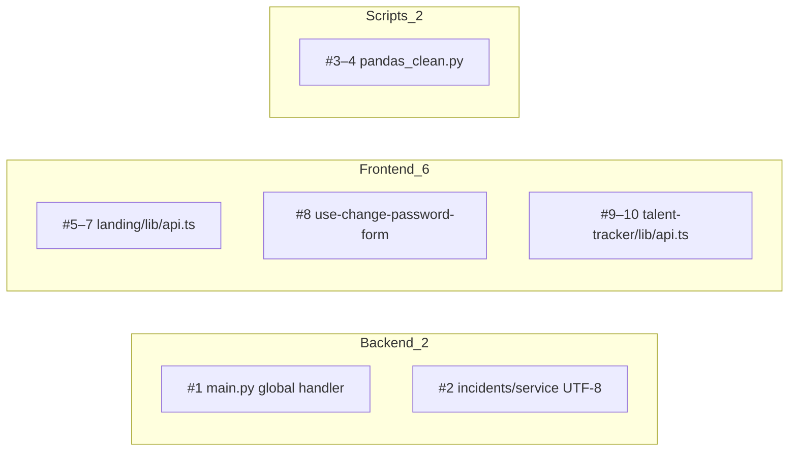

# Error Handling — Critical Implementation Plan

**Plan file:** [`memory-bank/references/error_handling_test/error_handling_IMPLEMENTATION_PLAN.md`](error_handling_IMPLEMENTATION_PLAN.md)

**Requirements source:** [`error_handling_specs.md`](error_handling_specs.md) — **CRITICAL findings only (#1–#10)**

**Milestone type:** Resilience hardening (not a feature build)

**Out of scope for this phase:** HIGH (#11–#31), MEDIUM (#32–#60), LOW (#61–#71), shared component extraction, `healthcore-api.ts` (#54), `analyze.py` script changes, landing UI polish beyond what #8 requires.

**Git branch:** All implementation commits go on `feature/critical_error_handling`, branched from `main`.

---

## Git workflow (mandatory)

All code changes for this plan must be made on **`feature/critical_error_handling`**, created from an up-to-date **`main`**. Do not commit directly to `main`.

### Before any implementation

```bash
git fetch origin
git checkout main
git pull origin main
git checkout -b feature/critical_error_handling
```

If the branch already exists locally:

```bash
git fetch origin
git checkout feature/critical_error_handling
git rebase origin/main   # only if main has moved ahead; resolve conflicts before continuing
```

### During and after implementation

- Keep all critical-fix commits on `feature/critical_error_handling`.
- Run verification (Phase 4) on this branch before opening a PR.
- PR target branch: **`main`**.
- Do not push or open a PR unless explicitly requested by the developer.

---

## Executive summary

The specs audit lists **71 findings**. This plan addresses only the **10 CRITICAL** items — failures that leak internals to clients, crash scripts with full tracebacks, or leave the UI permanently stuck.

| Layer | Critical count | Files touched |
|-------|----------------|---------------|
| Backend | 2 (#1–#2) | 2 |
| Frontend | 6 (#5–#10) | 3 |
| Scripts | 2 (#3–#4) | 1 |
| **Total** | **10** | **6** |



---

## Critical findings matrix

| # | Layer | File | Problem | Required fix |
|---|-------|------|---------|--------------|
| 1 | Backend | [`services/api/app/main.py`](../../../services/api/app/main.py) | Unhandled exceptions return FastAPI default 500 with traceback/paths in debug | Register `@app.exception_handler(Exception)` → `500` + `{"detail": "An unexpected error occurred."}`; log server-side |
| 2 | Backend | [`services/api/app/domains/reporting/incidents/service.py`](../../../services/api/app/domains/reporting/incidents/service.py) | `content.decode("utf-8")` uncaught → raw `UnicodeDecodeError` | try/except `UnicodeDecodeError` → `ValueError("File is not valid UTF-8 text.")` |
| 3 | Scripts | [`skills/data-analysis/scripts/pandas_clean.py`](../../../skills/data-analysis/scripts/pandas_clean.py) | Top-level `pd.read_csv` — no handling, validation, or exit codes | Refactor to `main()` + `sys.exit(main())`; validate file exists before read |
| 4 | Scripts | [`skills/data-analysis/scripts/pandas_clean.py`](../../../skills/data-analysis/scripts/pandas_clean.py) | CSV parse errors uncaught | Catch `pd.errors.ParserError`, `pd.errors.EmptyDataError`; stderr message; exit `1` |
| 5 | Frontend | [`uis/backoffice/landing/lib/api.ts`](../../../uis/backoffice/landing/lib/api.ts) | `apiFetch` — raw `TypeError: Failed to fetch` | Wrap `fetch` in try/catch; throw/rethrow with fixed user message |
| 6 | Frontend | [`uis/backoffice/landing/lib/api.ts`](../../../uis/backoffice/landing/lib/api.ts) | `fetchCurrentUser` — raw network error to AuthGuard/session | try/catch; return `null` on network failure |
| 7 | Frontend | [`uis/backoffice/landing/lib/api.ts`](../../../uis/backoffice/landing/lib/api.ts) | `verifyCredentials` — raw network error | try/catch; return `"error"` on network failure |
| 8 | Frontend | [`uis/backoffice/landing/hooks/use-change-password-form.ts`](../../../uis/backoffice/landing/hooks/use-change-password-form.ts) | `verifyCredentials` outside try/catch; `submitting` stuck `true` on throw | Move credential verify + password update into one try/catch/**finally** |
| 9 | Frontend | [`uis/backoffice/talent-tracker/lib/api.ts`](../../../uis/backoffice/talent-tracker/lib/api.ts) | `requestJson` / `requestVoid` — raw network errors | Wrap `fetch` in try/catch; user-friendly error message |
| 10 | Frontend | [`uis/backoffice/talent-tracker/lib/api.ts`](../../../uis/backoffice/talent-tracker/lib/api.ts) | `readResponse` throws raw `response.text()` | Parse JSON `detail` when possible; else generic message — never surface HTML/tracebacks |

---

## Phase 1 — Backend (findings #1–#2)

### 1.1 Global exception handler — #1

**File:** [`services/api/app/main.py`](../../../services/api/app/main.py)

Add after app creation:

```python
import logging
from fastapi import Request
from fastapi.responses import JSONResponse

logger = logging.getLogger(__name__)

@app.exception_handler(Exception)
async def global_exception_handler(request: Request, exc: Exception) -> JSONResponse:
    logger.exception("Unhandled exception on %s %s", request.method, request.url.path)
    return JSONResponse(
        status_code=500,
        content={"detail": "An unexpected error occurred."},
    )
```

**Test:** Add `tests/test_error_handling.py` — register a throwaway route or patch a dependency to raise; assert `500`, body `detail` is generic, no traceback string in response.

### 1.2 UTF-8 decode guard — #2

**File:** [`services/api/app/domains/reporting/incidents/service.py`](../../../services/api/app/domains/reporting/incidents/service.py) (~line 36)

Replace bare `content.decode("utf-8")` with:

```python
try:
    text = content.decode("utf-8")
except UnicodeDecodeError as exc:
    raise ValueError("File is not valid UTF-8 text.") from exc
buffer = StringIO(text)
```

Existing router `except ValueError` path will map this to HTTP 400 (router hardening is HIGH #11–#12 — not in this phase).

**Test:** Extend [`services/api/tests/test_incidents.py`](../../../services/api/tests/test_incidents.py) — upload non-UTF-8 bytes as CSV → `400`, safe `detail`, no traceback.

---

## Phase 2 — Frontend (findings #5–#10)

### 2.1 Landing API client — #5, #6, #7

**File:** [`uis/backoffice/landing/lib/api.ts`](../../../uis/backoffice/landing/lib/api.ts)

Add a local constant and helper (no shared package required for this phase):

```ts
const NETWORK_ERROR_MESSAGE =
  "Unable to connect. Please check your connection and try again.";

function isNetworkFailure(error: unknown): boolean {
  return error instanceof TypeError && error.message.includes("fetch");
}
```

| Function | Change |
|----------|--------|
| `apiFetch` | try/catch around `fetch`; on network failure throw `new Error(NETWORK_ERROR_MESSAGE)` |
| `fetchCurrentUser` | try/catch; return `null` on network failure (preserve 401 → `null` behavior) |
| `verifyCredentials` | try/catch; return `"error"` on network failure |

### 2.2 Change-password hook — #8

**File:** [`uis/backoffice/landing/hooks/use-change-password-form.ts`](../../../uis/backoffice/landing/hooks/use-change-password-form.ts)

Restructure `handleSubmit` so **all async work** after `setSubmitting(true)` lives inside one block:

```ts
setSubmitting(true);
setSuccess(false);
setFieldErrors({});

try {
  const verifyResult = await verifyCredentials(user.email, currentPassword);
  if (verifyResult === "invalid") {
    setFieldErrors({ currentPassword: "Current password is incorrect." });
    return;
  }
  if (verifyResult === "error") {
    setFieldErrors({ form: "Something went wrong. Please try again." });
    return;
  }

  const response = await apiFetch(`/users/${user.id}`, { ... });
  // ... existing ok / !ok handling
} catch {
  setFieldErrors({ form: "Something went wrong. Please try again." });
} finally {
  setSubmitting(false);
}
```

Remove the duplicate `setSubmitting(false)` calls on early-return paths before the try block.

### 2.3 Talent tracker API client — #9, #10

**File:** [`uis/backoffice/talent-tracker/lib/api.ts`](../../../uis/backoffice/talent-tracker/lib/api.ts)

**Network (#9):** Wrap `fetch` in `requestJson` and `requestVoid`; on `TypeError` / failed fetch throw `new Error(NETWORK_ERROR_MESSAGE)`.

**Response sanitization (#10):** Rewrite `readResponse`:

1. If `!response.ok`, read body as text.
2. Try `JSON.parse` and use `detail` string if present.
3. If body looks like HTML (`<html`, `<!DOCTYPE`) or contains `Traceback`, use generic `"Something went wrong. Please try again."`
4. Never throw raw `response.text()` directly.

Apply same sanitization logic in `requestVoid` error path.

**Build check:** `cd uis/backoffice/landing && npm run build` and `cd uis/backoffice/talent-tracker && npm run build`.

---

## Phase 3 — Scripts (findings #3–#4)

**File:** [`skills/data-analysis/scripts/pandas_clean.py`](../../../skills/data-analysis/scripts/pandas_clean.py)

Refactor from top-level execution to:

```python
import sys
from pathlib import Path
import pandas as pd

INPUT_DEFAULT = "data.csv"
GENERIC_READ_ERROR = "Error: could not read data.csv — file not found."
PARSE_ERROR = "Error: could not parse data.csv — the file does not appear to be valid CSV."

def main() -> int:
    input_path = Path(sys.argv[1] if len(sys.argv) > 1 else INPUT_DEFAULT)

    if not input_path.is_file():
        print(f"Error: could not read {input_path.name} — file not found.", file=sys.stderr)
        return 1

    try:
        df = pd.read_csv(input_path)
    except pd.errors.EmptyDataError:
        print(f"Error: {input_path.name} is empty or has no valid data.", file=sys.stderr)
        return 1
    except pd.errors.ParserError:
        print(PARSE_ERROR.replace("data.csv", input_path.name), file=sys.stderr)
        return 1
    except OSError as exc:
        print(f"Error: could not read {input_path.name}.", file=sys.stderr)
        return 1

    if df.empty:
        print(f"Error: {input_path.name} is empty or has no valid data.", file=sys.stderr)
        return 1

    # ... existing cleaning logic (unchanged behavior on success)
    return 0

if __name__ == "__main__":
    raise SystemExit(main())
```

**Rules (SC-1–SC-5):**
- Errors → `stderr`; success diagnostics → `stdout`
- Use `path.name` only in messages (no absolute paths)
- Exit `1` on any fatal error; `0` on success

**Smoke test** (from repository root — `cd` first so relative paths resolve correctly):

```bash
cd services/api
uv run python ../../skills/data-analysis/scripts/pandas_clean.py /nonexistent/file.csv
echo exit:$?
# expect stderr message, exit 1
```

---

## Phase 4 — Verification

### Automated

```bash
cd services/api && uv run pytest
cd uis/backoffice/landing && npm run build
cd uis/backoffice/talent-tracker && npm run build
```

### Critical acceptance checklist

**Step-by-step manual UAT:** [`error_handling_manual_test.md`](error_handling_manual_test.md)

- [ ] **#1** Unhandled API exception returns generic 500 JSON, no traceback in body
- [ ] **#2** Non-UTF-8 incident upload returns 400 with safe message
- [ ] **#3** `pandas_clean.py` uses `main()` + non-zero exit on missing file
- [ ] **#4** `pandas_clean.py` catches parse/empty CSV with stderr message + exit 1
- [ ] **#5** Landing `apiFetch` network failure → user-friendly message (not `TypeError`)
- [ ] **#6** `fetchCurrentUser` network failure → `null`, no throw
- [ ] **#7** `verifyCredentials` network failure → `"error"`, no throw
- [ ] **#8** Change-password submit always clears `submitting` in `finally`
- [ ] **#9** Talent tracker fetch network failure → user-friendly message
- [ ] **#10** Talent tracker API error responses never show raw HTML/traceback text

### Memory-bank (post-verify)

Update [`memory-bank/progress.md`](../../progress.md) noting critical error-handling phase complete; defer HIGH/MEDIUM/LOW to a follow-up plan if needed.

---

## Implementation order

| Step | Work | Findings |
|------|------|----------|
| 0 | Create/checkout `feature/critical_error_handling` from `main` | — |
| 1 | Backend: global handler + UTF-8 guard + tests | #1, #2 |
| 2 | `pandas_clean.py` refactor | #3, #4 |
| 3 | `landing/lib/api.ts` network handling | #5, #6, #7 |
| 4 | `use-change-password-form.ts` try/finally | #8 |
| 5 | `talent-tracker/lib/api.ts` network + `readResponse` | #9, #10 |
| 6 | Verify + checklist on branch | all |

**Files modified (expected):** 6 implementation files + 1–2 test files.

---

## Deferred to follow-up phase

The remaining **61 findings** (21 HIGH, 29 MEDIUM, 11 LOW) from [`error_handling_specs.md`](error_handling_specs.md) are intentionally excluded. Highest-value next items after this phase:

- `healthcore-api.ts` network wrapper (#54)
- Incidents router scoped exceptions (#11–#12)
- `analyze.py` scoped handlers (#16, #37–#38)
- Landing/talent-tracker UI error states and CTAs (#17–#28)
- `backoffice_functions` crash guards (#29–#31)

---

## Residual risks (critical phase only)

- **#2 without router fix:** `ValueError` message may still pass through `str(exc)` in router (HIGH #12) — acceptable for critical phase; message is intentionally safe.
- **Talent tracker external API:** Sanitization reduces leakage; playground error shapes may still require hook-level mapping in a later phase.
- **`pandas_clean.py`:** Diagnostic `print` of data values remains (MEDIUM #40) — out of scope for critical phase.
