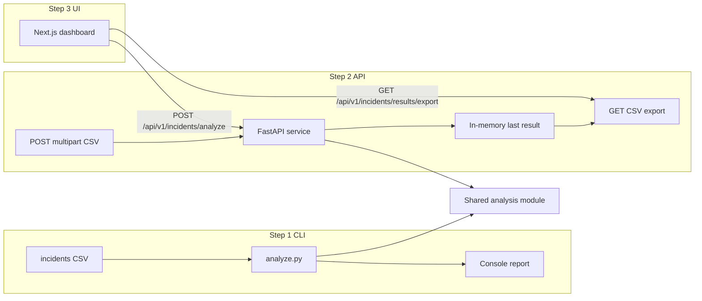

# Incident Analyzer — Implementation Plan

**Plan file (to be saved):** [`memory-bank/references/incident_analyzer_ai_plan/incident_analyzer_plan.md`](memory-bank/references/incident_analyzer_ai_plan/incident_analyzer_plan.md)

---

## Requirements (from CONTEXT-healthcore.md)

### Business context
- HealthCore operates 12 clinics (US + UK); incident data is PHI-heavy and **must never leave controlled processing** (no external AI, no `patient_id` in any output/log/export/error).
- Stakeholder: Priya Nair (Patient Experience). Country breakdown is required in output. ACCESSIBILITY category visibility matters for escalation.

### CSV input schema (`incidents.csv` / `incidents-healthcore.csv`)
| Field | Required | Validation |
|---|---|---|
| `incident_id` | Yes | `HC-XXXXXX` |
| `date` | Yes | `YYYY-MM-DD` |
| `clinic_id` | Yes | One of 12 clinic codes |
| `country` | Yes | `US` or `UK`; must match clinic's country |
| `category` | Yes | One of 5 categories |
| `description` | Yes | Min 5 characters |
| `status` | Yes | `OPEN`, `CLOSED`, `DISCARDED` |
| `patient_id` | Yes | `PAT-XXXXXX` — **never expose in output** |
| `satisfaction_score` | Conditional | Integer 1–5; required when `status = CLOSED` |

**Valid clinic codes:** `US-TX-01`, `US-TX-02`, `US-TX-03`, `US-FL-01`, `US-FL-02`, `US-FL-03`, `US-GA-01`, `US-GA-02`, `US-GA-03`, `UK-LON-01`, `UK-LON-02`, `UK-MAN-01`

**Valid categories:** `APPOINTMENT`, `BILLING`, `CLINICAL_CARE`, `ACCESSIBILITY`, `ADMINISTRATIVE`

### Invalid-record rules (count per rule; never expose PHI)
1. Missing or invalid `clinic_id`
2. Country/clinic mismatch
3. Missing or invalid `category`
4. Empty or too-short `description` (< 5 chars)
5. Missing or invalid `patient_id` (format `PAT-XXXXXX`)
6. `status = CLOSED` with no `satisfaction_score`
7. `satisfaction_score` out of range (not 1–5 when present)

A record can trigger multiple rules; invalid counts are **per-rule tallies** (not necessarily mutually exclusive row counts).

### Expected metrics (test file: [`uis/incident_analyzer/incidents-healthcore.csv`](uis/incident_analyzer/incidents-healthcore.csv))
| Metric | Expected value |
|---|---|
| Total rows | 100 |
| Valid records | 94 |
| Invalid/incomplete | 6 |
| Invalid breakdown (6 rules) | 1 each |
| Category (valid): APPOINTMENT / BILLING / CLINICAL_CARE / ACCESSIBILITY / ADMINISTRATIVE | 30 / 20 / 14 / 17 / 13 |
| Status (valid): OPEN / CLOSED / DISCARDED | 28 / 52 / 14 |
| Country (valid): US / UK | 61 / 33 |
| Satisfaction (52 closed): scores 1–5 | 3 / 5 / 12 / 23 / 9 |
| Average satisfaction | **3.58** |

Percentages in console output use valid-record denominators (e.g. APPOINTMENT 30 → 31.9%).

### CLI command

```bash
cd uis/incident_analyzer
python analyze.py incidents-healthcore.csv
```

### CLI console output (exact template)

Minor spacing / box-drawing variance is acceptable; **all numeric values must match exactly**.

```
============================================================
  HEALTHCORE — PATIENT INCIDENT REPORT ANALYSIS
  Source file: incidents-healthcore.csv
============================================================

TOTAL RECORDS IN FILE .......... 100
  ├─ Valid records ................ 94
  └─ Invalid / incomplete .......... 6

INVALID RECORDS BREAKDOWN
  ├─ Invalid or missing clinic_id .. 1
  ├─ Country/clinic mismatch ....... 1
  ├─ Invalid or missing category ... 1
  ├─ Empty description ............. 1
  ├─ Missing patient_id ............ 1
  └─ Closed case, no score ......... 1

BREAKDOWN BY CATEGORY (valid records)
  ├─ APPOINTMENT .................. 30  (31.9%)
  ├─ BILLING ...................... 20  (21.3%)
  ├─ CLINICAL_CARE ................ 14  (14.9%)
  ├─ ACCESSIBILITY ................ 17  (18.1%)
  └─ ADMINISTRATIVE ............... 13  (13.8%)

BREAKDOWN BY STATUS (valid records)
  ├─ OPEN ......................... 28  (29.8%)
  ├─ CLOSED ....................... 52  (55.3%)
  └─ DISCARDED .................... 14  (14.9%)

BREAKDOWN BY COUNTRY (valid records)
  ├─ US ........................... 61  (64.9%)
  └─ UK ........................... 33  (35.1%)

SATISFACTION INDEX (closed cases)
  Scored cases: 52 of 52
  Average score: 3.58 / 5.00
  ├─ Score 1 (Very dissatisfied) ... 3
  ├─ Score 2 (Dissatisfied) ........ 5
  ├─ Score 3 (Neutral) ............ 12
  ├─ Score 4 (Satisfied) .......... 23
  └─ Score 5 (Very satisfied) ...... 9

============================================================
Export results to CSV? [y / n]:
```

**CLI label mapping (for `analysis_core` → formatter):**

| Internal rule key | CLI label |
|---|---|
| `invalid_clinic_id` | Invalid or missing clinic_id |
| `country_clinic_mismatch` | Country/clinic mismatch |
| `invalid_category` | Invalid or missing category |
| `empty_description` | Empty description |
| `missing_patient_id` | Missing patient_id |
| `closed_no_score` | Closed case, no score |
| `score_out_of_range` | (included in breakdown when present; not in test file) |

**Satisfaction score labels:**

| Score | Label |
|---|---|
| 1 | Very dissatisfied |
| 2 | Dissatisfied |
| 3 | Neutral |
| 4 | Satisfied |
| 5 | Very satisfied |

### CSV export format (James Osei requirement)

One row per metric; columns: `metric`, `value`, optional `percentage`. Used by billing team reporting.

**Example export rows** (from `incidents-healthcore.csv` analysis):

| metric | value | percentage |
|---|---|---|
| total_records | 100 | |
| valid_records | 94 | |
| invalid_records | 6 | |
| invalid_clinic_id | 1 | |
| country_clinic_mismatch | 1 | |
| invalid_category | 1 | |
| empty_description | 1 | |
| missing_patient_id | 1 | |
| closed_no_score | 1 | |
| category_APPOINTMENT | 30 | 31.9 |
| category_BILLING | 20 | 21.3 |
| category_CLINICAL_CARE | 14 | 14.9 |
| category_ACCESSIBILITY | 17 | 18.1 |
| category_ADMINISTRATIVE | 13 | 13.8 |
| status_OPEN | 28 | 29.8 |
| status_CLOSED | 52 | 55.3 |
| status_DISCARDED | 14 | 14.9 |
| country_US | 61 | 64.9 |
| country_UK | 33 | 35.1 |
| satisfaction_average | 3.58 | |
| satisfaction_scored_cases | 52 | |
| satisfaction_score_1 | 3 | |
| satisfaction_score_2 | 5 | |
| satisfaction_score_3 | 12 | |
| satisfaction_score_4 | 23 | |
| satisfaction_score_5 | 9 | |

No `patient_id` or row-level PHI in export.

### Compliance constraints
- Zero `patient_id` in stdout, stderr, logs, JSON, or exported CSV.
- Invalid `patient_id` → report count only (e.g. "Missing patient_id: 1 records").

---

## Architecture



**Shared logic strategy:** Extract pure analysis functions into [`uis/incident_analyzer/analysis_core.py`](uis/incident_analyzer/analysis_core.py) (pandas validation + aggregation returning a typed dict). [`uis/incident_analyzer/analyze.py`](uis/incident_analyzer/analyze.py) formats console output and handles CLI export prompt. FastAPI imports `analysis_core` by adding the `uis/incident_analyzer` path in [`services/api/pyproject.toml`](services/api/pyproject.toml) (or `PYTHONPATH` in dev) — single source of truth, no duplicated rules.

---

## Step 1 — `analyze.py` (pandas CLI)

**Location:** [`uis/incident_analyzer/analyze.py`](uis/incident_analyzer/analyze.py)

**Dependencies:** `pandas` (add [`uis/incident_analyzer/requirements.txt`](uis/incident_analyzer/requirements.txt) or document `pip install pandas` for CLI-only use).

**`analysis_core.py` responsibilities:**
- `load_incidents(path_or_buffer) -> pd.DataFrame`
- `VALID_CLINICS: dict[str, str]` mapping clinic code → country
- `validate_record(row) -> list[ViolationRule]` — returns rule enums, never PHI
- `analyze(df, source_filename: str) -> AnalysisResult` — dataclass/TypedDict with all counts, percentages, satisfaction stats
- `to_export_rows(result) -> list[dict]` — metric/value/percentage rows for CSV export

**`analyze.py` responsibilities:**
- CLI: `python analyze.py <csv_path>`
- Print formatted report matching CONTEXT numeric values exactly
- Prompt `Export results to CSV? [y / n]:` → write `incident-analysis-export.csv` (or user-specified name) using `to_export_rows`
- Exit codes: 0 on success; non-zero on file/read errors (no PHI in error messages)

**Verification:**
```bash
cd uis/incident_analyzer
python analyze.py incidents-healthcore.csv
```
Assert all counts and average `3.58` match CONTEXT expected output.

---

## Step 2 — FastAPI + Pydantic (`services/api`)

**Scaffold:** Minimal `services/api` per [`docs/architecture_proposal.md`](docs/architecture_proposal.md) §7 — `uv`, Python 3.12, FastAPI, Pydantic v2, `uvicorn`. Full domain DB/Auth deferred; incidents feature is stateless except in-memory last result.

**Proposed structure (incidents slice only):**
```
services/api/
├── pyproject.toml          # fastapi, uvicorn, pandas, pydantic-settings, python-multipart
├── app/
│   ├── main.py             # CORS for uis/incident_analyzer dev origin
│   ├── api/v1/router.py    # mounts incidents router
│   └── domains/reporting/incidents/
│       ├── router.py
│       ├── schemas.py      # Pydantic response models
│       ├── service.py      # wraps analysis_core + in-memory store
│       └── store.py        # module-level LastAnalysisStore (thread-safe simple dict)
```

### Endpoints (per your choice: `/api/v1/` prefix)

| Method | Path | Behavior |
|---|---|---|
| `POST` | `/api/v1/incidents/analyze` | `multipart/form-data` field `file` (CSV). Parse with pandas; run `analysis_core.analyze()`; store result + export rows in memory; return JSON matching `IncidentAnalysisResponse` |
| `GET` | `/api/v1/incidents/results/export` | Return last analysis as downloadable CSV (`Content-Disposition: attachment`). **404** if no prior analysis |

### Pydantic schemas (`schemas.py`)

Mirror analysis result structure. No `patient_id` fields anywhere. Use `extra="forbid"` on request schemas.

### API JSON response (exact shape for dashboard)

`POST /api/v1/incidents/analyze` returns `IncidentAnalysisResponse`. Example for `incidents-healthcore.csv`:

```json
{
  "source_filename": "incidents-healthcore.csv",
  "analyzed_at": "2026-06-09T12:00:00Z",
  "totals": {
    "total": 100,
    "valid": 94,
    "invalid": 6
  },
  "invalid_breakdown": [
    { "rule": "invalid_clinic_id", "label": "Invalid or missing clinic_id", "count": 1 },
    { "rule": "country_clinic_mismatch", "label": "Country/clinic mismatch", "count": 1 },
    { "rule": "invalid_category", "label": "Invalid or missing category", "count": 1 },
    { "rule": "empty_description", "label": "Empty description", "count": 1 },
    { "rule": "missing_patient_id", "label": "Missing patient_id", "count": 1 },
    { "rule": "closed_no_score", "label": "Closed case, no score", "count": 1 }
  ],
  "by_category": [
    { "label": "APPOINTMENT", "count": 30, "percentage": 31.9 },
    { "label": "BILLING", "count": 20, "percentage": 21.3 },
    { "label": "CLINICAL_CARE", "count": 14, "percentage": 14.9 },
    { "label": "ACCESSIBILITY", "count": 17, "percentage": 18.1 },
    { "label": "ADMINISTRATIVE", "count": 13, "percentage": 13.8 }
  ],
  "by_status": [
    { "label": "OPEN", "count": 28, "percentage": 29.8 },
    { "label": "CLOSED", "count": 52, "percentage": 55.3 },
    { "label": "DISCARDED", "count": 14, "percentage": 14.9 }
  ],
  "by_country": [
    { "label": "US", "count": 61, "percentage": 64.9 },
    { "label": "UK", "count": 33, "percentage": 35.1 }
  ],
  "satisfaction": {
    "scored_cases": 52,
    "total_closed": 52,
    "average": 3.58,
    "max_score": 5,
    "distribution": [
      { "score": 1, "label": "Very dissatisfied", "count": 3 },
      { "score": 2, "label": "Dissatisfied", "count": 5 },
      { "score": 3, "label": "Neutral", "count": 12 },
      { "score": 4, "label": "Satisfied", "count": 23 },
      { "score": 5, "label": "Very satisfied", "count": 9 }
    ]
  }
}
```

Percentages are rounded to **one decimal place**, matching CLI output. The API returns the same data the CLI prints — the dashboard is a visual rendering of this JSON, not a separate calculation.

### In-memory last result
- `LastAnalysisStore` holds latest `AnalysisResult` + precomputed export rows (single global for v1 internal tool).
- Document limitation: lost on server restart; not multi-tenant. Acceptable for Priya's dashboard prototype.

### CORS / dev
- `CORS_ORIGINS` includes `http://localhost:3002` (incident analyzer dev port).
- Run API: `uv run uvicorn app.main:app --reload --port 8000`

### PHI safety in API layer
- Never include raw CSV rows in response.
- Log only filename + aggregate counts (no row-level PHI).
- Validate multipart is `.csv` / `text/csv`; reject empty files with 400.

---

## Step 3 — Next.js dashboard (`uis/incident_analyzer`)

**Scaffold:** New standalone app mirroring [`uis/backoffice`](uis/backoffice) conventions:
- Next.js 16 App Router, TypeScript, Tailwind v4 (PostCSS), React 19
- No third-party UI libraries; components ≤80 lines
- Dev port **3002** (avoid 3000/3001 conflicts)
- `npm run verify` = lint + build

**Proposed routes:**
- `/` — incident analysis dashboard (single page)

**Page composition:**
```
app/page.tsx
components/
  incident-dashboard.tsx      # orchestrates upload → analyze → display → export
  csv-upload.tsx              # file input + drag-drop zone (native input, Tailwind)
  analysis-summary.tsx        # totals + invalid breakdown cards
  breakdown-section.tsx       # reusable bar/table for category/status/country
  satisfaction-section.tsx    # score distribution + average
  export-button.tsx           # triggers GET export, triggers browser download
lib/
  api.ts                      # fetch helpers for analyze + export
  types.ts                    # mirrors Pydantic JSON shape
```

**User flow:**
1. User selects/drops CSV → client validates extension/size locally.
2. `POST ${NEXT_PUBLIC_API_URL}/api/v1/incidents/analyze` with `FormData`.
3. On success, render dashboard sections below (all values from JSON; numbers must match CLI exactly).
4. "Export CSV" button → `GET .../api/v1/incidents/results/export` → blob download (`incident-analysis-export.csv`).
5. Loading, error, and empty states explicit (no PHI in error UI).

**Env:** `.env.local.example` with `NEXT_PUBLIC_API_URL=http://localhost:8000`

### Dashboard layout and displayed information

The dashboard mirrors every CLI section. Before upload, show only the upload zone and page header. After a successful analyze, reveal all sections below.

```
┌─────────────────────────────────────────────────────────────┐
│  HealthCore — Patient Incident Report Analysis              │
│  Source: incidents-healthcore.csv  ·  Analyzed: <timestamp> │
├─────────────────────────────────────────────────────────────┤
│  [ Upload CSV ]  or drag-and-drop zone                      │
├─────────────────────────────────────────────────────────────┤
│  SUMMARY (3 stat cards)                                     │
│  ┌──────────────┐ ┌──────────────┐ ┌──────────────┐          │
│  │ Total: 100   │ │ Valid: 94    │ │ Invalid: 6   │          │
│  └──────────────┘ └──────────────┘ └──────────────┘          │
├─────────────────────────────────────────────────────────────┤
│  INVALID RECORDS BREAKDOWN (list or table)                  │
│  · Invalid or missing clinic_id .......... 1                │
│  · Country/clinic mismatch ............... 1                │
│  · Invalid or missing category ........... 1                │
│  · Empty description ..................... 1                │
│  · Missing patient_id .................... 1                │
│  · Closed case, no score ................. 1                │
├─────────────────────────────────────────────────────────────┤
│  BREAKDOWN BY CATEGORY (valid records)                      │
│  APPOINTMENT     30  ████████████████░░░░  31.9%            │
│  BILLING         20  ██████████░░░░░░░░░░  21.3%            │
│  CLINICAL_CARE   14  ███████░░░░░░░░░░░░░  14.9%            │
│  ACCESSIBILITY   17  █████████░░░░░░░░░░░  18.1%  ← highlight│
│  ADMINISTRATIVE  13  ███████░░░░░░░░░░░░░  13.8%            │
├─────────────────────────────────────────────────────────────┤
│  BREAKDOWN BY STATUS (valid records)                        │
│  OPEN       28  29.8%   CLOSED     52  55.3%                │
│  DISCARDED  14  14.9%                                       │
├─────────────────────────────────────────────────────────────┤
│  BREAKDOWN BY COUNTRY (valid records)  ← Priya requirement │
│  US  61  ████████████████████░░░░  64.9%                   │
│  UK  33  ██████████░░░░░░░░░░░░░░  35.1%                   │
├─────────────────────────────────────────────────────────────┤
│  SATISFACTION INDEX (closed cases)                          │
│  Scored cases: 52 of 52                                     │
│  Average score: 3.58 / 5.00  (prominent metric)             │
│  Score 1 Very dissatisfied ... 3                            │
│  Score 2 Dissatisfied ......... 5                            │
│  Score 3 Neutral .............. 12                           │
│  Score 4 Satisfied ............ 23                           │
│  Score 5 Very satisfied ....... 9                            │
├─────────────────────────────────────────────────────────────┤
│  [ Export results to CSV ]                                  │
└─────────────────────────────────────────────────────────────┘
```

**Section-by-section display rules:**

| Dashboard section | Data source (JSON path) | Display format |
|---|---|---|
| Page header | `source_filename`, `analyzed_at` | Title + subtitle under main heading |
| Summary cards | `totals.total`, `totals.valid`, `totals.invalid` | Three equal-width cards, large number + label |
| Invalid breakdown | `invalid_breakdown[]` | Table: label + count; show section only when `totals.invalid > 0` |
| Category breakdown | `by_category[]` | Row per category: label, count, percentage, Tailwind progress bar (width = percentage) |
| Status breakdown | `by_status[]` | Same row format as category |
| Country breakdown | `by_country[]` | Same row format; **always visible** when results present (stakeholder requirement) |
| Satisfaction index | `satisfaction.*` | Header line "Scored cases: X of Y"; large average "3.58 / 5.00"; distribution list with count + optional mini bar per score |
| Export button | n/a | Disabled until analysis succeeds; label "Export results to CSV" |

**Visual emphasis (Tailwind only):**
- `ACCESSIBILITY` row uses distinct accent styling (e.g. `border-l-4 border-amber-500`) — Priya escalation signal.
- `by_country` section placed in a dedicated card, not buried below fold on mobile.
- Percentages shown to **one decimal** everywhere, matching CLI.
- No raw CSV preview, no incident rows, no `patient_id` anywhere in UI.

**Responsive behavior:**
- Mobile: sections stack vertically; stat cards go 1-column.
- `lg:` breakpoint: summary cards 3-column; category/status/country in 2-column grid where space allows.

**Empty / loading / error states:**

| State | What user sees |
|---|---|
| Initial | Upload zone + instruction text ("Upload an incidents CSV to analyze") |
| Loading | Upload disabled; spinner + "Analyzing…" |
| Error | Red alert with API message (e.g. "Invalid file format") — no PHI |
| No prior export | Export button disabled with tooltip if user clicks before analyze |
| Export 404 | Toast: "No analysis available. Upload a CSV first." |

---

## File checklist

| File | Action |
|---|---|
| `uis/incident_analyzer/analysis_core.py` | Create — shared pandas logic |
| `uis/incident_analyzer/analyze.py` | Create — CLI entry |
| `uis/incident_analyzer/requirements.txt` | Create — pandas |
| `uis/incident_analyzer/package.json` + Next scaffold | Create — Step 3 app |
| `services/api/pyproject.toml` + `app/main.py` | Create — minimal FastAPI |
| `services/api/app/domains/reporting/incidents/*` | Create — router, schemas, service, store |
| `memory-bank/references/incident_analyzer_ai_plan/incident_analyzer_plan.md` | Create — this plan |
| `memory-bank/progress.md` | Update after implementation — new milestone slice |

---

## Verification plan

| Layer | Command / check |
|---|---|
| CLI | `python analyze.py incidents-healthcore.csv` — all numbers match CONTEXT |
| API unit | `pytest` for `analysis_core` rule counts against fixture CSV |
| API integration | `httpx` POST fixture → JSON counts; GET export → CSV rows with metric/value |
| UI | Manual: upload `incidents-healthcore.csv`, verify dashboard numbers, export CSV |
| Compliance | Grep outputs/logs for `PAT-` pattern — must be zero matches |
| UI build | `cd uis/incident_analyzer && npm run verify` |

---

## Risks and open items

| Risk | Mitigation |
|---|---|
| Duplicate validation logic between CLI and API | Single `analysis_core.py` imported by both |
| In-memory export lost on restart | Document v1 limitation; 404 on export with user-friendly message |
| Percentage rounding | Use same rounding as CLI (1 decimal) for parity |
| Records with multiple violations | Count each triggered rule independently per CONTEXT |
| `satisfaction_score` out of range on non-CLOSED rows | Flag as invalid per rule 7; exclude from valid aggregations |

**Deferred (out of scope for this plan):** Auth/JWT, Supabase persistence, clinic-level drill-down (Florida ACCESSIBILITY), integration into `uis/website` public portal.
