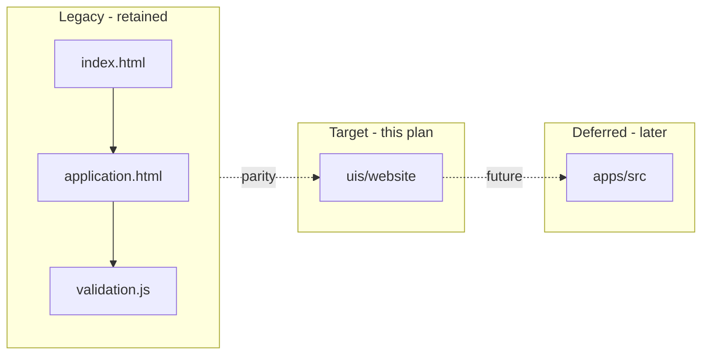
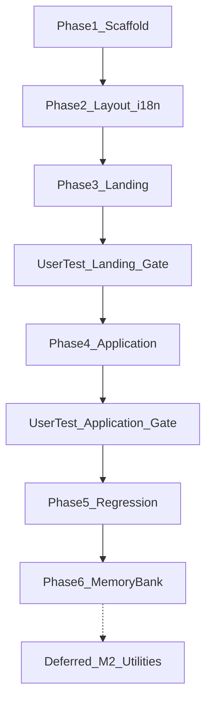

# Milestone 4: Public Web Portal Refactor Plan

Canonical M4 implementation plan (saved from Cursor plan `m4_portal_migration_c4e99b62`). Other files in `memory-bank/references/` still require explicit approval before reading unless you are directed to this plan.

## Scope and constraints

Per [`.agents/skills/frontend/migrate-portal-page-to-next.md`](.agents/skills/frontend/migrate-portal-page-to-next.md):

| Role | Path | Action |
|------|------|--------|
| **Migration target** | `uis/website/` | New Next.js 16 app — all migrated routes, components, layout |
| **Legacy reference** | [`apps/healthcore_web_portal/`](apps/healthcore_web_portal/) | **Do not delete or modify** (716-line `index.html`, 326-line `application.html`, 759-line `validation.js`) |

Per [memory-bank/decisions.md](memory-bank/decisions.md) and [memory-bank/techContext.md](memory-bank/techContext.md): match the stack and patterns of [`apps/talent-pipeline-tracker/`](apps/talent-pipeline-tracker/) — Next.js 16 App Router, TypeScript, Tailwind v4 via PostCSS, custom components only, **≤80 lines per component**.

**In scope (this plan):** scaffold, layout/i18n, landing migration, user testing gates, application form migration, final regression, memory-bank updates.

**Explicitly deferred:** Milestone 2 [`apps/src`](apps/src) utility integration ([`.agents/skills/utilities/frontend-consume-shared-utilities.md`](.agents/skills/utilities/frontend-consume-shared-utilities.md)) — enquiry validation stays fully in `uis/website` for now (ported from `validation.js`).

**Out of scope:** backend/API submission, retiring the legacy static app.

---

## Repository directory structure

### Repo context (what exists today vs what we add)

```
chitrasharath_healthcore_ft_ai_1/
├── apps/
│   ├── healthcore_web_portal/          # LEGACY — retain, do not modify
│   │   ├── index.html                  #   landing (716 lines)
│   │   ├── application.html            #   enquiry form (326 lines)
│   │   └── validation.js               #   i18n + form logic (759 lines)
│   ├── talent-pipeline-tracker/         # REFERENCE — Next.js 16 patterns
│   └── src/                            # M2 utilities — integration DEFERRED
├── uis/                                # NEW top-level folder for M4 UI
│   └── website/                        # M4 migration target (to be created)
├── memory-bank/                        # project context (update after delivery)
├── .agents/                            # rules + skills
└── AGENTS.md
```

### Target app: `uis/website/` (full tree)

```
uis/website/
├── app/
│   ├── layout.tsx                      # Root layout, metadata, shared footer
│   ├── page.tsx                        # Landing route `/` (from index.html)
│   ├── globals.css                     # Tailwind v4 + HealthCore CSS variables
│   ├── icon.svg                        # Favicon (optional, from talent app pattern)
│   └── enquiry-form/
│       └── page.tsx                    # Enquiry route `/enquiry-form` (from application.html)
│
├── components/
│   ├── layout/
│   │   ├── portal-header.tsx           # Sticky nav, logo, language toggle, CTA
│   │   ├── portal-footer.tsx           # Copyright + social links
│   │   ├── language-toggle.tsx         # EN/ES + localStorage + ?lang=
│   │   └── healthcore-logo.tsx           # Inline SVG logo
│   │
│   ├── landing/
│   │   ├── hero-section.tsx              # #home
│   │   ├── services-section.tsx          # #services
│   │   ├── why-section.tsx               # #why + experience block
│   │   ├── evidence-section.tsx          # #evidence
│   │   ├── locations-section.tsx         # #locations (table + mobile cards)
│   │   ├── contact-section.tsx           # #contact
│   │   └── faq-section.tsx               # #faq
│   │
│   ├── enquiry/
│   │   ├── enquiry-form-page.tsx         # Client shell for /enquiry-form
│   │   ├── enquiry-hero-section.tsx      # Form page hero band
│   │   ├── personal-details-fieldset.tsx
│   │   ├── appointment-preferences-fieldset.tsx
│   │   ├── patient-status-fieldset.tsx
│   │   ├── health-concern-fieldset.tsx
│   │   ├── form-field.tsx                # Reusable labeled input + error slot
│   │   ├── evening-warning.tsx
│   │   └── success-modal.tsx
│   │
│   └── schema-org/
│       ├── landing-json-ld.tsx           # All JSON-LD blocks from index.html
│       └── enquiry-form-json-ld.tsx    # WebPage JSON-LD from application.html
│
├── lib/
│   ├── i18n/
│   │   ├── translations.ts             # en / es keys (landing + form)
│   │   └── use-language.ts             # Hook: URL param + localStorage
│   ├── clinics.ts                        # Clinic list + closing hours map
│   └── enquiry-validation.ts             # All validation rules (from validation.js)
│
├── hooks/
│   └── use-enquiry-form.ts               # Form state, handlers, submit/modal
│
├── public/                               # Static assets if needed (images optional)
│
├── scripts/                              # Optional: smoke-check.mjs
│
├── package.json                          # dev, build, lint, verify
├── package-lock.json
├── tsconfig.json                         # @/* alias only (no apps/src yet)
├── next.config.ts
├── postcss.config.mjs
├── eslint.config.mjs
└── next-env.d.ts
```

**Route mapping:**

| Legacy file | Next route |
|-------------|------------|
| `apps/healthcore_web_portal/index.html` | `uis/website/app/page.tsx` → `/` |
| `apps/healthcore_web_portal/application.html` | `uis/website/app/enquiry-form/page.tsx` → `/enquiry-form` |

---

## Current state



**Legacy features to preserve:**
- Bilingual EN/ES (`?lang=`, `localStorage`, translation keys)
- Rich Schema.org JSON-LD on landing; WebPage JSON-LD on application
- Shared header/nav/footer (extracted once in Next)
- Enquiry form: fieldsets, conditional fields, evening warning, success modal, no server submit
- Accessibility: skip link, landmarks, `aria-*`, modal focus trap

**`uis/website` does not exist yet** — full scaffold required.

---

## Implementation phases

### Phase 1 — Scaffold `uis/website`

1. Create Next.js 16 app at `uis/website` (same stack as [`apps/talent-pipeline-tracker`](apps/talent-pipeline-tracker): Next 16.2.6, React 19, Tailwind 4, `@/*` alias).
2. Copy/adapt: `postcss.config.mjs`, `eslint.config.mjs`, `tsconfig.json`, [`app/globals.css`](apps/talent-pipeline-tracker/app/globals.css) tokens.
3. Add `verify` script: `lint && build`.
4. **Do not** add `apps/src` tsconfig path alias in this phase (utilities integration deferred).

**Deliverable:** `npm run build` succeeds with placeholder home page.

---

### Phase 2 — Shared layout and i18n foundation

| Component | Purpose |
|-----------|---------|
| `portal-header.tsx` | Sticky nav, logo, EN/ES toggle, CTA → `/enquiry-form` |
| `portal-footer.tsx` | Copyright + social links |
| `language-toggle.tsx` | `?lang=en|es`, `healthcore_lang` in localStorage |
| `healthcore-logo.tsx` | Inline SVG from legacy |

Port translation keys into `lib/i18n/translations.ts`; `use-language.ts` for client pages.

**Deliverable:** Shell on `/` with working language toggle and nav (enquiry-form route may still be stub).

---

### Phase 3 — Migrate landing page (`index.html` → `/`)

| Section ID | Component |
|------------|-----------|
| `#home` | `hero-section.tsx` |
| `#services` | `services-section.tsx` |
| `#why` | `why-section.tsx` |
| `#evidence` | `evidence-section.tsx` |
| `#locations` | `locations-section.tsx` |
| `#contact` | `contact-section.tsx` |
| `#faq` | `faq-section.tsx` |

Port Schema.org → `landing-json-ld.tsx`; page `metadata` + hreflang in `app/page.tsx`. Tailwind build pipeline only (no CDN).

**Deliverable:** Content and layout parity with legacy landing; EN/ES complete.

---

### User testing — Landing page gate (before application work)

**Stop implementation here until you sign off.**

| Step | Action |
|------|--------|
| 1 | Run `cd uis/website && npm run dev` |
| 2 | Open `http://localhost:3000/` and legacy `apps/healthcore_web_portal/index.html` side by side |
| 3 | Walk through checklist below; log issues before continuing |

**Landing UAT checklist:**

- [ ] All sections present: home, services, why, evidence, locations, contact, FAQ
- [ ] In-page nav anchors scroll correctly (`#services`, `#locations`, etc.)
- [ ] EN ↔ ES toggle updates all visible copy; `?lang=` and refresh behave like legacy
- [ ] Mobile, tablet, desktop layouts (locations table vs cards)
- [ ] CTA / “Request an appointment” links to `/enquiry-form` (404 or stub OK at this stage)
- [ ] Header/footer match legacy labels and social links
- [ ] View page source: Schema.org JSON-LD blocks present
- [ ] Quick a11y spot-check: skip link, heading order, focus visible on interactive elements
- [ ] **`apps/healthcore_web_portal/` unchanged** (no accidental edits)

**Sign-off:** Proceed to application migration only after landing issues are resolved or accepted as known gaps.

---

### Phase 4 — Migrate enquiry form (`application.html` → `/enquiry-form`)

1. `app/enquiry-form/page.tsx` + `enquiry-form-page.tsx` client shell.
2. Port all rules from [`validation.js`](apps/healthcore_web_portal/validation.js) into `lib/enquiry-validation.ts` + `hooks/use-enquiry-form.ts` (no `apps/src` imports).
3. Split fieldsets into ≤80-line components (see directory tree).
4. Preserve: `novalidate`, field errors, conditional patient ID / insurance, evening warning, success modal, no API submit.
5. Port application Schema.org → `enquiry-form-json-ld.tsx`.

**Deliverable:** Form behavior matches legacy in EN and ES.

---

### User testing — Application page gate (before final regression)

**Stop for sign-off before closing out the milestone.**

| Step | Action |
|------|--------|
| 1 | `npm run dev` in `uis/website` |
| 2 | Compare `http://localhost:3000/enquiry-form` vs legacy `application.html` |
| 3 | Complete checklist; fix blockers before Phase 5 |

**Application UAT checklist:**

- [ ] All form fields and fieldsets match legacy (labels, required markers, placeholders)
- [ ] Validation on blur/submit: names, email, phone, DOB, dates, service/paediatric rule, insurance, patient ID, health concern, consent
- [ ] Conditional UI: returning patient ID block; insurance fields when “Yes”
- [ ] Evening availability warning for eligible clinic + time combinations
- [ ] Clear form resets state; successful submit shows modal (no network call)
- [ ] EN ↔ ES: error messages and labels update correctly
- [ ] Nav from `/` ↔ `/enquiry-form` via header/CTA (`Link` components)
- [ ] Mobile layout and touch targets usable
- [ ] Modal focus trap and keyboard dismiss behavior
- [ ] Schema.org WebPage JSON-LD on `/enquiry-form` route
- [ ] Legacy `apps/healthcore_web_portal/` still untouched

**Sign-off:** Proceed to final regression and memory-bank updates.

---

### Phase 5 — Final regression verification

Combined checklist (landing + application + cross-page):

- [ ] `npm run verify` passes in `uis/website`
- [ ] Full EN/ES parity on both routes
- [ ] No Tailwind CDN in `uis/website`
- [ ] Manual compare: both legacy HTML pages vs both Next routes
- [ ] Legacy folder files present and unmodified

---

### Phase 6 — Memory-bank updates

Update per [AGENTS.md](AGENTS.md):

- [`memory-bank/progress.md`](memory-bank/progress.md) — M4 landing + application in `uis/website`
- [`memory-bank/techContext.md`](memory-bank/techContext.md) — `uis/website` stack; note M2 integration deferred
- [`memory-bank/decisions.md`](memory-bank/decisions.md) — `uis/website` as M4 target; legacy retention

---

## Deferred: Milestone 2 utilities (future phase)

Not part of this implementation. When ready, follow [`.agents/skills/utilities/frontend-consume-shared-utilities.md`](.agents/skills/utilities/frontend-consume-shared-utilities.md):

- Add tsconfig alias `@healthcore/src/*` → `../../apps/src/*`
- Wire `validateClaim` / `ServiceType` / `Location` via `form-mappers.ts` for fields that map to M2 entities
- Run `apps/src` typecheck + `uis/website` verify after integration

---

## Rules compliance (this phase)

| Requirement | Source |
|-------------|--------|
| Next.js 16 + App Router + TypeScript + Tailwind build | `tech-stack-nextjs16.md` |
| Components ≤80 lines | `component-size-limit.md` |
| No third-party UI libs, no Tailwind CDN | `tailwind-only-no-ui-libs.md` |
| EN/ES parity | `bilingual-parity.md` |
| Schema.org on public pages | `schemaorg-semantic-html.md` |
| Shared header/footer | `shared-header-footer-nav.md` |
| Client-side validation + accessible errors | `client-side-validation.md` |
| Legacy portal retained | `migrate-portal-page-to-next.md` |
| M2 utility reuse | **Deferred** — `utility-reuse.md` applies in future phase |

---

## Risks and mitigations

| Risk | Mitigation |
|------|------------|
| Large landing → many components | Strict section boundaries; shared atoms if needed |
| i18n drift from legacy | Single `translations.ts` with same keys as `data-i18n` |
| Starting application before landing signed off | **User testing gate** blocks Phase 4 |
| CTA to `/enquiry-form` during landing-only testing | Expected 404/stub until Phase 4; document in UAT |

---

## Implementation order (summary)



1. Scaffold
2. Shared layout + i18n
3. Landing page + Schema.org
4. **User testing — landing sign-off**
5. Application form + validation (UI-only, from `validation.js`)
6. **User testing — application sign-off**
7. Final regression
8. Memory-bank updates
9. *(Later)* M2 utilities integration

Estimated: ~25–30 files under `uis/website/` (most ≤80 lines).
