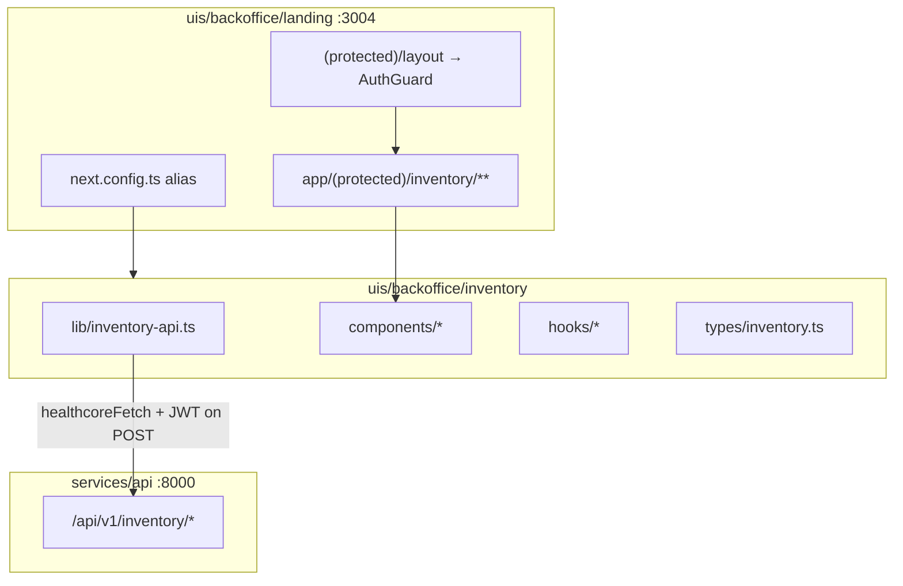

# Milestone 5 — Inventory Frontend Implementation Plan

**Plan file:** [`memory-bank/references/milestone5_ai_plan/milestone5_frontend_implementation_plan.md`](milestone5_frontend_implementation_plan.md)

**Requirements source:** [`milestone5_frontend_specs.md`](milestone5_frontend_specs.md)

**Milestone:** 5 — Medical Supply Inventory Management (Frontend)

**Branch:** `feature/milestone5` (backend inventory API already delivered on this branch)

**Working directory:** `uis/backoffice/` (feature module + landing routes)

**Status:** Delivered — frontend wired into landing; `npm run verify` passes

---

## Executive summary

Operations staff need a browser UI to view medical supply stock, log vendor deliveries, record clinical consumptions, and review order history. The backend REST API is **delivered** at `services/api/app/domains/inventory/`. This plan covers **frontend-only** work: a new feature module `uis/backoffice/inventory/` aliased into the backoffice landing app (`uis/backoffice/landing`, port **3004**), following the same hybrid pattern as talent-tracker and supplier-directory.

All inventory pages live under `(protected)/inventory/` and inherit `AuthGuard` from the existing protected layout. POST endpoints require JWT; `healthcoreFetch` injects the Bearer token from `localStorage`.

**Scope:** Frontend UI + landing wiring. No backend changes, no new npm dependencies, no auth modifications.

---

## Planning decisions (locked)

These resolve ambiguities between the spec, codebase patterns, and stakeholder answers (2026-07-01).

| Topic | Decision |
|-------|----------|
| Layout chrome | **ToolToolbar only** in `inventory/layout.tsx` — footer comes from root `ConditionalLandingFooter` (same as supplier-directory / incident-analyzer) |
| Hub nav position | Insert **after Supplier Directory** in `NAV_APPS` |
| Component size | **Strict ≤80 lines** per file — split tables/forms into hooks + presentational sub-components |
| Sub-page navigation | **"← Back to Inventory"** link on all `/inventory/*` sub-pages (not on `/inventory` landing itself) via shared `inventory-page-header` |
| Unknown `clinic_id` | Display **`Unknown clinic ({id})`** when `clinic_id` is not in `CLINICS` (handles seed data with `clinic_id: 10`) |
| Empty lists | **Simple centered message** — e.g. "No supplies found" / "No orders yet" (no CTA links) |
| API access | All calls through `inventory/lib/inventory-api.ts` — **no** direct `fetch` or `healthcoreFetch` in components |
| Error parsing | `inventoryFetch` extracts `detail` string or joins Pydantic validation array (same pattern as supplier-directory `parseError`) |
| Date display | **`en-US`** locale, **`America/New_York`** timezone — e.g. `Jun 30, 2026, 10:30 AM EDT` |
| Stock unit label | Outbound reactive display uses product `unit` — e.g. `"Available stock: 42 boxes"` |
| Query param | Pre-select product from **`supplyId`** (camelCase) on inbound/outbound forms |
| Protected code | Do **not** modify `shared/lib/healthcore-api.ts`, `landing/lib/api.ts`, `auth-guard.tsx`, or other feature modules |

---

## Current codebase baseline

Exploration against `uis/backoffice/` (as of plan authoring):

| Area | Current state |
|------|---------------|
| Inventory frontend module | **Does not exist** — no `uis/backoffice/inventory/` |
| Inventory backend | **Delivered** — 6 endpoints under `/api/v1/inventory/`; 82 pytest passing |
| Landing aliases | `@backoffice/talent-tracker`, `@backoffice/supplier-directory`, etc. — **no** `@backoffice/inventory` yet |
| Protected routes | `(protected)/layout.tsx` wraps `AuthGuard`; tool routes follow `landing/app/(protected)/{tool}/` pattern |
| Reference layouts | `supplier-directory/layout.tsx` and `incident-analyzer/layout.tsx` — **ToolToolbar only** |
| Root footer | `ConditionalLandingFooter` in root layout — hidden only for `/talent-tracker` |
| `NAV_APPS` | Incident Analyzer, Supplier Directory, Talent Tracker, Back Office Functions, Public Website — **no inventory entry** |
| `healthcoreFetch` | `@backoffice/shared/lib/healthcore-api.ts` — Bearer injection + 401 redirect |

**Seed data note:** `inventory/seed.py` includes orders with `clinic_id: 10` (UK). Frontend `CLINICS` maps IDs 1–6 only. Orders history will show `Unknown clinic (10)` per locked decision — no backend seed change in this milestone.

---

## Architecture

### Module placement



### Route map

| URL | Page file | Main component |
|-----|-----------|----------------|
| `/inventory` | `inventory/page.tsx` | `inventory-landing.tsx` |
| `/inventory/products` | `inventory/products/page.tsx` | `products-table.tsx` |
| `/inventory/orders` | `inventory/orders/page.tsx` | `orders-table.tsx` |
| `/inventory/orders/inbound` | `inventory/orders/inbound/page.tsx` | `inbound-order-form.tsx` |
| `/inventory/orders/outbound` | `inventory/orders/outbound/page.tsx` | `outbound-order-form.tsx` |

All routes except `/inventory` use `inventory-page-header` with `backHref="/inventory"` and `backLabel="Back to Inventory"`.

---

## File structure (target)

```
uis/backoffice/inventory/
├── lib/
│   ├── inventory-api.ts          # inventoryFetch + listProducts, getProduct, create*, listOrders
│   ├── constants.ts              # CLINICS, VENDORS, CONSUMPTION_TYPES, CATEGORY_LABELS
│   └── format.ts                 # formatClinicName, formatOrderDate, formatConsumptionType
├── types/
│   └── inventory.ts              # MedicalSupply, SupplyDeliveryCreate, SupplyConsumptionCreate, OrderRead
├── hooks/
│   ├── use-products.ts           # fetch list + loading/error state
│   ├── use-product-stock.ts      # reactive getProduct for outbound form
│   ├── use-orders.ts             # fetch order history
│   ├── use-inbound-form.ts       # form state, submit, banners
│   └── use-outbound-form.ts      # form state, stock warning, inline 400 handling
└── components/
    ├── inventory-landing.tsx     # hero + 4 nav cards
    ├── inventory-page-header.tsx # back link + title (sub-pages)
    ├── inventory-nav-cards.tsx   # landing card grid (keeps landing ≤80 lines)
    ├── products-table.tsx        # table shell
    ├── products-table-body.tsx   # rows + action links
    ├── stock-badge.tsx           # red/amber/green stock indicator
    ├── inbound-order-form.tsx    # form shell
    ├── inbound-form-fields.tsx   # four selects/inputs
    ├── outbound-order-form.tsx   # form shell
    ├── outbound-form-fields.tsx  # fields + stock display + warnings
    ├── orders-table.tsx          # table shell
    ├── orders-table-body.tsx     # rows + type-specific detail
    ├── order-type-badge.tsx      # Delivery / Consumption badges
    ├── status-banner.tsx         # reusable success/error/warning banners
    └── empty-state.tsx           # centered empty list message
```

**80-line discipline:** If any file approaches the limit during implementation, extract another hook or presentational child rather than expanding a single file.

---

## Implementation steps

### Step 0 — Preconditions

```bash
git checkout feature/milestone5
cd uis/backoffice/landing && npm install
cd services/api && uv run uvicorn app.main:app --reload   # separate terminal
cd services/api && uv run seed                            # if Supabase seeded empty
```

Confirm:

- `GET http://localhost:8000/api/v1/inventory/products` returns seeded supplies with `current_stock`.
- Landing dev server: `cd uis/backoffice/landing && npm run dev` → `http://localhost:3004`.
- Logged-in user can access other protected tools (e.g. `/supplier-directory`).

---

### Step 1 — Scaffold and configuration

**1a. Register alias** in [`uis/backoffice/landing/next.config.ts`](../../../uis/backoffice/landing/next.config.ts):

```ts
const inventory = path.join(landingDir, "../inventory");
// ...
"@backoffice/inventory": inventory,
```

**1b. Tailwind source** in [`uis/backoffice/landing/app/globals.css`](../../../uis/backoffice/landing/app/globals.css):

```css
@source "../../inventory/**/*";
```

**1c. Hub nav card** in [`uis/backoffice/landing/lib/nav-apps.ts`](../../../uis/backoffice/landing/lib/nav-apps.ts) — insert **after** Supplier Directory:

```ts
{
  title: "Inventory Management",
  description: "Track medical supply stock, deliveries, and clinical consumption",
  url: "/inventory",
  protected: true,
},
```

**1d.** Create empty `uis/backoffice/inventory/` directories (`lib/`, `types/`, `hooks/`, `components/`).

---

### Step 2 — Types, constants, and format helpers

**`types/inventory.ts`** — match spec §10.1 exactly (`MedicalSupply`, `SupplyDeliveryCreate`, `SupplyConsumptionCreate`, `OrderRead`).

**`lib/constants.ts`** — match spec §10.3 (`CLINICS`, `VENDORS`, `CONSUMPTION_TYPES`, `CATEGORY_LABELS`).

**`lib/format.ts`** — shared display helpers:

```ts
export const formatClinicName = (clinicId: number): string => {
  const clinic = CLINICS.find((c) => c.id === clinicId);
  return clinic ? clinic.name : `Unknown clinic (${clinicId})`;
};

export const formatOrderDate = (iso: string): string =>
  new Intl.DateTimeFormat("en-US", {
    month: "short",
    day: "numeric",
    year: "numeric",
    hour: "numeric",
    minute: "2-digit",
  }).format(new Date(iso));

export const formatConsumptionType = (value: string | null): string => {
  if (!value) return "—";
  return CONSUMPTION_TYPES.find((t) => t.value === value)?.label ?? value;
};
```

---

### Step 3 — API layer

**`lib/inventory-api.ts`** per spec §10.2:

- Private `parseError(response)` — handle `detail` as string or validation array (mirror [`uis/supplier_directory/lib/api.ts`](../../../uis/supplier_directory/lib/api.ts)).
- Private `inventoryFetch<T>(path, init?)` — call `healthcoreFetch`, throw `Error(detail)` on non-OK, else `return response.json() as T`.
- Exported functions:
  - `listProducts()` → `GET /inventory/products`
  - `getProduct(id)` → `GET /inventory/products/{id}`
  - `createInboundOrder(body)` → `POST /inventory/orders/inbound`
  - `createOutboundOrder(body)` → `POST /inventory/orders/outbound`
  - `listOrders()` → `GET /inventory/orders`

---

### Step 4 — Shared UI primitives

| Component | Responsibility |
|-----------|----------------|
| `status-banner.tsx` | `variant: "success" \| "error" \| "warning"` — Tailwind classes from spec §11 |
| `stock-badge.tsx` | Props: `stock: number` — red ≤5, amber ≤15, green >15 |
| `order-type-badge.tsx` | Props: `orderType` — green "Delivery" / red "Consumption" |
| `empty-state.tsx` | Props: `message: string` — centered muted text |
| `inventory-page-header.tsx` | Props: `title`, optional `subtitle` — always links back to `/inventory` |

Pattern reference: [`talent-tracker/components/page-header.tsx`](../../../uis/backoffice/talent-tracker/components/page-header.tsx) for back-link styling (sky-800, arrow prefix). Use a simple `←` character or inline SVG to avoid cross-module icon imports.

---

### Step 5 — Routes and layout

**`landing/app/(protected)/inventory/layout.tsx`:**

```tsx
import { ToolToolbar } from "@/components/layout/tool-toolbar";

export default function InventoryLayout({ children }: Readonly<{ children: React.ReactNode }>) {
  return (
    <>
      <ToolToolbar />
      {children}
    </>
  );
}
```

**Thin route pages** — each `page.tsx` imports one client component from `@backoffice/inventory/components/*` (same pattern as [`supplier-directory/page.tsx`](../../../uis/backoffice/landing/app/(protected)/supplier-directory/page.tsx)).

---

### Step 6 — Inventory landing (`/inventory`)

**`inventory-landing.tsx`** + **`inventory-nav-cards.tsx`:**

- Page container: `mx-auto w-full max-w-5xl px-4 py-8 sm:px-6`
- Hero: spec §10.5 gradient classes; `<HealthcoreLogo />` from `@/components/layout/healthcore-logo`; title **"Medical Supply Inventory"**; subtitle from spec.
- Four cards in `sm:grid-cols-2` grid — card class from spec §10.5; use `Link` from `next/link` (not `NavCard` from hub — different titles/links than `NAV_APPS`).
- **No** `inventory-page-header` on this page (landing is the section root).

---

### Step 7 — Products page (`/inventory/products`)

**`hooks/use-products.ts`:** `useEffect` → `listProducts()`; expose `{ products, loading, error, reload }`.

**`products-table.tsx`:** `inventory-page-header` title "Supply Stock"; loading spinner/text; error `status-banner`; `empty-state` when `products.length === 0`.

**`products-table-body.tsx`:** Table columns per spec §10.6; `CATEGORY_LABELS` for category column; `stock-badge` for current stock; per-row links:

- `Log Delivery` → `/inventory/orders/inbound?supplyId={id}`
- `Log Consumption` → `/inventory/orders/outbound?supplyId={id}`

---

### Step 8 — Inbound form (`/inventory/orders/inbound`)

**`hooks/use-inbound-form.ts`:**

- Load products via `listProducts()` on mount.
- Read `supplyId` from `useSearchParams()`; pre-select when valid.
- State: `supplyId`, `quantity`, `vendor`, `clinicId`, `saving`, `error`, `success`.
- `handleSubmit` → `createInboundOrder({ supply_id, quantity, vendor_name, clinic_id })`.
- Success: clear fields, set success banner; **do not** clear on error.

**`inbound-form-fields.tsx`:** Four required fields per spec §10.7 — native `<select>` / `<input type="number" min="1">`.

**`inbound-order-form.tsx`:** Compose header, banners, fields, submit button (`disabled={saving}`).

---

### Step 9 — Outbound form (`/inventory/orders/outbound`)

**`hooks/use-product-stock.ts`:** When `supplyId` changes, call `getProduct(id)`; expose `{ stock, unit, loading, error }`.

**`hooks/use-outbound-form.ts`:**

- Same product pre-select via `supplyId` query param.
- Track `quantity`, `consumptionType`, `clinicId`, `saving`, `formError`, `quantityError`, `success`.
- Client warning: `quantity > stock` → amber warning (do **not** block submit).
- On submit error: if message includes `"Insufficient stock"` (or status-derived 400 from API), set `quantityError` for **inline** display near quantity field; other errors → `formError` banner.

**`outbound-form-fields.tsx`:** Reactive stock line: `Available stock: {stock} {unit}(s)` when product selected.

**`outbound-order-form.tsx`:** Compose header, banners, fields, submit.

---

### Step 10 — Orders history (`/inventory/orders`)

**`hooks/use-orders.ts`:** `listOrders()` on mount; `{ orders, loading, error }`.

**`orders-table.tsx`:** Header, loading, error banner, empty state.

**`orders-table-body.tsx`:** Columns per spec §10.9:

| Column | Source |
|--------|--------|
| Supply Name | `supply_name` |
| Quantity | `quantity` |
| Type | `order-type-badge` |
| Clinic | `formatClinicName(clinic_id)` |
| Date | `formatOrderDate(created_at)` |
| User UUID | `user_uuid` |

Secondary detail row or sub-cell:

- Inbound: `vendor_name`
- Outbound: `formatConsumptionType(consumption_type)`

Read-only — no actions column.

---

### Step 11 — Verification and documentation

**Automated:**

```bash
cd uis/backoffice/landing && npm run verify
```

**Manual smoke checklist:**

| # | Action | Expected |
|---|--------|----------|
| 1 | Log in at `/login` | Token stored; hub shows Inventory card after Supplier Directory |
| 2 | Visit `/inventory` | Hero + 4 nav cards; ToolToolbar present |
| 3 | Visit `/inventory/products` | Live products; stock badges; action links with `supplyId` |
| 4 | Log delivery (inbound) | 201 → green banner, form cleared |
| 5 | Log consumption (outbound) | Stock updates on product select; 400 shows inline near quantity |
| 6 | Visit `/inventory/orders` | History sorted newest first; badges; clinic names / unknown fallback |
| 7 | Log out / clear token | `/inventory/products` redirects to `/login` |
| 8 | Sub-pages | "Back to Inventory" returns to `/inventory` |

**Memory-bank** (after verify passes):

- Update [`memory-bank/progress.md`](../../../memory-bank/progress.md) — Milestone 5 frontend delivered.
- Update [`memory-bank/decisions.md`](../../../memory-bank/decisions.md) — frontend planning decisions table.

---

## Styling reference

Use Tailwind classes from spec §11. Key patterns:

| Element | Classes |
|---------|---------|
| Page container | `mx-auto w-full max-w-5xl px-4 py-8 sm:px-6` |
| Primary button | `rounded-lg bg-sky-700 px-5 py-2.5 text-sm font-semibold text-white hover:bg-sky-800 disabled:opacity-50` |
| Form input/select | `w-full rounded-lg border border-slate-300 px-3 py-2 text-sm focus:ring-2 focus:ring-sky-500 focus:outline-none` |
| Table wrapper | `overflow-x-auto rounded-2xl border border-slate-200 bg-white shadow-sm` |

All new components: `"use client"` directive at top.

---

## Acceptance checklist (from spec §12)

Maps spec items to implementation steps. Check during Step 11 smoke test.

### Configuration
- [ ] `@backoffice/inventory` alias in `next.config.ts` (Step 1)
- [ ] `@source "../../inventory/**/*"` in `globals.css` (Step 1)
- [ ] Inventory card in `NAV_APPS` after Supplier Directory (Step 1)

### API layer
- [ ] `inventory-api.ts` uses `healthcoreFetch` only (Step 3)
- [ ] Non-OK responses throw `Error` with API `detail` (Step 3)

### Inventory landing
- [ ] Hero with logo, title, subtitle (Step 6)
- [ ] 4 nav cards with correct links (Step 6)
- [ ] ToolToolbar via layout (Step 5)

### Products page
- [ ] Live `GET /inventory/products` data (Step 7)
- [ ] Stock color coding ≤5 / ≤15 / >15 (Step 4 + 7)
- [ ] Category labels (Step 7)
- [ ] Action links with `supplyId` query param (Step 7)
- [ ] Simple empty state (Step 7)

### Inbound form
- [ ] 4 required fields (Step 8)
- [ ] `supplyId` pre-select (Step 8)
- [ ] Success clears form + green banner (Step 8)
- [ ] Error red banner, form retained (Step 8)
- [ ] Submit disabled while saving (Step 8)

### Outbound form
- [ ] 4 required fields (Step 9)
- [ ] `supplyId` pre-select (Step 9)
- [ ] Reactive stock via `getProduct` (Step 9)
- [ ] Amber client warning when quantity > stock (Step 9)
- [ ] 400 insufficient-stock inline near quantity (Step 9)
- [ ] Success clears form + green banner (Step 9)
- [ ] Submit disabled while saving (Step 9)

### Orders history
- [ ] All columns present (Step 10)
- [ ] Type badges (Step 4 + 10)
- [ ] Vendor / consumption type detail (Step 10)
- [ ] Human-readable dates (Step 2 + 10)
- [ ] Unknown clinic fallback (Step 2 + 10)
- [ ] Read-only (Step 10)
- [ ] Simple empty state (Step 10)

### Auth and build
- [ ] Routes under `(protected)` (Step 5)
- [ ] `npm run verify` passes (Step 11)
- [ ] Domain language: Medical Supply, Delivery, Consumption (all steps)

### Additional (locked decisions)
- [ ] "Back to Inventory" on all sub-pages (Step 4 + 5–10)
- [ ] All component files ≤80 lines (ongoing during Steps 4–10)

---

## What NOT to change

Per spec §13:

- `shared/lib/healthcore-api.ts`
- `landing/lib/api.ts`, `landing/components/auth/auth-guard.tsx`
- Existing feature modules (`talent-tracker`, `backoffice_functions`, `supplier-directory`, `incident_analyzer`)
- `services/api/` backend
- `package.json` dependencies
- `ConditionalLandingFooter` exclusion list (inventory **keeps** root footer)

---

## Risk register

| Risk | Mitigation |
|------|------------|
| Supabase not configured locally | Document `DATABASE_URL` in `services/api/.env`; seed via `uv run seed` |
| 80-line splits add file count | Acceptable trade-off per locked decision; hooks isolate testable logic |
| Seed `clinic_id: 10` confuses demo | `Unknown clinic (10)` label; optional future seed cleanup outside this milestone |
| FastAPI 422 `detail` as array | `parseError` joins messages before throwing |
| Form pre-select with invalid `supplyId` | Ignore invalid/missing IDs; leave dropdown on placeholder |

---

## Suggested implementation order (single PR)

1. Steps 1–3 (config + types + API) — enables API smoke from browser console.
2. Steps 4–5 (shared UI + routes/layout) — skeleton navigable.
3. Step 6 (landing) — hub card + section entry.
4. Steps 7–10 (feature pages) — can be parallelized after API layer exists.
5. Step 11 (verify + docs).

Estimated touch count: **~25 new files**, **3 modified landing files** (`next.config.ts`, `globals.css`, `nav-apps.ts`).
