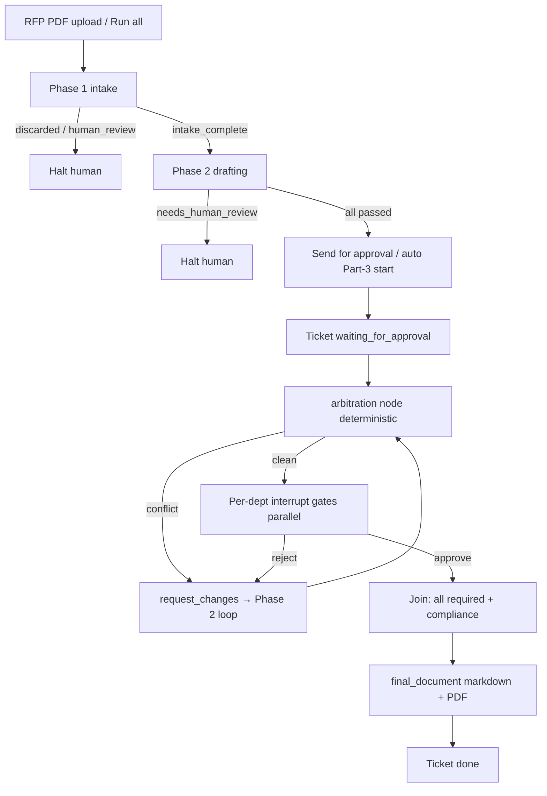

# RFP Intake Phase 3 — Implementation Plan

**Plan file:** [`IMPLEMENTATION_PLAN-rfp-intake-phase3.md`](IMPLEMENTATION_PLAN-rfp-intake-phase3.md)

**Requirements source (authoritative):**
- [`SPEC-rfp-intake-phase3.md`](SPEC-rfp-intake-phase3.md) — Part 3 only
- [`CONTEXT-multi_agent.md`](CONTEXT-multi_agent.md) — §2.1 owners, §5 guidelines, §6 Part 3 deliverable, §7 conflict triggers
- Prior: [`SPEC-rfp-intake-phase1.md`](SPEC-rfp-intake-phase1.md), [`SPEC-rfp-intake-phase2.md`](SPEC-rfp-intake-phase2.md)

**Prerequisite:** Phase 2 delivered on committed `feature/rfp-response-generation` (`d997010` — drafting loops + NLTK fix). `phi_was_redacted` already lives in evaluation JSON / section sync.

**Branch:** `feature/rfp-approval-completion` ← `feature/rfp-response-generation`  
**PR target:** `feature/rfp-response-generation`

**Working directories:**

| Area | Path |
|------|------|
| Approval pipeline (new) | `data/pipelines/rfp_intake/{approval_graph,approval_state,approval_runner,arbitration,final_document,checkpointer,node_logging}.py` |
| Repository / models | `data/pipelines/rfp_intake/repository.py`, `services/api/app/domains/rfp_intake/{models,schema_ddl,schemas,service,router}.py` |
| Frontend | `uis/backoffice/rfp-intake/` (extend detail + actions) |
| Dependencies | `services/api/pyproject.toml` + both `uv.lock` — add `langgraph-checkpoint-postgres`, `psycopg[binary]` (+ PDF render lib) |
| Tests | `tests/pipelines/test_rfp_approval*.py`, extend `services/api/tests/test_rfp_intake.py` |
| Docs | `data/pipelines/rfp_intake/README.md`; update `memory-bank/progress.md` + `decisions.md` before commit request |

**Status:** Plan ready — implement only after developer go-ahead.

**Rule:** Spec + locked clarifications below override ambiguity. Do **not** touch the CX agent graph. Do **not** invent capacity/population/PHI. Do **not** commit until the developer explicitly asks.

---

## Executive summary

Deliver **Milestone 9 Part 3** (final phase):

1. **Send for approval** (stepwise, all sections `passed`) and **Run all phases** (from **RFP PDF upload** through P1→P2→P3) plus mid-pipeline `start-drafting?continue_to_approval=true` (P2→P3 only). Approval graph uses `thread_id = ticket_id` + **durable Postgres checkpointer**.
2. Per-department **interrupt gates** (independent — B can approve while A waits); resume validates owner name-string + decision + reason.
3. **Deterministic arbitration** (`phi-detected` including `phi_was_redacted`, `baa-dpa-mismatch`, `capacity-vs-population`) with fixed arbiters — no LLM.
4. Reject / forced changes **re-enter Phase 2** drafting loop; bounded by `RFP_MAX_APPROVAL_ITERATIONS=3` (per-section).
5. On all required approvals (Compliance mandatory) + PHI cleared → consolidate **markdown + PDF** `FinalDocument`, set ticket `done`.
6. Transition integrity (`can_transition`), redacted execution log, backoffice Approve/Reject UI.



---

## Locked decisions (spec + planning Q&A)

| # | Topic | Decision |
|---|--------|----------|
| 1 | Entry points | **(a)** **`POST .../send-for-approval`** when Phase 2 is complete (all sections `passed`) — UI button label **"Run Phase 3"** (Send for approval). **(b)** **`POST .../run-all` starts from RFP PDF** (multipart → P1→P2→P3; halt at first human stop). **(c)** `start-drafting?continue_to_approval=true` mid-pipeline P2→P3 on existing `intake_complete` ticket (no PDF) |
| 2 | Max iterations | `RFP_MAX_APPROVAL_ITERATIONS=3` **per-section**; expose a per-ticket total (sum) in API/UI; at limit → section `needs_human_review`, ticket stays `waiting_for_approval`, no final doc |
| 3 | Final document | Persist **markdown + PDF**; GET returns both. On transition to `done`, UI **auto-downloads** both artifacts once; a persistent **Download** button (markdown + PDF) remains on the ticket detail for later re-download. `done` only when both retrievable |
| 4 | Approver identity | **Name-string validation** against fixed owners (Tom / Marcus / Claire). Any JWT user may submit; body `approver` must match §1.1 owner for `department_id`. RBAC deferred |
| 5 | PHI mid-revision | Hard stop on residual PHI; always offer **redact** path (reuse Phase 2 scrubbers). `phi_was_redacted` still requires Compliance **Approve** to clear — redaction alone never resolves |
| 6 | Base branch | Branch now from committed `feature/rfp-response-generation` (`d997010`) |
| 7 | `phi_was_redacted` | **Reuse** Phase 2 evaluation JSON / section sync; Compliance Approve clears the gate (no separate clear-PHI action). UI banner + Redact option for residual |
| 8 | Structured arbitration fields | Revenue: `RfpMetadata.covered_population` / `_n` (+ `contract_volume` in revenue `key_aspects` when present). Clinical: `committed_capacity` + `sites` on clinical `key_aspects`. Compliance: `instrument` (`BAA`\|`DPA`) on compliance `key_aspects`, verified via `rules.py`. PHI flags on evaluation results |
| 9 | Missing capacity/population | **Never invent.** If either numeric side missing → soft open-question revision on incomplete dept(s); **do not** fire false `capacity-vs-population` |
| 10 | §14 extras | **In:** `can_transition` guard, decision idempotency, crash-recovery test, golden US/UK final-doc fixtures, README update, `rules.py` for BAA/DPA. **Defer:** telemetry KPIs, checkpoint GC, timeline endpoint |
| 11 | Pytest checkpointer | Unit/gate/arbitration: **MemorySaver**. Isolation + crash-recovery: **Postgres** when `DATABASE_URL` set, else skip. Do not rely on SQLite for `langgraph-checkpoint-postgres` |
| 12 | `run-all` jobs | **One chained JobRun** (`job_name="rfp_run_all"`, `target_key=ticket_id`): stages `intake` → `drafting` → `approval` in the same background job; checkpoint JSON records current stage. Soft-idempotent on content SHA-256 like normal upload |
| 13 | Git | **No commits until the developer explicitly asks** |

### Fixed owners (CONTEXT §2.1)

| `department_id` | `approver` string (exact match) |
|-----------------|----------------------------------|
| `revenue` | `Tom Callahan` |
| `clinical` | `Dr. Marcus Reid` |
| `compliance` | `Claire Whitfield` |

---

## Prerequisites

- [ ] On / based off `feature/rfp-response-generation` @ `d997010` (or later tip)
- [ ] Spec Phase 3 + CONTEXT + this plan read end-to-end
- [ ] `DATABASE_URL` available for checkpointer smoke / crash-recovery tests
- [ ] `LLM_API_KEY` optional (revision path only); tests mock via `respx`
- [ ] Load `.agents/rules/frontend/*` before UI work
- [ ] Availability check (§3 SPEC) noted for PR: Phase 2 loop reusable, `phi_was_redacted` present, `approval_*` columns already on `DepartmentSection`

---

## Phase 0 — Branch + dependencies

### 0.1 Branch

```bash
git fetch origin
git checkout feature/rfp-response-generation
git pull
git checkout -b feature/rfp-approval-completion
```

### 0.2 Dependencies

Add to `services/api/pyproject.toml`, then `uv lock` in **both** `services/api` and repo root:

- `langgraph-checkpoint-postgres`
- `psycopg[binary]` (or `psycopg` binary extra as required by the checkpointer)
- PDF render: prefer **`fpdf2`** (pure Python, no system fonts/Chromium) unless an existing monorepo PDF lib is already locked — document choice in PR

Run checkpointer `.setup()` once on first approval-graph use (idempotent); document in README.

Do **not** change the CX agent checkpointer.

### 0.3 Availability check (PR checklist)

1. `DepartmentSection.approval_status` / `approver` / `approved_at` already exist (Part 1 placeholders) — wire them  
2. Phase 2 `phi_was_redacted` in evaluation sync — confirmed  
3. `EvaluationResult` + `rules.py` + `phi.py` reusable for revision  
4. `langgraph-checkpoint-postgres` + `psycopg` added and locked  
5. Structured fields missing today (`committed_capacity`, `sites`, `instrument`, optional `contract_volume`) — add to `key_aspects` / worker+generator contracts in Phase 1 of build  

---

## Phase 1 — Models, DDL, transition guard, structured fields

### 1.1 New / extended tables (`models.py` + `schema_ddl.py`)

**`FinalDocument`** (`rfp_final_documents`)

| Column | Notes |
|--------|--------|
| `ticket_id` | PK / unique FK → `rfp_tickets` |
| `sections` | JSON: ordered `{department_id, content}` of approved drafts |
| `currency` | `USD` \| `GBP` from `client_country` |
| `generated_at` | timezone-aware |
| `rendered_markdown` | Text |
| `pdf_path` | e.g. `data/raw/{ticket_id}_final.pdf` (runtime artifact; no PHI in path) |

**`RfpExecutionLog`** (dedicated table — preferred over JSON column)

| Column | Notes |
|--------|--------|
| `id` | PK |
| `ticket_id` | indexed FK |
| `agent` | node name |
| `input` / `output` | JSON, **redacted** snapshots |
| `timestamp` | timezone-aware UTC |
| `department_id` | nullable |
| `trigger_id` | nullable |

**`RfpArbitrationRecord`**

| Column | Notes |
|--------|--------|
| `id` | PK |
| `ticket_id` | indexed |
| `trigger_id` | `phi-detected` \| `baa-dpa-mismatch` \| `capacity-vs-population` |
| `arbiter` | owner name |
| `forced_action` | text / JSON |
| `resolved` | bool |
| `created_at` | timezone-aware |

**`DepartmentSection`:** ensure `approval_status` ∈ {`pending`,`approved`,`request_changes`}; add `approval_iteration` int (default 0) for §5.6 bound if not already present. Keep `status` in sync during revision.

**`EvaluationResult`:** keep `phi_was_redacted` in compliance JSON + section `evaluation_results` (no mandatory new column unless query convenience is needed).

DDL helper: `ALTER`/`CREATE` idempotent like Phase 2 evaluation table.

### 1.2 `can_transition(from, to)` 

Single helper used by every ticket status write:

Legal path: `analyzing` → `discarded` \| `intake_complete` → `drafting` → `under_evaluation` → `waiting_for_approval` → `done`  
(+ stay / soft-idempotent same-status writes; `discarded` terminal for Part 1)

Illegal jumps raise / return 409 — locks §5.9.

### 1.3 Structured field population

Extend clinical/compliance/revenue worker + generator contracts so `key_aspects` always include typed keys when knowable:

- clinical: `committed_capacity` (number \| null), `sites` (list \| null)  
- compliance: `instrument` (`BAA` \| `DPA` \| null) inferred from `client_country` when drafting  
- revenue: optional `contract_volume` when present in extract  

Arbitration reads these keys only — never parses draft prose for triggers.

---

## Phase 2 — Checkpointer, logging, arbitration, final document

### 2.1 `checkpointer.py`

- Factory over `settings.database_url` → `PostgresSaver` (or current `langgraph-checkpoint-postgres` API)
- `thread_config(ticket_id) -> {"configurable": {"thread_id": str(ticket_id)}}`
- Idempotent `.setup()` on first use
- Never share threads across tickets

### 2.2 `node_logging.py`

Append `{agent, input, output, timestamp, ticket_id, department_id?, trigger_id?}` via `Annotated[list, operator.add]` on `ApprovalState.execution_log`. Run PHI redact on snapshots before append + persist to `RfpExecutionLog`.

### 2.3 `arbitration.py` (no LLM)

Priority order:

1. **`phi-detected`** — any section `contains_phi` **or** `phi_was_redacted` **or** Phase-3 independent re-scan hits → arbiter Claire; force Compliance review / `request_changes`; block final doc  
2. **`baa-dpa-mismatch`** — `rules.py` predicates on `client_country` + `instrument` / draft clause presence → Claire; force compliance revision  
3. **`capacity-vs-population`** — only if both sides numeric; clinical capacity/sites cannot cover revenue population/volume → Tom (after no PHI); force revenue and/or clinical revision  

Missing numbers → open-question revision, not a false capacity trigger. Persist `RfpArbitrationRecord`.

### 2.4 `final_document.py`

Preconditions: all required sections `approval_status=approved`, Compliance included, no residual `contains_phi`, every historically `phi_was_redacted` section Compliance-cleared (approved), no `needs_human_review`.

- Assemble ordered markdown from approved `draft_content`
- Currency from `client_country`
- Final PHI re-scan on consolidated markdown — any hit → hard stop, no `done`
- Write PDF to `pdf_path`
- Upsert `FinalDocument`; only then `Ticket.status = done`

---

## Phase 3 — Approval graph + runner

### 3.1 `approval_state.py`

TypedDict / state schema: ticket_id, sections snapshot, arbitration, per-dept gate status, execution_log (reducer), approval_iterations, decisions buffer, flags for `phase3_complete` / blocked.

### 3.2 `approval_graph.py`

Compile with Postgres checkpointer (MemorySaver only in unit tests):

1. `arbitration` node  
2. Fan-out / parallel **per-department approval gate** nodes calling `interrupt(payload)`  
3. Gate resume matching: proceed only if `resume.department_id` matches this gate; else re-`interrupt`  
4. On approve → write `approval_status=approved`, `approver`, `approved_at`  
5. On reject → `request_changes` → invoke Phase 2 section loop with feedback → return to arbitration  
6. Join → `final_document` when preconditions met  

Prefer LangGraph interrupt-id targeting when available (≥1.2.9); department_id matching is the version-robust fallback.

### 3.3 `approval_runner.py`

- `start(ticket_id)` — validate all required sections `passed`; `can_transition` → `waiting_for_approval`; create `JobRun(job_name="rfp_approval")` unless already inside `rfp_run_all`; invoke graph to first interrupts  
- `resume(ticket_id, decision)` — validate then `Command(resume=...)`  
- Soft-idempotent start if already `waiting_for_approval` / `done`  
- `__main__` CLI: `--ticket-id`, `--resume-department`, etc.

### 3.4 Revision path

Reuse `drafting_runner` / section loop for a single department with approver `reason` and/or `trigger_id` in `feedback_for_generator`. Increment `approval_iteration`. At max → `needs_human_review`, retain last draft + evaluations + arbitration record.

### 3.5 Chained `run-all` (starts from RFP PDF)

**Canonical end-to-end path:** user selects/uploads the RFP PDF → one background job `rfp_run_all` runs all automated phases until a human is required.

1. **Accept PDF** (multipart) — same store path as Part 1 (`data/raw/{ticket_id}.pdf`), SHA-256 idempotency (reuse existing upload ticket if identical bytes + safe to continue)  
2. Stage **`intake`** — run Part 1 graph → `intake_complete` \| `discarded` \| `analyzing`+human_review  
3. If discarded or Part-1 human review → **halt** (do not auto-draft)  
4. Stage **`drafting`** — Part 2 loops until all `passed` or any `needs_human_review`  
5. If any `needs_human_review` → **halt** (do not start approval)  
6. Stage **`approval`** — same Part-3 start helper → graph pauses at department interrupts  
7. Checkpoint JSON: `intake` \| `drafting` \| `approval` \| `halted_discarded` \| `halted_human_review`

**Separate mid-pipeline path:** `start-drafting?continue_to_approval=true` on an existing `intake_complete` ticket runs stages `drafting`→`approval` only (no PDF). Same Part-3 start helper at the end.

**UI:** primary **Run all phases** control is on the upload surface (choose PDF → run). Ticket detail: stepwise **Start drafting**; when Phase 2 is complete show **"Run Phase 3"** (`send-for-approval`); show in-flight `rfp_run_all` status when applicable.
---

## Phase 4 — API endpoints

| Method | Path | Behavior |
|--------|------|----------|
| `POST` | `/tickets/{id}/send-for-approval` | All sections `passed` → start approval graph; `202`; soft-idempotent if already waiting/done |
| `POST` | `/run-all` (multipart PDF) | **Starts from RFP PDF:** create/reuse ticket → one `rfp_run_all` JobRun → intake→drafting→approval; `202` + `ticket_id`; halt at first human stop |
| `POST` | `/tickets/{id}/start-drafting?continue_to_approval=true` | Mid-pipeline only: drafting→approval on existing `intake_complete` ticket (no PDF) |
| `POST` | `/tickets/{id}/departments/{department_id}/decision` | Body `{decision, approver, reason?}`; validate owner name, reason on reject, pending gate; idempotent duplicate approve |
| `GET` | `/tickets/{id}/final-document` | Returns metadata + markdown (+ PDF URL or bytes). Support query `?format=markdown\|pdf\|zip` (or two download links) so the UI can fetch either artifact anytime |
| `GET` | `/tickets/{id}/final-document/pdf` | Optional dedicated PDF download (`application/pdf` attachment) for the re-download button |

All behind `Depends(get_current_user)`.

**Decision validation (400/409):**

- Ticket `waiting_for_approval`  
- `department_id` required for ticket  
- `decision` ∈ {`approve`,`reject`}; `reason` required on reject  
- `approver` exact match to fixed owner table  
- Gate pending (not already approved / not mid-revision)  
- Idempotency key: `(ticket_id, department_id, decision, approver)` — duplicate approve returns current state without second resume  

Extend ticket detail schema: approval fields, arbitration records, execution log (redacted), final-doc availability, `approval_iteration` / ticket total.

---

## Phase 5 — Backoffice UI (`uis/backoffice/rfp-intake/`)

- **Run all phases** on the **upload / list surface**: choose RFP PDF → `POST /run-all` (full P1→P2→P3 until human stop)  
- **Start drafting** (existing) on `intake_complete`; optional **Continue to approval** (`continue_to_approval=true`) for P2→P3 without re-upload  
- **Run Phase 3** (alias: Send for approval) on ticket detail when Phase 2 is complete — every required section `status === "passed"`, none in `needs_human_review`. Calls `POST .../send-for-approval`. Primary CTA for stepwise Part-3 entry; hide once `waiting_for_approval` / `done`  
- On `waiting_for_approval`: per-dept panel — redacted preview, owner, `approval_status`, Approve / Reject (reason required), PHI / `phi_was_redacted` banner (“PHI redacted — Compliance review required”), Redact action when residual PHI  
- Show arbitration trigger / arbiter / forced action; `needs_human_review` + re-draft  
- On `done`:
  - **Auto-download** the consolidated markdown and PDF once when the UI first observes `status === "done"` (session-flagged so polling does not re-trigger).
  - Always show a persistent **Download** control (markdown + PDF, or combined) so users can return later and re-download.
  - Show `currency`. Never render raw PHI.
- Poll ticket detail; disable buttons on submit; ≤80-line components; follow frontend rules
---

## Phase 6 — Tests

Mock LLM (`respx`); no live network; no committed raw PHI (synthetic in-memory / SPEC1 fixture pattern).

**Unit (`tests/pipelines/`):**

1. Arbitration: three triggers + priority (PHI > BAA/DPA > capacity); Compliance beats Revenue  
1b. `phi_was_redacted=true` + `contains_phi=false` still fires `phi-detected`; Phase-3 re-scan catches DOB/MRN/email Phase 2 missed  
2. Interrupt/gate: matching resume advances; other dept stays paused  
3. Resume validation: wrong owner, missing reason, wrong status, duplicate approve  
4. Revision + max iterations → `needs_human_review`, no final doc  
5. `thread_id` isolation (two tickets) — Postgres when available  
6. Node logging redaction — no raw PHI  
7. Final document preconditions + currency US/UK + PDF present  
8. Compliance-mandatory: cannot `done` without Claire  

**Integration / e2e:**

9. Seeded all-`passed` → approvals → `done` + final doc  
10. B approves while A interrupted  
11. Full three-phase Meridian (or golden markdown path) consistency — no status jumps / data loss / PHI leak  
12. `run-all` from PDF: intake→drafting→stops at approval interrupts; resume to completion; also halt on Part-1 discard/human_review or Phase 2 `needs_human_review`  
13. Crash-recovery: interrupt → simulate restart → resume from Postgres checkpoint (skip without `DATABASE_URL`)  

API tests for new endpoints + soft-idempotency. Landing `npm run verify`.

---

## Phase 7 — Docs + memory-bank

- Update `data/pipelines/rfp_intake/README.md`: approval graph, interrupt/resume, thread_id, arbitration, final markdown+PDF, env `RFP_MAX_APPROVAL_ITERATIONS`, checkpointer `.setup()`  
- Golden fixtures: US (BAA/USD) + UK (DPA/GBP) expected consolidated markdown snippets  
- Before commit request: update `progress.md` + `decisions.md` (Postgres checkpointer, name-string approvers, chained JobRun, PDF artifact, structured key_aspects, `can_transition`)  
- PR body: availability check, §8 decisions, arbitration wiring, transition-integrity fixes, validated vs residual gaps  

---

## Build order (execute in sequence)

1. Branch + deps + checkpointer factory + `.setup()`  
2. Models/DDL: `FinalDocument`, execution log, arbitration records, `approval_iteration`, structured `key_aspects` keys  
3. `can_transition` + wire existing status writes  
4. `arbitration.py` + `node_logging.py` + `final_document.py` (md+pdf)  
5. `approval_state` / `approval_graph` / `approval_runner`  
6. Revision path into Phase 2 loop + max iterations  
7. Service/router: `send-for-approval`, `run-all`, `continue_to_approval`, `decision`, `final-document`  
8. Chained JobRun `rfp_run_all`  
9. Backoffice UI  
10. Unit → integration/e2e → crash-recovery  
11. README + memory-bank; request commit acknowledgement  

---

## Out of scope

- CX agent graph / its checkpointer  
- Real RBAC / owner-linked auth users  
- Telemetry KPIs, checkpoint GC, `GET .../timeline`  
- Changing Phase 1 classifier or Phase 2 quality bar beyond revision reuse  
- Committing until developer asks  

---

## Acceptance mapping (SPEC §12)

| Criterion | Plan coverage |
|-----------|---------------|
| Send for approval + Run all from PDF (P1→P2→P3, halt at interrupts) + durable Postgres checkpoint | Phases 0, 3, 4 |
| Per-dept interrupt; B while A waits | §3.2, test 10 |
| Resume validates + routes; restart-safe | §3.3, §4, test 13 |
| Arbitration + `phi_was_redacted` | §2.3, tests 1/1b |
| Revision + max iterations | §3.4, test 4 |
| Redacted node logging | §2.2, test 6 |
| `thread_id` isolation | §2.1, test 5 |
| Final doc md+pdf, Compliance mandatory, `done` when accessible | §2.4, tests 7–8 |
| Transition integrity | §1.2, test 11 |
| Tests green | Phase 6 |

---

## Residual risks

- LangGraph multi-interrupt resume API nuances on installed ≥1.2.9 — mitigate with department_id re-interrupt pattern  
- `langgraph-checkpoint-postgres` + Supabase connection pooling — use dedicated connection string / psycopg kwargs documented in README  
- PDF library font/emoji edge cases — keep final PDF text-only ASCII-safe markdown render  
- Chained `rfp_run_all` (PDF→done-path) long runtime — JobRun `processing` lock + stale reclaim already exist; reuse  
- Upload SHA-256 idempotency vs “force new run-all” — default reuse ticket when bytes match and status allows continue; document override if needed  

---

**Next step:** Developer go-ahead to implement on `feature/rfp-approval-completion`.
