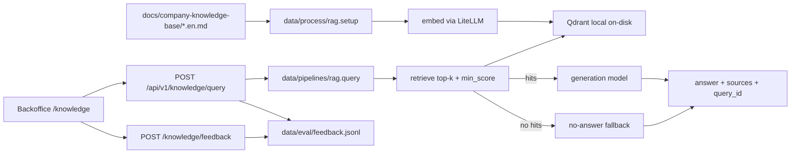

# Milestone 7 — RAG Knowledge Base — Implementation Plan

**Plan file:** [`rag_milestone7_IMPLEMENTATION_PLAN.md`](rag_milestone7_IMPLEMENTATION_PLAN.md)

**Requirements source (authoritative):** [`rag_milestone7_specs.md`](rag_milestone7_specs.md)

**Branch:** `feature/rag` (create off latest `main`; all work on this branch; PR into `main` when ready)

**Working directories:**

| Area | Path |
|------|------|
| Processing | `data/process/rag.py` |
| Pipeline | `data/pipelines/rag.py` |
| Eval | `data/eval/test-queries.json`, `data/eval/run_eval.py` |
| API domain | `services/api/app/domains/knowledge/` |
| Seed script | `scripts/seed_knowledge_base.py` (or uv script entry) |
| UI module | `uis/backoffice/knowledge/` (aliased into landing) |
| Theme | `uis/backoffice/shared/` + landing root layout |
| Design doc | `docs/rag-design.md` |

**Status:** Implemented on `feature/rag` — unit/API/Jest green; live `run_eval.py` + tuned `RAG_MIN_SCORE` pending before PR.

**Rule:** Spec §2 resolved decisions and the locked planning clarifications below override any ambiguity elsewhere. Do not introduce LangChain/LlamaIndex. Do not add PHI or simulated patient records.

---

## Executive summary

Build a JWT-protected RAG assistant for patient coordinators: index four English HealthCore policy docs into local on-disk Qdrant, retrieve top-k chunks, generate faithful salesperson-tone answers via the 4Geeks LiteLLM proxy, and expose the flow through FastAPI + a backoffice UI with sources and thumbs feedback.



---

## Locked decisions (spec §2 + planning Q&A)

| # | Topic | Decision |
|---|--------|----------|
| 1 | Repo / branch | This monorepo; **`feature/rag` off `main`** |
| 2 | Qdrant | Local on-disk via `qdrant-client` (no server/Cloud) |
| 3 | Auth | JWT via `get_current_user` on the knowledge router |
| 4 | Language | English only; index four `.en.md` files; payload `language` always `"en"` |
| 5 | KB sources | Already in `docs/company-knowledge-base/` |
| 6 | LLM key | Developer has working `LLM_API_KEY` for live seed/eval |
| 7 | UI shape | **Landing-aliased** module `uis/backoffice/knowledge/` on port **3001** (same pattern as inventory / incident-manager / reporting) |
| 8 | Hub | Add **NAV_APPS** card (tag `"New"`) for Knowledge Assistant |
| 9 | Seeding | **CLI seed** (`scripts/seed_knowledge_base.py`) as primary; **API startup no-op** if collection already populated; if empty, run idempotent `setup()` in-process once |
| 10 | Feedback store | **JSONL only** at `FEEDBACK_PATH` (default `data/eval/feedback.jsonl`); **no Supabase table** |
| 11 | Preference pairs | **Schema fields only** — `session_id` / `parent_query_id` nullable on interaction records; **UI wiring deferred** |
| 12 | Stretch (§18) | **In scope:** pure semantic chunker, chunk-integrity assert in `setup`, query pre-processing. **Defer:** embedding cache, telemetry hooks, hosted-Qdrant factory, bilingual indexing |
| 13 | Theme | **Shared light/dark toggle** in `@backoffice/shared`, wired into landing root layout; knowledge UI uses `dark:` variants |
| 14 | HTTP client | **`httpx`** for embeddings + chat (promote to runtime dep); no `openai` SDK |
| 15 | Jest location | Tests live under landing (or `uis/backoffice/knowledge/__tests__` mapped via landing Jest aliases) — **not** a separate `npm --prefix knowledge` app |

---

## Prerequisites

- [ ] On latest `main`; create `feature/rag`
- [ ] Four source docs present under `docs/company-knowledge-base/` (verified)
- [ ] `LLM_API_KEY` available in git-ignored `.env` (root and/or `services/api/.env`)
- [ ] Landing `npm install` / API `uv sync` can run locally
- [ ] Spec + this plan read end-to-end before coding

---

## Phase 0 — Branch, ignore paths, config

### 0.1 Branch

```bash
git checkout main
git pull   # if tracking remote
git checkout -b feature/rag
```

### 0.2 Gitignore

Add (if missing):

- `data/qdrant/` (or whatever `QDRANT_PATH` resolves to)
- `data/eval/feedback.jsonl`

Keep `data/eval/test-queries.json` **tracked**.

### 0.3 Env + Settings

Add to `services/api/app/core/config.py` `Settings` and both `.example.env` files (repo root + `services/api/`):

| Env var | Default / notes |
|---------|-----------------|
| `LLM_BASE_URL` | `https://llm.4geeks.ai` |
| `LLM_API_KEY` | required; empty placeholder in examples |
| `EMBEDDING_MODEL` | `downtown-miami/openrouter/perplexity/pplx-embed-v1-0.6b` |
| `GENERATION_MODEL` | `downtown-miami/openrouter/deepseek/deepseek-v4-flash` |
| `QDRANT_PATH` | `./data/qdrant` |
| `QDRANT_COLLECTION` | `company_knowledge_base` |
| `RAG_TOP_K` | `3` |
| `RAG_MIN_SCORE` | `0.30` (starting point; tune in Phase 8) |
| `FEEDBACK_PATH` | `./data/eval/feedback.jsonl` |

`data/process/rag.py` and `data/pipelines/rag.py` must load settings independently of a running FastAPI process (reuse `Settings` / dotenv bootstrap like `scripts/nightly_export.py`: root `.env` then fill gaps from `services/api/.env`). **Fail fast** if `LLM_API_KEY` is unset when calling the proxy.

### 0.4 Dependencies

In `services/api/pyproject.toml` (and dual lockfiles per conventions):

- Add `qdrant-client`
- Promote `httpx` to runtime dependencies

```bash
# from services/api after editing pyproject
uv lock
# also refresh root uv.lock if workspace requires it
```

---

## Phase 1 — Golden set

Create `data/eval/test-queries.json` (≥8 answerable covering **all four** docs + ≥2 abstain).

**Must cover (from docs + spec):**

| Topic | Expected doc / behavior |
|-------|-------------------------|
| Georgia vs Texas Medicaid | `insurance-coverage` |
| US vs UK coverage | `insurance-coverage` |
| Self-pay 20% discount | `insurance-coverage` |
| Cancellation &lt;24h fees `$50` / `£40` | `appointment-policy` |
| Medicare/Medicaid no no-show fee | `appointment-policy` |
| Referral ~11 days / 5-day escalate to Marcus Reid | `referral-process` |
| New-patient bring ID / insurance card | `new-patient-checklist` |
| Unlisted insurer → verify with Tom Callahan | guardrail (answerable or dedicated) |
| Country-ambiguous coverage → both US and UK in answer | guardrail |
| ≥1 Spanish-language question against English index | answer-language rule |
| ≥2 should-abstain (e.g. dental) | `should_abstain: true`, empty key facts |

Every `expected_key_facts` value must be a **verbatim** datum from the source docs. No PHI.

---

## Phase 2 — Processing layer (`data/process/rag.py`)

New module (+ `__init__.py` if needed). Bootstrap `sys.path` like `data/pipelines/pipeline.py` when importing `app.*`.

### 2.1 Public API

| Symbol | Role |
|--------|------|
| `chunk_markdown(md: str, *, source_document: str) -> list[Chunk]` | **Pure** semantic chunker (in-scope §18) |
| `assert_chunk_integrity(chunks)` | Fail loud on mid-sentence / mid-bullet splits |
| `embed(text: str) -> list[float]` | Single-text embedding; no title enrichment inside |
| `store_vector(...)` | Create/recreate collection + upsert + full-text index on `text` |
| `setup(...) -> SetupResult` | Read docs → chunk → enrich → embed → delete-by-doc → upsert |
| CLI | `python -m data.process.rag` / `__main__` |

### 2.2 Chunking rules

- Structure-aware Markdown: keep heading + following list/paragraph as a unit.
- Never split mid-sentence, mid-bullet, or mid-numbered-step.
- Soft max ~500–800 tokens / ~1,200 chars; prefer semantic boundaries.
- **≥3 chunks per document** KPI; if fewer, split at next-lower heading still respecting integrity.
- Payload `section` = nearest heading/subtitle; `chunk_index` 0-based within `source_document`.
- Payload fields: `company="healthcore"`, `language="en"`, `source_document`, `section`, `chunk_index`, `text` (verbatim body).

### 2.3 Contextual embedding (index only)

At `setup` call site (not inside `embed`):

```text
f"{doc_title} — {section}\n{chunk_text}"
```

Query embeddings remain raw question text.

### 2.4 Idempotency + stale cleanup

- Point ID: `uuid5(NAMESPACE, f"{source_document}:{chunk_index}")`.
- Before upserting a document’s chunks: **delete** existing points with `source_document == that doc` (payload filter).
- Collection create if missing; if dimension mismatch vs probed dim → recreate (warn).
- Distance: **COSINE**. Create full-text payload index on `text` at collection creation (hybrid seam).
- Probe vector dimension once via a short `embed()` call — never hardcode.

### 2.5 `embed` errors

- Typed `EmbeddingError` on non-2xx / malformed body.
- Bounded retry on 5xx/timeout; sane timeouts.
- Optional `input_type` only if proxy/model requires query vs passage distinction (verify; omit if unused).

### 2.6 Seed script + startup

- `scripts/seed_knowledge_base.py` (or `[project.scripts]` entry) runs `setup()` with API **stopped** preferred.
- API lifespan/startup: if collection missing or empty → call `setup()` once; if populated → **no-op**. Document Qdrant local **file-lock** caveat in code comments + design doc.

---

## Phase 3 — Pipeline layer (`data/pipelines/rag.py`)

| Symbol | Role |
|--------|------|
| `normalize_query(question: str) -> str` | Trim, collapse whitespace, enforce max length (in-scope pre-process) |
| `retrieve(query, *, top_k, min_score) -> list[dict]` | Dense search; filter score; include `text` + `score` |
| `query(question: str) -> QueryResult` | Orchestrate retrieve → fallback or generate |
| `QueryResult` | `answer: str`, `sources: list[dict]` |

### 3.1 Retrieve

- Embed normalized query; search top-k; drop hits **strictly below** `min_score`.
- Return surviving payloads ordered by score desc; `[]` if none.
- Dense-only this milestone; full-text index is seam only.

### 3.2 Query / prompt

- Empty retrieval → English salesperson fallback (*knowledge base has no relevant information…*); **`sources=[]`**; **do not call** generation.
- Else assemble labeled context blocks (`[Source: {source_document} — {section}]`), score-desc, never truncate chunks; then user question.
- Bake guardrails into system/prompt: salesperson tone; facts only from context; unlisted insurer → Tom Callahan; US/UK distinction; Medicare/Medicaid no no-show fee; no PHI; cite source naturally; **answer in question language, keep policy values verbatim**.
- Temperature ~0.1–0.2.
- `sources`: dedupe by `(source_document, section)`, keep highest score, score-desc.

Typed errors for LLM/proxy failures → API maps to 502/503.

---

## Phase 4 — Knowledge API domain

Create `services/api/app/domains/knowledge/`:

| File | Responsibility |
|------|----------------|
| `schemas.py` | Request/response models (§9) |
| `service.py` | Call `query()`; mint `query_id`; write interaction JSONL; feedback attach; PII screen |
| `router.py` | `APIRouter(prefix="/knowledge", tags=["knowledge"])` |
| `feedback_store.py` | Append-only JSONL helpers |
| `pii.py` | Lightweight regex redact/drop before persist |

### 4.1 Routes (JWT-protected)

Register in `app/api/v1/router.py` with `dependencies=[Depends(get_current_user)]`:

| Method | Path | Body / response |
|--------|------|-----------------|
| `POST` | `/api/v1/knowledge/query` | `{question}` → `{query_id, answer, sources}` |
| `POST` | `/api/v1/knowledge/feedback` | `{query_id, rating, comment?}` → `{status: "recorded"}` |

Validation: non-empty trimmed question; `max_length` ~1000 → 422. Feedback comment optional, trimmed, `max_length` ~2000. Unknown `query_id` → **404**.

### 4.2 Interaction + feedback JSONL

Append-only, one JSON object per line. On `/query` write interaction:

- `schema_version`, `query_id`, `timestamp`, `user_id` (from JWT)
- `question`, `answer`, `sources`, `context_texts`
- `generation`: `model`, `temperature`, assembled prompt (or reconstructible fields)
- `session_id: null`, `parent_query_id: null` (schema ready; UI deferred)

On `/feedback`: second line referencing `query_id` with `rating`, `comment`, feedback `timestamp` (do not mutate prior line).

PII screen on `question`/`comment` before persist; never INFO-log raw feedback content. Document retention + deletion-by-`query_id` + scrub-before-reuse in design doc.

---

## Phase 5 — Shared theme toggle + Knowledge UI

### 5.1 Shared theme (`uis/backoffice/shared/`)

Add small theme module (≤80-line files):

- `lib/theme.ts` — `light` \| `dark` \| `system`; persist key e.g. `healthcore_theme`; resolve effective mode
- `components/theme-toggle.tsx` — accessible control (pressed state, labels)
- Provider/hook that sets `classList` `dark` on `<html>` for Tailwind `dark:` variants

Wire into `uis/backoffice/landing/app/layout.tsx` (and place toggle in a shared chrome spot used by protected tools — e.g. near ToolToolbar / header — without breaking existing pages). Ensure `globals.css` / Tailwind dark variant is enabled (`@custom-variant dark` or `darkMode: 'class'` per Tailwind v4 landing setup).

### 5.2 Feature module `uis/backoffice/knowledge/`

Mirror inventory / reporting:

| Piece | Action |
|-------|--------|
| Alias | `@backoffice/knowledge` in `landing/next.config.ts` + `tsconfig.json` + Jest `moduleNameMapper` |
| Tailwind | `@source` path in landing `globals.css` |
| Route | `(protected)/knowledge/page.tsx` (+ thin layout with ToolToolbar) |
| Hub | `NAV_APPS` entry: title e.g. "Knowledge Assistant", url `/knowledge`, `tag: "New"` |

**UI requirements:**

- Question textarea (labeled), submit (disabled when empty/loading), answer panel with `aria-live`
- `healthcoreFetch("/knowledge/query", { method: "POST", body: JSON.stringify({ question }) })` only
- Loading / empty / error states; network/5xx friendly message; empty `sources` = valid no-answer (not error)
- Sources list when present (`source_document · section`)
- Feedback: thumbs up/down; optional comment on down-vote; PHI notice line; fire-and-forget `POST /knowledge/feedback`; failure must not hide answer
- Light/dark via shared toggle + contrast check

Component files ≤80 lines; const functional components; no third-party UI kits.

### 5.3 Frontend tests (Jest via landing)

Mock `healthcoreFetch`. Minimum cases from spec §10:

- Renders form
- Submit calls client with typed question
- Loading disables button
- Success renders answer **and** sources
- Failure renders error
- Empty sources = answer, no sources list
- Thumbs-down posts `{query_id, rating}`; feedback failure leaves answer visible

---

## Phase 6 — Unit tests (`tests/pipelines/test_rag.py`)

Mock **all** network; use pytest `tmp_path` for Qdrant. Cover:

- `setup`: four docs; ≥3 chunks/doc; payload fields; idempotent re-run; no mid-bullet splits; stale-chunk cleanup behavior
- `embed`: URL/model/auth assertions; vector return; `EmbeddingError`
- `store_vector`: COSINE + probed dim; idempotent upsert; dimension-mismatch recreate
- `retrieve`: top-k, min_score filter, empty, score order, `text` present
- `query`: happy path + sources dedupe; empty → fallback + generation **not** called; prompt contains guardrails
- Harness sanity against `test-queries.json` with stubbed embedder
- Knowledge API feedback tests (valid record, 404 unknown id, interaction reproducibility fields, PII redact, no raw feedback in logs)

Run:

```bash
uv run pytest tests/pipelines/test_rag.py -v
# plus knowledge/feedback API tests wherever colocated
uv run pytest   # full suite before hand-off
```

---

## Phase 7 — Eval script (`data/eval/run_eval.py`)

Skip entire script in CI unless `LLM_API_KEY` is set. Emit human-readable + JSON metrics.

| Tier | Metrics / gates |
|------|-----------------|
| Retrieval | Recall@3 **≥ 80%** (hard); report Recall@1, MRR, score distribution |
| Abstention | False-answer rate **= 0** (hard); no wrong abstain on answerable |
| Generation deterministic | Key-fact coverage **≥ 90%** (target); guardrail scenarios **all pass** (hard) |
| Faithfulness | Opt-in LLM judge; target ≥ 95%; never gates CI |

Tune `RAG_MIN_SCORE` from score distribution; record final value in design doc.

```bash
LLM_API_KEY=… uv run python data/eval/run_eval.py
```

---

## Phase 8 — Design doc (`docs/rag-design.md`)

Author per spec §14: problem/goals, architecture flow, chunking + per-doc counts, models/URLs/dim probe, Qdrant lock caveat + seed strategy, payload/ID scheme, tuned `top_k`/`min_score`, dense-only + hybrid trigger, contextual embedding asymmetry, prompt + answer-language rule, guardrails/KPIs, PHI posture, **actual eval numbers**, feedback loop + retention/scrub, trade-offs / §18–§19 follow-ups.

---

## Phase 9 — Verify & hand-off

1. Idempotent `setup` twice → same IDs/counts
2. Curl/Swagger smoke: `/knowledge/query` + `/feedback` with Bearer token
3. UI: answer, sources, feedback, light/dark, error paths
4. `uv run pytest` green; `npm run verify` in `uis/backoffice/landing`
5. `run_eval.py` meets §12.5 hard gates; numbers in design doc
6. Update `memory-bank/progress.md` and `memory-bank/decisions.md` when delivering
7. Open PR `feature/rag` → `main` when asked (do not commit/push unless requested)

---

## File touch list (expected)

| Path | Change |
|------|--------|
| `data/process/rag.py` (+ `__init__.py` if needed) | New |
| `data/pipelines/rag.py` | New |
| `data/eval/test-queries.json` | New |
| `data/eval/run_eval.py` | New |
| `scripts/seed_knowledge_base.py` | New |
| `services/api/app/domains/knowledge/*` | New |
| `services/api/app/api/v1/router.py` | Register knowledge router |
| `services/api/app/core/config.py` | New settings fields |
| `services/api/app/main.py` | Startup Qdrant/seed check if needed |
| `services/api/pyproject.toml` + lockfiles | `qdrant-client`, `httpx` |
| `.example.env`, `services/api/.example.env` | New env placeholders |
| `.gitignore` | Qdrant path + feedback.jsonl |
| `tests/pipelines/test_rag.py` | New |
| `tests/...` knowledge API / feedback | New as needed |
| `uis/backoffice/knowledge/**` | New feature module |
| `uis/backoffice/shared/lib/theme.ts` + toggle | New |
| `uis/backoffice/landing/app/layout.tsx` | Theme provider / class |
| `uis/backoffice/landing/app/(protected)/knowledge/*` | Routes |
| `uis/backoffice/landing/next.config.ts`, `tsconfig.json`, `globals.css`, `jest.config.ts` | Alias + `@source` |
| `uis/backoffice/landing/lib/nav-apps.ts` | Hub card |
| `uis/backoffice/landing/__tests__/…` | Knowledge + theme tests as needed |
| `docs/rag-design.md` | New |
| `memory-bank/progress.md`, `decisions.md` | At delivery |

---

## Out of scope (explicit)

- Patient records / PHI / chat history / multi-turn / streaming / re-ranking
- LangChain / LlamaIndex
- Supabase feedback table
- UI wiring for `session_id` / `parent_query_id`
- Embedding cache, telemetry instrumentation, hosted Qdrant, Spanish index
- Committing/pushing without explicit request

---

## Definition of done (checklist)

- [ ] `setup`, `embed`, `store_vector` in `data/process/rag.py`; `retrieve`, `query` in `data/pipelines/rag.py`
- [ ] Pure chunker + integrity assert + query normalize
- [ ] Idempotent setup with per-doc delete-before-upsert; ≥3 chunks/doc
- [ ] CLI seed + API startup no-op when populated
- [ ] `POST /api/v1/knowledge/query` and `/feedback` JWT-protected
- [ ] JSONL interaction + feedback; PII screen; schema includes nullable session/parent fields
- [ ] Landing-aliased UI with sources, feedback, hub card, shared theme toggle
- [ ] Unit + Jest tests pass; full pytest + landing verify pass
- [ ] `run_eval.py`: Recall@3 ≥ 80%, false-answer rate = 0, guardrails pass; `min_score` tuned
- [ ] `docs/rag-design.md` with actual metrics
- [ ] No hardcoded secrets/URLs/models/dimensions

---

## Suggested implementation order

1. Phase 0 (branch, env, deps, gitignore)  
2. Phase 1 (golden set)  
3. Phase 2 (process + seed)  
4. Phase 3 (pipeline)  
5. Phase 6 unit tests (process/pipeline) interleaved with 2–3  
6. Phase 4 (API + feedback) + API tests  
7. Phase 5 (theme + UI + Jest)  
8. Phase 7 (live eval + tune)  
9. Phase 8 (design doc)  
10. Phase 9 (verify / memory-bank / PR when asked)

---

## Residual risks

| Risk | Mitigation |
|------|------------|
| Perplexity embed misses named entities (Bupa, Medicaid Georgia) | Full-text index seam; tune `min_score`; swap embed model via config if Recall@3 fails |
| Qdrant local file lock | Seed with API stopped; single client; document in design doc |
| DeepSeek drifts from context | Low temperature; prompt guardrails; eval faithfulness opt-in; model swap via config |
| Coordinator pastes PHI into question/comment | UI notice + server regex screen + scrub-before-reuse gate |
| Dual `.env` locations | Bootstrap root then `services/api/.env` for CLI/seed/eval |
| Theme toggle regresses existing landing pages | Prefer additive `dark:` classes; default light; smoke existing hub routes |

---

## Follow-ups (not this PR)

- Wire `session_id` / `parent_query_id` in UI after downvote re-ask  
- Hybrid dense + keyword retrieval if named-entity misses persist  
- Embedding content-hash cache; telemetry for hit/no-answer rates  
- Hosted Qdrant client factory; index `.es.md` bilingual routing  
- Alternate models (§19) if KPI gates fail after prompt/`min_score` tuning  
