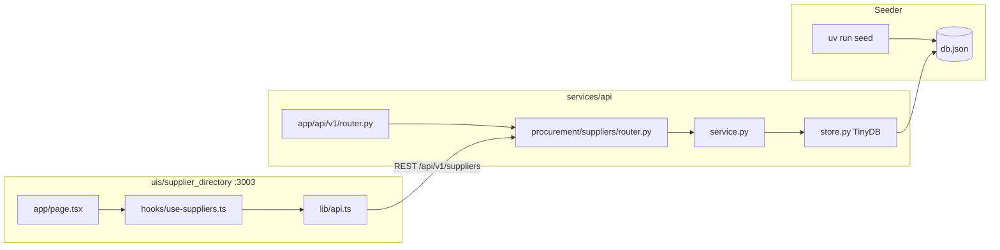

# Supplier Directory — Implementation Plan

**Plan file:** [`memory-bank/references/supplier_directory_ai_plan/IMPLEMENTATION_PLAN.md`](IMPLEMENTATION_PLAN.md)

**Requirements source:** [`SPECS.md`](SPECS.md), [`CONTEXT-healthcore.md`](CONTEXT-healthcore.md)

**Milestone:** 09 — Lightweight Storage API

**Status:** Delivered — backend, frontend, tests, and docs complete

---

## Executive summary

HealthCore's procurement team needs a centralized supplier registry replacing departmental spreadsheets. This plan delivers:

1. **Backend** — FastAPI procurement domain at `services/api/app/domains/procurement/suppliers/` using **TinyDB** (interim JSON store; Postgres migration deferred per James Osei).
2. **Seeder** — Manual `uv run seed` loads exactly 15 suppliers idempotently (dedupe by `name`).
3. **Frontend** — Standalone Next.js 16 app at `uis/supplier_directory` on **port 3003**, visually aligned with `uis/incident_analyzer`.

The implementation **extends** the existing `services/api` monolith alongside the incidents domain — it does not replace or break incident routes.

---

## Planning decisions (locked)

These resolve ambiguities between SPECS, CONTEXT, and the current codebase.

| Topic | Decision |
|-------|----------|
| Backend layout | Follow existing `app/` package + layered domain (`router.py`, `schemas.py`, `service.py`, `store.py`) — not SPECS' flat `main.py` / `routes.py` layout |
| Router registration | Mount suppliers router in `app/api/v1/router.py` (prefix `/suppliers` under `/api/v1`) |
| Uvicorn entry | `uv run uvicorn app.main:app --reload --port 8000` |
| Seeding | **Manual only** — `uv run seed` before demo; no auto-seed on API startup |
| CORS | Extend `app/core/config.py` default `cors_origins` to include `http://localhost:3003` (settings-driven, not wildcard `*`) |
| Duplicate names on POST | **Reject with 422** — registry enforces unique supplier names |
| `rate_updated_at` on seed | **Set to seed/run timestamp** for all 15 records |
| `rate_updated_at` on POST create | **Set to server UTC timestamp** at registration (initial rate recorded for audit) |
| `rate_updated_at` on PATCH rate | Server UTC timestamp on every rate change |
| DELETE in UI | **Not exposed** — API implements soft suspend; UI uses PATCH `/status` only |
| Table editing UX | **Actions column only** — rate and status columns are read-only display; rate editor + status toggle live in Actions (revisit inline/cell edit later if needed) |
| List filters (UI) | **Client-side** — fetch all suppliers once; filter in hook (API query params still implemented and tested) |
| List columns | SPECS §10.4 fields **plus** `compliance_agreement` (CONTEXT / Claire audit needs) |
| Currency on form | **Auto-derive** from country (hidden in UI; API receives correct USD/GBP) |
| Category display | **Humanized labels** in UI; API and storage remain snake_case |
| Visual chrome | **Copy** header/logo/globals pattern from `uis/incident_analyzer` |
| Dev port | **3003** |
| Memory-bank updates | Update `progress.md` and `decisions.md` **only after** backend + frontend verify pass |
| Component constraints | ≤80 lines per file, const functional components, no third-party UI libs, `npm run verify` |

---

## Requirements summary

### Business context

- HealthCore Digital operates 12 outpatient clinics (USA: Texas, Florida, Georgia; UK: London, Manchester).
- Stakeholders: **Diane Foster** (VP People), **Claire Whitfield** (Chief Compliance Officer), **James Osei** (CTO).
- Suppliers are never hard-deleted — suspension preserves audit history.
- Rate changes must be traceable via `rate_updated_at`.

### Supplier data model

| Field | Type | Required | Notes |
|-------|------|----------|-------|
| `name` | string | Yes | Unique across registry |
| `country` | string | Yes | `"USA"` or `"UK"` only |
| `categories` | list[string] | Yes | Min 1; each in `VALID_CATEGORIES` |
| `monthly_rate` | float | Yes | Must be > 0 |
| `currency` | string | Yes | `"USD"` (USA) or `"GBP"` (UK); must match country |
| `rate_updated_at` | datetime | System | Set on seed, POST create, and every rate PATCH; never client-provided |
| `status` | string | Yes | `"active"` or `"suspended"` |
| `compliance_agreement` | string \| null | No | `"BAA"`, `"DPA"`, `"both"`, or `null` |
| `contract_renewal_date` | string \| null | No | `YYYY-MM-DD` |
| `contact_email` | string \| null | No | Optional email |
| `notes` | string \| null | No | Internal notes |

**`VALID_CATEGORIES`:**

```python
[
    "medical_supplies",
    "laboratory_services",
    "pharmaceutical",
    "clinical_software",
    "it_infrastructure",
    "hr_and_payroll_software",
    "cleaning_and_facilities",
    "patient_communication",
    "billing_and_coding_software",
    "training_platforms",
]
```

**`VALID_STATUSES`:** `["active", "suspended"]`

**Compliance-prompt categories (UI only, not API validation):** `clinical_software`, `it_infrastructure`, `patient_communication`, `billing_and_coding_software`

### Seed data

Load exactly **15 suppliers** from SPECS §6.4 / CONTEXT seeder block. Notable records:

- **Healthstream LMS** — `status: "suspended"`
- **Nuffield Health Supplies** — multiple categories
- **Workday**, **ServiceMaster Clean** — `compliance_agreement: null`
- No seed record uses `pharmaceutical` category (still valid for filters/forms)

---

## Architecture



**Domain layering** (match incidents pattern):

| Layer | Responsibility |
|-------|----------------|
| `router.py` | HTTP handlers, status codes, thin delegation |
| `schemas.py` | Pydantic input/response/update models + validators |
| `service.py` | Business rules: uniqueness, soft delete, rate timestamp |
| `store.py` | TinyDB CRUD, query filters, doc_id as `id` |

**Incidents domain remains unchanged** at `app/domains/reporting/incidents/`.

---

## Target file structure

### Backend (`services/api/`)

```
services/api/
├── pyproject.toml                    # + tinydb, [project.scripts] seed = "app.seed:main"
├── app/
│   ├── main.py                       # unchanged except CORS already via settings
│   ├── api/v1/router.py              # + include suppliers router
│   ├── core/config.py                # + http://localhost:3003 in cors_origins default
│   ├── seed.py                       # NEW — idempotent seeder
│   └── domains/
│       ├── reporting/incidents/      # existing — do not modify
│       └── procurement/
│           └── suppliers/
│               ├── __init__.py
│               ├── router.py
│               ├── schemas.py
│               ├── service.py
│               └── store.py
├── db.json                           # TinyDB file (gitignored, created at runtime)
└── tests/
    ├── test_incidents.py             # existing — must still pass
    └── test_suppliers.py             # NEW
```

**SPECS deviation (intentional):** Use `app/` package root, `router.py` + `schemas.py` naming, and register via `api/v1/router.py` — aligned with delivered incident analyzer.

### Frontend (`uis/supplier_directory/`)

```
uis/supplier_directory/
├── package.json                      # dev port 3003, verify script
├── .env.local.example                # NEXT_PUBLIC_API_URL=http://localhost:8000
├── app/
│   ├── layout.tsx
│   ├── page.tsx
│   └── globals.css                   # copy CSS vars from incident_analyzer
├── components/
│   ├── layout/
│   │   ├── healthcore-logo.tsx       # copy from incident_analyzer
│   │   └── supplier-header.tsx
│   ├── supplier-directory.tsx        # main page shell (client)
│   ├── supplier-table.tsx
│   ├── supplier-filters.tsx
│   ├── supplier-status-badge.tsx
│   ├── supplier-row-actions.tsx      # Actions column: rate editor + status toggle
│   ├── supplier-rate-editor.tsx
│   ├── add-supplier-form.tsx
│   └── compliance-prompt.tsx         # shown when tech categories selected
├── hooks/
│   └── use-suppliers.ts
└── lib/
    ├── api.ts
    ├── types.ts
    └── categories.ts                 # VALID_CATEGORIES + humanized labels
```

---

## Step 1 — Backend domain

### 1.1 Dependencies

Add to `services/api/pyproject.toml`:

```toml
dependencies = [
    # ... existing ...
    "tinydb>=4.8.0",
]

[project.scripts]
seed = "app.seed:main"
```

Add `services/api/db.json` to the repo root `.gitignore` (not present today).

### 1.2 Pydantic schemas (`schemas.py`)

Create separate models per SPECS §4.4:

| Model | Purpose |
|-------|---------|
| `SupplierCreate` | POST body — no `rate_updated_at`; all §4.5 validators |
| `SupplierResponse` | All fields + `id` (TinyDB `doc_id`) |
| `SupplierRateUpdate` | PATCH rate — `monthly_rate` only |
| `SupplierStatusUpdate` | PATCH status — `status` only |

**Validators (422 on failure):**

1. `country` ∈ `{"USA", "UK"}`
2. `status` ∈ `{"active", "suspended"}`
3. `monthly_rate` > 0
4. `categories` non-empty; each ∈ `VALID_CATEGORIES`
5. `currency` matches country (USA→USD, UK→GBP)
6. `compliance_agreement` ∈ `{BAA, DPA, both, null}` when provided
7. `contract_renewal_date` matches `YYYY-MM-DD` when provided (regex or `date` parse)

**Constants module:** export `VALID_CATEGORIES`, `VALID_STATUSES`, `COUNTRY_CURRENCY` from `schemas.py` or a small `constants.py` if schemas file grows.

### 1.3 TinyDB store (`store.py`)

- Database path: `services/api/db.json` — resolve with `Path(__file__).resolve().parents[4] / "db.json"` from `store.py`.
- Use a dedicated TinyDB table name: `"suppliers"`.
- Methods:
  - `insert(supplier_doc) -> int` — returns `doc_id`
  - `get_by_id(id) -> dict | None`
  - `get_by_name(name) -> dict | None` — exact match for uniqueness check
  - `list_all() -> list[dict]`
  - `list_filtered(country?, category?) -> list[dict]`
  - `update(id, partial) -> dict | None`
- Map TinyDB `doc_id` to response field `id`; strip TinyDB internal keys from API output.

### 1.4 Service layer (`service.py`)

| Operation | Behavior |
|-----------|----------|
| `create(data)` | Reject if `get_by_name(data.name)` exists → raise `DuplicateSupplierError` (router maps to 422). Set `rate_updated_at` to `datetime.now(timezone.utc)` on create. Insert and return response. |
| `list_suppliers(country?, category?)` | Delegate to store filters |
| `get_supplier(id)` | 404 if missing |
| `update_rate(id, rate)` | Validate > 0; set `monthly_rate` + `rate_updated_at` now |
| `update_status(id, status)` | Validate status enum |
| `soft_delete(id)` | Set `status = "suspended"` (DELETE endpoint) |

### 1.5 Router (`router.py`)

`router = APIRouter(prefix="/suppliers", tags=["suppliers"])` — mounted under `/api/v1`.

| Method | Path | Status | Notes |
|--------|------|--------|-------|
| `POST` | `/` | 201 | Create supplier |
| `GET` | `/` | 200 | List all; optional `?country=` and `?category=` (combinable) |
| `GET` | `/{id}` | 200 / 404 | Detail |
| `PATCH` | `/{id}/rate` | 200 / 404 | Body: `{ monthly_rate }` |
| `PATCH` | `/{id}/status` | 200 / 404 | Body: `{ status }` |
| `DELETE` | `/{id}` | 200 / 404 | Soft suspend — API only, no UI |

**Query param validation:** Invalid `country` or `category` → 422.

**Duplicate name error body:** e.g. `{ "detail": "A supplier with this name already exists" }`

### 1.6 Register router

In `app/api/v1/router.py`:

```python
from app.domains.procurement.suppliers.router import router as suppliers_router

api_v1_router.include_router(suppliers_router)
```

### 1.7 CORS

In `app/core/config.py`, update default:

```python
cors_origins: str = "http://localhost:3002,http://localhost:3003"
```

Document `.env` override for other origins.

---

## Step 2 — Seeder

### 2.1 `app/seed.py`

- Import `SUPPLIERS_SEED` data (inline or from `app/domains/procurement/suppliers/seed_data.py`).
- For each record:
  - Skip if `get_by_name(name)` already exists.
  - Set `rate_updated_at` to `datetime.now(timezone.utc)` on insert.
- Print: `Inserted N supplier(s). Skipped M existing.`
- Exit 0.

### 2.2 Execution

```bash
cd services/api
uv run seed
```

Second run must print `Inserted 0 supplier(s)`.

---

## Step 3 — Backend tests

**File:** `services/api/tests/test_suppliers.py`

Use `TestClient(app)` with isolated TinyDB:

- **Fixture strategy:** Point store at a temp `db.json` path (env var or monkeypatch) per test session; truncate table in fixture setup, or use `tmp_path` + monkeypatch `store.DB_PATH`.
- **Seed fixture:** Run seed logic or insert minimal records for filter tests.

### Test matrix (SPECS §13 + planning decisions)

| # | Test | Expected |
|---|------|----------|
| 1 | `uv run seed` (or call seed main) | 15 inserted first run |
| 2 | Seed again | 0 inserted |
| 3 | POST valid supplier | 201 + `id` |
| 4 | POST missing `country` | 422 |
| 5 | POST USA + GBP currency | 422 |
| 6 | POST `monthly_rate: 0` | 422 |
| 7 | POST `monthly_rate: -50` | 422 |
| 8 | POST `status: "deleted"` | 422 |
| 9 | POST `categories: []` | 422 |
| 10 | POST `categories: ["unknown_thing"]` | 422 |
| 11 | POST duplicate name | 422 |
| 11b | POST valid supplier | 201; `rate_updated_at` present (not null) |
| 12 | GET all after seed | 15 suppliers |
| 13 | GET `?country=USA` | USA only |
| 14 | GET `?category=clinical_software` | matching only |
| 15 | GET `/{valid_id}` | 200 |
| 16 | GET `/{invalid_id}` | 404 |
| 17 | PATCH rate valid | 200; `rate_updated_at` updated |
| 18 | PATCH rate 0 | 422 |
| 19 | PATCH rate -100 | 422 |
| 20 | PATCH status suspended | 200 |
| 21 | PATCH status archived | 422 |
| 22 | DELETE valid id | 200; status suspended; record still in DB |
| 23 | DELETE invalid id | 404 |
| 24 | Seeded records have `rate_updated_at` | not null |
| 25 | `test_incidents.py` still passes | no regression |

Run: `cd services/api && uv run pytest`

---

## Step 4 — Frontend scaffold

### 4.1 Bootstrap

Create `uis/supplier_directory/` mirroring `uis/incident_analyzer` toolchain:

- Next.js **16.2.6**, React **19**, TypeScript, Tailwind **v4** via PostCSS
- `next dev --webpack --port 3003` (Turbopack not required; webpack matches sibling apps)
- `npm run verify` = `lint && build`
- Copy/adapt: `postcss.config.mjs`, `tsconfig.json`, `eslint.config.mjs`, `next.config.ts`

### 4.2 Environment

`.env.local.example`:

```
NEXT_PUBLIC_API_URL=http://localhost:8000
```

### 4.3 Theme (copy from incident analyzer)

Copy `app/globals.css` CSS custom properties and body styles from `uis/incident_analyzer/app/globals.css`.

Copy `components/layout/healthcore-logo.tsx` verbatim (or near-verbatim).

Create `supplier-header.tsx` — same gradient (`from-sky-900 to-teal-700`), title **Supplier Directory**, subtitle for procurement/compliance context.

---

## Step 5 — Frontend features

### 5.1 Types (`lib/types.ts`)

Mirror `SupplierResponse` from API. Use ISO string for `rate_updated_at`.

### 5.2 Categories (`lib/categories.ts`)

```typescript
export const VALID_CATEGORIES = [ /* snake_case list */ ] as const;

export const CATEGORY_LABELS: Record<Category, string> = {
  medical_supplies: "Medical Supplies",
  laboratory_services: "Laboratory Services",
  pharmaceutical: "Pharmaceutical",
  clinical_software: "Clinical Software",
  it_infrastructure: "IT Infrastructure",
  hr_and_payroll_software: "HR and Payroll Software",
  cleaning_and_facilities: "Cleaning and Facilities",
  patient_communication: "Patient Communication",
  billing_and_coding_software: "Billing and Coding Software",
  training_platforms: "Training Platforms",
};

export const COMPLIANCE_PROMPT_CATEGORIES = [
  "clinical_software",
  "it_infrastructure",
  "patient_communication",
  "billing_and_coding_software",
] as const;
```

### 5.3 API client (`lib/api.ts`)

Functions (all `async/await`):

- `listSuppliers(params?: { country?: string; category?: string })`
- `createSupplier(body)`
- `updateSupplierRate(id, monthlyRate)`
- `updateSupplierStatus(id, status)`

Base URL: `process.env.NEXT_PUBLIC_API_URL ?? "http://localhost:8000"`.

**422 handling:** Parse FastAPI `detail` (string or validation error array) and surface to UI.

### 5.4 Hook (`hooks/use-suppliers.ts`)

State: `suppliers`, `loading`, `error`, filter values.

- Initial fetch: `GET /api/v1/suppliers` once; **filter client-side** in the hook (country/category).
- API `?country=` / `?category=` query params are still implemented and covered by pytest.
- Mutations update local list optimistically or replace from response.
- Expose: `setCountryFilter`, `setCategoryFilter`, `addSupplier`, `updateRate`, `toggleStatus`.

### 5.5 Supplier table columns

| Column | Display |
|--------|---------|
| Name | plain text |
| Country | USA / UK |
| Categories | humanized labels, comma-separated |
| Monthly rate | `$4,200.00` or `£2,800.00` (read-only) |
| Rate updated | `toLocaleString()` on `rate_updated_at` (read-only) |
| Compliance | BAA / DPA / both / — |
| Status | badge (read-only display; see below) |
| Actions | **Rate editor** + **status toggle** — sole place to edit rate or status in the table |

**Editing rule:** Do not make rate or status cells click-to-edit. All row mutations go through the Actions column controls.

### 5.6 Status badge (`supplier-status-badge.tsx`)

- **Active:** green badge (`bg-emerald-100 text-emerald-800` or match incident analyzer accent patterns)
- **Suspended:** amber/red badge; optional muted row background for suspended rows

### 5.7 Filters (`supplier-filters.tsx`)

- Country: All / USA / UK
- Category: All + dropdown from `VALID_CATEGORIES` (humanized labels)
- No full page reload — client state only

### 5.8 Add supplier form (`add-supplier-form.tsx`)

**Required fields:** name, country, categories (multi-select), monthly_rate, status.

**Currency:** auto-set when country changes (USA→USD, UK→GBP); not shown as editable input.

**Optional:** compliance_agreement, contract_renewal_date, contact_email, notes.

**Compliance prompt:** When selected categories intersect `COMPLIANCE_PROMPT_CATEGORIES`, show `compliance-prompt.tsx` — prominent callout that compliance agreement should be recorded (Claire's team expectation).

**On success:** prepend/append supplier to list, reset form.

**On 422:** display API error message inline.

### 5.9 Rate editor (`supplier-rate-editor.tsx`)

Used inside `supplier-row-actions.tsx` in the **Actions** column only. Inline input or small modal triggered from an "Edit rate" control → `PATCH /{id}/rate` → update displayed monthly rate + `rate_updated_at` immediately.

### 5.10 Status toggle

Implemented in `supplier-row-actions.tsx` in the **Actions** column only. Button or toggle → `PATCH /{id}/status` alternating active/suspended; status badge column updates on success.

**Do not** call DELETE from UI. **Do not** edit status inline in the badge cell (revisit later if stakeholders want cell-level edit).

### 5.11 Component size

Split any file exceeding 80 lines. Keep `const` functional components throughout.

### 5.12 Main page

`app/page.tsx` renders `<SupplierDirectory />` (client component), matching incident analyzer's thin page pattern.

---

## Step 6 — Verification

### 6.1 Backend

```bash
cd services/api
uv run seed
uv run pytest
uv run uvicorn app.main:app --reload --port 8000
```

Swagger: `http://localhost:8000/docs` — confirm suppliers routes appear alongside incidents.

### 6.2 Frontend

```bash
cd uis/supplier_directory
cp .env.local.example .env.local
npm install
npm run verify
npm run dev
```

Open `http://localhost:3003` — all 15 seeded suppliers visible.

### 6.3 Manual smoke test

| Action | Expected |
|--------|----------|
| Load page | 15 suppliers, Healthstream LMS shows suspended |
| Filter USA | 9 USA suppliers (per seed data) |
| Filter `clinical_software` | Epic Systems, EMIS Health |
| Add valid supplier | Appears in list |
| Add duplicate name | Error message shown |
| Update rate | New rate + timestamp visible |
| Toggle status | Badge updates immediately |
| Nuffield row | Two categories displayed humanized |

### 6.4 Regression

```bash
cd services/api && uv run pytest tests/test_incidents.py
cd uis/incident_analyzer && npm run verify
```

Incidents must remain green.

---

## Step 7 — Documentation and memory-bank

### 7.1 README

Add **Supplier Directory** section to repo `README.md`:

- Seed command
- API endpoints table
- Frontend dev on port 3003
- Link to SPECS and this plan

### 7.2 Memory-bank (after verify passes)

Update `memory-bank/progress.md`:

- New subsection: **Milestone 09 — Supplier Directory (Delivered)**
- List backend domain path, frontend path, seed command, verify commands

Update `memory-bank/decisions.md`:

- TinyDB interim storage choice
- Unique name enforcement
- `rate_updated_at` on seed, POST create, and PATCH (Option A — audit trail from registration)
- Manual seed only
- UI decisions (compliance column, humanized categories, Actions column, client-side filters, PATCH-only status, port 3003)
- SPECS deviations (app/ layout, CORS settings vs wildcard, hidden currency on form)

---

## Development workflow (quick reference)

```bash
# Terminal 1 — seed + API
cd services/api
uv run seed
uv run uvicorn app.main:app --reload --port 8000

# Terminal 2 — frontend
cd uis/supplier_directory
npm run dev
# → http://localhost:3003
```

---

## Risk register

| Risk | Mitigation |
|------|------------|
| TinyDB file corruption / concurrent writes | Single-process dev/demo; document limitation; future Postgres per architecture proposal |
| CORS blocks frontend | Add 3003 to `cors_origins`; document `.env` |
| Component 80-line limit | Split table/form into subcomponents early |
| Registry drift vs SPECS flat layout | This plan documents intentional `app/` alignment |
| `pharmaceutical` category unused in seed | Still expose in filters — no seed change required |
| Duplicate DELETE vs PATCH semantics | UI uses PATCH only; DELETE tested in API for audit API consumers |

---

## Acceptance criteria (definition of done)

- [ ] All Step 3 backend tests pass
- [ ] `test_incidents.py` still passes
- [ ] `uv run seed` idempotent; 15 records on first run
- [ ] `npm run verify` passes in `uis/supplier_directory`
- [ ] Frontend matches incident analyzer visual family (gradient header, slate background, sky/teal accents)
- [ ] All SPECS §13 frontend checklist items satisfied, plus compliance column, humanized categories, and Actions-column rate/status controls
- [ ] README updated
- [ ] `memory-bank/progress.md` and `decisions.md` updated

---

## References

- [SPECS.md](SPECS.md) — authoritative API and field definitions
- [CONTEXT-healthcore.md](CONTEXT-healthcore.md) — business context and seed data
- [incident_analyzer_plan.md](../incident_analyzer_ai_plan/incident_analyzer_plan.md) — pattern reference for API + standalone UI
- [docs/architecture_proposal.md](../../../docs/architecture_proposal.md) — long-term Postgres target (TinyDB is interim per SPECS)
