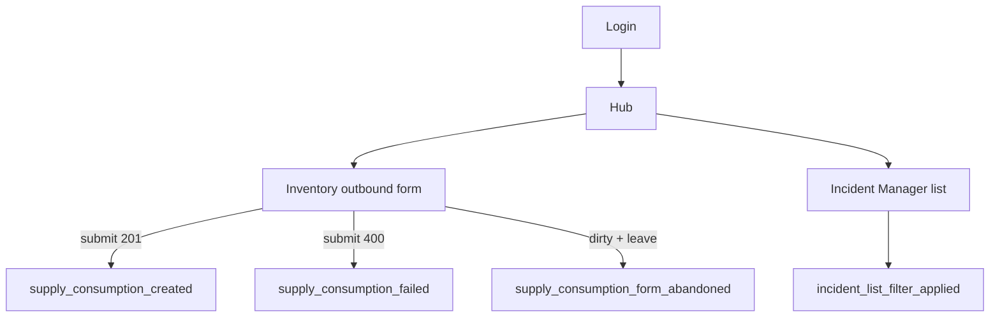

# Telemetry — Phase 1 (Design) Implementation Plan

**Plan file:** [`memory-bank/references/telemetry_ai_plan/telemetry_design_implementation_plan.md`](telemetry_design_implementation_plan.md)

**Requirements source:** [`telemetry_design_specs.md`](telemetry_design_specs.md) + v1.1 stakeholder additions (below)

**Branch:** `feature/telemetry` (single branch for all four phases; Phase 1 is first commit)

**Working directory:** `docs/telemetry/`

**Status:** **Delivered** — `docs/telemetry/telemetry-plan.md` and `event-schemas.json` (v1.1.0, 11 events)

---

## Executive summary

HealthCore's backoffice inventory module (`uis/backoffice/inventory` via landing `:3001`) and FastAPI inventory API (`services/api/app/domains/inventory/`) are **delivered** but produce **no operational telemetry**. Leadership cannot answer jurisdiction-segmented questions about consumption volume, waste rates, or stock-out rejections without manual spreadsheet work.

Phase 1 delivers **design documentation only** — two files another developer uses to implement capture (Phase 2), storage (Phase 3), and reporting (Phase 4) without ambiguity:

1. `docs/telemetry/telemetry-plan.md` — KPIs, flows, envelope, event catalog, risks
2. `docs/telemetry/event-schemas.json` — JSON Schema draft-07 definitions

**v1.1 adds two events** beyond the original spec §6 catalog:

- `supply_consumption_form_abandoned` — outbound form left with unsaved changes
- `incident_list_filter_applied` — Incident Manager list filter dropdown change

No servers, packages, or instrumentation code in this phase.

---

## Extended events (v1.1 — stakeholder additions)

### Event A — `supply_consumption_form_abandoned` (inventory)

| | |
|---|---|
| **Golden rule** | When staff leave the outbound consumption form with unsaved changes, we record partial form state so ops can distinguish form friction from stock-out rejections (`supply_consumption_failed`). |
| **Trigger** | User navigates away from `/inventory/orders/outbound` or the tab becomes `hidden` while the form is **dirty** and no successful submit occurred on that mount. |
| **Dirty definition** | Any field differs from `emptyOutbound()` in `outbound-form-logic.ts`: `supplyId !== null` OR `quantity !== ""` OR `consumptionType !== CONSUMPTION_TYPES[0].value` OR `clinicId !== 1`. |
| **Code location (Phase 2)** | `inventory/hooks/use-outbound-form.ts` — `useEffect` cleanup + `visibilitychange`; refs for dirty/submitted flags. |
| **Properties (allowlist)** | `clinic_id` (int), `had_supply_selected` (bool), `had_quantity` (bool), `jurisdiction` (`us` \| `uk`, omit if no supply selected), `abandon_trigger` (`navigation` \| `tab_hidden`) |
| **PII** | false |
| **Stream/batch** | batch — debounce duplicate abandon within 30s per form mount |
| **KPI link** | Supports KPI 3 interpretation — high abandons alongside `supply_consumption_failed` suggests UX/stock friction |

**Design notes:**

- Do **not** include raw `quantity` or supply name.
- Do **not** include `supply_id` — use `had_supply_selected` boolean.
- Fire at most once per abandon episode per form mount.

---

### Event B — `incident_list_filter_applied` (incident manager)

Inventory has **no filter UI**. This event covers the Incident Manager list (`incident-manager/components/incident-list-filters.tsx`).

| | |
|---|---|
| **Golden rule** | When staff apply a filter on the incident list, we record which dimension changed and how many filters are active so Patient Experience can audit how teams slice incident data. |
| **Trigger** | Any dropdown change in `IncidentListFilters` that invokes `onChange` (including clear to All). |
| **Code location (Phase 2)** | `incident-manager/components/incident-list-filters.tsx` `onChange` wrapper, or `incident-manager/hooks/use-incident-list.ts` `setFilters`. |
| **Properties (allowlist)** | `filter_dimension` (`status` \| `origin` \| `branch` \| `category`), `filter_value` (string — enum value or empty when cleared), `active_filter_count` (integer 0–4) |
| **PII** | false — operational enums only; never incident title/description |
| **Stream/batch** | batch — 500ms debounce when staff change multiple dropdowns quickly |
| **API touchpoint** | Triggers `GET /api/v1/incidents?...` via `listIncidents(filters)` — telemetry is client-side only |

**Rejected filter alternatives (documented):**

| Alternative | Why not chosen |
|-------------|----------------|
| `supplier_list_filter_applied` | Supplier Directory country/category filters — procurement domain |
| `candidate_list_filter_applied` | Talent Tracker — external API, recruiting domain |

---

## Planning decisions (locked)

| Topic | Decision |
|-------|----------|
| Entity names | **Code wins** — `MedicalSupply`, `SupplyDelivery`, `SupplyConsumption` |
| KPIs | Three reconciled KPIs from spec §4 (consumption rate, waste rate, insufficient-stock rejection rate) |
| Dropped events | `stock_threshold_triggered`, `direct_stock_edit_rejected`, `emergency_dispensing_flagged` |
| `product_created` | Design-only (API exists, no UI) |
| Form abandon event | **`supply_consumption_form_abandoned`** |
| Filter event | **`incident_list_filter_applied`** (stakeholder choice) |
| Envelope | Include **both** `requestId` and `service: "backoffice"` |
| `schemaVersion` | **`1.1.0`** once v1.1 events are in design docs |
| `userId` | Opaque TinyDB user id as **string** (`str(user.id)`) |
| `jurisdiction` | Derived from `MedicalSupply.country`: `US`→`us`, `UK`→`uk` |
| Branch | `feature/telemetry` — sequential commits per phase |
| Supabase (downstream) | Reuse **`milestone5_inventory`** project |
| Report auth (downstream) | `GET /telemetry/report` JWT-protected |

---

## Current codebase baseline (spec reconciliation)

| Spec claim | Codebase state | Path |
|------------|----------------|------|
| `MedicalSupply` with `country` US/UK | Confirmed | `inventory/models.py` |
| `SupplyConsumption.consumption_type` ∈ `{clinical_use, expiry_waste}` | Confirmed | `inventory/schemas.py` |
| Stock computed, not stored | Confirmed | `inventory/router.compute_stock()` |
| Insufficient stock → HTTP 400 | Confirmed | `create_outbound_order` |
| Outbound form dirty-state detectable | Confirmed | `use-outbound-form.ts` + `emptyOutbound()` |
| Inventory has no list filters | Confirmed | filter event is Incident Manager |
| Incident list filters (4 dropdowns) | Confirmed | `incident-list-filters.tsx` |
| Auth: login, `/auth/me`, JWT | Confirmed | `auth/router.py`, `landing/lib/api.ts` |

**Instrumentation call sites (Phase 2 reference):**

| `event_type` | Code location |
|--------------|---------------|
| `supply_delivery_created` | `inventory/lib/inbound-form-logic.ts` → `submitInboundOrder` success |
| `supply_consumption_created` | `inventory/lib/outbound-form-logic.ts` → `submitOutboundOrder` success |
| `supply_consumption_failed` | `use-outbound-form.ts` catch / `classifyOutboundError` |
| **`supply_consumption_form_abandoned`** | **`inventory/hooks/use-outbound-form.ts`** — dirty form + navigation / `visibilitychange` |
| `supply_list_viewed` | `inventory/hooks/use-products.ts` |
| `orders_list_viewed` | `inventory/hooks/use-orders.ts` |
| **`incident_list_filter_applied`** | **`incident-manager/components/incident-list-filters.tsx` `onChange`** |
| `user_login_succeeded` | `landing/hooks/use-login-form.ts` after 200 |
| `user_login_failed` | `use-login-form.ts` failure branches |
| `session_expired` | `shared/lib/healthcore-api.ts` + `landing/lib/api.ts` on 401 redirect |

---

## Implementation steps

### Step 1 — Create `docs/telemetry/` folder

```bash
mkdir -p docs/telemetry
```

### Step 2 — Write `telemetry-plan.md`

Required sections (spec §7) **plus v1.1 events in §6 Event catalog and §3 Flow mapping**.

#### 2.4 Flow mapping

Include abandon branch on outbound form and incident filter path:



Mark **≥6** inventory instrumentation points (5 original + abandon).

#### 2.5 Backoffice opportunities

Auth events (`user_login_succeeded`, `user_login_failed`, `session_expired`) **plus** `incident_list_filter_applied`.

#### 2.7 Event catalog

Document **all 11 events** (see full catalog table below). Include golden-rule, allowlist, PII, stream/batch for each.

#### 2.8 High-frequency strategy

- Auth failures + `session_expired` → stream
- Inventory + incident filter → batch
- List views → 30s debounce recommendation
- **`supply_consumption_form_abandoned`** → at most once per mount; 30s dedupe
- **`incident_list_filter_applied`** → 500ms debounce

### Step 3 — Write `event-schemas.json`

**11 event definitions** (10 instrumentable + 1 design-only):

| # | `event_type` | Instrumentable |
|---|--------------|----------------|
| 1 | `supply_delivery_created` | yes |
| 2 | `supply_consumption_created` | yes |
| 3 | `supply_consumption_failed` | yes |
| 4 | **`supply_consumption_form_abandoned`** | **yes (v1.1)** |
| 5 | `supply_list_viewed` | yes |
| 6 | `orders_list_viewed` | yes |
| 7 | `product_created` | design-only |
| 8 | **`incident_list_filter_applied`** | **yes (v1.1)** |
| 9 | `user_login_succeeded` | yes |
| 10 | `user_login_failed` | yes |
| 11 | `session_expired` | yes |

**Property types (locked):**

| Property | Type | Events |
|----------|------|--------|
| `supply_id` | integer | delivery, consumption, failed |
| `quantity` | integer | delivery, consumption |
| `clinic_id` | integer | delivery, consumption, failed, **form_abandoned** |
| `jurisdiction` | `us` \| `uk` | delivery, consumption, failed, form_abandoned (optional), product_created, login_succeeded (optional) |
| `consumption_type` | `clinical_use` \| `expiry_waste` | consumption_created |
| `error_code` | string | consumption_failed |
| `item_count` | integer | list views |
| **`had_supply_selected`** | boolean | **form_abandoned** |
| **`had_quantity`** | boolean | **form_abandoned** |
| **`abandon_trigger`** | `navigation` \| `tab_hidden` | **form_abandoned** |
| **`filter_dimension`** | `status` \| `origin` \| `branch` \| `category` | **incident_list_filter_applied** |
| **`filter_value`** | string | **incident_list_filter_applied** |
| **`active_filter_count`** | integer 0–4 | **incident_list_filter_applied** |
| `reason` | enum | login_failed |
| `category` | string | product_created |

Set `schemaVersion` const to **`1.1.0`** in envelope definition.

### Step 4 — Consistency pass

- [ ] All **11** `event_type` values in plan match JSON definitions
- [ ] v1.1 property keys match between plan §6 and JSON
- [ ] `x-pii: false` on every event definition

### Step 5 — Verification

```bash
python3 -m json.tool docs/telemetry/event-schemas.json > /dev/null
```

---

## Full event catalog (for `telemetry-plan.md` §6)

Copy these entries into the design doc event catalog section.

### `supply_consumption_form_abandoned` (v1.1)

- **Golden rule:** When staff leave the outbound form with unsaved changes, we record partial progress so ops can separate abandon friction from stock-out failures.
- **Properties:** `clinic_id`, `had_supply_selected`, `had_quantity`, `jurisdiction` (optional), `abandon_trigger`
- **PII:** false | **Stream/batch:** batch

### `incident_list_filter_applied` (v1.1)

- **Golden rule:** When staff change an incident list filter, we record the dimension and active filter count for Patient Experience audit.
- **Properties:** `filter_dimension`, `filter_value`, `active_filter_count`
- **PII:** false | **Stream/batch:** batch (500ms debounce)

*(Remaining 9 events: see spec §6 — `supply_delivery_created`, `supply_consumption_created`, `supply_consumption_failed`, `supply_list_viewed`, `orders_list_viewed`, `product_created`, `user_login_succeeded`, `user_login_failed`, `session_expired`.)*

---

## PR checklist

- **Title:** `[W16D46] Telemetry Design Plan`
- **Description:**
  - One line per reconciled KPI
  - **11 events designed (10 instrumentable + 1 design-only)**
  - v1.1: `supply_consumption_form_abandoned`, `incident_list_filter_applied`
  - Hardest decision: reconciling CONTEXT KPIs to observable code paths

---

## Definition of done

- [ ] 3 KPIs grounded in real entities
- [ ] **≥6** inventory instrumentation points + **≥2** auth + **incident filter** documented
- [ ] Consistent envelope with `requestId` and `service`
- [ ] Every event: golden-rule + allowlist + PII note
- [ ] **`supply_consumption_form_abandoned` and `incident_list_filter_applied` in plan + JSON**
- [ ] `event-schemas.json` valid draft-07, `schemaVersion` 1.1.0
- [ ] Stream/batch justified; risks/exclusions documented

---

## Eval criteria partials

| Eval item | Status | Note |
|-----------|--------|------|
| KPIs justified from `CONTEXT-company.md` | **Partial** | No `CONTEXT-company.md` in repo; justification lives in [`telemetry-plan.md`](../../../../docs/telemetry/telemetry-plan.md) §2 + **Reconciliation with CONTEXT** table. |

---

## Handoff to Phase 2

Update `telemetry_frontend_implementation_plan.md` to instrument:

- `supply_consumption_form_abandoned` in `use-outbound-form.ts`
- `incident_list_filter_applied` in `incident-list-filters.tsx`
