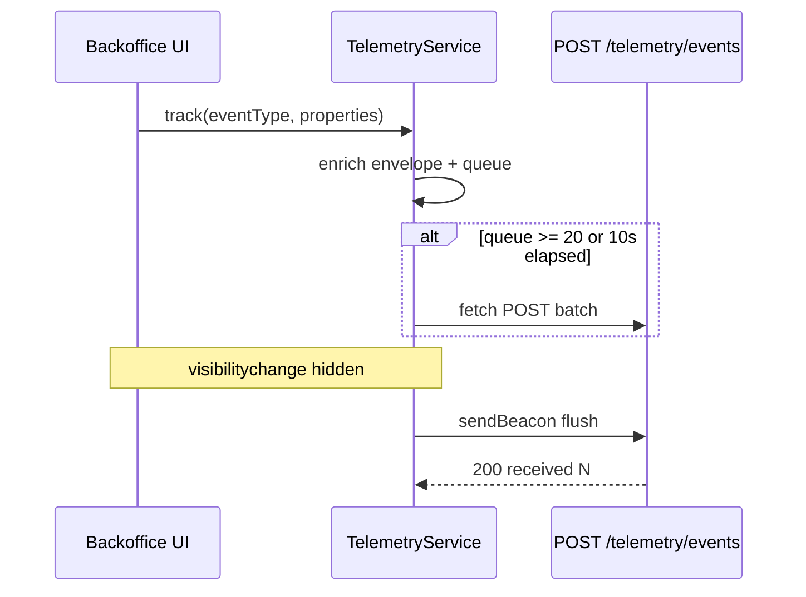

# Telemetry — Phase 2 (Frontend Capture + Stub) Implementation Plan

**Plan file:** [`memory-bank/references/telemetry_ai_plan/telemetry_frontend_implementation_plan.md`](telemetry_frontend_implementation_plan.md)

**Requirements source:** [`telemetry_frontend_specs.md`](telemetry_frontend_specs.md), design docs from Phase 1

**Branch:** `feature/telemetry` (second commit on same branch)

**Working directories:** `services/api/`, `uis/backoffice/shared/`, `uis/backoffice/inventory/`, `uis/backoffice/landing/`

**Status:** Not started — no telemetry domain or `telemetry.ts` exists

---

## Executive summary

Phase 2 adds **client-side event capture** and a **backend stub** that validates shape and logs counts without persisting. A single `track()` entry point in `@backoffice/shared/lib/telemetry` batches events to `POST /api/v1/telemetry/events` using standalone `fetch` / `sendBeacon` (never `healthcoreFetch`).

Inventory inbound/outbound, list views, and auth flows are instrumented per the Phase 1 event catalog.

---

## Planning decisions (locked)

| Topic | Decision |
|-------|----------|
| Service location | `uis/backoffice/shared/lib/telemetry.ts` (not `uis/backoffice/src/services/`) |
| Endpoint auth | **None** on `POST /telemetry/events` — identity in envelope; CORS allowlist protection |
| Transport | Standalone `fetch` + `sendBeacon`; no Bearer header |
| `userId` | `String((await fetchCurrentUser())?.id ?? "")` via existing `landing/lib/api.ts` pattern; cache in module scope after login |
| `sessionId` | UUID in `sessionStorage`; generated on login success in `use-login-form.ts` |
| Instrumentation placement | **Logic files** for order events (access to `products[]` for jurisdiction); **hooks** for list views |
| `error_code` | `INSUFFICIENT_STOCK` when `isInsufficientStockError(message)`; `VALIDATION_ERROR` for other outbound failures |
| `session_expired` | Instrument **both** `healthcore-api.ts` (inventory) and `landing/lib/api.ts` (hub/auth pages) on 401 redirect |
| Env vars | `NEXT_PUBLIC_TELEMETRY_ENDPOINT`, `TELEMETRY_ENDPOINT` (backend placeholder) |
| Tests | **pytest** stub tests + **Jest** TelemetryService unit tests (stakeholder locked) |
| Branch | `feature/telemetry` sequential commit |

---

## Architecture



---

## Step 1 — Backend telemetry domain (stub)

### 1.1 Create `services/api/app/domains/telemetry/schemas.py`

Per spec §3 — `TelemetryEvent` and loose `TelemetryBatch`:

```python
class TelemetryEvent(BaseModel):
    eventId: str
    timestamp: datetime
    sessionId: str
    userId: str
    event_type: str
    schemaVersion: str
    requestId: str
    service: str
    properties: dict[str, Any] = {}

class TelemetryBatch(BaseModel):
    events: list[dict[str, Any]]
```

This model is **frozen for Phase 3** — do not rename fields.

### 1.2 Create `services/api/app/domains/telemetry/router.py`

```python
router = APIRouter(prefix="/telemetry", tags=["telemetry"])

@router.post("/events")
def ingest_events(body: TelemetryBatch) -> dict[str, int]:
    # log len + each event_type; try model_validate per item for logging only
    return {"received": len(body.events)}
```

- No database session
- Do not fail entire batch if one item fails validation (log warning, still count in `received`)

### 1.3 Register router

In `app/api/v1/router.py`:

```python
from app.domains.telemetry.router import router as telemetry_router
api_v1_router.include_router(telemetry_router)  # NO get_current_user
```

Final path: `/api/v1/telemetry/events`.

### 1.4 Config

`app/core/config.py`:

```python
telemetry_endpoint: str = ""
```

`services/api/.example.env`:

```
TELEMETRY_ENDPOINT=http://localhost:8000/api/v1/telemetry/events
```

---

## Step 2 — Backend tests (`tests/test_telemetry_stub.py`)

| Case | Assert |
|------|--------|
| Valid batch of 2 events | 200, `received: 2` |
| Empty batch | 200, `received: 0` |
| Mixed valid/invalid dicts | 200, `received: 2` (stub does not reject) |
| No DB side effects | No `get_supabase_db` usage; table count unchanged |

Use `TestClient` + caplog for `event_type` log lines.

---

## Step 3 — `TelemetryService` (`shared/lib/telemetry.ts`)

### 3.1 Constants (spec §4)

```ts
const SCHEMA_VERSION = "1.0.0";
const SERVICE = "backoffice";
const FLUSH_INTERVAL_MS = 10_000;
const MAX_QUEUE_SIZE = 20;
const MAX_RETRIES = 3;
```

### 3.2 Public API

```ts
export function track(eventType: string, properties: Record<string, unknown>): void
export function setTelemetryUserId(userId: string): void  // called after login / auth/me
export function initTelemetrySession(sessionId: string): void  // called on login success
```

Keep `track` as the only capture export; helper exports for login hook only.

### 3.3 Enrichment

On `track()`:

- `eventId`: `crypto.randomUUID()`
- `timestamp`: `new Date().toISOString()`
- `sessionId`: from `sessionStorage.getItem("telemetry_session_id")` or `""`
- `userId`: cached module variable (set by login flow)
- `schemaVersion`, `service`
- `requestId`: new UUID per event (or per flush — spec allows per event; use per event)
- `event_type`: from `eventType` argument
- `properties`: caller-supplied allowlist only

### 3.4 Flush logic

- `setInterval` 10s flush
- Push to queue; if `queue.length >= 20`, flush immediately
- `flush()`: POST `{ events: queue }` to `process.env.NEXT_PUBLIC_TELEMETRY_ENDPOINT` with `Content-Type: application/json`
- On success, clear queue; on failure, exponential backoff retry up to 3, then discard silently

### 3.5 `sendBeacon` on tab close

```ts
document.addEventListener("visibilitychange", () => {
  if (document.visibilityState === "hidden") flushBeacon();
});
```

Blob with `application/json` body.

### 3.6 Never use `healthcoreFetch`

Grep guard: no `track` or telemetry POST outside `telemetry.ts`.

---

## Step 4 — Jest tests (`uis/backoffice/landing` or shared test location)

Add test file e.g. `uis/backoffice/landing/__tests__/telemetry.test.ts` (or colocated under shared if landing test config resolves `@backoffice/shared`):

| Case | Assert |
|------|--------|
| `track` queues without immediate fetch | `fetch` not called until flush threshold |
| Queue size 20 triggers flush | One POST with 20 events |
| Retry on network failure | 3 attempts with backoff (fake timers) |
| `sendBeacon` called on visibility hidden | mock `navigator.sendBeacon` |
| Envelope fields present | `eventId`, `service`, `schemaVersion`, etc. |

Mock `global.fetch`, `navigator.sendBeacon`, `crypto.randomUUID`.

**Note:** Landing already has Jest from website pattern — verify `landing/package.json` test script; add if missing mirroring inventory/website setup.

---

## Step 5 — Jurisdiction helper

Create `uis/backoffice/inventory/lib/jurisdiction.ts`:

```ts
export const countryToJurisdiction = (country: string): "us" | "uk" =>
  country === "UK" ? "uk" : "us";
```

Used by inbound/outbound instrumentation to derive jurisdiction from selected supply's `country`.

---

## Step 6 — Inventory instrumentation

### 6.1 `inbound-form-logic.ts`

After successful `createInboundOrder`:

```ts
const supply = products.find((p) => p.id === fields.supplyId);
track("supply_delivery_created", {
  supply_id: fields.supplyId,
  quantity: qty,
  clinic_id: fields.clinicId,
  jurisdiction: countryToJurisdiction(supply?.country ?? "US"),
});
```

Pass `products` into `submitInboundOrder` or resolve supply inside hook after success — **prefer extending `submitInboundOrder` signature** to accept products array already loaded in hook.

### 6.2 `outbound-form-logic.ts`

Success path: `supply_consumption_created` with `consumption_type: fields.consumptionType` (exact form value).

Catch in `use-outbound-form.ts` after `classifyOutboundError`:

```ts
track("supply_consumption_failed", {
  error_code: isInsufficientStockError(msg) ? "INSUFFICIENT_STOCK" : "VALIDATION_ERROR",
  supply_id: fields.supplyId,
  clinic_id: fields.clinicId,
  jurisdiction: countryToJurisdiction(supply?.country ?? "US"),
});
```

### 6.3 `use-products.ts`

After successful load:

```ts
track("supply_list_viewed", { item_count: data.length });
```

Optional: 30s debounce via ref `{ lastPath, lastAt }` — document if implemented.

### 6.4 `use-orders.ts`

```ts
track("orders_list_viewed", { item_count: data.length });
```

---

## Step 7 — Auth instrumentation

### 7.1 `use-login-form.ts`

On 200 success:

```ts
const sessionId = crypto.randomUUID();
sessionStorage.setItem("telemetry_session_id", sessionId);
initTelemetrySession(sessionId);
const user = await fetchCurrentUser();
if (user) setTelemetryUserId(String(user.id));
track("user_login_succeeded", {}); // omit jurisdiction — unknown at login
```

On `!response.ok` with status 401:

```ts
track("user_login_failed", { reason: "invalid_credentials" });
```

On catch with `NETWORK_ERROR_MESSAGE` or `TypeError`:

```ts
track("user_login_failed", { reason: "network_error" });
```

Refactor login to distinguish 401 from other errors (currently generic message on all `!response.ok`).

### 7.2 `healthcore-api.ts`

When `response.status === 401` and redirecting to `/login` from protected route:

```ts
track("session_expired", {});
```

Import `track` from telemetry — ensure no circular import (telemetry must not import healthcore-api).

### 7.3 `landing/lib/api.ts`

Same `session_expired` track on 401 redirect in `apiFetch` and when `fetchCurrentUser` gets 401 — covers hub/profile routes not using `healthcoreFetch`.

---

## Step 8 — Environment

**`uis/backoffice/landing/.example.env`:**

```
NEXT_PUBLIC_TELEMETRY_ENDPOINT=http://localhost:8000/api/v1/telemetry/events
```

**Root `.example.env`** (Docker):

```
NEXT_PUBLIC_TELEMETRY_ENDPOINT=http://localhost:8000/api/v1/telemetry/events
TELEMETRY_ENDPOINT=http://localhost:8000/api/v1/telemetry/events
```

Document in `services/api/README.md` telemetry stub section (brief).

---

## Verification

### Manual

1. Start API `:8000`, landing `:3001`
2. Login → check Network for batched POST (may need 10s or 20 events)
3. Create inbound + outbound orders; trigger insufficient stock
4. Visit products + orders lists
5. Confirm API logs show `event_type` values
6. Close tab → confirm `sendBeacon` request in DevTools

### Automated

```bash
cd services/api && uv run pytest tests/test_telemetry_stub.py -v
cd uis/backoffice/landing && npm test -- --testPathPattern=telemetry
```

### Grep guard

```bash
rg "telemetry/events" uis/backoffice --glob '!**/telemetry.ts'
# should return no direct fetch calls outside telemetry.ts
```

---

## PR checklist

- **Title:** `[W16D47] Telemetry Frontend`
- **Description:** event→file mapping table, DevTools screenshot note, auth instrumentation confirmed

---

## Definition of done (maps to spec §9)

- [ ] Stub endpoint returns `{ received: N }`, no DB
- [ ] `TelemetryEvent` model matches envelope; reusable in Phase 3
- [ ] Env vars established; no hardcoded URL
- [ ] TelemetryService: queue, 10s/20 flush, sendBeacon, retry
- [ ] `track()` auto-fills envelope fields
- [ ] Single `track()` entry point; no stray telemetry fetch
- [ ] Inventory + auth events with allowlist properties
- [ ] No PII in properties
- [ ] pytest + Jest passing

---

## Handoff to Phase 3

Phase 3 replaces stub body only — same `schemas.py`, same URL, same frontend. Response gains `stored`/`rejected`; frontend ignores extra fields.
