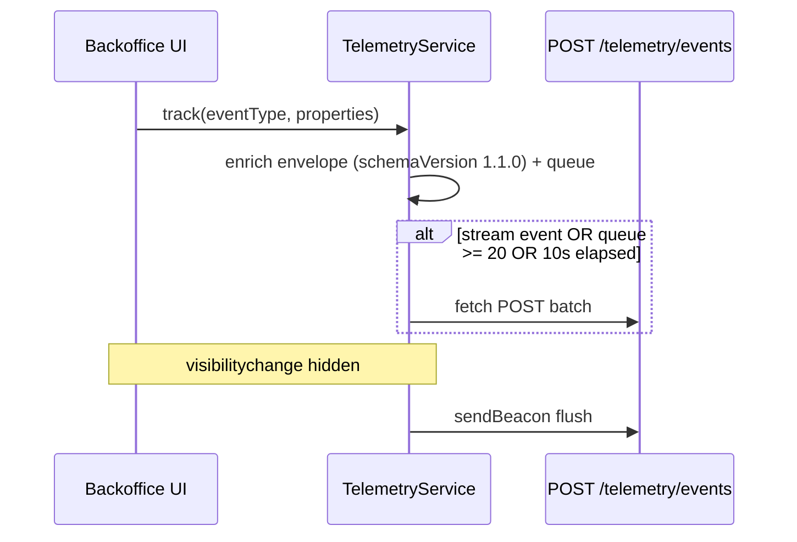

# Telemetry — Phase 2 (Frontend Capture + Stub) Implementation Plan

**Plan file:** [`memory-bank/references/telemetry_ai_plan/telemetry_frontend_implementation_plan.md`](telemetry_frontend_implementation_plan.md)

**Requirements source:** [`telemetry_frontend_specs.md`](telemetry_frontend_specs.md), [`docs/telemetry/telemetry-plan.md`](../../../../docs/telemetry/telemetry-plan.md) (v1.1.0), [`docs/telemetry/event-schemas.json`](../../../../docs/telemetry/event-schemas.json)

**Branch:** `feature/telemetry` (second commit on same branch)

**Working directories:** `services/api/`, `uis/backoffice/shared/`, `uis/backoffice/inventory/`, `uis/backoffice/incident-manager/`, `uis/backoffice/landing/`

**Status:** Not started — no telemetry domain or `telemetry.ts` exists

---

## Executive summary

Phase 2 adds **client-side event capture** and a **backend stub** that validates shape and logs counts without persisting. A single `track()` entry point in `@backoffice/shared/lib/telemetry` batches events to `POST /api/v1/telemetry/events` using standalone `fetch` / `sendBeacon` (never `healthcoreFetch`).

Instrument **10 events** per [`telemetry-plan.md`](../../../../docs/telemetry/telemetry-plan.md) v1.1.0:

| Module | Events |
|--------|--------|
| Inventory | `supply_delivery_created`, `supply_consumption_created`, `supply_consumption_failed`, `supply_consumption_form_abandoned`, `supply_list_viewed`, `orders_list_viewed` |
| Incident manager | `incident_list_filter_applied` |
| Auth | `user_login_succeeded`, `user_login_failed`, `session_expired` |

`product_created` is **design-only** — no UI, do not instrument.

---

## Planning decisions (locked)

| Topic | Decision |
|-------|----------|
| Design doc version | **`schemaVersion: "1.1.0"`** in envelope (matches `event-schemas.json`) |
| Service location | `uis/backoffice/shared/lib/telemetry.ts` |
| Endpoint auth | **None** on `POST /telemetry/events` — identity in envelope; CORS allowlist |
| Transport | Standalone `fetch` + `sendBeacon`; no Bearer header |
| `userId` | `String((await fetchCurrentUser())?.id ?? "")`; cache after login |
| `sessionId` | UUID in `sessionStorage`; generated on login success |
| Instrumentation placement | Logic files for order events; hooks for lists + form abandon; incident filter wrapper |
| `error_code` | `INSUFFICIENT_STOCK` / `VALIDATION_ERROR` for `supply_consumption_failed` |
| Form abandon (v1.1) | Dirty = any field differs from `emptyOutbound()`; fire on unmount + `visibilitychange` when `hidden` |
| Incident filter (v1.1) | 500ms debounce; `active_filter_count` = count of non-empty filter keys |
| Stream events | `user_login_failed`, `session_expired` — **immediate flush** after queue (do not wait 10s/20) |
| Batch events | All inventory + incident filter + `user_login_succeeded` |
| `session_expired` | Both `healthcore-api.ts` and `landing/lib/api.ts` |
| Tests | pytest stub + Jest TelemetryService (stakeholder locked) |

---

## Event → code location map (instrument all 10)

| `event_type` | File | Properties (allowlist only) |
|--------------|------|----------------------------|
| `supply_delivery_created` | `inventory/lib/inbound-form-logic.ts` | `supply_id`, `quantity`, `clinic_id`, `jurisdiction` |
| `supply_consumption_created` | `inventory/lib/outbound-form-logic.ts` | `supply_id`, `quantity`, `consumption_type`, `clinic_id`, `jurisdiction` |
| `supply_consumption_failed` | `inventory/hooks/use-outbound-form.ts` catch | `error_code`, `supply_id`, `clinic_id`, `jurisdiction` |
| `supply_consumption_form_abandoned` | `inventory/hooks/use-outbound-form.ts` | `clinic_id`, `had_supply_selected`, `had_quantity`, `jurisdiction`?, `abandon_trigger` |
| `supply_list_viewed` | `inventory/hooks/use-products.ts` | `item_count` |
| `orders_list_viewed` | `inventory/hooks/use-orders.ts` | `item_count` |
| `incident_list_filter_applied` | `incident-manager/components/incident-list-filters.tsx` | `filter_dimension`, `filter_value`, `active_filter_count` |
| `user_login_succeeded` | `landing/hooks/use-login-form.ts` | `jurisdiction` optional (omit) |
| `user_login_failed` | `use-login-form.ts` | `reason` |
| `session_expired` | `healthcore-api.ts`, `landing/lib/api.ts` | *(envelope only)* |

---

## Architecture



---

## Step 1 — Backend telemetry domain (stub)

### 1.1 `services/api/app/domains/telemetry/schemas.py`

```python
class TelemetryEvent(BaseModel):
    eventId: str
    timestamp: datetime
    sessionId: str
    userId: str
    event_type: str
    schemaVersion: str
    requestId: str
    service: str
    properties: dict[str, Any] = {}

class TelemetryBatch(BaseModel):
    events: list[dict[str, Any]]
```

Frozen for Phase 3 — do not rename fields. Accept `schemaVersion: "1.1.0"` from client.

### 1.2 `router.py` — stub `POST /events`

- Log count + each `event_type`
- Return `{ "received": len(body.events) }`
- No DB; partial validation for logging only

### 1.3 Register without `get_current_user` in `app/api/v1/router.py`

### 1.4 Config — `telemetry_endpoint` in Settings + `.example.env`

---

## Step 2 — Backend tests (`tests/test_telemetry_stub.py`)

Include a fixture event with `schemaVersion: "1.1.0"` and v1.1 `event_type` values (`supply_consumption_form_abandoned`, `incident_list_filter_applied`).

---

## Step 3 — `TelemetryService` (`shared/lib/telemetry.ts`)

### Constants

```ts
const SCHEMA_VERSION = "1.1.0";
const SERVICE = "backoffice";
const FLUSH_INTERVAL_MS = 10_000;
const MAX_QUEUE_SIZE = 20;
const MAX_RETRIES = 3;

const STREAM_EVENT_TYPES = new Set([
  "user_login_failed",
  "session_expired",
]);
```

### Stream vs batch behaviour

- **Batch (default):** queue until 10s or 20 events, then `fetch` POST.
- **Stream:** after `track()` for `user_login_failed` or `session_expired`, call `flush()` immediately (still uses same batch endpoint — urgency is client-side, not a separate API).

### Public API

```ts
export function track(eventType: string, properties: Record<string, unknown>): void
export function setTelemetryUserId(userId: string): void
export function initTelemetrySession(sessionId: string): void
```

Never use `healthcoreFetch` for telemetry POSTs.

---

## Step 4 — Jest tests

Add cases for:

- `schemaVersion` is `"1.1.0"` on enriched events
- Stream events trigger immediate flush
- Batch events wait for threshold

---

## Step 5 — Jurisdiction helper

`uis/backoffice/inventory/lib/jurisdiction.ts`:

```ts
export const countryToJurisdiction = (country: string): "us" | "uk" =>
  country === "UK" ? "uk" : "us";
```

---

## Step 6 — Inventory instrumentation

### 6.1–6.4 — Original events (inbound, outbound, failed, list views)

Unchanged from prior plan; use `countryToJurisdiction` for clinic-operation events.

List views: optional 30s debounce at call site.

### 6.5 — `supply_consumption_form_abandoned` (v1.1)

In `use-outbound-form.ts`:

```ts
const isDirty = (fields: ReturnType<typeof emptyOutbound>) =>
  fields.supplyId !== null ||
  fields.quantity !== "" ||
  fields.consumptionType !== CONSUMPTION_TYPES[0].value ||
  fields.clinicId !== 1;

const emitAbandon = (trigger: "navigation" | "tab_hidden") => {
  if (!dirtyRef.current || submittedRef.current || abandonEmittedRef.current) return;
  const props: Record<string, unknown> = {
    clinic_id: fields.clinicId,
    had_supply_selected: fields.supplyId !== null,
    had_quantity: fields.quantity !== "",
    abandon_trigger: trigger,
  };
  if (fields.supplyId) {
    const supply = products.find((p) => p.id === fields.supplyId);
    if (supply) props.jurisdiction = countryToJurisdiction(supply.country);
  }
  track("supply_consumption_form_abandoned", props);
  abandonEmittedRef.current = true;
};
```

- `useEffect` cleanup on unmount → `emitAbandon("navigation")`
- `visibilitychange` when `hidden` → `emitAbandon("tab_hidden")`
- Set `submittedRef.current = true` on successful submit
- 30s dedupe via `abandonEmittedRef` per mount

**Do not** include `supply_id` or raw `quantity`.

---

## Step 7 — Incident manager instrumentation (v1.1)

Wrap `onChange` in `incident-list-filters.tsx` (or debounce in `use-incident-list.ts`):

```ts
const handleFilterChange = (dimension: FilterDimension, value: string, next: IncidentFilters) => {
  const active = [next.status, next.origin, next.branch, next.category].filter(Boolean).length;
  debouncedTrack(() =>
    track("incident_list_filter_applied", {
      filter_dimension: dimension,
      filter_value: value,
      active_filter_count: active,
    }),
  );
  onChange(next);
};
```

`filter_value` is the selected enum string or `""` when cleared to All.

Import `track` from `@backoffice/shared/lib/telemetry` — incident-manager compiles through landing like inventory.

---

## Step 8 — Auth instrumentation

Same as prior plan:

- `use-login-form.ts` — sessionId, login success/failure
- `healthcore-api.ts` + `landing/lib/api.ts` — `session_expired` on 401 redirect

`user_login_failed` and `session_expired` use stream flush.

---

## Step 9 — Environment

`NEXT_PUBLIC_TELEMETRY_ENDPOINT` and `TELEMETRY_ENDPOINT` in landing `.example.env` and root `.example.env`.

---

## Verification

### Manual

1. Login → `user_login_succeeded` in batch
2. View products/orders lists
3. Inbound + outbound orders; trigger insufficient stock
4. **Start outbound form, enter data, navigate away** → `supply_consumption_form_abandoned`
5. **Incident Manager list → change a filter** → `incident_list_filter_applied`
6. DevTools: batched POST to `/api/v1/telemetry/events` with `schemaVersion: "1.1.0"`
7. Tab close → `sendBeacon` flush

### Automated

```bash
cd services/api && uv run pytest tests/test_telemetry_stub.py -v
cd uis/backoffice/landing && npm test -- --testPathPattern=telemetry
```

---

## PR checklist

- **Title:** `[W16D47] Telemetry Frontend`
- **Description:** 10-event mapping table, v1.1 abandon + filter noted, DevTools screenshot

---

## Definition of done

- [ ] Stub returns `{ received: N }`, no DB
- [ ] `schemaVersion` **1.1.0** in client envelope
- [ ] All **10 instrumentable** events wired with allowlist-only properties
- [ ] Stream flush for `user_login_failed` / `session_expired`
- [ ] Form abandon + incident filter (v1.1)
- [ ] No PII; single `track()` entry point
- [ ] pytest + Jest passing

---

## Handoff to Phase 3

Same URL and body; response gains `stored`/`rejected`. Storage must accept all v1.1 property keys in `tags` per [`telemetry-plan.md`](../../../../docs/telemetry/telemetry-plan.md).
