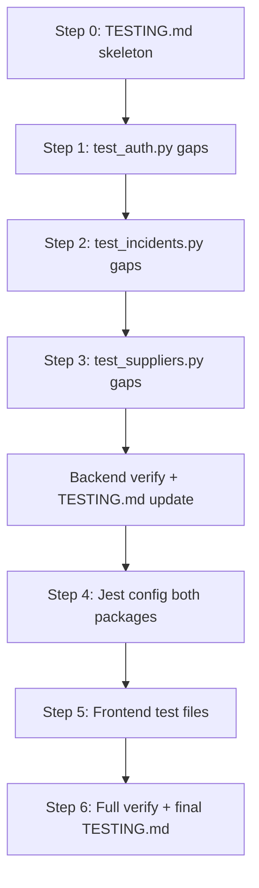

# Unit Test Gap Coverage — Implementation Plan

**Plan file:** [`memory-bank/references/unit_tests/unit_test_IMPLEMENTATION_PLAN.md`](unit_test_IMPLEMENTATION_PLAN.md)

**Requirements source:** [`unit_test_SPECS.md`](unit_test_SPECS.md), [`unit_test_evaluation_criteria.md`](unit_test_evaluation_criteria.md), [`test_coverage_pre.md`](test_coverage_pre.md)

**Milestone:** Unit test gap coverage (AUTH-088, API-042, FE-019)

**Status:** Delivered — backend, frontend Jest, and `TESTING.md` complete

---

## Executive summary

The API already has **70 pytest tests at 94.1% line coverage**. Frontend `uis/` packages have **0% automated test coverage** and no `TESTING.md` exists. This plan closes only the **gaps listed in SPECS** — no duplication of existing tests — and delivers a root-level `TESTING.md` documenting how to run tests, the test plan, coverage results, and any bugs discovered — each with a **concrete deferred fix** (documented only; fixes are not applied during this milestone).

**Scope (locked):** Full SPECS — backend §2–3, frontend Jest §4, and `TESTING.md` §1.

---

## Planning decisions (locked)

These resolve ambiguities between SPECS, evaluation criteria, and the current codebase. Confirmed with the developer before this plan was written.

| Topic | Decision |
|-------|----------|
| Scope | **Full SPECS** — backend gap tests + frontend Jest + `TESTING.md` |
| Supplier not-found test | Map SPECS `PUT /suppliers/{id}` to **`PATCH /suppliers/{id}/details`** with non-existent ID → 404 `"Supplier not found"` |
| Frontend test runner | **Jest + ts-jest** (per SPECS §4a), not Vitest |
| Pytest working directory | **`cd services/api && uv run pytest`** (no root-level pytest wrapper) |
| Frontend test depth | **SPECS minimum only** — named cases in §4b–4d; do not add tests for `validateRequiredSelect`, `emptyFormValues`, etc. |
| Bug policy | If a new test exposes a production bug, **document in `TESTING.md` with a ready-to-apply fix** (file, line, symptom, exact code change) — **do not apply the fix** in this milestone unless explicitly instructed |
| Assertion style | Assert **business outcomes** (status codes, error messages, return values, raised exceptions) — not raw HTTP serialisation details |
| Duplicate tests | **Skip** any SPECS case already covered by an existing test (rename only if needed for SPECS traceability) |

---

## Current baseline

| Area | Tests | Coverage | Key files |
|------|-------|----------|-----------|
| `services/api` | 70 pytest | 94.1% | `test_auth.py` (37), `test_suppliers.py` (29), `test_incidents.py` (4) |
| `uis/website` | 0 | 0% | `lib/enquiry-validation.ts` — 14+ exported validators, untested |
| `uis/supplier_directory` | 0 | 0% | `lib/format.ts`, `lib/supplier-filter-params.ts` — untested |

**Files below SPECS target thresholds:**

| File | Current | SPECS target |
|------|---------|--------------|
| `app/domains/users/router.py` | 84.6% | ≥ 95% |
| `app/domains/reporting/incidents/router.py` | 84.4% | ≥ 95% |
| `app/domains/auth/reset_service.py` | 91.2% | ≥ 95% |

---

## Deliverable 1 — `TESTING.md` (project root)

Create early as a skeleton; update incrementally after each implementation step.

### Required sections

1. **How to run tests**
   - Backend: `cd services/api && uv sync --extra dev && uv run pip install pytest-cov && uv run pytest`
   - Backend coverage: `uv run pytest --cov=app --cov-report=term-missing`
   - Website Jest: `cd uis/website && npm test -- --coverage` (after `test` script added)
   - Supplier directory Jest: `cd uis/supplier_directory && npm test -- --coverage`

2. **Test plan** — grouped tables for auth, users, suppliers, incidents, and each frontend module (happy / edge / failure)

3. **Coverage results** — paste latest pytest and Jest summary tables after all tests pass

4. **Bugs found** — one entry per bug (see template below). If no bugs are found, state *"No production bugs identified during test implementation."* Include at least one **AI-assisted workflow** note per evaluation criteria (e.g. gap identified from coverage report, or bug caught by a new test)

5. **AI assistance log** (recommended subsection) — brief notes on which gaps were identified via coverage analysis vs. SPECS enumeration

### Bugs found — required entry template

When a new test fails because production code is wrong (not because the test is incorrect), add an entry to `TESTING.md` § Bugs found using this structure. The goal is a **copy-paste-ready fix** a developer can apply later without re-investigating.

```markdown
### BUG-NNN: <short title>

| Field | Detail |
|-------|--------|
| **Discovered by** | `<test file>::<test name>` |
| **File** | `path/to/file.py` (or `.ts`) |
| **Line(s)** | e.g. `42–45` |
| **Symptom** | What the test expected vs. what actually happened |
| **Root cause** | One-sentence explanation of why the code is wrong |
| **Deferred fix** | Exact code change to apply later (before/after snippet or unified diff) |
| **Verify after fix** | Command + expected outcome (e.g. `uv run pytest tests/test_auth.py::test_…` passes) |
| **Status** | `documented` — fix not applied in this milestone |
```

**Workflow when a test fails:**

1. Confirm the failure is a **production bug**, not a bad assertion or test setup.
2. Write the failing test as specified in SPECS (keep it — it documents correct behaviour).
3. **Do not change production code** to make the test pass.
4. Fill in the bug entry template above in `TESTING.md`, including the **exact deferred fix**.
5. If the test cannot pass without the fix, mark it `pytest.mark.xfail` / `test.todo` with a comment linking to `BUG-NNN` in `TESTING.md`, **or** skip asserting the broken behaviour and document why — prefer `xfail` when the intended behaviour is clear.

**Example deferred fix snippet (illustrative):**

```python
# Before (bug): allows duplicate email when updating to own email
if other is not None:
    raise DuplicateEmailError

# After (deferred fix): exclude current user
if other is not None and other["id"] != user_id:
    raise DuplicateEmailError
```

### Update cadence

| After step | Update in TESTING.md |
|------------|---------------------|
| Step 0 | Skeleton + run commands |
| Steps 1–3 | Auth/users/suppliers/incidents test-plan rows |
| Steps 4–5 | Frontend test-plan rows |
| Step 6 | Final coverage tables, bugs section (with deferred fixes), completion checklist |

---

## Deliverable 2 — Backend gap tests (`services/api/tests/`)

**Conventions:** Reuse existing fixtures (`client`, `bearer`, `isolated_db` in `test_auth.py`; `auth_helpers.auth_headers` in incidents/suppliers). Follow naming and structure of neighbouring tests. Add brief comments only for non-obvious setup (e.g. JWT crafting, monkeypatching).

**Coverage tooling:** `pytest-cov` is not in `pyproject.toml` dev deps; install at verify time (`uv run pip install pytest-cov`) or add to `[project.optional-dependencies].dev` if the team prefers a permanent dep.

---

### Step 1 — `tests/test_auth.py` (8 new tests)

#### 2a. Users router gaps

| Test | Implementation notes |
|------|---------------------|
| `test_put_user_not_found_returns_404` | Register user → get token → `PUT /api/v1/users/999` with valid body → 404 `"User not found"`. User must PUT their own ID per router auth check; use non-existent ID with user 1's token. |
| `test_put_user_duplicate_email_returns_422` | Register `alice@…` and `bob@…` → Alice's token → `PUT /api/v1/users/1` with `email: bob@…` → 422 `"Email already registered"` |

#### 2b. Reset service gaps

| Test | Implementation notes |
|------|---------------------|
| `test_reset_password_user_deleted_after_token_issued_returns_400` | Register user → `create_reset_token(1)` → `users_store.delete_user(1)` or `clear` + re-insert without id 1 → POST reset-password → 400 `"Invalid or expired reset token."` |
| `test_forgot_password_sends_email_when_api_key_set` | `monkeypatch.setattr(settings, "email_api_key", "re_test_key")` + `unittest.mock.patch("resend.Emails.send")` → POST forgot-password for registered email → assert `send` called once; `to` contains email; `text` or logged URL contains `/reset-password?token=` and decodable JWT. **Note:** `conftest.py` forces `EMAIL_API_KEY=""` — override in test via monkeypatch on `settings`. |

#### 2c. Token module gaps (direct unit tests)

| Test | Implementation notes |
|------|---------------------|
| `test_decode_reset_token_missing_subject_returns_error` | `jwt.encode({"purpose": RESET_TOKEN_PURPOSE, "exp": …}, …)` without `sub` → `pytest.raises(InvalidResetTokenError)` on `token.decode_reset_token` |
| `test_decode_access_token_missing_subject_returns_401` | Craft JWT without `sub` → `pytest.raises(HTTPException)` with `status_code == 401` on `token.decode_access_token` |

#### 2d. Users service gaps (direct unit tests)

| Test | Implementation notes |
|------|---------------------|
| `test_to_user_response_string_created_at` | Call `service.to_user_response({…, "created_at": "2025-01-01T00:00:00Z", …})` → assert `UserResponse.created_at` is timezone-aware datetime |
| `test_update_user_email_same_as_own_succeeds` | Insert user via store → `service.update_user(id, UserUpdate(email=same_email))` → no `DuplicateEmailError`; response email unchanged |

**Expected outcome:** `users/router.py`, `reset_service.py`, `token.py`, `users/service.py` coverage increases; router and reset_service reach ≥ 95%.

---

### Step 2 — `tests/test_incidents.py` (5 new tests)

| Test | Implementation notes |
|------|---------------------|
| `test_analyze_no_filename_returns_400` | POST `/api/v1/incidents/analyze` with `files={"file": ("", bytes, "text/csv")}` or UploadFile without filename — 400 `"A CSV file is required."` |
| `test_analyze_invalid_csv_content_returns_400` | Upload bytes that trigger `ValueError` in `analyze_incidents_csv` (e.g. empty file or single invalid row per service logic) — 400 with ValueError message in `detail` |
| `test_analyze_unexpected_error_returns_400` | `monkeypatch` `analyze_incidents_csv` to raise `RuntimeError` — 400 `"Unable to analyze incidents file."` |
| `test_analyze_valid_csv_returns_analysis` | **Review overlap** with `test_analyze_incidents_healthcore_csv`. If existing test already validates schema, extend it to assert additional response fields (breakdown keys, satisfaction object shape) rather than duplicating. If fully covered, add comment in TESTING.md mapping SPECS case to existing test. |
| `test_export_csv_content_format` | After successful analyze, GET export → parse CSV → assert headers `metric,value,percentage` and row values match analysis totals |

**Fixture:** Reuse `FIXTURE_PATH` → `uis/incident_analyzer/incidents-healthcore.csv`.

**Expected outcome:** `incidents/router.py` ≥ 95%.

---

### Step 3 — `tests/test_suppliers.py` (3 new tests / cases)

**Overlap check before writing:**

| SPECS test | Existing coverage | Action |
|------------|-------------------|--------|
| `test_create_supplier_missing_required_fields_returns_422` | Partial (`test_post_missing_country`, etc.) | Add **`test_create_supplier_missing_required_fields_returns_422`** with `{}` empty body → 422 (distinct from single-field tests) |
| `test_update_supplier_not_found_returns_404` | `test_delete_not_found`, `test_get_supplier_not_found` exist; no PATCH-details 404 | Add **`test_patch_supplier_details_not_found_returns_404`** — `PATCH /api/v1/suppliers/99999/details` with `{}` or minimal body → 404 |
| `test_supplier_schema_validation_edge_cases` | Many POST validation tests exist | Add **one parametrized or grouped test** covering only **missing** boundaries: `monthly_rate: 0`, very long `name`, invalid `category`, empty `country` — use Pydantic/schema validation via POST and assert 422 |

**Expected outcome:** Router and schema gap branches covered without duplicating `test_post_zero_rate`, `test_post_unknown_category`, etc.

---

## Deliverable 3 — Frontend Jest tests (`uis/`)

### Step 4a — Shared Jest setup pattern

Apply to **both** `uis/website` and `uis/supplier_directory`:

1. **Install dev dependencies:**
   ```bash
   cd uis/website && npm install --save-dev jest @types/jest ts-jest
   cd uis/supplier_directory && npm install --save-dev jest @types/jest ts-jest
   ```

2. **Create `jest.config.ts`** per package:
   - `preset: 'ts-jest'`
   - `testEnvironment: 'node'` (pure `lib/` tests — no DOM needed)
   - `roots: ['<rootDir>/__tests__']`
   - `moduleNameMapper` for path aliases:
     - **website:** `"^@/(.*)$": "<rootDir>/$1"`
     - **supplier_directory:** `"^@backoffice/supplier-directory/(.*)$": "<rootDir>/$1"` (matches existing import style in `lib/format.ts`, `lib/supplier-filter-params.ts`)
   - `collectCoverageFrom: ['lib/**/*.ts']` (exclude components)

3. **Add npm scripts** to each `package.json`:
   ```json
   "test": "jest",
   "test:coverage": "jest --coverage"
   ```

4. **Create `__tests__/`** directory in each package.

**Optional:** Extend `verify` script to `npm run lint && npm run test && npm run build` — defer unless requested; SPECS does not require CI wiring.

---

### Step 4b — `uis/website/__tests__/enquiry-validation.test.ts`

Import from `@/lib/enquiry-validation`. Use **`lang: "en"`** for all cases unless a Spanish-specific assertion is required (SPECS does not require `es`).

**Date-sensitive tests** — use fixed reference dates via `jest.useFakeTimers().setSystemTime(new Date('2025-06-24T12:00:00Z'))` in `beforeEach` / `afterEach` so `calcAge`, `validateDob`, and `validatePreferredDate` are deterministic:

| SPECS case | Key inputs |
|------------|------------|
| `validateNameField — valid name` | `"Alice"`, `first_name` → `null` |
| `validateNameField — empty string` | `""` → non-null error |
| `validateNameField — name with digits` | `"Alice123"` → error |
| `validateDob — valid adult` | DOB 25 years before frozen "today" → `null` |
| `validateDob — future date` | tomorrow → error |
| `validateDob — age over 120` | year 1850 → error |
| `validateEmail — valid` | `a@b.com` → `null` |
| `validateEmail — missing @` | `invalid` → error |
| `validatePhone — valid intl` | `+1 555-123-4567` → `null` |
| `validatePhone — no country code` | `5551234567` → error |
| `validatePreferredDate — next business day` | compute next weekday from frozen date → `null` |
| `validatePreferredDate — weekend` | Saturday → error |
| `validatePreferredDate — date > 60 days` | 61 days out → error |
| `validateService — Paediatric Care for adult` | service + adult DOB → paediatric error |
| `validateInsuranceProvider` | `hasInsurance="Yes"`, empty provider → error |
| `validateMemberId` | `hasInsurance="Yes"`, `"!!!"` → error |
| `validatePatientId — invalid` | `newPatient="No"`, `"INVALID"` → error |
| `validatePatientId — valid HC-` | `"HC-ABC123"` → `null` |
| `validateHealthConcern — too short` | 5 chars → error includes remaining count |
| `validateConsent — false` | `false` → error |
| `shouldShowEveningWarning` | evening time + clinic closing before 8pm → `true` (use a clinic from `clinics.ts` with early close) |
| `calcAge — birthday today` | today's date as DOB → `0` |

**Out of scope:** `validateRequiredSelect`, `emptyFormValues`, and other exports not listed in SPECS §4b.

---

### Step 4c — `uis/supplier_directory/__tests__/format.test.ts`

| Test | Assertion |
|------|-----------|
| `formatRate — USD` | `{ currency: "USD", monthly_rate: 1234.5 }` → `"$1,234.50"` |
| `formatRate — GBP` | `{ currency: "GBP", monthly_rate: 999 }` → `"£999.00"` |
| `formatRateUpdated` | `"2025-06-15T10:30:00Z"` → contains `"Jun 15, 2025"` |
| `formatCompliance — null` | `null` → `"—"` |
| `formatCompliance — non-null` | `"HIPAA"` → `"HIPAA"` |

Use minimal `Supplier` object stubs (only fields read by `formatRate`).

---

### Step 4d — `uis/supplier_directory/__tests__/supplier-filter-params.test.ts`

| Test | Assertion |
|------|-----------|
| `parseSupplierFilters — no params` | empty → `{ countryFilter: "all", categoryFilter: "all" }` |
| `parseSupplierFilters — valid` | `?country=USA&category=pharmaceutical` → matching filters |
| `parseSupplierFilters — invalid country` | `?country=INVALID` → `countryFilter: "all"` |
| `parseSupplierFilters — invalid category` | `?category=nonexistent` → `categoryFilter: "all"` |
| `applySupplierFilters — sets country` | apply `{ countryFilter: "UK" }` → `country=UK` |
| `applySupplierFilters — removes country when all` | `countryFilter: "all"` → no `country` key |
| `applySupplierFilters — strips api` | start `?api=true&country=USA` → `api` removed |
| `filterListQuery` | builds `country=UK&category=pharmaceutical` |
| `supplierListPath — no filters` | `"/supplier-directory"` |
| `supplierDetailPath — with return` | `supplierDetailPath(42, "country=USA")` contains `/suppliers/42?return=` |
| `supplierDetailPath — without return` | `supplierDetailPath(42, "")` → `"/supplier-directory/suppliers/42"` |
| `supplierListPathFromReturn — null` | `null` → `"/supplier-directory"` |

---

## Verification checklist (Step 6)

Run in order; all must pass before marking complete.

### Backend

```bash
cd services/api
uv sync --extra dev
uv run pip install pytest-cov
uv run pytest                          # all tests green
uv run pytest --cov=app --cov-report=term-missing
```

**Pass criteria:**

- [ ] All new + existing tests pass
- [ ] Overall coverage ≥ 70% (expect ~94%+ maintained)
- [ ] `users/router.py` ≥ 95%
- [ ] `incidents/router.py` ≥ 95%
- [ ] `reset_service.py` ≥ 95%

### Frontend

```bash
cd uis/website && npm test -- --coverage
cd uis/supplier_directory && npm test -- --coverage
```

**Pass criteria:**

- [ ] All SPECS §4b–4d cases pass
- [ ] Jest coverage summaries captured in `TESTING.md`

### Documentation

- [ ] `TESTING.md` complete with all four sections
- [ ] Evaluation criteria satisfied (auth happy/edge/failure, business-logic assertions, AI workflow note)
- [ ] `memory-bank/progress.md` updated after verify (per AGENTS.md pre-commit workflow)

---

## Implementation order



**Rationale:** Backend tests are independent and unblock coverage targets first. Jest setup is parallelizable across the two `uis/` packages once backend is green. `TESTING.md` is updated continuously to satisfy the evaluation deliverable.

---

## Risks and mitigations

| Risk | Mitigation |
|------|------------|
| `test_analyze_valid_csv` duplicates existing test | Compare with `test_analyze_incidents_healthcore_csv`; extend or document mapping |
| Supplier validation tests duplicate `test_post_*` | Pre-flight overlap table (Step 3); only add empty-body and PATCH-details-404 plus grouped schema edge case |
| `conftest.py` clears `EMAIL_API_KEY` | Monkeypatch `settings.email_api_key` inside forgot-password email test |
| Date-flaky Jest tests | `jest.useFakeTimers` with fixed system time |
| `@backoffice/supplier-directory` imports in Jest | `moduleNameMapper` in `jest.config.ts` |
| Test reveals production bug | Document in `TESTING.md` § Bugs using the entry template (symptom + exact deferred fix + verify command); do not apply fix in this milestone |
| `coverage.json` / `.coverage` artifacts | Add to `.gitignore` if not already (local tooling only) |

---

## Completion criteria (from SPECS §5)

- [ ] `TESTING.md` at project root with all required sections
- [ ] All §2–3 tests pass via `cd services/api && uv run pytest`
- [ ] `uv run pytest --cov=app` ≥ 70% overall
- [ ] Gap files: `users/router.py`, `incidents/router.py`, `reset_service.py` ≥ 95%
- [ ] All §4 tests pass via `npx jest --coverage` from each `uis/` package
- [ ] Assertions target business logic, not HTTP serialisation
- [ ] `TESTING.md` updated with final coverage numbers
- [ ] Any bug found includes a **deferred fix** entry (file, line, symptom, exact code change, verify command) — or explicit "no bugs found" statement

---

## Test count estimate

| Area | New tests (approx.) | Running total |
|------|-------------------|---------------|
| `test_auth.py` | +8 | 45 |
| `test_incidents.py` | +4–5 (one may merge) | 8–9 |
| `test_suppliers.py` | +2–3 | 31–32 |
| `enquiry-validation.test.ts` | ~22 cases | 22 |
| `format.test.ts` | 5 | 5 |
| `supplier-filter-params.test.ts` | 12 | 12 |
| **Total new** | **~53–54** | **~123–124** |

---

## References

- [`unit_test_SPECS.md`](unit_test_SPECS.md) — authoritative gap list
- [`unit_test_evaluation_criteria.md`](unit_test_evaluation_criteria.md) — grading rubric
- [`test_coverage_pre.md`](test_coverage_pre.md) — baseline coverage report (2025-06-24)
- Existing test patterns: `services/api/tests/test_auth.py`, `test_suppliers.py`, `test_incidents.py`
- AGENTS.md — update `memory-bank/progress.md` / `decisions.md` after verification
